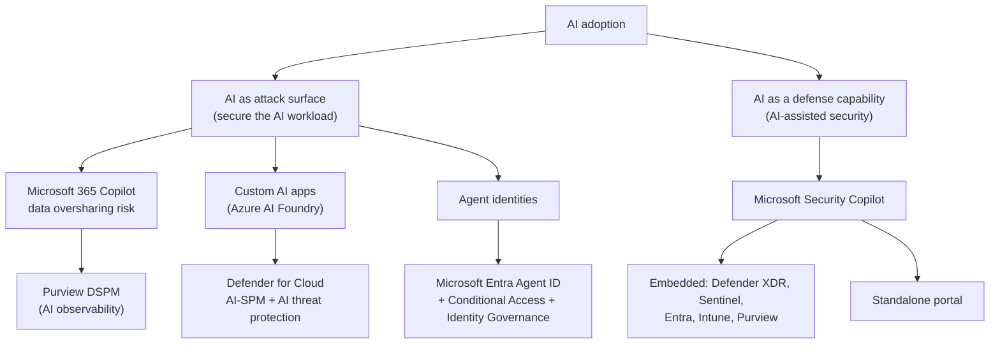
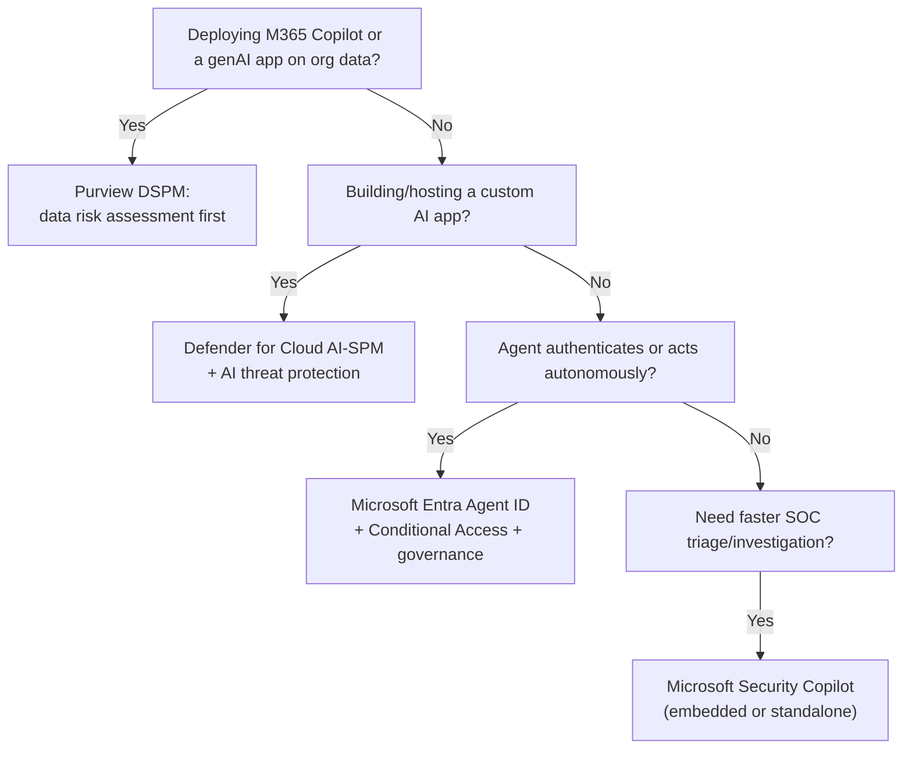

---
tags:
  - sc100
type: concept
domain:
  - best-practices
  - ops-identity-compliance
  - infrastructure
  - apps-data
status: needs-verification
---

# AI and Copilot Security Architecture

## Purpose

How generative AI and Copilot reshape SC-100 architecture in two directions: AI as a new workload to secure (data, apps, agents) and AI as a new capability that secures other things ([[Microsoft Security Copilot]]).

---

## Why Architects Choose It

- AI adoption is happening regardless of security readiness — [[Cloud Adoption Framework (CAF)|CAF]]'s Secure AI guidance treats this as "secure what's being adopted," not "block AI."
- [[Microsoft Security Copilot|Security Copilot]] gives defenders a productivity lift (natural-language KQL, incident summarization, guided response) embedded in tools the SOC already uses, not a new console.
- Microsoft 365 Copilot doesn't grant new access — it *inherits* the signed-in user's existing permissions, turning pre-existing oversharing into an immediately discoverable, exploitable leak. Data governance becomes a prerequisite, not hygiene.
- Autonomous AI agents need their own identity primitive — reusing a shared service principal or embedding secrets in agent code doesn't scale, audit, or support least privilege.

---

## When to Use

- Rolling out Microsoft 365 Copilot, Copilot Chat, or any enterprise generative AI tool — run a [[Data Security Posture Management (DSPM)|Purview DSPM]] data risk assessment first.
- Equipping a SOC with faster triage and investigation — Security Copilot embedded in [[Microsoft Defender XDR]] / [[Microsoft Sentinel]] / [[Entra ID]] / Intune / Purview.
- Building or hosting custom generative AI apps on Azure AI Foundry — [[Microsoft Defender for Cloud]] AI security posture management (AI-SPM) and AI threat protection.
- Any AI agent that authenticates, calls tools, or acts autonomously — provision it through [[Microsoft Entra Agent ID]], not a shared app registration.

---

## When NOT to Use

- Treating Microsoft 365 Copilot as low-risk because "it's just a chat interface" — it surfaces any content the signed-in user can already reach.
- Standing up Security Copilot without planning Security Compute Unit (SCU) capacity and workspace RBAC — uncontrolled cost and access sprawl follow.
- Managing agent identities by hand through app registrations once agent counts grow — that's the scaling problem Agent ID blueprints solve.

---

## Data Security Posture Management (DSPM) for AI

- Within [[Data Security Posture Management (DSPM)|Purview DSPM]], AI risk lives in a dedicated **AI observability** page — an inventory of AI apps and agents (including Microsoft Agent 365) active in the last 30 days, with high-risk counts and sensitive-interaction breakdowns.
- **Data Risk Assessments** (under Discover) are the standard pre-Copilot-rollout check — they scan for oversharing (e.g., an over-permissioned SharePoint site) that Copilot would otherwise surface to any user who can already reach it.
- **Activity explorer → AI activities** tracks individual genAI prompts/responses for sensitive-information matches and DLP rule hits, feeding investigation and compliance workflows.
- "DSPM for AI" as a standalone product is now the **classic**, deprecated predecessor — current guidance folds AI risk into the unified Purview DSPM experience above.

For DSPM's general, non-AI data-estate scope — and its comparison to Defender for Cloud's data-aware security posture — see [[Data Security Posture Management (DSPM)]].

---

## Architecture

---

## Architecture Decisions

---

## Comparison

| Compare | Difference |
| --- | --- |
| Security Copilot vs. Microsoft 365 Copilot | SOC assistant embedded in Defender/Sentinel/Entra/Intune/Purview, billed via Security Compute Units (SCUs), vs. productivity assistant embedded in Office apps, licensed per user, inheriting the signed-in user's existing data permissions. Different products despite the shared name. |
| Defender for Cloud AI-SPM vs. AI threat protection | Posture: assesses configuration/attack paths *before* an incident, vs. runtime: detects active threats (prompt injection, jailbreak, data leakage, credential theft), feeding [[Microsoft Defender XDR]]. Same split as CSPM vs. CWPP elsewhere in [[Microsoft Defender for Cloud]]. |
| Microsoft Entra Agent ID vs. service principal / managed identity | Those authenticate an application or resource; Agent ID is purpose-built for autonomous agents — identity blueprints provision them at scale with parent-child relationships, governed by the same [[Conditional Access]] and Identity Governance controls used for human identities. |
| MCSB v2 AI Security domain vs. Defender for Cloud AI-SPM | [[Microsoft Cloud Security Benchmark (MCSB)|MCSB]] is the scored baseline defining what good AI security looks like; AI-SPM is the tool that assesses and enforces against it — same Plan/Monitor/Establish relationship MCSB has with every other domain. |

---

## AZ-500 Review

Not covered at all — Security Copilot, Copilot data risk tooling, Agent ID, and Defender for Cloud's AI-specific posture/threat protection all shipped after AZ-500's scope. Underlying mechanisms (Conditional Access, Purview, Defender for Cloud) are still AZ-500 fundamentals; only the AI-specific layer is new.

---

## What's New for SC-100

- Split "securing AI" into two exam-tested problems: securing AI as a *workload* (data, custom apps, agents) vs. using AI as a *security capability* (Security Copilot).
- Know agent identity as a distinct, governable identity class in [[Entra ID]] — not interchangeable with service principals or managed identities — now reachable by [[Conditional Access]] and Identity Governance.
- Recognize Purview DSPM's Data Risk Assessment as the standard pre-Copilot-rollout answer to oversharing risk, not DLP alone.
- Know Defender for Cloud's AI-SPM/AI threat protection as the AI-specific extension of the CSPM/CWPP model already covered in [[Security Posture Assessments]] — same pattern, new workload type.
- Tie AI security decisions back to [[Cloud Adoption Framework (CAF)|CAF]]'s AI adoption lifecycle (Strategy → Plan → Ready → Govern → Manage → Secure) for strategy-level questions.

---

## Exam Tips

- "Assess data oversharing risk before a Copilot rollout" → Purview DSPM Data Risk Assessment, not Conditional Access or DLP alone.
- "Assistant embedded in Defender/Sentinel, capacity billed in compute units" → Security Copilot, not Microsoft 365 Copilot.
- "Authenticate and govern an autonomous AI agent at scale" → Microsoft Entra Agent ID with identity blueprints, not a shared service principal.
- Expect AI scenarios blended with an existing SC-100 topic (sensitivity labels, Conditional Access, Zero Trust) rather than AI tested in isolation.

---

## Common Exam Confusion

- **Security Copilot vs. Microsoft 365 Copilot** — see Comparison table; the exam relies on candidates conflating "Copilot" as one product.
- **AI-SPM vs. AI threat protection** — posture/pre-incident vs. runtime/active-incident, same pattern as CSPM vs. CWPP.
- **Agent identity vs. workload identity** — agents are a governed *subset* of non-human identity, not a replacement term for service principals or managed identities.

---

## Keywords

- Microsoft Security Copilot, Security Compute Units (SCU), embedded vs. standalone experiences
- Microsoft 365 Copilot data security and compliance
- Microsoft Purview DSPM, AI observability, Data Risk Assessment, oversharing
- Microsoft Entra Agent ID, agent identity, identity blueprint
- AI security posture management (AI-SPM), AI threat protection
- Prompt injection, jailbreak, data leakage, data poisoning, credential theft
- Microsoft Agent 365, shadow AI / shadow agents
- MCSB v2 AI Security domain, CAF Secure AI adoption lifecycle

---

## Related Services

- [[Microsoft Cloud Security Benchmark (MCSB)]]
- [[Cloud Adoption Framework (CAF)]]
- [[Conditional Access]]
- [[Microsoft Defender for Cloud]]
- [[Microsoft Sentinel]]
- [[Purview]]
- [[Data Security Posture Management (DSPM)]]
- [[Security Posture Assessments]]
- [[Zero Trust]]
- [[Entra ID]]
- [[Microsoft Entra Agent ID]]
- [[Microsoft Security Copilot]]
- [[Threat Intelligence]]
- [[Securing Microsoft 365]]

---

## References

- [What is Microsoft Security Copilot?](https://learn.microsoft.com/en-us/copilot/security/microsoft-security-copilot) — Microsoft Learn
- [What is Microsoft Entra Agent ID?](https://learn.microsoft.com/en-us/entra/agent-id/what-is-microsoft-entra-agent-id) — Microsoft Learn
- [Use Microsoft Purview to manage data security & compliance for Microsoft 365 Copilot](https://learn.microsoft.com/en-us/purview/ai-m365-copilot) — Microsoft Learn
- [Prevent oversharing with DSPM for AI data risk assessments](https://learn.microsoft.com/en-us/purview/data-security-posture-management-oversharing) — Microsoft Learn
- [AI security posture management - Microsoft Defender for Cloud](https://learn.microsoft.com/en-us/azure/defender-for-cloud/ai-security-posture) — Microsoft Learn
- [Secure AI - Cloud Adoption Framework](https://learn.microsoft.com/en-us/azure/cloud-adoption-framework/ai/secure) — Microsoft Learn
- [[Exam Objectives]]

---

## Verification Flag

Fast-moving surface — Entra Agent ID, MCSB v2's AI Security domain, and Microsoft Agent 365 were preview or recently-GA as of 2026-08-03. Re-verify GA status and licensing (especially SCU pricing) close to exam date.
