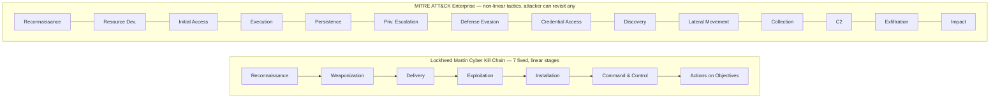
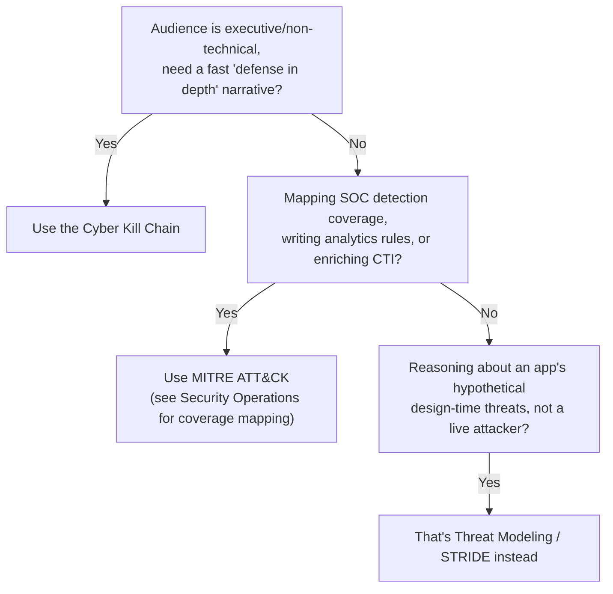

---
tags:
  - sc100
type: concept
domain:
  - ops-identity-compliance
aliases:
  - Cyber Kill Chain
  - Kill Chain
  - MITRE ATT&CK
  - ATT&CK
---
# Attack Chain Models

## Purpose

Two ways to model an attacker's lifecycle — the Lockheed Martin Cyber Kill Chain (linear, communication-friendly) and MITRE ATT&CK (non-linear, technique-level) — and when an architect reaches for each.

---

## Why Architects Choose It

- The Kill Chain's fixed 7-stage narrative is fast to explain to a non-technical audience and supports a simple "break the chain early" defense-in-depth argument.
- MITRE ATT&CK is the operational standard SOCs actually map real detections against — versioned, technique-ID-addressable, and non-linear, since a real intrusion can revisit a tactic (e.g., more Discovery after Lateral Movement) rather than march through 7 fixed stages once.
- [[Security Operations]]'s Sentinel coverage matrices (Enterprise/Mobile/ICS) and [[Threat Intelligence]]'s STIX attack-pattern objects both anchor to ATT&CK technique IDs — ATT&CK isn't an optional alternate lens once you're doing coverage mapping or CTI enrichment, the way the Kill Chain is for messaging.
- Mapping a real incident (below: NotPetya) against either model turns "what happened" into "which stage/tactic should have been caught, and how early" — the diagnostic an architect needs in a post-incident review.

---

## When to Use

- Explaining "defense in depth breaks the chain early" to leadership or a non-technical audience → the Cyber Kill Chain's 7-stage narrative.
- Mapping SOC detection coverage, writing analytics rules, or enriching CTI → MITRE ATT&CK tactics/techniques — see [[Security Operations]] for the Enterprise/Mobile/ICS coverage-mapping exercise itself.
- Reconstructing a post-incident timeline stage-by-stage to find the earliest point a control could have intervened.
- Reasoning about how a real adversary campaign unfolds operationally, as a complement to design-time [[Threat Modeling]] (STRIDE), which reasons about an application's hypothetical design-time threats, not a live attacker's actual behavior.

---

## When NOT to Use

- Don't use the Kill Chain's 7 linear stages as a SOC detection-coverage checklist — it has no technique IDs and assumes a strictly linear progression real intrusions don't follow.
- Don't hand MITRE ATT&CK's full technique-level detail (hundreds of techniques/sub-techniques) to a non-technical audience without translation — the Kill Chain communicates the same "layered defense" point faster.
- Don't treat either model as a substitute for design-time [[Threat Modeling]]/STRIDE — attack chain models describe how a real adversary campaign unfolds operationally; STRIDE reasons about an application's design before it's ever attacked.

---

## Architecture

Each ATT&CK tactic (the "why") contains many techniques and sub-techniques (the "how"), each with a stable ID (e.g., T1566 Phishing) — that ID is what a Sentinel analytics rule or a STIX attack-pattern object actually references.

---

## Architecture Decisions

---

## Case Study: Petya / NotPetya (2017)

Grounded in Microsoft's own writeup ([reference below](#references)) — a June 2017 outbreak that displayed a ransom demand but was, by design, a destructive wiper.

| Kill Chain stage | What happened |
| --- | --- |
| Delivery | A trojanized update of **M.E.Doc** — Ukrainian tax/accounting software — pushed the payload to every organization running it: a software-supply-chain compromise, not phishing or a direct exploit. |
| Exploitation / propagation | Two channels, run together: an **SMBv1 vulnerability (MS17-010)** for network-based spread, and **credential theft** — impersonating any currently logged-on account, including service accounts, to move laterally using legitimate access. Microsoft's analysis notes credential-based spread accounted for most real infections, since many networks had already patched MS17-010 after WannaCrypt. |
| Installation | Rebooted the host and overwrote the disk, then displayed on-screen text claiming to be ransomware. |
| Command & Control | None of substance — it self-propagated peer-to-peer rather than phoning home for instructions, unlike a typical C2-dependent campaign. |
| Actions on Objectives | **Destruction, not extortion**: the malware had no technical provision to generate or register per-victim decryption keys — the standard mechanism real ransomware needs to enable recovery. Paying the ransom could not restore data. This is what reclassifies it as a wiper ("NotPetya") rather than ransomware. |

**Architect takeaway:** the controls that would have broken this chain earliest are patch management (closing the MS17-010/SMBv1 exploit path) and network segmentation (containing credential-based lateral spread once one host was hit) — directly reinforcing Zero Trust's [[Zero Trust|assume-breach and segmentation]] principles and [[Ransomware Resiliency and BCDR]]'s framing that a destructive payload, not just encryption-for-ransom, is a realistic outcome to plan recovery around.

---

## Comparison

| Compare | Difference |
| --- | --- |
| Cyber Kill Chain vs. MITRE ATT&CK | Kill Chain: 7 fixed, linear, vendor-agnostic stages — built for communication and a "break the chain" narrative. ATT&CK: a living, versioned matrix of tactics (the "why") and techniques/sub-techniques (the "how"), non-linear — the standard SOCs map real detections against. |
| MITRE ATT&CK vs. Threat Modeling / STRIDE | ATT&CK catalogs real-world adversary TTPs observed across many campaigns — operational and retrospective. STRIDE (see [[Threat Modeling]]) reasons about one application's hypothetical design-time threats before it's built — proactive and single-system. Different altitude, not competing frameworks. |
| ATT&CK technique vs. STIX attack-pattern object | ATT&CK is the taxonomy; STIX's `attack-pattern` object (see [[Threat Intelligence]]) is the wire format that *carries* an ATT&CK technique ID into a TI feed, Sentinel analytics rule, or hunting query. |
| Ransomware vs. wiper (NotPetya) | Ransomware holds data for extortion and, however unreliably, retains a path to recovery via payment. A wiper destroys data with no recovery path — NotPetya displayed ransomware text but had no key-management infrastructure to actually decrypt, making its objective destruction, not extortion. |

---

## AZ-500 Review

AZ-500 doesn't name either model — it configures individual Defender/Sentinel detections, which are often already ATT&CK-mapped under the hood, without ever surfacing the framework by name. Treat both models as new for SC-100.

---

## What's New for SC-100

- Recognize both models by name and know which a scenario is actually asking for: audience-facing narrative (Kill Chain) vs. operational detection-engineering vocabulary (ATT&CK).
- Treat ATT&CK technique IDs as the shared vocabulary connecting [[Threat Intelligence]] (STIX attack-pattern objects), [[Security Operations]] (Sentinel coverage matrices), and detection engineering — one taxonomy referenced from three places, not three separate frameworks.
- Practice mapping a real incident narrative (like NotPetya above) onto both models — a common way the exam turns a scenario into "which control breaks this chain earliest."
- Distinguish a wiper disguised as ransomware from real ransomware by whether a working decryption/key-recovery path exists — it changes the correct resiliency answer (see [[Ransomware Resiliency and BCDR]]).

---

## Exam Tips

- "Explain to leadership why layered defenses matter" → Cyber Kill Chain, not ATT&CK.
- "Evaluate or report on detection coverage gaps" → MITRE ATT&CK matrices (see [[Security Operations]]), not the Kill Chain.
- A scenario about an application that hasn't been built yet → [[Threat Modeling]] (STRIDE), not either attack-chain model — different lifecycle stage entirely.
- A scenario describing self-propagating malware with a ransom note but no way to actually decrypt → recognize the wiper pattern (NotPetya), which changes the resiliency answer from "negotiate/pay" toward "restore from immutable backup."

---

## Common Exam Confusion

- **Cyber Kill Chain vs. MITRE ATT&CK** — narrative/linear vs. operational/non-linear; full comparison above.
- **MITRE ATT&CK vs. Threat Modeling/STRIDE** — real adversary TTP catalog vs. hypothetical application design threats; also flagged in [[Threat Modeling]].
- **Ransomware vs. wiper** — both can show a ransom note; only one has a real recovery path. NotPetya is the canonical exam-style example of the distinction.

---

## Keywords

- Lockheed Martin Cyber Kill Chain: Reconnaissance, Weaponization, Delivery, Exploitation, Installation, Command & Control, Actions on Objectives
- MITRE ATT&CK: tactics vs. techniques vs. sub-techniques, technique ID
- MITRE ATT&CK Enterprise / Mobile / ICS matrices
- STIX attack-pattern object
- NotPetya, Petya, wiper vs. ransomware
- M.E.Doc supply-chain compromise
- MS17-010 / SMBv1 vulnerability
- Credential theft / impersonation, lateral movement

---

## Related Services

- [[Security Operations]]
- [[Threat Intelligence]]
- [[Threat Modeling]]
- [[Zero Trust]]
- [[Ransomware Resiliency and BCDR]]
- [[Microsoft Sentinel]]
- [[Microsoft Defender XDR]]

---

## References

- [Overview of Petya, a rapid cyberattack](https://www.microsoft.com/en-us/security/blog/2018/02/05/overview-of-petya-a-rapid-cyberattack/) — Microsoft Security Blog
- [MITRE ATT&CK](https://attack.mitre.org/) — MITRE (industry framework, not Microsoft Learn)
- [The Cyber Kill Chain](https://www.lockheedmartin.com/en-us/capabilities/cyber/cyber-kill-chain.html) — Lockheed Martin (industry framework, not Microsoft Learn)
- [View MITRE ATT&CK coverage in Microsoft Sentinel](https://learn.microsoft.com/en-us/azure/sentinel/mitre-coverage) — Microsoft Learn
- [[Exam Objectives]]

---

## Verification Flag

The Kill Chain and MITRE ATT&CK are both industry frameworks, not Microsoft Learn content — confirm SC-100 material references them by these exact names/stage lists before quoting exact wording on the exam. The NotPetya case study is grounded directly in the linked Microsoft Security Blog post; re-check only if citing further technical specifics (e.g., exact lateral-movement tooling) beyond what that post states.
