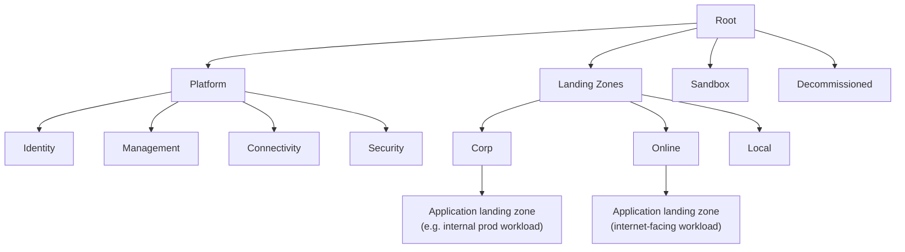
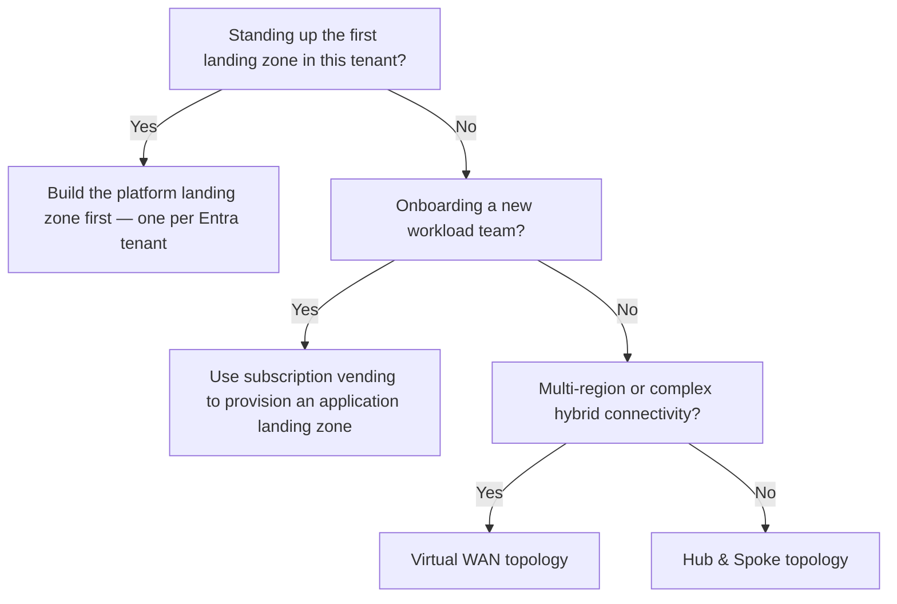

---
tags:
  - sc100
---

# Azure Landing Zones

## Purpose

An Azure landing zone is the multi-subscription environment — platform plus application — that [[Cloud Adoption Framework (CAF)]]'s Ready phase establishes to govern, secure, and scale workloads consistently.

---

## Why Architects Choose It

- Separates platform (centrally governed, shared) from application (workload-specific) so governance applies consistently without blocking workload teams.
- **Subscription vending** gives a repeatable, automatable process for provisioning new application landing zones that inherit baseline governance and security automatically.
- Supports new and emerging workload types, including AI, without redesigning the architecture — only the platform's governance policies need updating.
- Accelerators (Microsoft-provided infrastructure-as-code) give a fast, best-practice-aligned starting point instead of a bespoke build.

---

## When to Use

- Standing up a new multi-subscription Azure environment for an organization.
- Onboarding a new workload team that needs guardrails applied automatically rather than manual per-subscription policy assignment.
- Choosing a network topology for hybrid/multi-region connectivity.
- Centralizing identity, connectivity, security monitoring, and management for reuse across many workloads.

---

## When NOT to Use

- For a single, standalone proof-of-concept — a lightweight sandbox subscription is enough; the full hierarchy is overhead.
- As a per-workload architecture decision — that's the Well-Architected Framework's job once a workload lands inside its application landing zone.
- To justify a second platform landing zone in the same tenant — most organizations need exactly one; a second is a design smell, not a scaling strategy.

---

## Architecture

| Platform subscription | Typical contents |
| --- | --- |
| Identity | Domain services, [[Entra ID]] integration, Recovery Services vaults |
| Management | Log Analytics, [[Microsoft Sentinel]], dashboards |
| Connectivity | [[Azure Firewall]], DDoS Protection, DNS, VPN/ExpressRoute gateways, hub VNets |
| Security | [[Microsoft Defender for Cloud]] |

Application landing zones sit under the Corp, Online, or Local management group and inherit governance/policy from the hierarchy above them.

---

## Architecture Decisions

Prefer a Microsoft accelerator over a custom build unless requirements genuinely don't fit the reference architecture.

---

## Comparison

| Compare | Difference |
| --- | --- |
| Platform landing zone vs. application landing zone | Platform = centralized governance/shared services, one per tenant; application = workload-hosting environment, many per org, inherits platform policy. |
| Hub & Spoke vs. Virtual WAN | Hub & Spoke = self-managed hub VNet with peered spokes; Virtual WAN = Microsoft-managed hub-and-spoke at global scale, simpler at high region/connectivity complexity. |
| Accelerator vs. custom build | Accelerator = Microsoft IaC templates, fastest path to best-practice alignment; custom build = full control, justified only when requirements don't fit the reference architecture. |

---

## AZ-500 Review

AZ-500 covers the individual controls that live inside these subscriptions — Azure Policy, RBAC, NSG/Firewall rules, Defender for Cloud configuration. It doesn't cover the landing zone structure itself (management group hierarchy, subscription vending, platform/application separation) — that's new territory for SC-100.

---

## What's New for SC-100

- Design the management group hierarchy and platform/application separation as an org-wide architecture decision, not a per-resource configuration task.
- Recommend subscription vending as the mechanism for onboarding workload teams with guardrails already applied, instead of manual policy assignment.
- Choose a network topology (Hub & Spoke vs. Virtual WAN) as part of the platform landing zone's connectivity design.
- Recognize that a landing zone must reach baseline security before a [[Cloud Adoption Security Review (CASR)]] applies — landing zone design precedes that assessment.

---

## Exam Tips

- "One platform landing zone per tenant" is a specific, testable fact — a scenario proposing multiple platform landing zones for one tenant is a red flag.
- New-workload-team onboarding scenarios point to subscription vending, not manual subscription creation.
- Network topology choice hinges on scale/complexity: many regions or complex hybrid connectivity → Virtual WAN; simpler footprint → Hub & Spoke.

---

## Common Exam Confusion

- **Platform vs. application landing zone** — shared foundation vs. workload environment; see [[Cloud Adoption Framework (CAF)]] for where this fits in the Ready phase.
- **Hub & Spoke vs. Virtual WAN** — both are valid topologies; the choice is about scale/complexity, not one being universally correct.

---

## Keywords

- Management group hierarchy
- Platform landing zone vs. application landing zone
- Subscription vending
- One platform landing zone per tenant
- Hub & Spoke vs. Virtual WAN topology
- Landing zone accelerator vs. custom build
- Corp / Online / Local management groups

---

## Related Services

- [[Cloud Adoption Framework (CAF)]]
- [[Cloud Adoption Security Review (CASR)]]
- [[Azure Firewall]]
- [[Microsoft Defender for Cloud]]
- [[Microsoft Sentinel]]
- [[Entra ID]]

---

## References

- [What is an Azure landing zone?](https://learn.microsoft.com/en-us/azure/cloud-adoption-framework/ready/landing-zone/) — Microsoft Learn
- [[Exam Objectives]]
