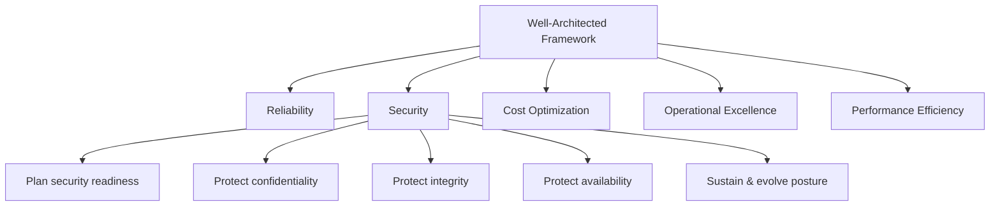
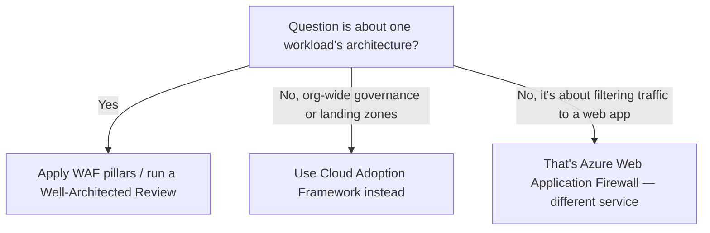

---
tags:
  - sc100
---

# Azure Well-Architected Framework (WAF)

## Purpose

WAF is a set of five pillars and a self-assessment review used to evaluate and improve a single workload's architecture; the Security pillar is the workload-level counterpart to [[Cloud Adoption Framework (CAF)]]'s org-wide Secure methodology.

---

## Why Architects Choose It

- Gives a structured checklist for the Security pillar (plan readiness; protect confidentiality, integrity, availability; sustain and evolve) instead of an ad hoc workload review.
- Complements CAF: CAF governs org-wide via [[Azure Landing Zones]]; WAF evaluates what's actually built *inside* a landing zone, one workload at a time.
- Has its own self-assessment tool (the Azure Well-Architected Review) — same self-assess pattern as [[Cloud Adoption Security Review (CASR)]], but scoped to one workload across all five pillars rather than landing zone security.
- Forces explicit trade-offs — naming what you're sacrificing (e.g., cost vs. resiliency) instead of treating all five pillars as free.

---

## When to Use

- Reviewing or designing the architecture of a specific workload already inside an application landing zone.
- Needing a structured trade-off discussion across security, cost, reliability, performance, and operations for one system.
- Running a Well-Architected Review as a periodic health check on a production workload.
- Establishing a workload-level security baseline, distinct from the platform-level baseline CAF/landing zones provide.

---

## When NOT to Use

- For org-wide governance, landing zone structure, or adoption sequencing — that's [[Cloud Adoption Framework (CAF)]], not WAF.
- As a substitute for [[Cloud Adoption Security Review (CASR)]] — CASR reviews landing zone security specifically; WAF reviews one workload across five pillars.
- When the *other* WAF is meant — don't confuse this with [[Azure Web Application Firewall]]; same three letters, unrelated service.

---

## Architecture

---

## Architecture Decisions

---

## Comparison

| Compare | Difference |
| --- | --- |
| WAF (framework) vs. [[Azure Web Application Firewall]] | Same acronym, unrelated: one is an architecture evaluation framework, the other is a network security service filtering HTTP(S) traffic to web apps. |
| WAF vs. [[Cloud Adoption Framework (CAF)]] | CAF is org-wide lifecycle sequencing; WAF is per-workload architecture evaluation — full comparison already in the CAF note. |
| Well-Architected Review vs. [[Cloud Adoption Security Review (CASR)]] | The Well-Architected Review evaluates one workload across all five pillars; CASR evaluates a landing zone's security specifically. |

---

## AZ-500 Review

AZ-500 already covers the individual controls the Security pillar checklist points to — identity/access, network protection, encryption, hardening, secrets management. That implementation knowledge is assumed here.

---

## What's New for SC-100

- Apply the Security pillar's five design principles (plan readiness; protect confidentiality, integrity, availability; sustain and evolve) as an explicit evaluation lens for a workload, not a features list.
- Use the Well-Architected Review assessment as the concrete mechanism for evaluating an *existing* workload's security posture — mirrors the exam's "evaluate an existing strategy" framing.
- Treat pillar trade-offs as a deliberate exam theme: a "more secure" answer that destroys reliability or cost efficiency without justification is often the wrong one.
- Position WAF correctly relative to CAF and landing zones — WAF applies once a workload is inside an application landing zone, not before.

---

## Exam Tips

- A scenario about one workload's design choices points to the WAF Security pillar, not CAF.
- A scenario about org-wide governance, subscription structure, or adoption sequencing points to CAF, not WAF.
- Watch for the acronym trap — confirm whether a scenario means "architecture review" or "web traffic filtering" before picking an answer.

---

## Common Exam Confusion

- **Well-Architected Framework vs. Azure Web Application Firewall** — identical acronym, completely different domains; always confirm which WAF a scenario means.
- **WAF Security pillar vs. CAF Secure methodology** — workload-level architecture evaluation vs. org-wide operational methodology.

---

## Keywords

- Well-Architected Review
- Five pillars
- Security pillar
- Per-workload architecture evaluation
- Trade-off analysis
- Plan security readiness
- Protect confidentiality / integrity / availability
- Sustain and evolve posture

---

## Related Services

- [[Cloud Adoption Framework (CAF)]]
- [[Azure Landing Zones]]
- [[Cloud Adoption Security Review (CASR)]]
- [[Zero Trust]]
- [[Azure Web Application Firewall]]

---

## References

- [Well-Architected Framework Security pillar](https://learn.microsoft.com/en-us/azure/well-architected/security/) — Microsoft Learn
- https://aka.ms/WAF
- https://aka.ms/WAFsecure
- [[Exam Objectives]]
