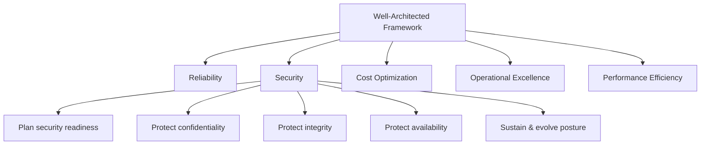
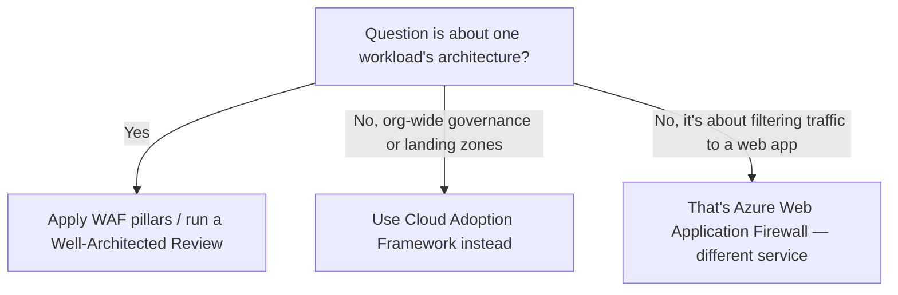

---
tags:
  - sc100
type: concept
domain:
  - best-practices
aliases:
  - WAF
status: needs-verification
---
# Azure Well-Architected Framework (WAF)

## Purpose

WAF is a set of five pillars and a self-assessment review used to evaluate and improve a single workload's architecture; the Security pillar is the workload-level counterpart to [[Cloud Adoption Framework (CAF)]]'s org-wide Secure methodology.

---

## Why Architects Choose It

- Gives a structured checklist for the Security pillar (plan readiness; protect confidentiality, integrity, availability; sustain and evolve) instead of an ad hoc workload review.
- Complements CAF: CAF governs org-wide via [[Azure Landing Zones]]; WAF evaluates what's actually built *inside* a landing zone, one workload at a time.
- Has its own self-assessment tool (the Azure Well-Architected Review) — same self-assess pattern as [[Cloud Adoption Security Review (CASR)]], but scoped to one workload across all five pillars rather than landing zone security.
- Forces explicit trade-offs — naming what you're sacrificing (e.g., cost vs. resiliency) instead of treating all five pillars as free.

---

## When to Use

- Reviewing or designing the architecture of a specific workload already inside an application landing zone.
- Needing a structured trade-off discussion across security, cost, reliability, performance, and operations for one system.
- Running a Well-Architected Review as a periodic health check on a production workload.
- Establishing a workload-level security baseline, distinct from the platform-level baseline CAF/landing zones provide.

---

## When NOT to Use

- For org-wide governance, landing zone structure, or adoption sequencing — that's [[Cloud Adoption Framework (CAF)]], not WAF.
- As a substitute for [[Cloud Adoption Security Review (CASR)]] — CASR reviews landing zone security specifically; WAF reviews one workload across five pillars.
- When the *other* WAF is meant — don't confuse this with [[Azure Web Application Firewall]]; same three letters, unrelated service.

---

## Architecture

---

## Architecture Decisions

---

## Security Pillar Checklist (SE:01–SE:12)

The Security pillar's five design principles (Architecture, above) get operationalized as a 12-item checklist — the level of detail the Well-Architected Review actually scores against, not just the five principles.

| Item | Focus |
| --- | --- |
| SE:01 | Establish a security baseline aligned to compliance requirements and platform benchmarks ([[Microsoft Cloud Security Benchmark (MCSB)]]) |
| SE:02 | Secure development lifecycle — hardened, auditable software supply chain; threat model by design (see [[Threat Modeling]]) |
| SE:03 | Classify data/systems by sensitivity; let classification drive design and prioritization ([[Purview]]) |
| SE:04 | Segment architecture and platform footprint — networks, roles, workload identities, resource organization |
| SE:05 | Strict, conditional, auditable identity and access management; modern authN/authZ everywhere; audit non-identity-based access |
| SE:06 | Isolate/filter/control network traffic on ingress and egress, both east-west and north-south |
| SE:07 | Encrypt data with modern methods, scoped to data classification, preferring native platform encryption ([[Key Vault]]) |
| SE:08 | Protect application secrets — hardened storage, restricted access, regular rotation |
| SE:09 | Holistic monitoring with modern threat detection integrated into existing SecOps ([[Security Operations]]) |
| SE:10 | Defined, tested incident response procedures with clear ownership |
| SE:11 | Comprehensive testing regimen — prevention validation and detection-mechanism testing |
| SE:12 | Governance aligned to internal and compliance requirements, assessed at platform and workload level |

- The checklist is what a real Well-Architected Review walks item by item — the five principles are the grouping, SE:01–SE:12 are the testable units.
- Several items point straight at notes already in this vault (baseline → MCSB, secure SDLC → Threat Modeling, monitoring → Security Operations) — the checklist's role is to force *this workload* to prove each control exists, not to introduce new controls.

---

## Antipatterns & Tradeoffs

Every checklist item trades against another WAF pillar (cost, performance, operations) — the Security pillar explicitly expects that tradeoff to be named, not ignored:

- **Segmenting everything uniformly** (SE:04) — indiscriminate micro-segmentation adds operational complexity, latency, and cost disproportionate to the workload's actual blast radius; segment by criticality, not by default.
- **Encrypting indiscriminately** (SE:07) — encrypting data that doesn't need it adds performance overhead and key-management sprawl without a matching risk reduction; scope encryption to the data classification (SE:03), don't apply it uniformly.
- **Over-restrictive identity controls** (SE:05) — excessive step-up authentication or approval friction drives the same shadow-IT workarounds [[Zero Trust]]'s adoption antipatterns describe; least privilege still has to remain usable.
- **Blocking legacy protocols with no migration plan** (SE:06) — disabling legacy authentication/protocols without a compatibility plan breaks business function instead of reducing risk; sequence the block behind a validated migration.
- **Treating security as absolute** — no checklist item aims for 100% prevention; the pillar is risk-balanced against reliability, cost, and performance, and a "more secure" answer that silently wrecks another pillar without justification is the antipattern, not the goal.

---

## Comparison

| Compare | Difference |
| --- | --- |
| WAF (framework) vs. [[Azure Web Application Firewall]] | Same acronym, unrelated: one is an architecture evaluation framework, the other is a network security service filtering HTTP(S) traffic to web apps. |
| WAF vs. [[Cloud Adoption Framework (CAF)]] | CAF is org-wide lifecycle sequencing; WAF is per-workload architecture evaluation — full comparison already in the CAF note. |
| Well-Architected Review vs. [[Cloud Adoption Security Review (CASR)]] | The Well-Architected Review evaluates one workload across all five pillars; CASR evaluates a landing zone's security specifically. |

---

## AZ-500 Review

AZ-500 already covers the individual controls the Security pillar checklist points to — identity/access, network protection, encryption, hardening, secrets management. That implementation knowledge is assumed here.

---

## What's New for SC-100

- Apply the Security pillar's five design principles (plan readiness; protect confidentiality, integrity, availability; sustain and evolve) as an explicit evaluation lens for a workload, not a features list.
- Use the Well-Architected Review assessment as the concrete mechanism for evaluating an *existing* workload's security posture — mirrors the exam's "evaluate an existing strategy" framing.
- Treat pillar trade-offs as a deliberate exam theme: a "more secure" answer that destroys reliability or cost efficiency without justification is often the wrong one.
- Position WAF correctly relative to CAF and landing zones — WAF applies once a workload is inside an application landing zone, not before.

---

## Exam Tips

- A scenario about one workload's design choices points to the WAF Security pillar, not CAF.
- A scenario about org-wide governance, subscription structure, or adoption sequencing points to CAF, not WAF.
- Watch for the acronym trap — confirm whether a scenario means "architecture review" or "web traffic filtering" before picking an answer.

---

## Common Exam Confusion

- **Well-Architected Framework vs. Azure Web Application Firewall** — identical acronym, completely different domains; always confirm which WAF a scenario means.
- **WAF Security pillar vs. CAF Secure methodology** — workload-level architecture evaluation vs. org-wide operational methodology.

---

## Keywords

- Well-Architected Review
- Five pillars
- Security pillar
- Per-workload architecture evaluation
- Trade-off analysis
- Plan security readiness
- Protect confidentiality / integrity / availability
- Sustain and evolve posture
- Security checklist SE:01–SE:12
- Antipatterns: uniform segmentation, indiscriminate encryption, absolute security

---

## Related Services

- [[Cloud Adoption Framework (CAF)]]
- [[Azure Landing Zones]]
- [[Cloud Adoption Security Review (CASR)]]
- [[Zero Trust]]
- [[Azure Web Application Firewall]]
- [[Microsoft Cloud Security Benchmark (MCSB)]]
- [[Threat Modeling]]
- [[Purview]]
- [[Key Vault]]
- [[Security Operations]]

---

## References

- [Well-Architected Framework Security pillar](https://learn.microsoft.com/en-us/azure/well-architected/security/) — Microsoft Learn
- https://aka.ms/WAF
- https://aka.ms/WAFsecure
- https://aka.ms/wafsecure-assess
- [[Exam Objectives]]

---

## Verification Flag

The SE:01–SE:12 checklist item titles/focus areas are transcribed from training-knowledge recall of the Well-Architected Framework Security pillar checklist, not a live re-read of the current Learn page — re-verify exact item numbering and wording against [Well-Architected Framework Security pillar](https://learn.microsoft.com/en-us/azure/well-architected/security/) before treating it as exam-final. The Antipatterns & Tradeoffs section is synthesized architecture judgment applied to those items, not transcribed Microsoft wording.
