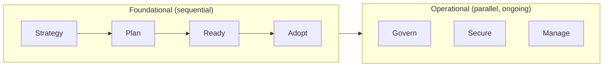
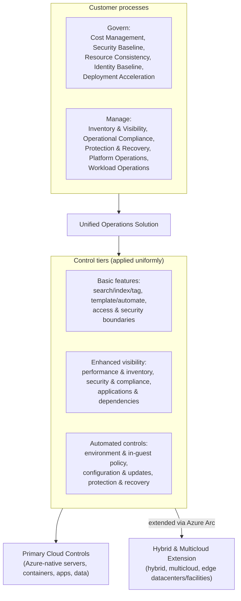
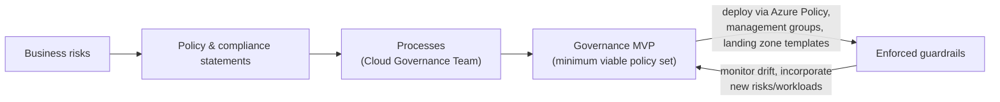
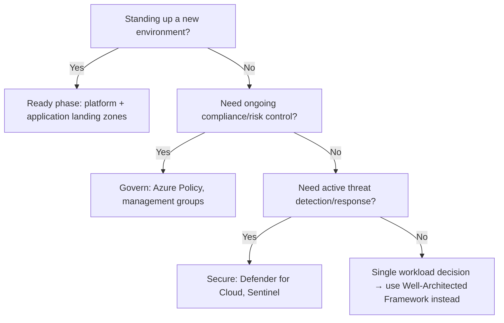

---
tags:
  - sc100
type: concept
domain:
  - best-practices
aliases:
  - CAF
status: needs-verification
---

# Cloud Adoption Framework (CAF)

## Purpose

CAF is Microsoft's structured roadmap of seven methodologies for adopting and operating Azure; architects use it to sequence *when* and *how* security and governance get embedded into that lifecycle.

---

## Why Architects Choose It

- Gives a single, ordered methodology (Strategy → Plan → Ready → Adopt, then Govern/Secure/Manage running in parallel) instead of ad-hoc security bolted on after deployment.
- [[Azure Landing Zones|Landing zones]] — the environment workloads land in — are defined in the **Ready** phase, so security requirements get built into the platform before any workload exists.
- Integrates directly with the [Azure Well-Architected Framework](https://learn.microsoft.com/en-us/azure/well-architected/) for workload-level guidance once CAF has set the org-wide foundation.

---

## When to Use

- Standing up a new Azure environment/tenant and defining a platform landing zone.
- Sequencing security investment against business drivers rather than reacting ad hoc.
- Designing a DevSecOps pipeline that needs to align with an existing adoption roadmap.
- Evaluating (not necessarily rebuilding) an existing governance strategy for gaps.

---

## When NOT to Use

- For a single workload's architecture trade-offs — use the Well-Architected Framework's Security pillar instead.
- As a substitute for [[Zero Trust]] — CAF sequences *when* controls are introduced; Zero Trust dictates *what trust model* those controls enforce.
- For a small proof-of-concept — the Azure landing zone accelerator's lightweight templates are enough; full CAF ceremony is overhead.

---

## Architecture

| Methodology | Security relevance                                                                                                                                              |
| ----------- | --------------------------------------------------------------------------------------------------------------------------------------------------------------- |
| Strategy    | Map business drivers to cloud outcomes, incl. security investment case                                                                                          |
| Plan        | Cloud skills, migration plan, cost — security ownership assigned here                                                                                           |
| Ready       | Platform + application landing zones — security baseline built in from day one                                                                                  |
| Adopt       | Migrate/modernize/build — security requirements carried into each workload                                                                                      |
| Govern      | Risk assessment, policy, compliance ([[Azure Policy]]); tracked via [[Security Scoring Dashboards]]                                                             |
| Secure      | Active protection — SecOps, threat protection ([[Microsoft Defender for Cloud]], [[Microsoft Sentinel]]); posture measured via [[Security Posture Assessments]] |
| Manage      | Ongoing operations and optimization — the **Unified Operations model** below is its named architecture for hybrid/multicloud monitoring                        |

**Secure** and **Govern** are distinct, parallel methodologies — Govern is risk/compliance controls, Secure is active threat protection.

---

## Manage Methodology: Unified Operations Model

CAF's named answer to "design monitoring to support hybrid and multicloud environments" — a specific model, not a generic "monitor everything" instruction.

- **Govern** and **Manage** are two parallel customer-process tracks, each with five named disciplines (above) — they run continuously against whatever the **Unified Operations Solution** layer below them controls.
- The **Unified Operations Solution** applies the *same three control tiers* regardless of where a resource actually lives: **Basic features** (search/index/tag, template/automate, access boundaries), **Enhanced visibility** (performance/inventory, security/compliance, app dependencies), and **Automated controls** (environment/in-guest policy, config/updates, protection and recovery).
- **Primary Cloud Controls** is those three tiers applied natively to Azure-hosted resources. **Hybrid & Multicloud Extension** is the *same* three tiers stretched out to hybrid, multicloud, and edge resources — the mechanism that makes this possible is [[Azure Arc]], which projects non-Azure resources into Azure Resource Manager so they're addressable by the identical policy/RBAC/monitoring tooling as native resources (technical detail in [[Azure Arc]]; SIEM-side ingestion once that data lands is [[Security Operations]]).
- The architectural point: **one control plane, extended outward** — not a separate monitoring stack per cloud/environment. That's the direct answer whenever a scenario says "hybrid and multicloud monitoring."

---

## Govern Methodology

CAF's named answer to "how do we turn business risk into enforced, auditable policy" — an iterative governance process, not a one-time policy document.

- **Corporate policy** is built top-down: identified business risks drive policy and compliance statements, which drive the processes a **Cloud Governance Team** actually runs — governance starts from risk, not from a tooling checklist.
- The **governance MVP** (minimum viable product) is the deliberately small first policy set enforced from day one in the landing zone, then iterated — mirrors the Ready phase's platform landing zone, but for policy rather than infrastructure.
- Enforcement is continuous: [[Azure Policy]] and management-group-scoped guardrails catch drift as new workloads land, feeding findings back into the next MVP iteration rather than a fixed, never-revisited policy set.

**Five Disciplines of Cloud Governance** — the corporate policy areas Govern organizes work into:

| Discipline | Governs |
| --- | --- |
| Cost Management | Budgets, cost allocation, showback/chargeback |
| Security Baseline | Minimum security controls every subscription/workload must meet ([[Azure Policy]], MCSB — see [[Microsoft Cloud Security Benchmark (MCSB)]]) |
| Resource Consistency | Naming, tagging, resource organization so resources are discoverable and manageable at scale |
| Identity Baseline | Consistent [[Entra ID]] configuration — directory structure, role assignment conventions, guest access rules |
| Deployment Acceleration | Standardized deployment mechanisms (IaC templates, landing zone blueprints) so new resources land pre-compliant instead of being remediated after the fact |

- Each discipline gets its own maturity assessment and toolchain — Security Baseline is Govern's specific link to [[Azure Policy]]-driven Secure Score (see [[Security Posture Assessments]]), distinct from the Secure methodology's active threat protection.

---

## Architecture Decisions

---

## Comparison

| Compare | Difference |
| --- | --- |
| CAF vs. [[Azure Well-Architected Framework (WAF)]] | CAF sequences the org-wide adoption lifecycle; WAF evaluates an individual workload's architecture across five pillars — full comparison in the WAF note. |
| CAF vs. [[Zero Trust]] | CAF is a lifecycle/governance roadmap; Zero Trust is the trust-verification principle applied within controls CAF introduces. |
| Platform landing zone vs. application landing zone | Platform = shared services (identity, connectivity, management); application = hosts a specific workload. Full architecture in [[Azure Landing Zones]]. |
| Primary Cloud Controls vs. Hybrid & Multicloud Extension | Same three control tiers (Basic features/Enhanced visibility/Automated controls) in both cases — the difference is *reach*, not different tooling. Primary Cloud Controls apply natively to Azure-hosted resources; the Hybrid & Multicloud Extension applies the identical tiers to non-Azure resources once [[Azure Arc]] has projected them into Azure Resource Manager. |

---

## AZ-500 Review

AZ-500 already covers the individual controls that populate Govern and Secure — [[Azure Policy]], RBAC, NSGs, baseline [[Microsoft Defender for Cloud]] configuration. That implementation knowledge is assumed here.

---

## What's New for SC-100

- Treat CAF as the sequencing framework for *introducing* security across an adoption lifecycle, not a control to configure.
- **Secure** is now its own core methodology (distinct from Govern) — expect it tested separately from compliance/policy questions.
- Landing zone design decisions (platform vs. application) carry security requirements — a frequent exam framing.
- Recommend a DevSecOps process aligned with CAF as an explicit skill, not just a CI/CD implementation detail.
- Evaluate an *existing* CAF/WAF-based strategy for gaps rather than always designing one from scratch.
- Use [[Security Posture Assessments]] and [[Security Scoring Dashboards]] as the recurring measurement layer for the Secure and Govern methodologies — CAF sequences *when* they run, those notes cover *what the numbers mean*.
- Once a landing zone hits baseline security, use a [[Cloud Adoption Security Review (CASR)]] to self-assess (or have Microsoft assess) maturity against the Secure methodology specifically.
- CAF's AI adoption lifecycle adds a dedicated Secure AI track — see [[AI and Copilot Security Architecture]] for the architecture decisions it drives.
- Know the Unified Operations model by name for "design monitoring to support hybrid and multicloud environments" — the answer is extending the *same* Basic/Enhanced/Automated control tiers outward via [[Azure Arc]], not standing up a separate monitoring stack per cloud.
- Recognize Govern's five disciplines (Cost Management, Security Baseline, Resource Consistency, Identity Baseline, Deployment Acceleration) and Manage's five (Inventory & Visibility, Operational Compliance, Protection & Recovery, Platform Operations, Workload Operations) as named, testable process groups, not generic "governance" and "operations" labels.

---

## Exam Tips

- Know which methodology a scenario belongs to: landing zone setup = Ready; ongoing policy/compliance = Govern; active detection/response = Secure.
- Distractors often mislabel Secure-phase controls (Defender for Cloud, Sentinel) as Govern-phase, or vice versa — check whether the scenario is about *risk/compliance* or *active protection*.
- "Recommend a strategy based on CAF and WAF" questions expect you to name the specific methodology or pillar, not just "use CAF."
- "Design monitoring to support hybrid and multicloud environments" → the Unified Operations model: same control tiers, extended via Azure Arc — not a separate tool per environment.

---

## Common Exam Confusion

- **CAF Govern vs. Secure** — Govern manages risk and compliance controls; Secure operationalizes active threat protection. Easy to conflate since both sound like "security."
- **CAF vs. [[Azure Well-Architected Framework (WAF)]]** — CAF is the org-wide roadmap; WAF is per-workload guidance across five pillars. See the WAF note for the acronym collision with [[Azure Web Application Firewall]].
- **Platform landing zone vs. application landing zone** — shared foundation vs. workload-specific environment built on it.
- **Primary Cloud Controls vs. Hybrid & Multicloud Extension** — same control tiers, different reach; see Comparison above.

---

## Keywords

- Seven methodologies: Strategy, Plan, Ready, Adopt, Govern, Secure, Manage
- Foundational (sequential) vs. operational (parallel) methodologies
- Landing zone — platform vs. application
- DevSecOps process alignment
- Secure methodology vs. Govern methodology
- Adoption lifecycle sequencing
- Unified Operations model, Unified Operations Solution
- Primary Cloud Controls, Hybrid & Multicloud Extension
- Govern's five disciplines, Manage's five disciplines
- Basic features / Enhanced visibility / Automated controls (control tiers)

---

## Related Services

- [[Zero Trust]]
- [[Azure Policy]]
- [[Microsoft Defender for Cloud]]
- [[Microsoft Sentinel]]
- [[Security Posture Assessments]]
- [[Security Scoring Dashboards]]
- [[AI and Copilot Security Architecture]]
- [[Azure Arc]]
- [[Security Operations]]
- [[Azure Security Logging]]
- [[Azure Landing Zones]]
- [[Microsoft Cloud Security Benchmark (MCSB)]]
- [[Entra ID]]

---

## References

- [Cloud Adoption Framework overview](https://learn.microsoft.com/en-us/azure/cloud-adoption-framework/overview) — Microsoft Learn
- [Cloud Adoption Framework: Govern](https://learn.microsoft.com/en-us/azure/cloud-adoption-framework/govern/) — Microsoft Learn
- [Cloud Adoption Framework for Microsoft - Cloud Adoption Framework | Microsoft Learn](https://learn.microsoft.com/en-us/azure/cloud-adoption-framework/)
- [Security Teams, Roles, and Functions - Cloud Adoption Framework | Microsoft Learn](https://learn.microsoft.com/en-us/azure/cloud-adoption-framework/secure/teams-roles)
- [Secure Overview - Cloud Adoption Framework | Microsoft Learn](https://learn.microsoft.com/en-us/azure/cloud-adoption-framework/secure/overview)
- [[Exam Objectives]]

---

## Verification Flag

The Unified Operations model (Govern/Manage discipline names, the Basic features/Enhanced visibility/Automated controls tiers, Primary Cloud Controls vs. Hybrid & Multicloud Extension) was transcribed from a Microsoft Learn training-module diagram, not cross-checked against the live CAF Manage methodology page. Re-verify exact discipline names and diagram terminology against [Cloud Adoption Framework: Manage](https://learn.microsoft.com/en-us/azure/cloud-adoption-framework/manage/) before treating it as exam-final wording.

The Govern Methodology section (governance MVP process, Cloud Governance Team, Five Disciplines of Cloud Governance) is transcribed from training-knowledge recall, not a live re-read of the current page — re-verify against [Cloud Adoption Framework: Govern](https://learn.microsoft.com/en-us/azure/cloud-adoption-framework/govern/) before treating discipline names/process steps as exam-final wording.
