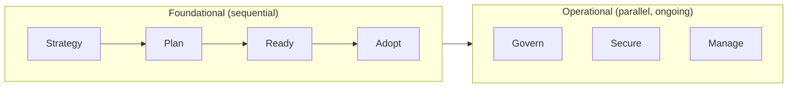
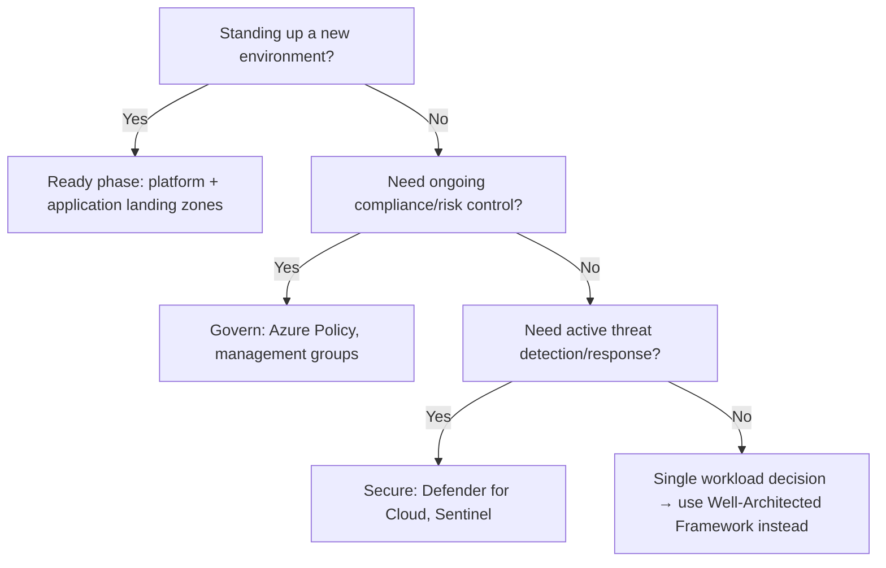

---
tags:
  - sc100
---

# Cloud Adoption Framework

## Purpose

CAF is Microsoft's structured roadmap of seven methodologies for adopting and operating Azure; architects use it to sequence *when* and *how* security and governance get embedded into that lifecycle.

---

## Why Architects Choose It

- Gives a single, ordered methodology (Strategy → Plan → Ready → Adopt, then Govern/Secure/Manage running in parallel) instead of ad-hoc security bolted on after deployment.
- Landing zones — the environment workloads land in — are defined in the **Ready** phase, so security requirements get built into the platform before any workload exists.
- Integrates directly with the [Azure Well-Architected Framework](https://learn.microsoft.com/en-us/azure/well-architected/) for workload-level guidance once CAF has set the org-wide foundation.

---

## When to Use

- Standing up a new Azure environment/tenant and defining a platform landing zone.
- Sequencing security investment against business drivers rather than reacting ad hoc.
- Designing a DevSecOps pipeline that needs to align with an existing adoption roadmap.
- Evaluating (not necessarily rebuilding) an existing governance strategy for gaps.

---

## When NOT to Use

- For a single workload's architecture trade-offs — use the Well-Architected Framework's Security pillar instead.
- As a substitute for [[Zero Trust]] — CAF sequences *when* controls are introduced; Zero Trust dictates *what trust model* those controls enforce.
- For a small proof-of-concept — the Azure landing zone accelerator's lightweight templates are enough; full CAF ceremony is overhead.

---

## Architecture

| Methodology | Security relevance |
| --- | --- |
| Strategy | Map business drivers to cloud outcomes, incl. security investment case |
| Plan | Cloud skills, migration plan, cost — security ownership assigned here |
| Ready | Platform + application landing zones — security baseline built in from day one |
| Adopt | Migrate/modernize/build — security requirements carried into each workload |
| Govern | Risk assessment, policy, compliance ([[Azure Policy]]) |
| Secure | Active protection — SecOps, threat protection ([[Microsoft Defender for Cloud]], [[Microsoft Sentinel]]) |
| Manage | Ongoing operations and optimization |

**Secure** and **Govern** are distinct, parallel methodologies — Govern is risk/compliance controls, Secure is active threat protection.

---

## Architecture Decisions

---

## Comparison

| Compare | Difference |
| --- | --- |
| CAF vs. Well-Architected Framework | CAF sequences the org-wide adoption lifecycle; WAF evaluates an individual workload's architecture across five pillars (incl. Security). |
| CAF vs. [[Zero Trust]] | CAF is a lifecycle/governance roadmap; Zero Trust is the trust-verification principle applied within controls CAF introduces. |
| Platform landing zone vs. application landing zone | Platform landing zone provides shared services (identity, connectivity, management); application landing zone hosts a specific workload on top of it. |

---

## AZ-500 Review

AZ-500 already covers the individual controls that populate Govern and Secure — [[Azure Policy]], RBAC, NSGs, baseline [[Microsoft Defender for Cloud]] configuration. That implementation knowledge is assumed here.

---

## What's New for SC-100

- Treat CAF as the sequencing framework for *introducing* security across an adoption lifecycle, not a control to configure.
- **Secure** is now its own core methodology (distinct from Govern) — expect it tested separately from compliance/policy questions.
- Landing zone design decisions (platform vs. application) carry security requirements — a frequent exam framing.
- Recommend a DevSecOps process aligned with CAF as an explicit skill, not just a CI/CD implementation detail.
- Evaluate an *existing* CAF/WAF-based strategy for gaps rather than always designing one from scratch.

---

## Exam Tips

- Know which methodology a scenario belongs to: landing zone setup = Ready; ongoing policy/compliance = Govern; active detection/response = Secure.
- Distractors often mislabel Secure-phase controls (Defender for Cloud, Sentinel) as Govern-phase, or vice versa — check whether the scenario is about *risk/compliance* or *active protection*.
- "Recommend a strategy based on CAF and WAF" questions expect you to name the specific methodology or pillar, not just "use CAF."

---

## Common Exam Confusion

- **CAF Govern vs. Secure** — Govern manages risk and compliance controls; Secure operationalizes active threat protection. Easy to conflate since both sound like "security."
- **CAF vs. WAF** — CAF is the org-wide roadmap; WAF is per-workload guidance across five pillars (Security, Reliability, Cost Optimization, Operational Excellence, Performance Efficiency).
- **Platform landing zone vs. application landing zone** — shared foundation vs. workload-specific environment built on it.

---

## Related Services

- [[Zero Trust]]
- [[Azure Policy]]
- [[Microsoft Defender for Cloud]]
- [[Microsoft Sentinel]]

---

## References

- [Cloud Adoption Framework overview](https://learn.microsoft.com/en-us/azure/cloud-adoption-framework/overview) — Microsoft Learn
- [[Exam Objectives]]
