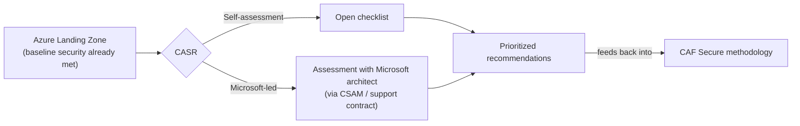
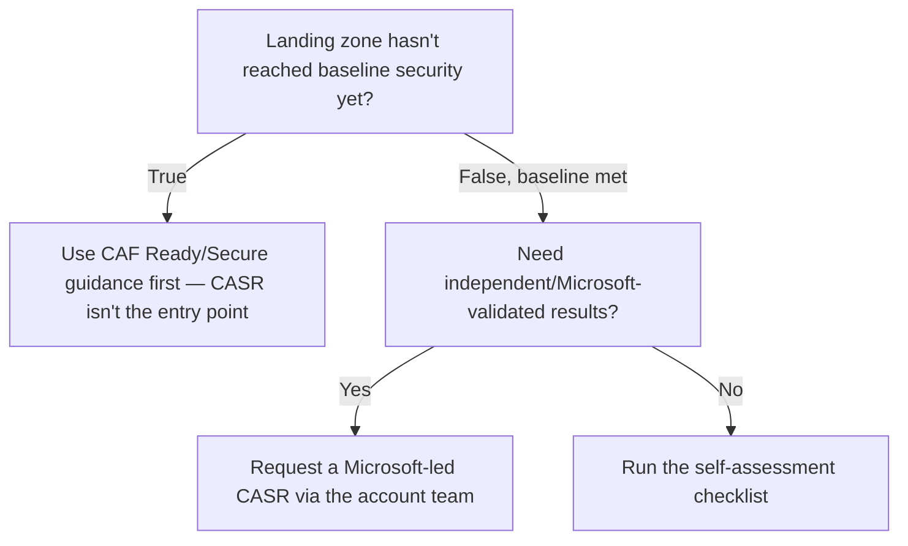

---
tags:
  - sc100
type: concept
domain:
  - best-practices
aliases:
  - CASR
status: needs-verification
---

# Cloud Adoption Security Review (CASR)

## Purpose

CASR is a checklist-driven review that self-assesses (or Microsoft-assesses) an [[Azure Landing Zones|Azure landing zone]] that has already met baseline security, scoring it against the [[Cloud Adoption Framework (CAF)]] Secure methodology and returning prioritized recommendations.

---

## Why Architects Choose It

- Turns Secure methodology guidance into a concrete, actionable checklist instead of abstract principles.
- Two delivery paths — self-assessment (open checklist) or Microsoft-led (via a Microsoft account team/CSAM, typically under an existing support contract) — so the level of independent validation is a choice, not fixed.
- Assumes a landing zone has already reached baseline security; CASR is a maturity/optimization step, not initial hardening.
- Output is prioritized, incremental recommendations, matching CAF's "security is a journey, not a destination" principle.

---

## When to Use

- After a landing zone reaches baseline security, to identify the next optimization increment.
- As a recurring governance checkpoint, on a cadence aligned with CAF's Govern/Secure methodologies.
- Before a Microsoft-led CISO or [[Microsoft Cybersecurity Reference Architectures (MCRA)|MCRA]] workshop, to establish a starting baseline.
- When independent, Microsoft-validated evidence of landing zone security maturity is needed (Microsoft-led path).

---

## When NOT to Use

- As the initial security setup for a brand-new, unsecured landing zone — CASR assumes baseline security already exists; use CAF Ready/Secure guidance first.
- As a substitute for continuous posture monitoring — CASR is a point-in-time review, not the same as [[Security Posture Assessments]]'s continuous scoring.
- As proof of regulatory compliance — like Secure Score, it produces prioritization guidance, not an audit certificate.

---

## Architecture

---

## Architecture Decisions

---

## Comparison

| Compare | Difference |
| --- | --- |
| CASR vs. [[Security Posture Assessments]] | CASR is a point-in-time, checklist-driven maturity review against CAF Secure; posture assessments are continuous, automated scoring (Secure Score/MCSB) inside Defender for Cloud. |
| CASR vs. Well-Architected Review | CASR evaluates landing zone security specifically; a Well-Architected Review evaluates a single workload across all five WAF pillars, not just security. |
| Self-assessment vs. Microsoft-led CASR | Self-assessment is self-service via the published checklist; Microsoft-led adds an architect's involvement, typically through an existing support contract. |

---

## AZ-500 Review

Not covered in AZ-500 at all — AZ-500 teaches the individual controls CASR checks for (identity, network, data protection configuration), but the review methodology itself is new territory for SC-100.

---

## What's New for SC-100

- CASR is the concrete assessment mechanism behind "design/evaluate a strategy based on CAF" — know it as a named, actionable tool, not just an abstract framework alignment.
- The two delivery models (self-assessment vs. Microsoft-led) are themselves an architecture decision — whether to involve Microsoft's account team has a real trigger (need for independent validation).
- CASR presupposes landing zone baseline security is already achieved — a prerequisite the exam may test by asking what should happen *before* a CASR.

---

## Exam Tips

- A brand-new, unsecured landing zone scenario should not point to CASR first — baseline CAF Secure/Ready guidance comes before it.
- CASR results are recommendations, not a compliance certificate — don't pick it as the answer to "prove regulatory compliance."
- "Self-assess against the CAF Secure methodology" is the phrase that should trigger CASR as the answer.

---

## Common Exam Confusion

- **CASR vs. Security Posture Assessments** — one-time landing-zone maturity review vs. continuous resource-level scoring.
- **CASR vs. Well-Architected Review** — landing zone security specifically vs. single-workload, all-pillar architecture review.

---

## Keywords

- Self-assessment vs. Microsoft-led review
- CAF Secure methodology alignment
- Baseline security prerequisite
- Landing zone maturity/optimization
- Prioritized recommendations
- CSAM / Microsoft account team

---

## Related Services

- [[Cloud Adoption Framework (CAF)]]
- [[Security Posture Assessments]]
- [[Zero Trust]]
- [[Microsoft Defender for Cloud]]
- [[Azure Landing Zones]]

---

## References

- [What is a Cloud Adoption Security Review?](https://techcommunity.microsoft.com/blog/azurearchitectureblog/what-is-a-cloud-adoption-security-review/3806510) — Microsoft Tech Community
- [Cloud Adoption Framework Secure methodology](https://learn.microsoft.com/en-us/azure/cloud-adoption-framework/secure/overview) — Microsoft Learn
- [[Exam Objectives]]

---

## Verification Flag

Primary source is a Microsoft Tech Community blog post (not a canonical Learn article), and the exact checklist categories live in an actively maintained GitHub project. Confirm current scope/categories before treating this as exam-final detail.
