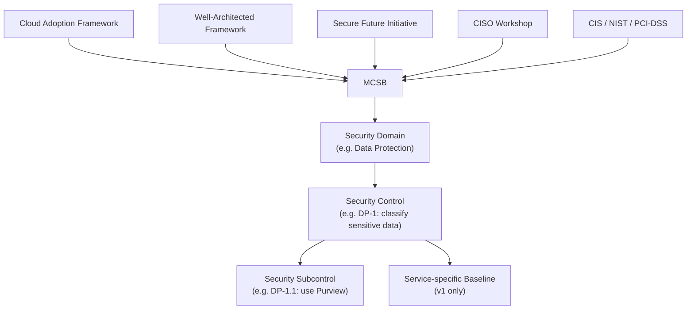
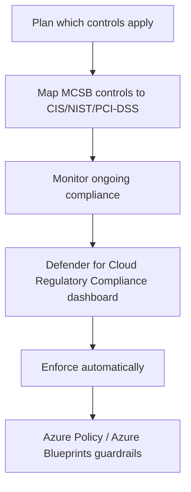

---
tags:
  - sc100
---

# Microsoft Cloud Security Benchmark (MCSB)

## Purpose

MCSB is Microsoft's prescriptive, cross-cloud security control framework — synthesizing [[Cloud Adoption Framework (CAF)]], the Well-Architected Framework, and industry standards — that underpins the default scoring in [[Security Posture Assessments]].
![[Pasted image 20260802142723.png]]

---

## Why Architects Choose It

- Pre-maps controls to CIS, NIST, and PCI-DSS, so meeting MCSB gives a head start on multiple regulatory frameworks instead of mapping each one separately.
- Synthesizes guidance from CAF, the Well-Architected Framework, Microsoft's Secure Future Initiative, and the CISO Workshop into one control set — a single reference instead of five.
- Cloud-agnostic in scope (Azure + multicloud), so the same control set monitors Azure, AWS, and other providers through one pane of glass.
- A structured hierarchy (Domain → Control → Subcontrol) gives both an executive-level summary and implementation-level detail from the same framework.

---

## When to Use

- New to Azure/multicloud and needing a starting security baseline instead of building one from scratch.
- Needing pre-mapped alignment to CIS, NIST, or PCI-DSS for a regulated industry.
- Establishing automated guardrails via Azure Policy/Blueprints tied to a named control set.
- Evaluating a new service before onboarding it into an approved service catalog.

---

## When NOT to Use

- As the capability/target-state architecture — that's [[Microsoft Cybersecurity Reference Architectures (MCRA)|MCRA]], not MCSB.
- As a replacement for reading the actual regulatory standard text when strict legal compliance is required — MCSB accelerates alignment, it isn't the regulation itself.
- Assuming a fixed, immutable structure — v2 (preview) reorganizes domains and controls from v1; the two versions aren't interchangeable in an answer.

---

## Architecture

---

## Architecture Decisions

---

## Comparison

| Compare | Difference |
| --- | --- |
| MCSB vs. [[Microsoft Cybersecurity Reference Architectures (MCRA)|MCRA]] | MCSB is a scored control baseline; MCRA is a capability reference architecture — full comparison in the MCRA note. |
| MCSB v1 vs. v2 (preview) | v2 is Azure-focused with expanded domains (including a new AI Security domain, 7 recommendations), 420+ built-in Azure Policy definitions, and risk/threat-based guidance; v1's per-service baselines aren't yet available in v2. |
| Security Domain vs. Control vs. Subcontrol | Domain = high-level grouping (e.g., Data Protection); Control = specific requirement within it (e.g., DP-1); Subcontrol = granular implementation step (e.g., DP-1.1). |

---

## AZ-500 Review

AZ-500 already covers implementing the individual technical controls MCSB references (Azure Policy, encryption, network security, identity hardening). MCSB's role as a named, synthesized benchmark — and its Plan/Monitor/Establish lifecycle — is new for SC-100.

---

## What's New for SC-100

- Know MCSB by name as the framework [[Security Posture Assessments|Secure Score]] scores against by default — this note covers what MCSB *is*; scoring mechanics live in [[Security Posture Assessments]].
- Recognize MCSB's synthesis role: it isn't original content, it's CAF + WAF + Secure Future Initiative + CISO Workshop + industry standards combined into one control set.
- MCSB v2 (preview) adds a dedicated AI Security domain — directly relevant to the exam's "AI solutions aligned to Microsoft Cloud Security Benchmark" objective; see [[AI and Copilot Security Architecture]] for the tooling that operationalizes this domain.
- Use the Plan → Monitor → Establish lifecycle (map to standards → Regulatory Compliance dashboard → Azure Policy/Blueprints) as the architecture answer for "how do you operationalize MCSB."

---

## Exam Tips

- A scenario aligning AI workloads to MCSB is testing awareness of the new AI Security domain in v2.
- "Pre-mapped to CIS/NIST/PCI-DSS" is MCSB's distinguishing exam fact — don't confuse this regulatory pre-mapping with MCRA, which has none.
- The enforcement mechanism for MCSB is Azure Policy/Blueprints, not manual configuration — expect this in "how do you enforce this at scale" questions.

---

## Common Exam Confusion

- **MCSB vs. MCRA** — scored benchmark vs. capability reference architecture; see the MCRA note for the full breakdown.
- **MCSB v1 vs. v2** — different domain counts and structure; don't assume exam content describes a fixed, unchanging control list.

---

## Keywords

- Microsoft cloud security benchmark
- Security Domain / Control / Subcontrol / Baseline
- Pre-mapped to CIS, NIST, PCI-DSS
- Regulatory Compliance dashboard
- Azure Policy / Blueprints enforcement
- MCSB v2 preview, AI Security domain
- Plan, Monitor, Establish lifecycle

---

## Related Services

- [[Security Posture Assessments]]
- [[Microsoft Cybersecurity Reference Architectures (MCRA)]]
- [[Cloud Adoption Framework (CAF)]]
- [[Azure Policy]]
- [[Microsoft Defender for Cloud]]
- [[AI and Copilot Security Architecture]]

---

## References

- [Microsoft cloud security benchmark introduction](https://learn.microsoft.com/en-us/security/benchmark/azure/introduction) — Microsoft Learn
- [[Exam Objectives]]
- aka.ms/MCSB
- 
