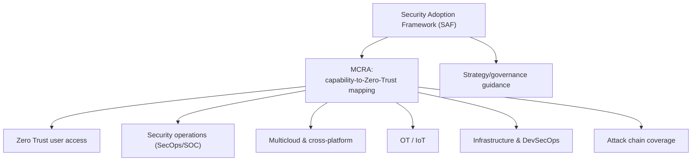
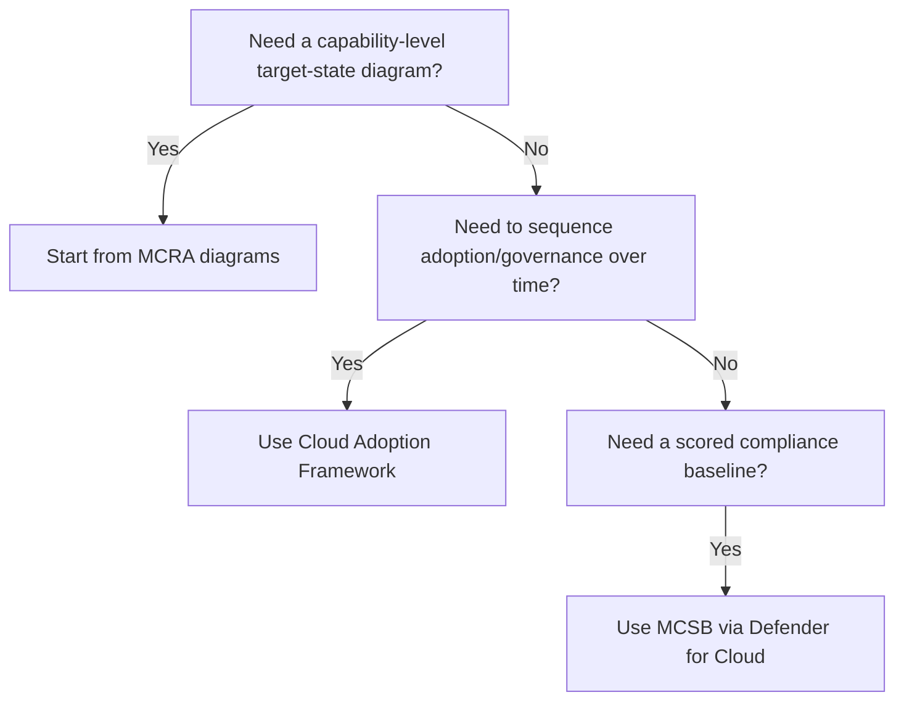

---
tags:
  - sc100
type: concept
domain:
  - best-practices
aliases:
  - MCRA
---

# Microsoft Cybersecurity Reference Architectures (MCRA)

## Purpose

MCRA is Microsoft's downloadable reference-architecture deck mapping Microsoft (and third-party) security capabilities onto [[Zero Trust]] principles across the full hybrid, multicloud, IoT, OT, and AI estate.

---

## Why Architects Choose It

- Gives a capability-level target-state architecture instead of starting a security architecture from a blank slide.
- Maps concrete products — and how they integrate — directly onto Zero Trust principles and industry standards (e.g., The Open Group's Zero Trust Reference Model), closing the gap between abstract principle and product choice.
- Doubles as a gap-analysis tool: compare what an organization already owns/licenses against the reference diagrams to surface unused capability.
- Actively maintained and revised as products change (the most recent major revision added Security Exposure Management, [[Microsoft Security Copilot|Security Copilot]], Windows LAPS, passkeys, and Entra Verified ID, and de-emphasized Secure Score) — a living reference, not a static framework.

---

## When to Use

- Defining a target-state cybersecurity capability architecture for an organization.
- Comparing owned/licensed Microsoft security capabilities against what's actually deployed, to find coverage gaps.
- Preparing for or following up a Microsoft CISO or MCRA workshop.
- Learning how specific Microsoft capabilities integrate — each capability in the deck includes a short description and documentation link.

---

## When NOT to Use

- As a governance/adoption sequencing framework — that's [[Cloud Adoption Framework (CAF)]], not MCRA.
- As a scored compliance benchmark — that's MCSB, assessed via [[Security Posture Assessments]].
- As a substitute for reading Zero Trust guidance directly — MCRA maps capabilities onto Zero Trust, it doesn't redefine the principles; see [[Zero Trust]] for those.

---

## Architecture

---

## Architecture Decisions

---

## Comparison

| Compare | Difference |
| --- | --- |
| MCRA vs. [[Cloud Adoption Framework (CAF)]] | MCRA maps capabilities to Zero Trust (what to deploy and how it fits together); CAF sequences the org-wide adoption lifecycle (when, in what order). |
| MCRA vs. MCSB | MCRA is a capability reference architecture; MCSB is a scored control baseline assessed via [[Security Posture Assessments]]. Easy to conflate since the exam names them together. |
| MCRA vs. [[Zero Trust]] guidance | Zero Trust defines the principles; MCRA maps specific Microsoft (and third-party) products onto those principles. |

---

## AZ-500 Review

Not covered in AZ-500 — AZ-500 teaches individual product configuration; MCRA is a higher-level, cross-product reference architecture that assumes that product knowledge already exists.

---

## What's New for SC-100

- Recognize MCRA as the named artifact behind the "align with MCRA and MCSB" exam objective — a specific, downloadable Microsoft deck, not a generic phrase.
- Use MCRA as the starting template/gap-analysis tool for a target-state architecture, and know its diagram categories (Zero Trust user access, SecOps, multicloud, OT, attack chain coverage, infrastructure/DevSecOps).
- MCRA is a component of Microsoft's broader [[Security Adoption Framework (SAF)|Security Adoption Framework (SAF)]] — know the relationship, not just the acronym.
- MCRA content shifts with product reality (recent revision moved emphasis from Secure Score toward Security Exposure Management) — treat it as a living reference, not a fixed syllabus.

---

## Exam Tips

- "Recommend a capability/target-state architecture using Microsoft's reference architecture" points to MCRA, not CAF or MCSB.
- Don't confuse MCRA (capability mapping) with MCSB (scored benchmark) just because both appear together in the same exam objective line.
- MCRA workshops are Microsoft-led, the same delivery pattern as a CISO workshop or a Microsoft-led [[Cloud Adoption Security Review (CASR)]].

---

## Common Exam Confusion

- **MCRA vs. MCSB** — reference architecture (capability mapping) vs. scored benchmark (compliance baseline); easy to conflate since the exam objective names them together.
- **MCRA vs. CAF** — capability/target-state diagrams vs. adoption lifecycle sequencing.

---

## Keywords

- Microsoft Cybersecurity Reference Architectures
- Security Adoption Framework (SAF)
- Capability-to-Zero-Trust mapping
- Target-state security architecture
- Gap analysis / capability comparison
- Zero Trust user access diagram
- Attack chain coverage
- Security Exposure Management (current MCRA emphasis)

---

## Related Services

- [[Zero Trust]]
- [[Cloud Adoption Framework (CAF)]]
- [[Security Posture Assessments]]
- [[Microsoft Defender for Cloud]]
- [[Microsoft Sentinel]]
- [[Microsoft Security Copilot]]
- [[Security Adoption Framework (SAF)]]

---

## References

- [Microsoft Cybersecurity Reference Architectures (MCRA)](https://learn.microsoft.com/en-us/security/adoption/mcra) — Microsoft Learn
- [[Exam Objectives]]
- aka.ms/MCRA

