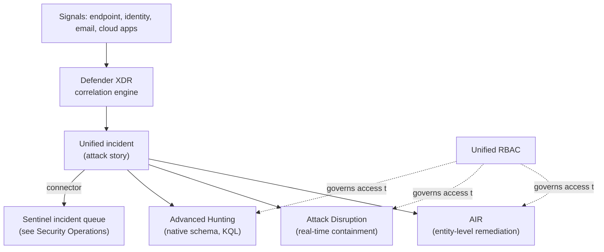
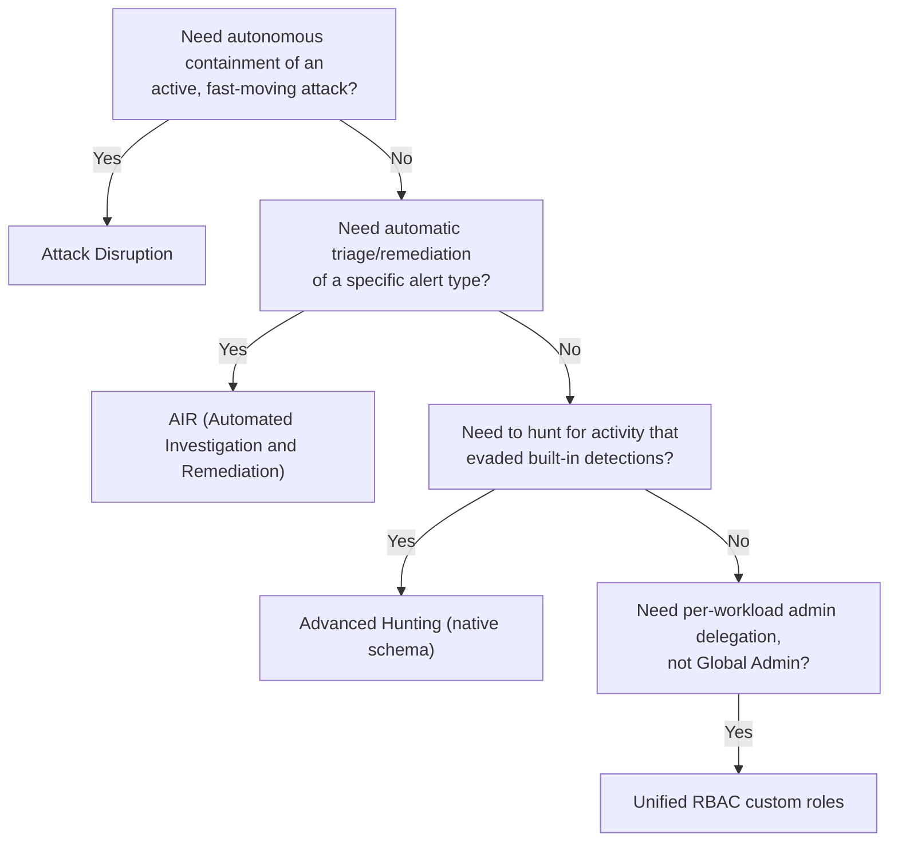

---
tags:
  - sc100
---

# Microsoft Defender XDR

## Purpose

Microsoft's native cross-signal detection and response product — endpoint, identity, email, and cloud apps — that auto-correlates alerts into unified incidents and can autonomously contain an active attack. The "XDR" piece of the unified platform architected in [[Security Operations]]; this note covers what Defender XDR itself does, not the SIEM/SOAR layering around it.

---

## Why Architects Choose It

- Correlation across first-party signal sources happens natively and automatically, before Sentinel or an analyst ever looks at it — related alerts merge into one incident instead of flooding a queue as separate events.
- **Attack Disruption** acts autonomously on high-confidence signals to contain an active attack (disable a compromised account, isolate a device) in near real time — faster than any human-in-the-loop process, closing the gap between detection and containment for fast-moving attacks like ransomware (see [[Ransomware Resiliency and BCDR]]).
- **Automated Investigation and Remediation (AIR)** triages and remediates verdict-based alerts (a malicious file, a suspicious mailbox rule) without analyst effort, freeing analyst time for genuine investigation.
- **Unified RBAC** lets an org delegate per-workload administration — an Exchange admin managing Defender for Office 365 policy without also getting endpoint device-isolation rights — instead of relying on Global Admin or separate workload consoles.
- The component products (Defender for Endpoint, Office 365, Identity, Cloud Apps) and how XDR compares to Defender for Cloud are already mapped in [[Microsoft Defender]] — not repeated here.

---

## Automated Investigation and Remediation (AIR)

- Runs automatically after certain alert types fire, investigating the entity (file, mailbox, process) and reaching a verdict (malicious, suspicious, no threat found).
- Remediation actions are **auto-approved or pending approval** depending on the org's configured automation level — full automation for high-confidence verdicts, analyst sign-off for lower-confidence ones.
- Scope is entity-level and verdict-driven — it acts on *what it already investigated*, not on a broad, org-wide containment action.

## Attack Disruption

- Triggers on **high-confidence, correlated signals indicating an active attack** (e.g., ransomware behavior, business email compromise, human-operated intrusion) — not a single suspicious alert.
- Acts **autonomously and immediately**: disabling the compromised account, isolating the affected device(s), or blocking further lateral movement — designed to contain before an analyst could react manually.
- Distinct from AIR: Attack Disruption interrupts an *in-progress* attack in real time; AIR investigates and cleans up *after the fact* on a specific entity.

## Advanced Hunting

- KQL-based hunting over Defender XDR's own native schema (`DeviceEvents`, `EmailEvents`, `IdentityLogonEvents`, etc.) — proactive search for activity that didn't trigger a built-in detection.
- Once Sentinel is connected via the unified platform, hunting can span both Defender XDR's native tables and Sentinel's broader Log Analytics-ingested tables from the same portal — but the native schema itself remains narrower in scope (Microsoft-signal-only) than Sentinel's full ingested estate.
- Custom detection rules can be built directly from a saved hunting query, turning a one-off hunt into a standing detection.

## Unified RBAC

- One permission model spanning Defender for Endpoint, Office 365, Identity, and Cloud Apps — custom roles scope exactly which workload and which action (e.g., view-only on Identity, full remediation on Endpoint) a role can perform.
- Replaces relying on Global Admin or each workload's separate, inconsistent permission set — a governance improvement the exam expects you to recommend when a scenario describes over-broad admin access across Defender workloads.

---

## When to Use

- Detecting and natively responding within Microsoft's own signal sources (endpoint, identity, email, cloud apps) with minimal setup.
- Containing a fast-moving, high-confidence active attack automatically — Attack Disruption, not a Sentinel playbook waiting on a trigger condition.
- Reducing analyst triage load on high-volume, well-understood alert types — AIR.
- Delegating Defender administration by workload and action, not by handing out Global Admin — Unified RBAC.
- Hunting for activity that evaded built-in detections, using Microsoft-signal-native tables — Advanced Hunting.

---

## When NOT to Use

- Expecting Attack Disruption to fire on every alert — it activates only on high-confidence, correlated attack patterns, not general suspicious activity.
- Treating AIR as a substitute for Attack Disruption during an active, fast-moving attack — AIR's after-the-fact remediation is too slow for that use case.
- Assuming Advanced Hunting alone covers non-Microsoft sources — that requires Sentinel's broader ingestion (see [[Security Operations]]).
- Continuing to manage Defender workload permissions via Global Admin once Unified RBAC is available — it's the intended replacement for that over-broad default.

---

## Architecture

---

## Architecture Decisions

---

## Comparison

| Compare | Difference |
| --- | --- |
| AIR vs. Attack Disruption | AIR investigates and remediates a *specific entity* after an alert fires — after-the-fact cleanup. Attack Disruption acts *immediately and autonomously* on high-confidence, correlated signals of an active, in-progress attack — real-time containment, not post-alert remediation. |
| AIR vs. Sentinel SOAR playbooks | AIR is native, verdict-driven remediation scoped to Defender XDR entities (files, mailboxes, devices) — no configuration required beyond automation level. Sentinel SOAR playbooks (see [[Security Operations]]) are configurable, trigger-based [[Logic Apps]] automations that can act across *any* connected system, Microsoft or not. |
| Advanced Hunting vs. Sentinel hunting | Advanced Hunting queries Defender XDR's native, Microsoft-signal-only schema. Sentinel hunting queries the full Log Analytics workspace, including non-Microsoft/custom-ingested sources. The unified portal lets you query both together once connected, but the underlying scope still differs. |
| Unified RBAC vs. Azure RBAC/Entra ID roles | Unified RBAC scopes actions *within Defender XDR workloads* (device isolation, mailbox remediation, identity actions). Azure RBAC and Entra ID roles (full comparison in [[Identity and Access Management (IAM)]]) govern Azure resources and the directory itself — a separate control plane entirely. |

---

## AZ-500 Review

AZ-500 covers configuring individual Defender products in isolation — onboarding devices to Defender for Endpoint, setting Defender for Office 365 policies, deploying Defender for Identity sensors, configuring Defender for Cloud Apps discovery. It does not cover XDR-level incident correlation, AIR, Attack Disruption, Unified RBAC, or cross-product Advanced Hunting — all new for SC-100.

---

## What's New for SC-100

- Recognize **Attack Disruption** as a distinct, named autonomous-response capability — separate from both AIR and Sentinel SOAR playbooks — and the exam's answer for "contain in real time without waiting for a human."
- Recognize **AIR** as the automated-triage-and-remediation mechanism for verdict-based alerts on a specific entity, not a general containment tool.
- Design **Unified RBAC** for cross-workload delegation as the replacement for Global Admin/separate workload-console permissions.
- Know **Advanced Hunting**'s native schema as complementary to, but narrower than, Sentinel's broader hunting scope — both live in the same unified portal but query different data.

---

## Exam Tips

- "Automatically isolate a device or disable an account the moment a high-confidence ransomware signal is detected, with no analyst involvement" → Attack Disruption, not AIR or a Sentinel playbook.
- "Automatically investigate and remediate a phishing email or malicious file verdict" → AIR.
- "Let the Exchange team manage Defender for Office 365 policy without granting device-isolation rights" → Unified RBAC custom role, not Global Admin.
- "Hunt using KQL over raw endpoint process/network events" → Advanced Hunting; if the scenario also names a non-Microsoft log source, the answer extends to Sentinel hunting instead.

---

## Common Exam Confusion

- **AIR vs. Attack Disruption** — after-the-fact entity remediation vs. real-time autonomous containment; full comparison above.
- **AIR vs. Sentinel SOAR playbooks** — native verdict-driven automation vs. configurable, cross-system Logic Apps automation.
- **Advanced Hunting vs. Sentinel hunting** — native Microsoft-signal schema vs. full Log Analytics scope.
- **Unified RBAC vs. Azure RBAC/Entra ID roles** — Defender workload actions vs. Azure resource/directory control planes.

---

## Keywords

- Automated Investigation and Remediation (AIR)
- Attack Disruption, autonomous containment
- Advanced Hunting, native schema (DeviceEvents, EmailEvents, IdentityLogonEvents)
- Unified RBAC, custom roles
- Incident correlation, attack story
- Self-healing, real-time containment
- Device isolation, account disable

---

## Related Services

- [[Security Operations]]
- [[Microsoft Sentinel]]
- [[Microsoft Defender]]
- [[Threat Intelligence]]
- [[Identity and Access Management (IAM)]]
- [[Ransomware Resiliency and BCDR]]
- [[Zero Trust]]

---

## References

- [Automated investigation and response in Microsoft Defender XDR](https://learn.microsoft.com/en-us/defender-xdr/m365d-autoir) — Microsoft Learn
- [Automatic attack disruption in Microsoft Defender XDR](https://learn.microsoft.com/en-us/defender-xdr/automatic-attack-disruption) — Microsoft Learn
- [Advanced hunting overview](https://learn.microsoft.com/en-us/defender-xdr/advanced-hunting-overview) — Microsoft Learn
- [Unified role-based access control (RBAC)](https://learn.microsoft.com/en-us/defender-xdr/manage-rbac) — Microsoft Learn
- [[Exam Objectives]]
