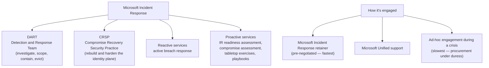
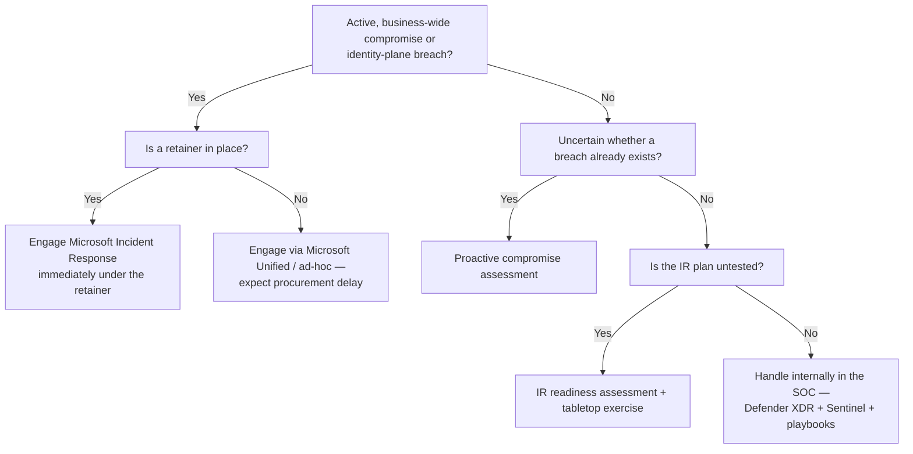

---
tags:
  - sc100
type: concept
domain:
  - best-practices
aliases:
  - DART
  - Microsoft Detection and Response Team
  - Microsoft Incident Response
  - CRSP
status: needs-verification
---

# Microsoft Incident Response (DART)

## Purpose

Microsoft's own incident response practice — the **Detection and Response Team (DART)** plus the Compromise Recovery Security Practice (CRSP), now delivered under the **Microsoft Incident Response** brand — and the published guidance it produces for investigating, containing, and recovering from a major compromise.

---

## Why Architects Choose It

- A major breach is the one scenario where an internal SOC is simultaneously **the investigating party and a potentially compromised system**. DART supplies an outside team with Microsoft-internal telemetry access and product engineering escalation paths a customer cannot replicate.
- DART's published guidance is *doctrine*, not marketing: it defines the sequence an architect should design toward — assess, contain, evict, recover, harden — and the exam treats that sequence as the correct answer shape.
- Splits the response into **tactical recovery** (get the business running) and **strategic hardening** (don't get re-breached), which is the architectural insight: recovering into the same design that was breached is not recovery.
- Engagement terms are a **pre-incident architecture decision**. A retainer negotiated in advance means the response starts in hours; procurement mid-crisis costs days at the worst possible moment.

---

## When to Use

- Suspected or confirmed **human-operated ransomware**, nation-state activity, or a compromise of the identity plane (domain controllers, [[Entra ID]] Global Admins, [[Securing Active Directory Domain Services (AD DS)|AD DS]] Tier 0, Entra Connect).
- The internal team cannot establish scope with confidence, or cannot trust its own tooling/administrative accounts.
- Proactively: incident response readiness assessments, compromise assessments (am I already breached?), tabletop exercises, and crisis playbook development.
- Post-incident: converting DART's findings into a hardening roadmap — typically the [[Rapid Modernization Plan (RaMP)]] and [[Securing Privileged Access]] work.

---

## When NOT to Use

- For routine alert triage or day-to-day investigations — that's the internal SOC ([[Security Operations]]) with [[Microsoft Defender XDR]] and [[Microsoft Sentinel]]; escalating everything externally destroys the SOC's own capability.
- As a substitute for having an internal IR plan, an on-call rota, and defined escalation criteria — DART augments a functioning process, it doesn't replace one.
- As a compliance/audit deliverable — a DART engagement is an incident service, not an attestation.
- To design routine automation — automated containment belongs to [[Playbooks and Automation Rules|playbooks and automation rules]] and Defender XDR's attack disruption.

---

## Architecture

**DART's ransomware investigation sequence** — the shape the exam expects:

| Step | What it establishes |
| --- | --- |
| 1. Assess the current situation | What happened, when, which systems, is the attacker still active, what is the extent of encryption/exfiltration. |
| 2. Identify affected line-of-business applications | Which business processes are actually down, so recovery is sequenced by business impact rather than by server list. |
| 3. Determine the compromise recovery process | Whether to clean or rebuild, in what order, and what must be hardened *before* systems return to service. |

Recovery then runs as tactical containment/eviction → restore in the priority order from [[Ransomware Resiliency and BCDR]] (identity first) → strategic hardening.

---

## DART's Recurring Recommendations

Patterns that show up across DART engagements and Microsoft's ransomware guidance — high-value because they double as exam answers:

- **Assume the identity plane is fully compromised** in a domain-wide incident. Tier 0 assets are rebuilt, not cleaned; the `krbtgt` account is rotated (twice, allowing for replication) to invalidate golden tickets.
- **Do not pay the ransom** — payment is not a recovery strategy and does not reliably restore data or prevent leak/repeat extortion.
- **Protect and verify backups first**, before eviction — attackers target backups precisely to remove the alternative to paying ([[Resource Guard]], immutability).
- **Deploy EDR broadly before eviction**, not after — evicting an attacker without visibility invites immediate re-entry.
- **Enforce MFA and eliminate legacy authentication** as part of containment, not as a later project.
- **Treat Entra Connect servers and administrative workstations as Tier 0**, since they are routine pivot points into cloud identity.
- **Pair eviction with a hardening roadmap** — otherwise the same initial access vector remains open.

---

## Architecture Decisions

---

## Comparison

| Compare | Difference |
| --- | --- |
| **DART vs. MSRC** | DART/Microsoft Incident Response responds to **a customer's** compromise. The Microsoft Security Response Center (MSRC) handles vulnerabilities in **Microsoft's own products** and coordinates disclosure/patches. Unrelated functions, easily confused acronyms. |
| **DART vs. CRSP** | Both sit under Microsoft Incident Response: DART investigates and evicts; CRSP rebuilds and hardens the identity plane afterwards. Investigation vs. compromise recovery. |
| **Microsoft Incident Response vs. the internal SOC** | The SOC runs continuous detection and routine response ([[Security Operations]]). Microsoft IR is a surge capability for incidents beyond internal scope or trust — not a replacement for the SOC. |
| **Reactive vs. proactive engagement** | Reactive = active breach. Proactive = readiness assessments, compromise assessments, tabletops, playbook development — bought *before* an incident. |
| **IR retainer vs. ad-hoc engagement** | A retainer pre-negotiates contract, scope, and contacts so response begins in hours; ad-hoc engagement puts procurement on the critical path during the crisis. |
| **[[Playbooks and Automation Rules\|IR playbook]] vs. Sentinel playbook** | Microsoft's IR playbooks (phishing, password spray, app consent grant) are **documented human procedures**. A Sentinel playbook is an automated [[Logic Apps]] workflow. Same word, entirely different artifact. |

---

## AZ-500 Review

Not covered by AZ-500, which stops at configuring detection and response tooling. Knowing *when to escalate outside the organization*, how Microsoft's IR practice is structured, and how its guidance shapes recovery sequencing is entirely SC-100 territory.

---

## What's New for SC-100

- Treat "when do we engage Microsoft's incident response resources" as a **documented escalation criterion in the security strategy**, not an ad-hoc judgment call during a crisis.
- Recognize the retainer as a pre-incident architectural decision with a measurable effect on time-to-response.
- Know DART's three-step ransomware approach and the tactical-then-strategic split — the exam frames incident response as sequencing, not tooling.
- Use DART/Microsoft IR published guidance as a source of security best practices in a recommended strategy, alongside [[Microsoft Cybersecurity Reference Architectures (MCRA)|MCRA]], [[Zero Trust]], and [[Microsoft Cloud Security Benchmark (MCSB)|MCSB]] — IR playbooks are one of the guidance sets [[Security Adoption Framework (SAF)|SAF]] integrates.

---

## Exam Tips

- "Widespread human-operated ransomware, internal team cannot determine scope" → engage **Microsoft Incident Response / DART**, and prioritize identity recovery first.
- "Reduce the time to engage external IR expertise during a breach" → an **IR retainer** purchased in advance, not a faster procurement process.
- "Determine whether an undetected compromise already exists" → **proactive compromise assessment**, not a vulnerability scan and not a penetration test.
- MSRC is the wrong answer to any customer-breach scenario — it handles Microsoft product vulnerabilities.
- Answers that restore systems without hardening the initial access vector are incomplete — DART's guidance always pairs recovery with hardening.
- "Recovery order after a domain-wide compromise" → identity systems first (see [[Ransomware Resiliency and BCDR]]), and rebuild Tier 0 rather than clean it.

---

## Common Exam Confusion

- **DART vs. MSRC** — customer incident response vs. Microsoft product vulnerability response.
- **DART vs. CRSP** — investigate/evict vs. rebuild/harden, both under Microsoft Incident Response.
- **IR playbook (procedure) vs. Sentinel playbook (Logic App)** — see [[Playbooks and Automation Rules]].
- **Microsoft Incident Response vs. Microsoft Unified** — Unified is the *support contract* through which services including IR are delivered; it isn't the IR team.
- **Proactive compromise assessment vs. penetration test** — "are we already breached?" vs. "can we be breached?"

---

## Keywords

- DART (Detection and Response Team), Microsoft Incident Response
- CRSP (Compromise Recovery Security Practice)
- Reactive vs. proactive IR services
- Incident response retainer, Microsoft Unified
- Compromise assessment, IR readiness assessment, tabletop exercise
- Assess the situation → identify affected LOB apps → determine compromise recovery
- Tactical containment vs. strategic hardening
- Tier 0 rebuild, krbtgt rotation (twice), golden ticket
- Do not pay the ransom
- Human-operated ransomware

---

## Related Services

- [[Security Operations]]
- [[Ransomware Resiliency and BCDR]]
- [[Playbooks and Automation Rules]]
- [[Securing Active Directory Domain Services (AD DS)]]
- [[Securing Privileged Access]]
- [[Rapid Modernization Plan (RaMP)]]
- [[Microsoft Defender XDR]]
- [[Microsoft Sentinel]]
- [[Security Adoption Framework (SAF)]]
- [[Attack Chain Models]]
- [[Threat Intelligence]]
- [[Zero Trust]]

---

## References

- [Microsoft Incident Response](https://www.microsoft.com/en-us/security/business/microsoft-incident-response) — Microsoft
- [DART ransomware approach and best practices](https://learn.microsoft.com/en-us/security/ransomware/dart-ransomware-approach) — Microsoft Learn
- [Human-operated ransomware](https://learn.microsoft.com/en-us/security/ransomware/human-operated-ransomware) — Microsoft Learn
- [Incident response playbooks](https://learn.microsoft.com/en-us/security/operations/incident-response-playbooks) — Microsoft Learn
- [[Exam Objectives]]

---

## Verification Flag

The DART name has been folded into the **Microsoft Incident Response** brand, and the split of services between DART, CRSP, Microsoft Unified, and retainer offerings has been repackaged more than once. Exam items may still use "DART" as the primary term. Re-verify current branding and the reactive/proactive service list against Microsoft's incident response page close to exam date.
