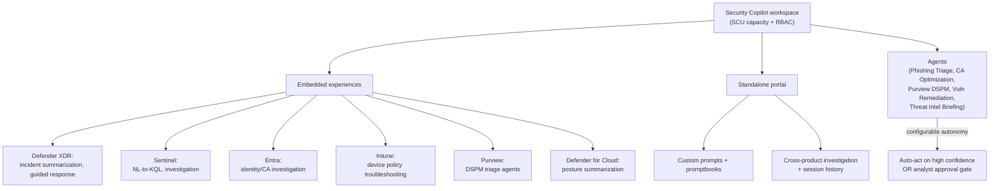
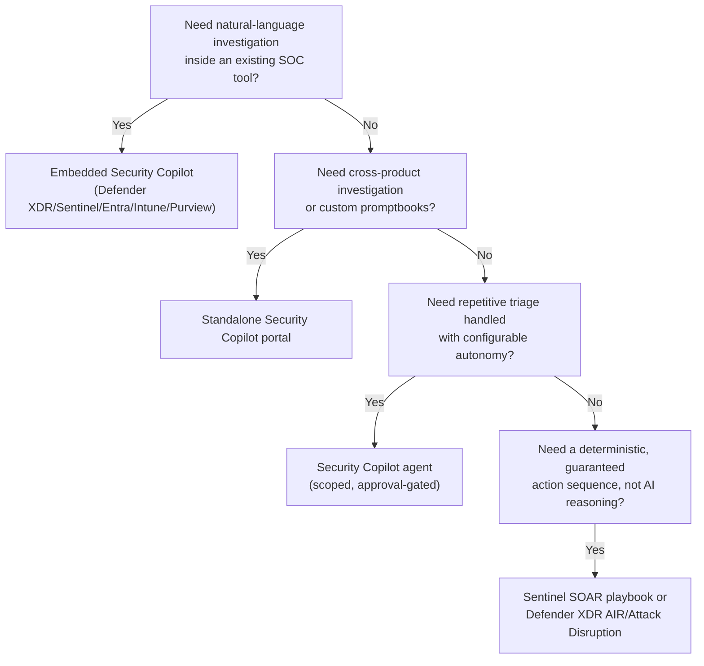

---
tags:
  - sc100
type: concept
domain:
  - ops-identity-compliance
aliases:
  - Security Copilot
status: needs-verification
---

# Microsoft Security Copilot

## Purpose

Generative-AI assistant for the SOC — natural-language investigation, incident summarization, and (increasingly) autonomous agents — embedded directly in Defender XDR, Sentinel, Entra, Intune, Purview, and Defender for Cloud, plus a standalone portal; billed as provisioned capacity (Security Compute Units), not per-seat.

---

## Why Architects Choose It

- Meets analysts inside tools the SOC already uses — Defender XDR incident summarization, Sentinel natural-language-to-KQL, Entra identity investigation — instead of forcing a context switch to a separate AI console.
- Runs within existing RBAC and tenant boundaries: a user only sees what their existing role already permits across the underlying product, so adding Security Copilot doesn't grant new access — closing the same "does AI expand the blast radius" question architects ask about Microsoft 365 Copilot, but answered oppositely (see Comparison).
- Consumption-based Security Compute Unit (SCU) billing decouples cost from headcount — pay for provisioned throughput, not per-analyst seats, which matters when only a subset of the SOC needs AI-assisted triage at any moment.
- Promptbooks turn a senior analyst's investigation pattern into a repeatable, shareable sequence — institutional knowledge encoded once, reused by junior analysts without a training cycle.
- **Agents** (Phishing Triage, Conditional Access Optimization, Purview Data Security, Vulnerability Remediation, Threat Intelligence Briefing) extend Security Copilot from "answer my question" to "monitor and act with configurable autonomy" — the architectural shift from assistant to semi-autonomous SOC operator.

---

## Standalone vs. Embedded Experiences

- **Embedded** — a scoped Security Copilot experience surfaced directly inside [[Microsoft Defender XDR]] (incident summarization, guided response, script/file deobfuscation, device timeline), [[Microsoft Sentinel]] (natural-language-to-KQL, incident investigation), [[Entra ID]] (identity/Conditional Access investigation), [[Intune]] (device policy troubleshooting), [[Purview]] (DSPM triage agents), and [[Microsoft Defender for Cloud]] (posture/recommendation summarization). No separate login — same workflow the analyst is already in.
- **Standalone** — a dedicated Security Copilot portal for building custom prompts and promptbooks, running cross-product investigations, and reviewing session history that spans multiple embedded surfaces.
- Both draw from the same provisioned SCU capacity and the same plugin/skill architecture — the split is *where* the analyst interacts with it, not two separate products.

---

## Agents

- Pre-built, Microsoft-authored agents that run with a defined scope and permission set, not a general-purpose chat session — e.g., **Phishing Triage agent** (Defender XDR), **Alert Triage agents for Purview DSPM**, **Conditional Access Optimization agent** (Entra), **Vulnerability Remediation agent**, **Threat Intelligence Briefing agent**.
- Configurable autonomy — an agent can be scoped to act automatically on high-confidence findings or require analyst approval before acting, the same human-in-the-loop dial as [[Microsoft Defender XDR|Defender XDR's AIR automation levels]].
- Distinct from a [[Microsoft Sentinel|Sentinel]] SOAR playbook: an agent reasons over natural-language context and unstructured signal to decide *what* to do; a playbook executes a deterministic, pre-defined action sequence once triggered. See Comparison.

---

## Licensing and Capacity

- Billed via **Security Compute Units (SCUs)** — provisioned capacity purchased in units and billed hourly for as long as it's provisioned, independent of actual usage (the same provisioned-throughput pattern architects should recognize from other Azure services) — not a per-user license.
- Capacity is managed at the **workspace** level; an admin provisions SCUs, assigns RBAC (who can use vs. who can manage plugins/capacity), and can scale capacity up or down as SOC demand changes.
- Standing up Security Copilot without planning SCU capacity ahead of a rollout is the concrete architecture mistake the exam tests — uncontrolled cost (capacity billed regardless of idle time) and uncontrolled access (no workspace RBAC) both follow from skipping this step.

---

## When to Use

- Reducing SOC mean-time-to-triage on Defender XDR/Sentinel incidents via natural-language investigation and auto-generated incident summaries.
- Lowering the KQL skill bar for junior analysts — natural-language-to-KQL query generation inside Sentinel.
- Standardizing a senior analyst's investigation pattern into a reusable promptbook other analysts can run.
- Offloading well-scoped, repetitive triage (phishing submissions, DSPM data-risk alerts, Conditional Access policy gaps) to an agent with a human-approval gate, freeing analyst time for novel investigation.
- Producing audience-ready incident summaries or exposure reports without an analyst manually authoring them each time.

---

## When NOT to Use

- As a substitute for a workspace capacity/RBAC plan — provisioning SCUs without a plan produces uncontrolled cost and access sprawl (see Licensing and Capacity).
- As a deterministic, guaranteed-outcome automation mechanism — for that, use a Sentinel SOAR playbook or Defender XDR's AIR/Attack Disruption; Security Copilot and its agents reason probabilistically and should carry a defined confidence/approval threshold, not be trusted unsupervised for hard, compliance-mandated actions.
- Confusing it with Microsoft 365 Copilot to "cover AI adoption" in one line item — they're different products, different billing models, different risk profiles (see Comparison).
- Expecting free or unlimited usage — SCU capacity is a real, hourly cost that must be sized and monitored like any other provisioned Azure resource.

---

## Architecture

---

## Architecture Decisions

---

## Comparison

| Compare | Difference |
| --- | --- |
| Security Copilot vs. Microsoft 365 Copilot | SOC assistant embedded in Defender/Sentinel/Entra/Intune/Purview, billed via Security Compute Units (SCUs), runs within the analyst's *existing* RBAC. Microsoft 365 Copilot is a productivity assistant embedded in Office apps, licensed per user, and inherits the signed-in user's existing *data* permissions — different risk (oversharing) because it surfaces content, not security telemetry. Different products despite the shared name — full detail in [[AI and Copilot Security Architecture]]. |
| Security Copilot agents vs. Sentinel SOAR playbooks | Agents reason over natural-language context and unstructured signal to decide what action fits, with a configurable confidence/approval threshold. Playbooks ([[Logic Apps]]-based) execute a deterministic, pre-defined action sequence once a trigger condition fires — no reasoning, no judgment call. Agents suit ambiguous, judgment-heavy triage; playbooks suit a known, repeatable action. |
| Security Copilot agents vs. Defender XDR AIR | AIR is native, verdict-driven remediation scoped to Defender XDR entities only (files, mailboxes, devices), with no separate licensing. Security Copilot agents span multiple products (Purview, Entra, Defender XDR) and are billed via the same SCU capacity as the rest of Security Copilot. |
| Embedded vs. standalone Security Copilot | Same workspace, same SCU capacity, same plugin architecture — the difference is only *where* the analyst works: inside the product they're already using vs. a dedicated cross-product portal for custom prompts and promptbooks. |

---

## AZ-500 Review

Not covered at all — Security Copilot didn't exist as a GA product during AZ-500's scope. Underlying surfaces it's embedded in (Defender XDR, Sentinel, Entra, Intune, Purview) are AZ-500 fundamentals; the AI layer, promptbooks, plugin architecture, agents, and SCU billing model are entirely new for SC-100.

---

## What's New for SC-100

- Know Security Copilot as a **capacity-billed (SCU), embedded-first** capability — not a per-seat license and not a standalone product most SOCs would license in isolation.
- Distinguish embedded vs. standalone experiences, and know both draw from the same workspace capacity — a common exam framing is "where does the analyst do X," testing whether you know which surface a given task lives on.
- Recognize **agents** as the newest architectural layer — a step beyond conversational Q&A toward semi-autonomous, approval-gated action — and know the named examples (Phishing Triage, Conditional Access Optimization, Purview DSPM triage, Vulnerability Remediation, Threat Intelligence Briefing).
- Tie workspace planning (SCU sizing, RBAC) to cost/access governance — the exam's "what goes wrong if you skip planning" angle, same pattern as any provisioned-capacity Azure resource.
- Understand Security Copilot as the "AI as a defense capability" half of [[AI and Copilot Security Architecture]]'s two-directional AI framing — the other half being AI as a workload to secure.

---

## Exam Tips

- "Assistant embedded in Defender/Sentinel, capacity billed in compute units" → Security Copilot, not Microsoft 365 Copilot.
- "Natural-language KQL generation" or "auto-summarized incident" → Security Copilot embedded in Sentinel/Defender XDR.
- "Repetitive triage task handled with configurable human approval, spanning multiple products" → a Security Copilot agent, not a Sentinel playbook (deterministic) or AIR (Defender XDR-scoped only).
- "Uncontrolled cost after enabling an AI SOC assistant" → missing SCU capacity planning, the concrete pre-rollout step the exam expects.
- A scenario asking for a *guaranteed, deterministic* action sequence is testing SOAR (playbooks) or AIR/Attack Disruption, not Security Copilot or its agents — AI reasoning is probabilistic by design.

---

## Common Exam Confusion

- **Security Copilot vs. Microsoft 365 Copilot** — different products, different billing, different permission-inheritance risk; see Comparison and [[AI and Copilot Security Architecture]].
- **Security Copilot agents vs. Sentinel SOAR playbooks** — natural-language reasoning with configurable autonomy vs. deterministic, trigger-based automation.
- **Embedded vs. standalone Security Copilot** — same capacity/workspace, different surface; not two separate products or licenses.
- **Security Copilot agents vs. Defender XDR AIR** — cross-product, SCU-billed agents vs. Defender-XDR-native, entity-scoped remediation.

---

## Keywords

- Microsoft Security Copilot, Security Compute Units (SCU)
- Embedded vs. standalone Security Copilot experiences
- Promptbooks, plugins/skills
- Security Copilot agents: Phishing Triage, Conditional Access Optimization, Purview DSPM triage, Vulnerability Remediation, Threat Intelligence Briefing
- Workspace RBAC, capacity provisioning
- Natural-language-to-KQL, incident summarization, guided response
- Configurable autonomy, human-in-the-loop approval gate

---

## Related Services

- [[AI and Copilot Security Architecture]]
- [[Microsoft Defender XDR]]
- [[Microsoft Sentinel]]
- [[Entra ID]]
- [[Purview]]
- [[Data Security Posture Management (DSPM)]]
- [[Microsoft Entra Agent ID]]
- [[Conditional Access]]
- [[Threat Intelligence]]
- [[Security Operations]]
- [[Microsoft Defender for Cloud]]
- [[Zero Trust]]

---

## References

- [What is Microsoft Security Copilot?](https://learn.microsoft.com/en-us/copilot/security/microsoft-security-copilot) — Microsoft Learn
- [Microsoft Security Copilot agents](https://learn.microsoft.com/en-us/copilot/security/agents-overview) — Microsoft Learn
- [Microsoft Security Copilot pricing and licensing](https://learn.microsoft.com/en-us/copilot/security/manage-usage) — Microsoft Learn
- [Promptbooks in Microsoft Security Copilot](https://learn.microsoft.com/en-us/copilot/security/promptbooks) — Microsoft Learn
- [[Exam Objectives]]

---

## Verification Flag

Security Copilot's agent lineup (Phishing Triage, Conditional Access Optimization, Purview DSPM triage, Vulnerability Remediation, Threat Intelligence Briefing) and SCU pricing were expanding quickly as of writing (2026-08-11) — re-verify the current agent catalog, GA vs. preview status, and exact SCU pricing/billing mechanics close to exam date.
