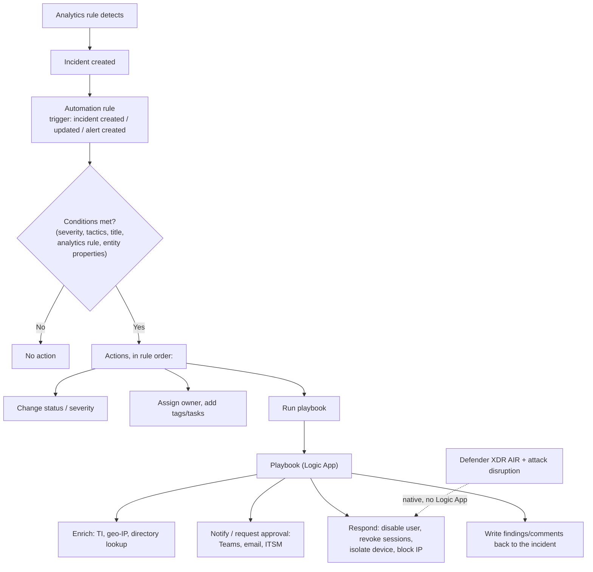
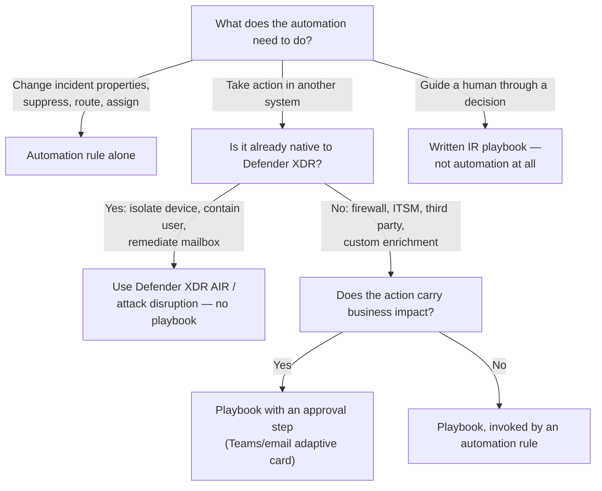

---
tags:
  - sc100
type: concept
domain:
  - ops-identity-compliance
aliases:
  - Playbook vs automation rule
  - Sentinel automation
  - SOAR automation
---

# Playbooks and Automation Rules

## Purpose

Distinguishes the three things "automation" means in a Microsoft SOC — [[Microsoft Sentinel]] **automation rules** (incident-level triage logic), **playbooks** ([[Logic Apps]] workflows that take action), and **built-in autonomous response** in [[Microsoft Defender XDR]] — plus the unrelated fourth meaning: an **incident response playbook** as a written human procedure.

---

## Why Architects Choose It

- The word "playbook" collides across three artifacts (Logic App workflow, Defender XDR response action, written IR procedure). Choosing the right one is an exam skill and a real design decision.
- **Automation rules and playbooks solve different halves of SOAR**: a rule decides *when and to which incidents* automation applies and performs cheap incident-property changes; a playbook performs the actual cross-system *work*. Using a playbook where a rule suffices adds Logic Apps cost and failure modes for nothing.
- Automation rules are the **single, centrally managed layer** for attaching automation — attaching playbooks to dozens of analytics rules individually produces automation nobody can inventory or disable during an incident.
- Automation belongs on **repeatable, low-judgment steps** (enrich, notify, tag, assign, contain a known-bad IP). Containment decisions with business impact stay human — see [[Security Operations]].

---

## When to Use

**Automation rule** when the need is:
- Suppressing or auto-closing known-benign incidents (a tuning control that doesn't touch the analytics rule).
- Assigning owner/severity/status, adding tasks, or tagging by incident properties.
- Applying one behaviour across many analytics rules at once, with a defined execution order.
- Triggering a playbook — the recommended way to attach one.

**Playbook** when the need is:
- Enrichment (geo-IP, threat intel lookup, CMDB/HR lookup) written back to the incident.
- Notification/approval (Teams, email, ServiceNow ticket) including adaptive-card approval before an action.
- Response actions in other systems — disable an [[Entra ID]] user, revoke sessions, isolate a device via [[Microsoft Defender XDR]], block an IP on [[Azure Firewall]], reset a password.
- Entity-triggered, analyst-invoked actions from an entity page during investigation.

---

## When NOT to Use

- A playbook for something an automation rule already does natively (set severity, assign owner, close incident) — unnecessary cost and an extra dependency.
- Automation on high-impact containment without an approval step — auto-disabling accounts or isolating servers on a noisy rule creates a self-inflicted outage; gate with an approval action or restrict scope.
- Automation to compensate for bad detections — tune the analytics rule; auto-closing floods hides the tuning debt.
- Sentinel playbooks where [[Microsoft Defender XDR]]'s built-in **automated investigation and response (AIR)** or **attack disruption** already handles it natively — don't rebuild in Logic Apps what the product does with no configuration.
- Any of these where the requirement is actually a **documented human procedure** — that's an IR playbook, see [[Microsoft Incident Response (DART)]].

---

## Architecture

---

## Side-by-Side

| | **Automation rule** | **Playbook** |
| --- | --- | --- |
| What it is | Sentinel-native rule: trigger → conditions → ordered actions | A [[Logic Apps]] workflow with the Microsoft Sentinel connector |
| Triggers | Incident created, incident updated, alert created | Incident trigger, alert trigger, entity trigger (manual, from an entity) |
| Typical actions | Change status/severity, assign owner, add tags/tasks, **run playbook** | Anything a Logic App connector can reach — Microsoft and third-party |
| Scope control | Conditions on incident/entity properties; applies across many analytics rules; supports execution **order** and an **expiration date** | Scoped by whatever invokes it (automation rule, manual run) |
| Cost | No additional charge | Billed as Logic Apps — per action/connector execution |
| Identity | Runs as Sentinel's own automation identity | The Logic App authenticates via **managed identity** or a stored API connection ([[Identity and Access Management (IAM)]]) |
| Permissions | Managed within Sentinel RBAC | Sentinel needs **Microsoft Sentinel Automation Contributor** on the playbook's resource group to run it |
| Best at | Triage, routing, suppression, orchestration | Enrichment, notification, cross-system response |

**Design rule:** attach playbooks **through automation rules**, not directly on each analytics rule. One place to see every automation, one place to disable it, and conditions/order become explicit.

---

## Architecture Decisions

---

## Comparison

| Compare | Difference |
| --- | --- |
| **Automation rule vs. playbook** | The rule is the *when/which/what order* (free, Sentinel-native, incident-property actions). The playbook is the *what work gets done* (Logic Apps, billed, reaches external systems). Rules invoke playbooks; playbooks don't invoke rules. |
| **Sentinel playbook vs. [[Microsoft Incident Response (DART)\|IR playbook]]** | A Logic App that executes automatically vs. a written procedure a human follows. Microsoft publishes IR playbooks (phishing, password spray, app consent grant) — those are documents, not workflows. |
| **Sentinel playbook vs. Defender XDR AIR** | AIR is built-in, verdict-based auto-remediation inside Defender XDR (no configuration, entity-scoped). A playbook is custom orchestration you author, typically spanning systems Defender doesn't own. |
| **Sentinel playbook vs. Defender XDR attack disruption** | Attack disruption autonomously contains an in-progress attack in real time using high-confidence signals across the XDR estate; a playbook runs after an incident exists and does exactly what you scripted. |
| **Automation rule suppression vs. tuning the analytics rule** | Suppression hides the incident but keeps generating it; tuning fixes the detection. Suppression is a stopgap — Microsoft's own guidance prefers tuning. |
| **[[Logic Apps]] Consumption vs. Standard** | Playbooks can run on either hosting model; Standard supports stateless workflows and VNet integration for playbooks that must reach private endpoints. |

---

## AZ-500 Review

AZ-500 introduces Sentinel playbooks as Logic Apps at a "connect a playbook to an alert" level. It does not cover automation rules as a distinct layer, the ordering/expiration semantics, the permission model (Automation Contributor), or the design choice between Sentinel automation and Defender XDR's native response.

---

## What's New for SC-100

- Know the **layering**: automation rule (decide) → playbook (act) → Defender XDR native response (already automatic). The exam tests which layer answers a scenario.
- Treat **centralized automation via automation rules** as the architectural pattern, replacing per-analytics-rule playbook attachment.
- Design **approval gates** into high-impact automation rather than automating every response end-to-end.
- Recognize the terminology collision with IR playbooks — an incident response *strategy* question wants procedures, not Logic Apps.
- Account for playbook **identity and permissions** (managed identity, Automation Contributor role) as part of the design, not as deployment detail.

---

## Exam Tips

- "Automate a response across multiple systems (firewall, ITSM, identity)" → **Sentinel playbook**, invoked by an automation rule.
- "Automatically close known false-positive incidents" or "assign incidents of severity X to team Y" → **automation rule**, no playbook needed.
- "Apply the same automation to many analytics rules and control the order it runs in" → automation rules (they have explicit order and can expire).
- "Contain a compromised device with no analyst involvement, using built-in capability" → **Defender XDR** AIR / attack disruption, not a playbook.
- "Analysts need a documented, repeatable process for phishing response" → an **IR playbook** document, not Sentinel automation.
- A playbook that fails to run is usually a **permissions** answer: Sentinel needs Microsoft Sentinel Automation Contributor on the playbook's resource group.
- Automation rules cost nothing; playbooks incur Logic Apps charges — relevant when a scenario mentions cost.

---

## Common Exam Confusion

- **Automation rule vs. playbook** — triage/orchestration layer vs. the workflow that does the work.
- **Sentinel playbook vs. IR playbook** — automated Logic App vs. written human procedure.
- **Playbook vs. Defender XDR AIR/attack disruption** — custom orchestration you build vs. native autonomous response you enable.
- **SOAR vs. SIEM vs. XDR** — orchestration/automation vs. correlation over ingested logs vs. native cross-signal detection and response (see [[Security Operations]]).
- **Suppression vs. tuning** — hiding incidents vs. fixing the detection that creates them.

---

## Keywords

- Automation rule: trigger, conditions, actions, order, expiration
- Incident created / incident updated / alert created triggers
- Entity trigger, manual playbook run
- Playbook = Logic Apps workflow + Microsoft Sentinel connector
- Microsoft Sentinel Automation Contributor
- Managed identity for playbook authentication
- Enrichment, notification, approval (adaptive card), containment
- SOAR, MTTR reduction
- AIR (automated investigation and response), attack disruption
- IR playbook (written procedure) vs. Sentinel playbook

---

## Related Services

- [[Microsoft Sentinel]]
- [[Logic Apps]]
- [[Security Operations]]
- [[Microsoft Defender XDR]]
- [[Microsoft Incident Response (DART)]]
- [[Identity and Access Management (IAM)]]
- [[Microsoft Security Copilot]]
- [[Threat Intelligence]]
- [[Azure Firewall]]
- [[Conditional Access]]

---

## References

- [Automate threat response with automation rules in Microsoft Sentinel](https://learn.microsoft.com/en-us/azure/sentinel/automate-incident-handling-with-automation-rules) — Microsoft Learn
- [Automate threat response with playbooks in Microsoft Sentinel](https://learn.microsoft.com/en-us/azure/sentinel/automate-responses-with-playbooks) — Microsoft Learn
- [Incident response playbooks](https://learn.microsoft.com/en-us/security/operations/incident-response-playbooks) — Microsoft Learn
- [[Exam Objectives]]
