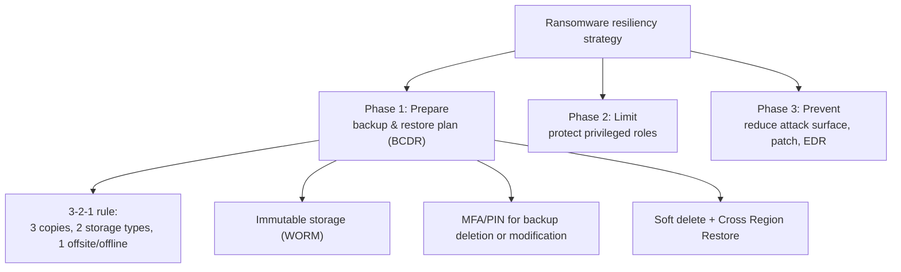
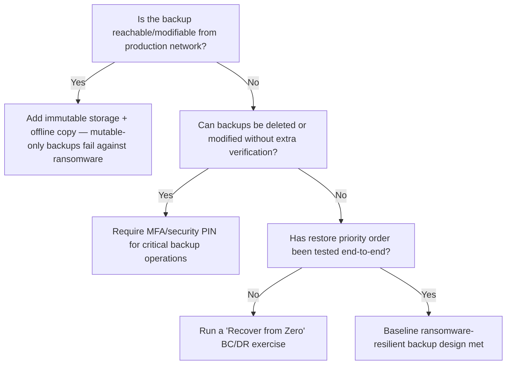

---
tags:
  - sc100
---

# Ransomware Resiliency and BCDR

## Purpose

Microsoft's three-phase ransomware strategy — Prepare (backup/BCDR), Limit (privileged access), Prevent (reduce attack surface) — treats the ability to recover without paying as the primary architectural goal.

---

## Why Architects Choose It

- Assumes compromise will happen (ties to [[Zero Trust]]'s "assume breach") and prioritizes the ability to recover over trying to guarantee prevention.
- Backups are themselves an attack target — human-operated ransomware deliberately corrupts or deletes backups before triggering encryption, so backup design must defend against an attacker with prior access, not just accidental loss.
- Gives a fixed, testable priority order for what to protect and restore first (identity → life-safety → financial → product/service → minimum security), removing ambiguity from a crisis.
- Maps directly onto verifiable architecture decisions: immutable storage, offline copies, MFA-gated backup operations, RBAC-scoped restore roles.

---

## When to Use

- Designing or evaluating a backup and restore strategy specifically for ransomware resilience, not just general disaster recovery.
- Prioritizing which systems get protected and tested first when resources are limited.
- Establishing "Recover from Zero" BC/DR exercises — testing recovery assuming all systems are down.
- Deciding where MFA/PIN gating, soft delete, and immutability apply across backup infrastructure.

---

## When NOT to Use

- As a general-purpose DR plan for non-malicious outages only — ransomware guidance assumes an active adversary who may already be inside the network targeting backups directly, which demands immutability and offline copies beyond standard DR redundancy.
- Relying on network-connected, mutable backups as the only copy — that's exactly what human-operated ransomware is built to corrupt.
- Treating Prevent (patching/EDR) as sufficient alone — Microsoft explicitly prioritizes Prepare and Limit ahead of Prevent, since prevention alone fails against a sufficiently motivated attacker.

---

## Architecture

Priority order for identifying business-critical systems — also the restore order:

| Priority | Category |
| --- | --- |
| 1 | Identity systems (AD DS, Entra Connect, domain controllers) |
| 2 | Human life / safety systems |
| 3 | Financial systems |
| 4 | Product or service enablement |
| 5 | Security (minimum monitoring to prevent re-compromise) |

---

## Architecture Decisions

---

## Comparison

| Compare | Difference |
| --- | --- |
| Ransomware-specific BCDR vs. general disaster recovery | General DR assumes accidental or environmental loss; ransomware BCDR assumes an active adversary targeting backups directly — requiring immutability and offline copies, not just redundancy. |
| Soft delete vs. immutable storage | Soft delete recovers accidentally or maliciously deleted backups within a retention window (14 days); immutable (WORM) storage prevents modification or deletion entirely for a set period, even by an authenticated attacker with delete permissions. |
| Recovery Services vault vs. Backup vault | Recovery Services vault covers IaaS VMs, SQL, and on-prem/hybrid workloads; Backup vault covers newer workload types — both are Azure Backup storage entities, chosen per workload rather than interchangeably. |

---

## AZ-500 Review

AZ-500 already covers configuring Azure Backup, Recovery Services vaults, soft delete, and RBAC roles for backup/restore at the implementation level. That configuration knowledge is assumed here.

---

## What's New for SC-100

- Architect the three-phase strategy (Prepare, Limit, Prevent) and its priority order, not just configure backup jobs — a resiliency design decision, not a checkbox.
- Explicitly sequence privileged access hardening (Phase 2, via the enterprise access model / [[PIM]]) as part of ransomware mitigation, not a separate identity task.
- Treat backups as an attacker target requiring immutability and offline copies by design — an architectural requirement, not just a retention setting.
- Tie "evaluate solutions for security updates" (Phase 3) into the same strategy instead of treating patch management as isolated.
- Design and mandate recurring "Recover from Zero" BC/DR exercises as part of the architecture, not a one-time backup configuration.

---

## Exam Tips

- A scenario prioritizing what to protect/restore first follows identity → life-safety → financial → product → security order, not an alphabetical or arbitrary one.
- If a scenario describes backups that are network-reachable and mutable with no offline/immutable copy, the fix is immutability/offline storage — not just "back up more often."
- Phase ordering matters: Prepare and Limit are prioritized ahead of Prevent in Microsoft's own guidance — a prevention-only answer is usually incomplete.

---

## Common Exam Confusion

- **Soft delete vs. immutable storage** — a retention window for recovery vs. true write-once protection against a privileged attacker.
- **General BCDR vs. ransomware-specific BCDR** — redundancy against outages vs. resilience against an adversary actively targeting the backups themselves.

---

## Keywords

- Prepare, Limit, Prevent (three-phase ransomware plan)
- Human-operated ransomware
- 3-2-1 backup rule
- Immutable storage / WORM
- Offline / air-gapped backup
- Soft delete, Cross Region Restore
- Recovery Services vault vs. Backup vault
- Recover from Zero
- Enterprise access model / privileged access prioritization

---

## Related Services

- [[Zero Trust]]
- [[PIM]]
- [[Microsoft Cloud Security Benchmark (MCSB)]]
- [[Key Vault]] — purge protection is the specific control preventing permanent key destruction during an attack.
- [[Security Operations]]
- [[Microsoft Defender XDR]]
- [[Identity and Access Management (IAM)]]
- [[Securing Privileged Access]]

---

## References

- [Prepare for ransomware attacks with a backup and recovery plan](https://learn.microsoft.com/en-us/security/ransomware/protect-against-ransomware-phase1) — Microsoft Learn
- [Limit the impact that ransomware attacks can have](https://learn.microsoft.com/en-us/security/ransomware/protect-against-ransomware-phase2) — Microsoft Learn
- [Azure backup and restore plan to protect against ransomware](https://learn.microsoft.com/en-us/azure/security/fundamentals/backup-plan-to-protect-against-ransomware) — Microsoft Learn
- [[Exam Objectives]]
- https://aks.ms/backup
- https://aka.ms/direc

