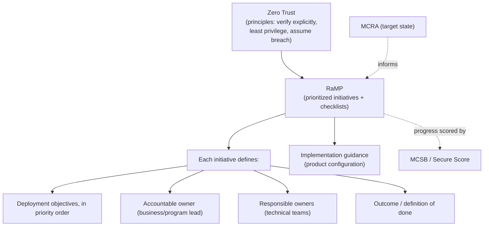
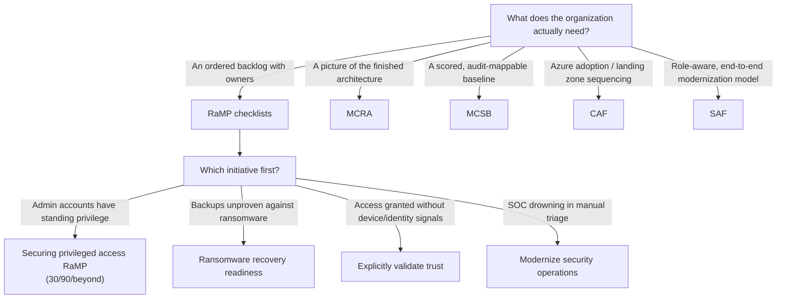

---
tags:
  - sc100
type: concept
domain:
  - best-practices
aliases:
  - RaMP
  - Rapid Modernization Plan
  - Zero Trust RaMP
status: needs-verification
---

# Rapid Modernization Plan (RaMP)

## Purpose

Microsoft's prioritized, initiative-based **checklists** that turn [[Zero Trust]] principles into a sequenced program of work — each initiative naming its deployment objectives, the accountable and responsible stakeholders, and the outcome, so an organization can start in days rather than after a year of architecture.

---

## Why Architects Choose It

- [[Zero Trust]] states principles; [[Microsoft Cybersecurity Reference Architectures (MCRA)|MCRA]] shows a target state; **RaMP answers "what do we do on Monday, and in what order"** — it is the sequencing layer between strategy and configuration.
- Organized around **initiatives and outcomes**, not products. Each checklist is scoped to a risk ("ransomware recovery readiness", "explicitly validate trust") so progress is reported as risk reduced rather than features enabled.
- Explicitly assigns **program members and key stakeholders** per initiative — a business-lead/accountable owner plus responsible technical owners. That project-management framing is unusual for Microsoft security guidance and is exactly what an architect is asked to produce.
- Front-loads the controls with the highest return: privileged access, MFA/explicit validation, and backup recoverability come before broad platform re-architecture.
- Time-boxed staging (notably the **privileged access RaMP**: 30 days → 90 days → beyond) makes an executive-legible roadmap out of a control catalogue.

---

## When to Use

- An organization has accepted Zero Trust as a direction and needs an ordered backlog rather than another framework.
- Post-incident hardening — [[Microsoft Incident Response (DART)|DART]]-style recovery hands off into RaMP initiatives as the strategic half of the response.
- Standing up a privileged access program: the **Securing privileged access RaMP** is the canonical starting checklist (see [[Securing Privileged Access]]).
- Executive reporting where "% of initiative complete, owner named" is more useful than a Secure Score delta.

---

## When NOT to Use

- As the target-state architecture — RaMP tells you *what to do next*, not *what the finished estate looks like*. That's [[Microsoft Cybersecurity Reference Architectures (MCRA)|MCRA]].
- As a scored control baseline for compliance or audit — that's [[Microsoft Cloud Security Benchmark (MCSB)|MCSB]] and the Regulatory Compliance dashboard (see [[Security Posture Assessments]]).
- For Azure subscription/landing zone sequencing — that's [[Cloud Adoption Framework (CAF)|CAF]]'s Ready/Govern/Secure methodologies (see [[Azure Landing Zones]]).
- For evaluating a single workload's architecture trade-offs — that's the [[Azure Well-Architected Framework (WAF)|WAF]] Security pillar.
- As a substitute for the full [[Security Adoption Framework (SAF)|SAF]] model when the ask is role-aware, end-to-end modernization across business scenarios and disciplines.

---

## Architecture

**Zero Trust RaMP initiative areas** (the checklist set, grouped):

| Area | Initiative focus |
| --- | --- |
| User access and productivity | **Explicitly validate trust** for every access request — identities (MFA, passwordless), endpoints (device compliance), apps, and network. |
| Data, compliance, governance | **Ransomware recovery readiness** — backup/BCDR and privileged access containment; and **data protection** — discovery, classification, labelling, DLP. |
| Modernize security operations | Streamline response, unify visibility, and reduce manual effort in the SOC. |
| Additional | Securing **OT and Industrial IoT**, and the underlying security foundations / privileged access work. |

**Securing privileged access RaMP** — the most exam-relevant single checklist, staged by time horizon:

| Horizon | Typical objectives |
| --- | --- |
| ~30 days | Separate, cloud-only administrative accounts; enforce MFA for all admins; emergency access ("break-glass") accounts; deploy [[PIM]] for critical roles. |
| ~90 days | Privileged access workstations for Tier 0/Control-plane admins; [[Conditional Access]] policies gating admin access; secure the four elements — **accounts, devices, intermediaries, interfaces**. |
| Beyond | Full enterprise access model rollout, elimination of standing privilege, continuous access reviews and CIEM right-sizing. |

---

## Architecture Decisions

---

## Comparison

| Compare | Difference |
| --- | --- |
| **RaMP vs. [[Zero Trust]]** | Zero Trust is the principle set with no schedule. RaMP is the prioritized, owner-assigned execution plan for reaching it. |
| **RaMP vs. [[Microsoft Cybersecurity Reference Architectures (MCRA)\|MCRA]]** | MCRA is target-state capability mapping (a deck for gap analysis). RaMP is the ordered task list that closes those gaps. |
| **RaMP vs. [[Security Adoption Framework (SAF)\|SAF]]** | SAF is the umbrella, role-aware adoption model (business scenarios → security disciplines → technology pillars). RaMP is a tactical, checklist-level accelerator that lives inside that journey — narrower and faster. |
| **RaMP vs. [[Cloud Adoption Framework (CAF)\|CAF]]** | CAF sequences **Azure adoption** (Strategy/Plan/Ready/Adopt/Govern/Secure/Manage) org-wide. RaMP sequences **security modernization** regardless of cloud or platform. |
| **RaMP vs. [[Microsoft Cloud Security Benchmark (MCSB)\|MCSB]]** | RaMP is a plan (what to do next, who owns it). MCSB is a measurement (how compliant is the configuration, scored via Secure Score). |
| **RaMP vs. [[Cloud Adoption Security Review (CASR)\|CASR]]** | RaMP drives work forward; CASR is a point-in-time review scoring how secure a landing zone already is. |

---

## AZ-500 Review

Not covered by AZ-500 at all — RaMP is program sequencing and stakeholder assignment, not a configurable control. The underlying tasks (MFA, PIM, Conditional Access, backup hardening) are AZ-500 material; the prioritization and ownership framing is new.

---

## What's New for SC-100

- Recognize RaMP by its distinguishing features: **initiative-based checklists, prioritized deployment objectives, and named accountable/responsible stakeholders** — no other Microsoft framework assigns owners this way.
- Know the **privileged access RaMP's 30/90/beyond staging** and its four elements to secure — accounts, devices, intermediaries, interfaces.
- Place RaMP correctly among the frameworks: Zero Trust (principle) → SAF (umbrella model) → **RaMP (tactical sequencing)** → product implementation → MCSB/Secure Score (measurement). See [[Frameworks Cheat Sheet]].
- Use RaMP as the answer whenever a scenario asks for **quick wins, a phased rollout, or "where do we start"** rather than a complete architecture.

---

## Exam Tips

- "Where should the organization start with Zero Trust / what are the first 30 days?" → **RaMP**, not MCRA and not a full CAF adoption plan.
- "Assign accountable and responsible owners to each security initiative" → RaMP checklists are the guidance that formalizes this.
- "Reduce risk from standing administrative privilege quickly" → the **Securing privileged access RaMP**: separate admin accounts + MFA + [[PIM]] first, privileged access workstations next.
- A scenario asking for a target-state capability diagram is MCRA, not RaMP — RaMP produces a backlog, not an architecture.
- RaMP progress is not a score; a scenario asking to *measure* posture points to MCSB/Secure Score instead.

---

## Common Exam Confusion

- **RaMP vs. MCRA** — plan of action vs. target-state architecture.
- **RaMP vs. SAF** — tactical checklist accelerator vs. the umbrella, role-aware adoption model it sits inside.
- **RaMP vs. CAF Secure methodology** — security modernization anywhere vs. the security track of Azure's adoption lifecycle.
- **Zero Trust RaMP vs. privileged access RaMP** — the broad multi-initiative checklist set vs. the specific, time-staged privileged access plan; the exam may mean either by "RaMP."

---

## Keywords

- Rapid Modernization Plan, RaMP, Zero Trust RaMP
- Initiatives, deployment objectives, checklists
- Accountable / responsible stakeholders, program members
- Quick wins, phased rollout, "where do we start"
- 30 days / 90 days / beyond staging
- Explicitly validate trust
- Ransomware recovery readiness
- Modernize security operations
- Accounts, devices, intermediaries, interfaces (privileged access elements)

---

## Related Services

- [[Zero Trust]]
- [[Securing Privileged Access]]
- [[PIM]]
- [[Conditional Access]]
- [[Security Adoption Framework (SAF)]]
- [[Microsoft Cybersecurity Reference Architectures (MCRA)]]
- [[Cloud Adoption Framework (CAF)]]
- [[Microsoft Cloud Security Benchmark (MCSB)]]
- [[Ransomware Resiliency and BCDR]]
- [[Microsoft Incident Response (DART)]]
- [[Security Operations]]
- [[Frameworks Cheat Sheet]]

---

## References

- [Zero Trust Rapid Modernization Plan](https://learn.microsoft.com/en-us/security/zero-trust/zero-trust-ramp-overview) — Microsoft Learn
- [Securing privileged access rapid modernization plan (RaMP)](https://learn.microsoft.com/en-us/security/privileged-access-workstations/security-rapid-modernization-plan) — Microsoft Learn
- [Privileged access: Strategy](https://learn.microsoft.com/en-us/security/privileged-access-workstations/privileged-access-strategy) — Microsoft Learn
- [[Exam Objectives]]

---

## Verification Flag

Microsoft reorganizes the RaMP initiative list and its Learn navigation periodically — initiative names, groupings, and which checklists exist have changed between revisions, and some RaMP content has been folded into the broader security adoption model. Re-verify the current initiative set and the privileged access staging against Microsoft Learn close to exam date; treat the tables above as the structural pattern rather than a fixed list.
