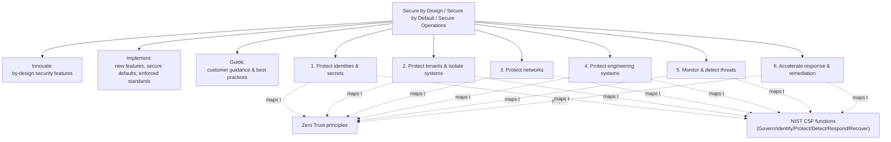
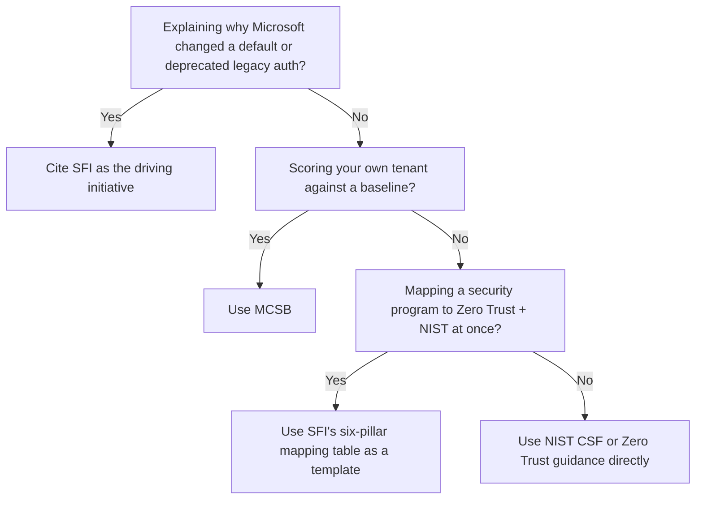

---
tags:
  - sc100
type: concept
domain:
  - best-practices
aliases:
  - SFI
  - Secure Future Initiative
---

# Secure Future Initiative (SFI)

## Purpose

SFI is Microsoft's own multi-year, company-wide engineering commitment (launched November 2023) to build, ship, and operate its products more securely, organized around three principles — Secure by Design, Secure by Default, Secure Operations — delivered through six prioritized engineering pillars mapped to [[Zero Trust]] and the NIST Cybersecurity Framework.

---

## Why Architects Choose It

- Explains *why* Microsoft keeps pushing secure-by-default changes into its own products (legacy auth deprecation, enforced MFA, tenant isolation improvements) — SFI is the initiative driving that, not a customer-configurable control.
- The six-pillar structure ships with a ready-made mapping table to both [[Zero Trust]] principles (verify explicitly / least privilege / assume breach) and NIST CSF functions — reusable as a template when an org needs its own engineering security program to speak both languages at once.
- Named as one of the sources [[Microsoft Cloud Security Benchmark (MCSB)|MCSB]] synthesizes — explains where part of MCSB's control guidance originates.
- Published as recurring, dated progress reports (not a static whitepaper) — a living account of what Microsoft has actually shipped, useful as evidence when discussing platform-level security posture with stakeholders.

---

## When to Use

- Explaining the rationale behind a Microsoft-driven secure-default or deprecation change (e.g., legacy protocol removal, enforced passwordless).
- Benchmarking or designing an internal engineering security program against Microsoft's six-pillar structure (identity/secrets, tenant isolation, network, engineering systems, monitor/detect, respond/remediate).
- Needing a single template that maps a security program to both Zero Trust principles and NIST CSF functions simultaneously.
- Citing a named source behind part of MCSB's synthesized guidance.

---

## When NOT to Use

- As a customer-deployable framework or product — SFI describes Microsoft's own internal engineering commitments; there's nothing to "turn on" in a tenant.
- As a substitute for [[Microsoft Cloud Security Benchmark (MCSB)|MCSB]] when a scored, tenant-level control baseline is required.
- As a substitute for reading [[Zero Trust]] or NIST CSF guidance directly — SFI maps onto both but doesn't redefine either.

---

## Architecture

| Pillar | Zero Trust principle emphasis | NIST CSF function |
| --- | --- | --- |
| 1. Protect identities and secrets | Verify explicitly, least privilege, assume breach (credential rotation) | PR, DE |
| 2. Protect tenants and isolate systems | Explicit inter-tenant auth, least-privilege paths, isolation as containment | ID, PR, DE |
| 3. Protect networks | Policy-based identity-verified connections, micro-segmentation | ID, PR |
| 4. Protect engineering systems | Authenticated SDLC actions, restricted pipeline access, tamper-resistant builds | ID, PR, GV |
| 5. Monitor and detect threats | Telemetry-driven continuous validation, adaptive access | ID, PR, DE, RS |
| 6. Accelerate response and remediation | Continuous trust reassessment, automated revocation/rotation | ID, RC, RS, GV |

---

## Architecture Decisions

---

## Comparison

| Compare | Difference |
| --- | --- |
| SFI vs. [[Microsoft Cloud Security Benchmark (MCSB)\|MCSB]] | SFI is Microsoft's internal engineering commitment (a source); MCSB is the customer-facing, scored control baseline that partly synthesizes SFI. |
| SFI vs. [[Zero Trust]] | Zero Trust defines the principles; SFI's six pillars are Microsoft's own engineering program mapped onto those principles — not a customer-deployable product mapping like [[Microsoft Cybersecurity Reference Architectures (MCRA)\|MCRA]]. |
| SFI vs. NIST CSF | SFI pillars map to NIST CSF functions for traceability; SFI doesn't replace or redefine the NIST framework itself. |

---

## AZ-500 Review

Not covered in AZ-500 — this is background/context knowledge about Microsoft's own engineering program, not an implementable customer control, so it's new territory for SC-100.

---

## What's New for SC-100

- Know SFI by name as one of the sources [[Microsoft Cloud Security Benchmark (MCSB)|MCSB]] synthesizes (already referenced in the MCSB note).
- Memorize the three principles (Secure by Design, Secure by Default, Secure Operations) and the six pillars (identities/secrets, tenants/isolation, networks, engineering systems, monitor/detect, response/remediation).
- The pillar-to-Zero-Trust-to-NIST mapping table is a plausible direct exam target — know which pillar maps to which Zero Trust principle emphasis.
- SFI is Microsoft's internal commitment, not a customer control set — don't confuse "align with SFI" with "deploy SFI."

---

## Exam Tips

- A scenario asking "why is Microsoft deprecating this legacy protocol / enforcing this default" points to SFI as the underlying initiative.
- Don't pick SFI as the answer to "score my tenant's compliance" — that's MCSB.
- If a scenario needs a security program mapped to *both* Zero Trust and NIST CSF simultaneously, SFI's pillar-mapping table is the named mechanism.

---

## Common Exam Confusion

- **SFI vs. MCSB** — internal engineering commitment (source material) vs. customer-facing scored control baseline that partly synthesizes it.
- **SFI vs. Zero Trust** — Zero Trust is the principle; SFI is Microsoft's own engineering program mapped onto it, not a general customer framework.
- **SFI vs. NIST CSF** — SFI pillars map to NIST functions but aren't a replacement for the NIST framework.

---

## Keywords

- Secure Future Initiative, SFI
- Secure by Design / Secure by Default / Secure Operations
- Six engineering pillars
- Protect identities and secrets / tenants and isolate systems / networks / engineering systems
- Monitor and detect threats / Accelerate response and remediation
- NIST Cybersecurity Framework (CSF) mapping
- SFI progress report

---

## Related Services

- [[Microsoft Cloud Security Benchmark (MCSB)]]
- [[Zero Trust]]
- [[Security Adoption Framework (SAF)]]
- [[Microsoft Cybersecurity Reference Architectures (MCRA)]]
- [[DevOps Security]]
- [[Security Operations]]

---

## References

- [Microsoft Secure Future Initiative (SFI) overview](https://learn.microsoft.com/en-us/security/zero-trust/sfi/secure-future-initiative-overview) — Microsoft Learn
- [Securing our future: July 2026 progress report on Microsoft's Secure Future Initiative](https://www.microsoft.com/en-us/security/blog/2026/07/10/securing-our-future-july-2026-progress-report-on-microsofts-secure-future-initiative/) — Microsoft Security Blog
- [[Exam Objectives]]
