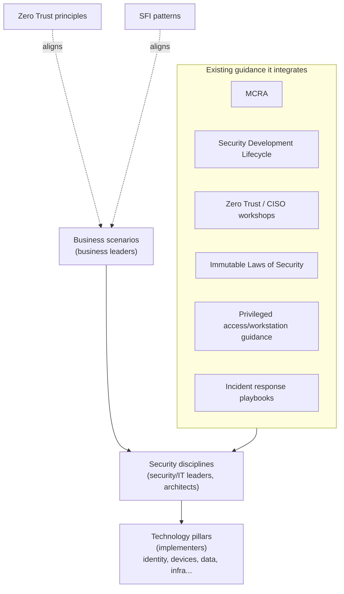
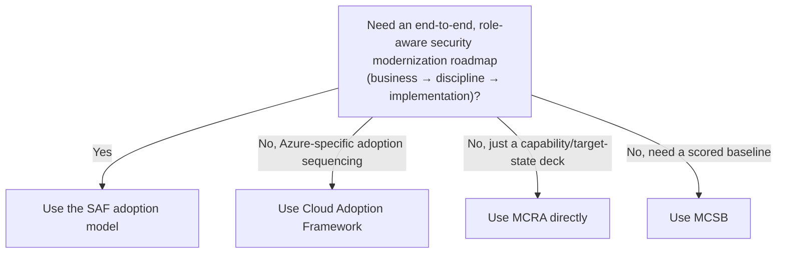

---
tags:
  - sc100
type: concept
domain:
  - best-practices
aliases:
  - SAF
  - Security Adoption Framework
  - Microsoft security adoption model
---

# Security Adoption Framework (SAF)

## Purpose

SAF (Microsoft Learn now labels the page "Microsoft security adoption model") is Microsoft's umbrella, role-aware model for end-to-end security modernization — it unifies previously scattered guidance ([[Microsoft Cybersecurity Reference Architectures (MCRA)|MCRA]], SDL, Zero Trust/CISO workshops, incident response playbooks, privileged access guidance) into one structure spanning business strategy through implementation.

---

## Why Architects Choose It

- Consolidates guidance that used to live in separate decks/pages (MCRA, Security Development Lifecycle, Zero Trust and CISO workshops, the Immutable Laws of Security, privileged access/workstation guidance, IR playbooks) into one navigable model instead of five.
- Built on three components that move an org from intent to implementation: **business scenarios** (business leaders), **security disciplines** (security/IT leaders, architects), **technology pillars** (implementers) — each targets a different audience, so the same model produces role-specific guidance instead of one generic document.
- Delivered hands-on via **SAF workshops** through Microsoft Unified — same delivery pattern as CISO workshops and a Microsoft-led [[Cloud Adoption Security Review (CASR)|CASR]].
- Explicitly aligns with [[Zero Trust]] principles, [[Secure Future Initiative (SFI)|SFI]] patterns, and external open standards — a cross-framework anchor rather than a Microsoft-only silo.

---

## When to Use

- Planning multi-year, org-wide security modernization that spans strategy, architecture, and operations — not just a single Azure adoption project.
- Needing role-specific guidance: a business-outcome narrative for leadership, a discipline-level plan for architects, and an implementation checklist for engineers, all traceable to the same model.
- Consolidating fragmented internal use of MCRA, Zero Trust workshops, IR playbooks, and privileged access guidance into one coherent roadmap.
- Preparing for or following up a Microsoft Unified-delivered SAF workshop.

---

## When NOT to Use

- For Azure-specific subscription/landing zone sequencing — that's [[Cloud Adoption Framework (CAF)|CAF]]'s Ready/Govern/Secure methodologies, not SAF (SAF is product- and cloud-agnostic).
- As a synonym for MCRA — MCRA is one integrated input into SAF's technology-pillar guidance, not the whole model.
- As a scored compliance baseline — that's [[Microsoft Cloud Security Benchmark (MCSB)|MCSB]].
- For a single workload's architecture trade-offs — that's the [[Azure Well-Architected Framework (WAF)|WAF]] Security pillar.

---

## Architecture

---

## Architecture Decisions

---

## Comparison

| Compare | Difference |
| --- | --- |
| SAF vs. [[Microsoft Cybersecurity Reference Architectures (MCRA)\|MCRA]] | SAF is the umbrella adoption model (business scenarios → security disciplines → technology pillars); MCRA is one of the guidance sources SAF integrates into its technology-pillar content, not synonymous with the whole model. |
| SAF vs. [[Cloud Adoption Framework (CAF)]] | SAF is a product-/cloud-agnostic, end-to-end security modernization model; CAF's Secure methodology is specifically the security track within Azure's adoption lifecycle. They overlap in intent but live under different Microsoft Learn content trees. |
| SAF workshops vs. Microsoft-led [[Cloud Adoption Security Review (CASR)\|CASR]] | Both are Microsoft Unified-delivered engagements; SAF workshops cover the full adoption model, CASR specifically scores landing zone security against CAF's Secure methodology. |

---

## AZ-500 Review

Not covered in AZ-500 at all — this is program-structure/roadmap knowledge, not a configurable control, so it's entirely new territory for SC-100.

---

## What's New for SC-100

- Know SAF's three-part structure — business scenarios → security disciplines → technology pillars — and which audience each targets; the exam's "recommend a strategy for X stakeholder" framing maps directly onto this.
- Recognize that MCRA, SDL, Zero Trust/CISO workshops, the Immutable Laws of Security, privileged access guidance, and IR playbooks are *ingredients* SAF integrates, not competing frameworks — don't treat MCRA as interchangeable with SAF.
- SAF workshops are a named, Microsoft Unified-delivered engagement, parallel to CISO workshops and Microsoft-led CASR — recognize the delivery pattern.

---

## Exam Tips

- "Consolidate scattered Microsoft security guidance into one structured, role-based adoption plan" → SAF, not CAF or MCRA alone.
- Don't equate SAF with MCRA on the exam — MCRA is a named component, not the umbrella.
- A scenario about Azure subscription/landing zone sequencing specifically still points to CAF, even though SAF also covers "security adoption."

---

## Common Exam Confusion

- **SAF vs. MCRA** — SAF is the umbrella adoption model integrating MCRA as one input; MCRA alone is just the capability-to-Zero-Trust mapping deck.
- **SAF vs. CAF** — SAF spans all of security modernization (any product, any cloud) structured by business scenario/discipline/technology pillar; CAF's Secure methodology is the security track specifically within Azure's adoption lifecycle.

---

## Keywords

- Security Adoption Framework, security adoption model
- Business scenarios / security disciplines / technology pillars
- SAF workshops, Microsoft Unified
- End-to-end security modernization
- Role-aware, repeatable guidance
- Integrates MCRA, SDL, Zero Trust/CISO workshops, Immutable Laws of Security, privileged access guidance, IR playbooks

---

## Related Services

- [[Microsoft Cybersecurity Reference Architectures (MCRA)]]
- [[Zero Trust]]
- [[Cloud Adoption Framework (CAF)]]
- [[Cloud Adoption Security Review (CASR)]]
- [[Secure Future Initiative (SFI)]]
- [[Security Operations]]
- [[Securing Privileged Access]]

---

## References

- [Microsoft security adoption model](https://learn.microsoft.com/en-us/security/zero-trust/security-adoption-model) — Microsoft Learn
- [Microsoft security adoption overview](https://learn.microsoft.com/en-us/security/zero-trust/security-adoption-journey) — Microsoft Learn
- [[Exam Objectives]]
