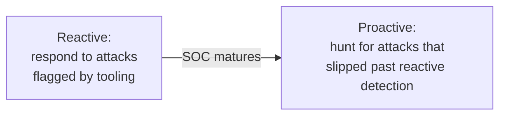
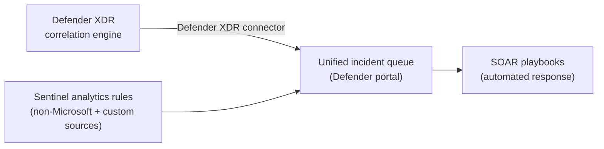
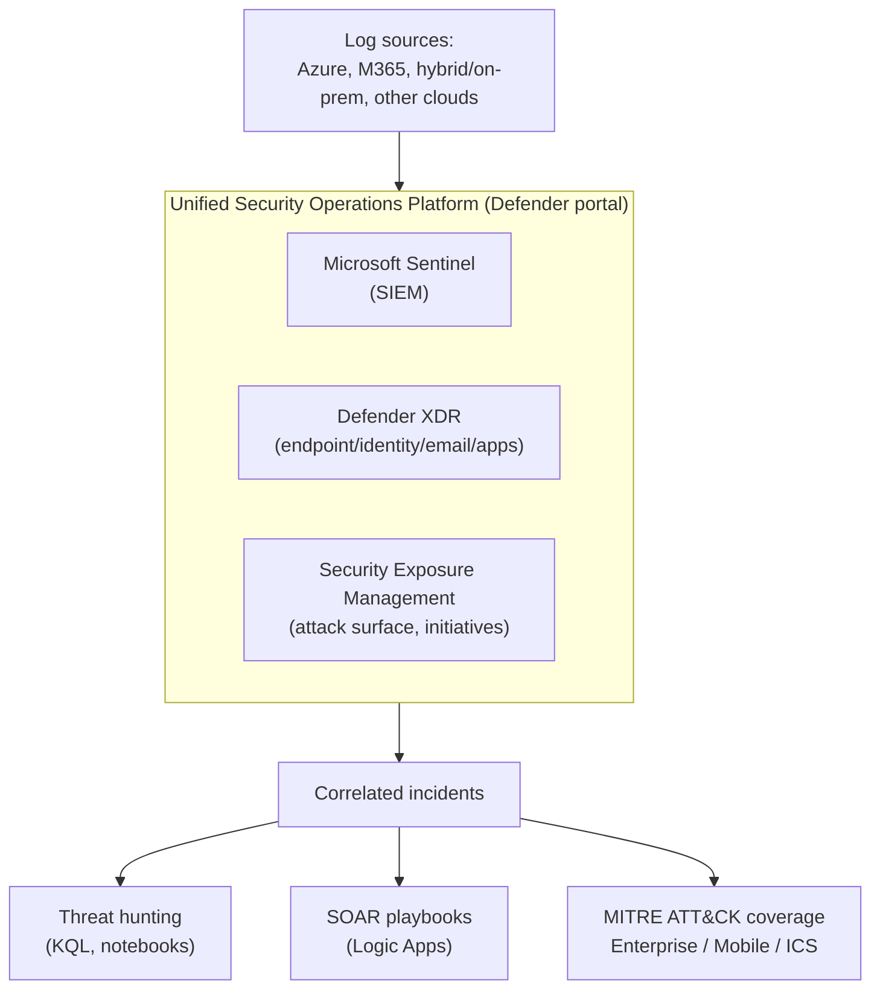
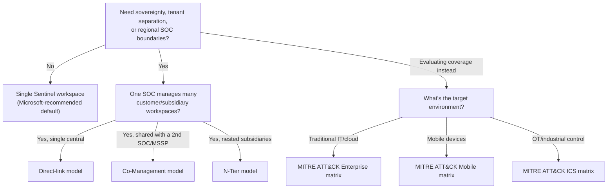

---
tags:
  - sc100
---
# Security Operations

## Purpose

Architecting the SOC itself — how SIEM, XDR, SOAR, and centralized logging combine into one detection-and-response platform, how many [[Microsoft Sentinel]] workspaces an org needs, and how detection coverage is evaluated. Not how to configure any single tool — that's [[Microsoft Sentinel]] and [[Microsoft Defender]].

---

## SecOps Overview

The core mission of cloud security operations (SecOps) — **detect**, **respond to**, and **recover from** active attacks:

- **Detect** — surface active attacks via [[Microsoft Sentinel]] analytics rules and Defender XDR native detections.
- **Respond** — contain and remediate, either through SOAR playbooks or analyst-driven investigation.
- **Recover** — restore affected systems and data after an incident (the recovery side overlaps with [[Ransomware Resiliency and BCDR]]).

SOC maturity is measured by *how* detection happens, not just whether it does:

- A reactive-only SOC depends entirely on existing analytics-rule/XDR coverage — anything outside that coverage goes unnoticed until damage is done.
- Proactive threat hunting (KQL queries, notebooks, hypothesis-driven investigation over raw log data) assumes some attacks have *already* evaded detection and searches for them directly. This is the maturity signal the exam tests for, not just "is Sentinel deployed."
- MITRE ATT&CK coverage gaps (see Comparison below) are exactly what proactive hunting should target first — hunt where the coverage map shows nothing.
- Hunting and analytics rules run *on* [[Threat Intelligence|threat intelligence]] — indicators and attack-pattern context are what turn a raw log query into a hypothesis worth hunting.

---

## SIEM, SOAR, and XDR Solutions

Three layers, each solving a different part of detection and response — the architecture question is how to combine them, not which one to pick:

- **XDR** ([[Microsoft Defender XDR]]) — native, deep detection/response within Microsoft's own signal sources (endpoint, identity, email, cloud apps). Its correlation engine auto-merges related alerts into a single incident before Sentinel ever sees it; AIR, Attack Disruption, Advanced Hunting, and Unified RBAC are detailed in its own note.
- **SIEM** ([[Microsoft Sentinel]]) — breadth and retention. Ingests what XDR can't natively reach (network devices, on-prem, other clouds, legacy/custom apps, third-party security tools) and gives long-term storage for custom analytics rules and hunting over raw logs.
- **SOAR** (Sentinel playbooks, built on [[Logic Apps]]) — the orchestration layer that turns a detected incident, from either XDR or SIEM, into an automated response action.

- Enabling the **Microsoft Defender XDR connector** streams Defender XDR incidents into the Sentinel incident queue automatically — this is what "unified security operations platform" means at the data-flow level: one incident list, not two portals to reconcile.
- In a **multi-workspace** Sentinel design, only one workspace can be the **Primary workspace** — full Defender XDR incident integration and correlation applies there only. This is a real constraint on the workspace-topology decisions above, not just a naming detail.
- XDR alone can suffice for a Microsoft-only estate with no custom-detection, long-retention, or non-Microsoft-source requirement; add Sentinel (SIEM) when any of those apply, and SOAR playbooks whenever response needs to be automated rather than manual.

---

## Why Architects Choose It

- Layering SIEM/XDR/SOAR through the unified platform (above) closes detection gaps by design rather than by integration effort — Security Exposure Management (attack surface, initiatives) sits in the same Defender portal alongside them.
- Workspace topology is itself an architecture decision, not a deployment step — sovereignty, data ownership, multi-tenant SOC (MSSP), and retention requirements each push toward a different multi-workspace model.
- MITRE ATT&CK coverage evaluation turns "do we have enough detections" into a measurable gap analysis across three distinct threat surfaces (IT/cloud, mobile, OT/ICS) instead of a subjective judgment call.
- SOAR automation ([[Logic Apps|playbooks]]) turns detection into consistent response, cutting mean time to respond (MTTR) without waiting on manual triage for every incident.

---

## When to Use

- Designing detection/response for a new org, or after M&A — start from the unified platform (Sentinel + Defender XDR + SOAR), not separate deployments.
- Choosing a workspace topology — single workspace by default; move to multi-workspace only for a named driver (sovereignty, tenant separation, regional SOC access, billing split).
- Standing up or evaluating an MSSP/multi-tenant SOC relationship — Direct-link, Co-Management, or N-Tier workspace management.
- Evaluating detection maturity — map active analytics rules against the MITRE ATT&CK Enterprise, Mobile, and ICS matrices to find coverage gaps.

---

## When NOT to Use

- Defaulting to multiple workspaces without a named driver — added cost and RBAC complexity for no architectural benefit; single-workspace is the Microsoft-recommended default.
- Treating MITRE coverage mapping as a one-time exercise — it's continuous, tied to the analytics rule gallery and evolving ATT&CK versions.
- Using SOAR playbooks as the only response mechanism for every incident — automate the repeatable steps, not the judgment calls that still need an analyst.

---

## Architecture

---

## Architecture Decisions

---

## Comparison

| Compare | Difference |
| --- | --- |
| Single-workspace vs. multi-workspace Sentinel | Single workspace is the default — simpler RBAC, one detection surface, lower cost. Multi-workspace is justified only by sovereignty/regulatory boundaries, separate data ownership, multiple Entra tenants, or differing retention/billing needs. |
| Direct-link vs. Co-Management vs. N-Tier | Direct-link: one central workspace controls all member workspaces (simplest). Co-Management: more than one central workspace manages a member workspace (e.g., in-house SOC + MSSP). N-Tier: a central workspace manages other central workspaces (e.g., conglomerate → subsidiaries → their own member workspaces). |
| MITRE ATT&CK Enterprise vs. Mobile vs. ICS | Enterprise covers traditional IT, endpoint, and cloud tactics/techniques; Mobile covers Android/iOS-targeted threats; ICS covers OT/industrial control systems — evaluate coverage against the matrix matching the estate, not Enterprise alone. |
| SIEM vs. XDR vs. SOAR | Sentinel (SIEM) correlates logs into incidents; Defender XDR provides native endpoint/identity/email/app-level detection and response; SOAR (Sentinel playbooks, built on [[Logic Apps]]) automates the response action across systems. Full breakdown above. |
| Primary vs. secondary (member) workspace | Only the Primary workspace in a multi-workspace design gets full Defender XDR incident integration and correlation; secondary/member workspaces don't get native XDR correlation on their own. Choosing which workspace is Primary is part of the multi-workspace architecture decision, not an afterthought. |

---

## AZ-500 Review

AZ-500 covers enabling Sentinel on a single workspace/subscription, creating individual analytics rules, and basic Log Analytics configuration. Multi-workspace/multi-tenant topology, MITRE coverage as a formal, continuous evaluation exercise, and the unified platform's architectural rationale are new for SC-100.

---

## What's New for SC-100

- Treat workspace topology (single vs. multi-workspace, and which management model) as a named architecture decision, not a default deployment step.
- Know the three multi-workspace management models by name — Direct-link, Co-Management, N-Tier — and match each to its driving scenario (single SOC, shared SOC/MSSP, nested subsidiaries).
- Evaluate threat detection coverage explicitly against MITRE ATT&CK's **three** matrices (Enterprise, Mobile, ICS), not just Enterprise — an explicit exam objective, and easy to under-scope if OT/ICS or mobile is in the estate.
- Know *why* SIEM, XDR, and SOAR get layered together rather than choosing one — native depth (XDR) vs. cross-source breadth/retention (SIEM) vs. automated response (SOAR) — and that the Defender XDR connector plus a single Primary workspace is the concrete mechanism that unifies them in the Defender portal. Legacy separate-portal designs are outdated, see [[Microsoft Sentinel]].
- Centralized logging/auditing design (which sources converge where) is covered in [[Azure Security Logging]]; this note covers what happens to that data once it lands — correlation, hunting, automation, coverage evaluation.

---

## Exam Tips

- "Design a SOC for a multi-tenant MSSP" → multi-workspace with Co-Management or N-Tier, not a single shared workspace.
- "Evaluate detection coverage" scenarios that mention OT, ICS, or mobile devices are testing whether you reach for the Mobile/ICS matrices, not just Enterprise.
- Distractors often default to "add more workspaces" for scale — the correct answer is usually single workspace unless a named driver (sovereignty, ownership, tenancy) is stated.
- "Automate response across multiple systems" → Sentinel SOAR playbooks; "detect and natively respond within an endpoint" → Defender XDR.
- "Improve SOC maturity" scenarios point to *adding proactive threat hunting*, not just adding more detection rules — reactive detection alone is the lower maturity state.
- A multi-workspace design still needs exactly one **Primary workspace** for full Defender XDR correlation — don't assume every workspace in the topology gets equal integration.

---

## Common Exam Confusion

- **Single vs. multi-workspace** — default vs. exception; multi-workspace needs a named regulatory/ownership/tenancy driver, not just "scale."
- **Direct-link vs. Co-Management vs. N-Tier** — one central workspace vs. two managing SOCs vs. nested central workspaces.
- **MITRE ATT&CK Enterprise vs. Mobile vs. ICS** — different attack surfaces; an exam scenario naming OT/industrial or mobile devices signals the non-Enterprise matrix.
- **Primary vs. secondary workspace** — easy to assume multi-workspace means every workspace behaves identically; only the Primary workspace carries full Defender XDR correlation.

---

## Keywords

- Detect, Respond, Recover (SecOps core objective)
- Reactive vs. proactive SOC maturity
- Unified security operations platform (Defender portal)
- Microsoft Defender XDR connector, unified incident queue
- Primary workspace vs. secondary/member workspace
- Multi-workspace Sentinel: Direct-link, Co-Management, N-Tier
- Workspace sovereignty, data ownership, tenant separation
- MITRE ATT&CK Enterprise / Mobile / ICS matrices
- SOAR, mean time to respond (MTTR)
- Threat hunting, incident management workflow
- MSSP multi-tenant SOC

---

## Related Services

- [[Microsoft Sentinel]]
- [[Microsoft Defender XDR]]
- [[Microsoft Defender]]
- [[Azure Security Logging]]
- [[Logic Apps]]
- [[Compliance and Privacy]]
- [[Zero Trust]]
- [[Security Posture Assessments]]
- [[Ransomware Resiliency and BCDR]]
- [[Threat Intelligence]]

---

## References

- [Prepare for multiple workspaces and tenants in Microsoft Sentinel](https://learn.microsoft.com/en-us/azure/sentinel/prepare-multiple-workspaces) — Microsoft Learn
- [View MITRE ATT&CK coverage in Microsoft Sentinel](https://learn.microsoft.com/en-us/azure/sentinel/mitre-coverage) — Microsoft Learn
- [Microsoft Defender XDR integration with Microsoft Sentinel](https://learn.microsoft.com/en-us/azure/sentinel/microsoft-365-defender-sentinel-integration) — Microsoft Learn
- (https://aka.ms/xdr)
- (https://aka.ms/unsecops)
- [[Exam Objectives]]
