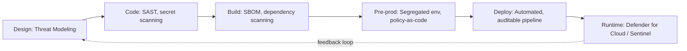

---
tags:
  - sc100
type: concept
domain:
  - best-practices
aliases:
  - Shift Left
---

# Shift Left (WAF)

## Purpose

Move security activities (threat modeling, code scanning, policy checks) earlier into the SDLC and deployment pipeline instead of catching issues in production.

---

## Why Architects Choose It

- Cost of fixing a vulnerability grows the later it's found — cheapest in design, most expensive in production incident response.
- Reduces mean-time-to-detect by catching issues before they reach a live workload.
- Converts security from a gate at release into a continuous, distributed responsibility across the SDLC.
- Enables faster release velocity long-term, because fewer defects surface post-deployment.

---

## Where It Lives in Microsoft's Guidance

Shift left isn't a separate WAF pillar — it's a **practice referenced inside the Security pillar** and reinforced in CAF.

- **WAF Security pillar**, checklist item **SE:02 – Secure Development Lifecycle (SDLC)**: mandates a hardened, mostly automated, auditable software supply chain, plus threat modeling during design.
- **CAF Secure methodology (Adopt phase)**: recommends segregated pre-production vs. production environments with different access levels, explicitly framed as a shift-left mechanism — it pushes security concerns into every phase of development rather than only at release.
- **DevSecOps** is the operating model that implements shift left in practice (this is why the SC-100 objective "DevSecOps process aligned with CAF" sits next to the CAF domain, not just Security Operations).

---

## When to Use

- Any workload with an active CI/CD pipeline (Azure Pipelines, GitHub Actions).
- Greenfield application development, where controls are cheapest to bake in from day one.
- Regulated workloads where audit evidence of secure SDLC is required (SE:02 explicitly calls for an _auditable_ pipeline).
- Organizations maturing past reactive, production-only security monitoring.

## When NOT to Use (or use with caution)

- Legacy/COTS workloads with no pipeline access — shift left has nothing to attach to; compensate with runtime controls (Defender for Cloud, WAF at the network layer) instead.
- Small, short-lived proof-of-concept workloads — the process overhead may exceed the risk being mitigated.
- Don't treat shift left as a replacement for production monitoring — it reduces the volume of issues reaching production, it doesn't eliminate the need for [[Microsoft Defender for Cloud]] posture management or [[Microsoft Sentinel]] detection. Architects still need shift **right** (runtime observability) for defense in depth.

---

## Architecture Pattern

- Design stage: [[Threat Modeling|threat modeling]] is the anchor activity — feeds requirements into backlog items so security is delivered as a product feature, not an afterthought.
- Code stage: static analysis, secret scanning, peer review gates — see [[DevOps Security]] for the concrete Defender for DevOps mechanism.
- Pipeline stage: [[Azure Policy]] as code / [[DevOps Security|Defender for DevOps]] IaC template scanning before deployment.
- Environment stage: segregated pre-prod with reduced-privilege identities — ties directly into [[PIM]] and least-privilege design.
- Runtime stage: closes the loop — findings feed back into design (continuous improvement, matching WAF's "not a one-time setup" philosophy).

---

## Related Services

- [[DevOps Security]] — the concrete Defender for DevOps mechanism that scans IaC, secrets, code, and dependencies pre-deployment.
- [[Threat Modeling]] — the design-stage anchor activity, including STRIDE.
- [[Microsoft Defender for Cloud]] — DevOps security posture management scans IaC and pipelines pre-deployment.
- [[Azure Policy]] — enforces guardrails as code, usable in pipeline stage.
- [[PIM]] — least-privilege access for pipeline identities and pre-prod environments.
- [[Microsoft Sentinel]] — closes the loop with runtime detection (shift-left's complement, not substitute).
- [[Conditional Access]] — controls access to pipeline tooling and source repos.
- [[Key Vault]] — secret management referenced in secure coding (avoid hardcoded secrets, a SE:02 concern).

---

## AZ-500 Overlap

- You already know secret scanning, RBAC, and network controls at the resource level — AZ-500 doesn't test SDLC/pipeline security.
- New at SC-100 altitude: security is designed as a **process across the pipeline**, not configured as a **feature on a resource**.

## What's New for SC-100

- Exam expects you to recommend _where in the lifecycle_ a control belongs, not just _that_ a control exists.
- Expect scenario questions like "vulnerabilities are found only after deployment — what should the architect recommend?" → answer: shift security left into the SDLC/pipeline (SE:02), not just add more runtime scanning.
- Know that shift left is explicitly tied to **DevSecOps** and the **CAF Secure/Adopt phase**, so a question framed around CAF alignment can still be a shift-left question.

---

## Exam Tips

- If a question describes security controls applied only late (at release or in production), the expected architectural fix is shift left.
- SE:02 is the specific WAF checklist anchor — cite "secure development lifecycle" if asked to name the pillar practice.
- Shift left ≠ shift right. Know both terms: shift right = runtime/production observability and detection (Sentinel, Defender for Cloud). A mature architecture uses both.
- Segregated pre-prod/prod environments (CAF) is a favorite exam scenario for shift left — different access levels, not just different subscriptions.

---

## Common Exam Confusion

**Shift Left vs Shift Right**

|Aspect|Shift Left|Shift Right|
|---|---|---|
|Timing|Design, code, build, pre-prod|Post-deployment, production|
|Goal|Prevent defects/vulnerabilities from reaching production|Detect and respond to what reaches production|
|Primary tools|SAST, threat modeling, IaC scanning, policy-as-code|[[Microsoft Sentinel]], [[Microsoft Defender for Cloud]] runtime protection|
|WAF anchor|Security pillar SE:02 (Secure Development Lifecycle)|Security pillar operations/monitoring checklist items|
|Owner|Development/platform engineering|SecOps/SOC|

**Shift Left vs DevSecOps**

|Aspect|Shift Left|DevSecOps|
|---|---|---|
|Scope|A principle — _move security earlier_|An operating model/culture that _implements_ the principle|
|Granularity|Applies to a specific control's placement in the lifecycle|Applies to the entire team structure and pipeline tooling|
|Exam framing|"Where should this control run?"|"How should teams and pipelines be organized?"|

---

## References

- Microsoft Learn — Well-Architected Framework, Security pillar, Secure Development Lifecycle (SE:02)
- Microsoft Learn — Cloud Adoption Framework, Secure methodology, Adopt phase

**Verification flag:** Shift left is not a standalone WAF pillar or numbered principle on its own — it is realized through SE:02 and reinforced in CAF's Secure/Adopt guidance. Re-verify pillar checklist IDs against Microsoft Learn if citing SE:02 directly in exam prep, as checklist numbering has been revised before.