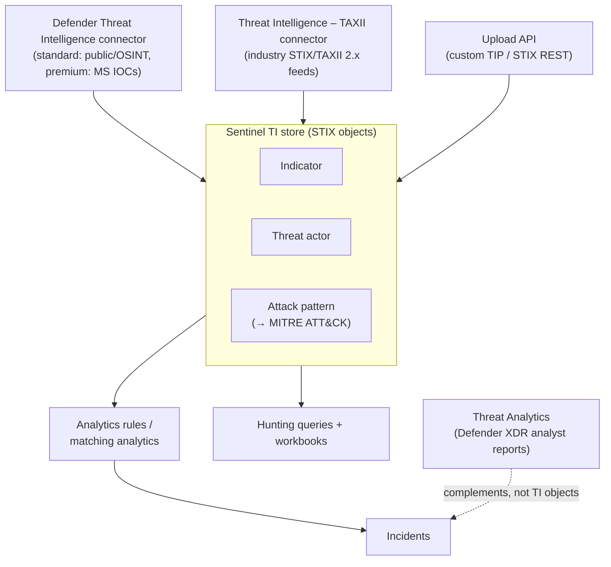
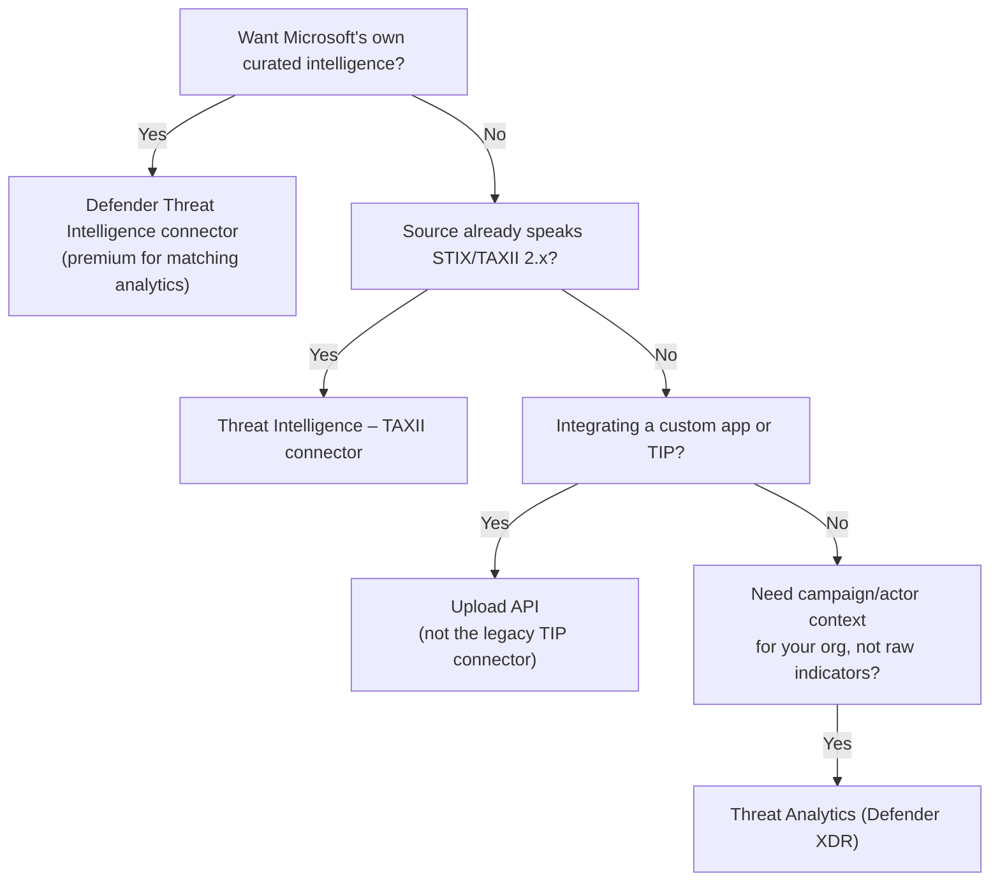

---
tags:
  - sc100
type: concept
domain:
  - ops-identity-compliance
aliases:
  - CTI
  - MDTI
status: needs-verification
---
# Threat Intelligence

## Purpose

Architecting how an organization sources, structures, and operationalizes cyber threat intelligence (CTI) — tactical (indicators) and strategic (actors, TTPs) — so it feeds detection, hunting, and response instead of sitting unused in a feed.

---

## Why Architects Choose It

- CTI turns "unusual activity" into "known-bad, attributed activity" — the difference between a low-confidence anomaly and a high-fidelity, actionable alert.
- STIX gives a shared taxonomy (indicator, threat actor, attack pattern, identity, relationship) across tools and vendors, so intelligence gathered once is reusable across analytics rules, hunting, and reporting instead of siloed per source.
- As of August 2026, Microsoft Defender Threat Intelligence (MDTI) converged directly into [[Microsoft Defender XDR]] and [[Microsoft Sentinel]] — architects no longer license a separate MDTI product; TI capability now ships bundled with the platforms already being designed in [[Security Operations]].
- Traffic Light Protocol (TLP) sensitivity levels make TI sharing a governance decision, not an afterthought — critical when consuming community or commercial feeds that carry redistribution restrictions.

---

## When to Use

- Enriching Sentinel analytics rules and hunting queries with indicators from Microsoft, community, or commercial sources — TAXII connector (industry feeds) or Defender Threat Intelligence connector (Microsoft's own).
- Integrating a third-party threat intelligence platform (TIP) or custom feed — the Threat Intelligence **upload API** (STIX-based REST API).
- Wanting Microsoft's own curated, high-fidelity indicators automatically matched against your logs with minimal setup — the premium Defender Threat Intelligence **matching analytics** rule.
- Tracking an active campaign or actor's relevance to your specific environment (exposure, related incidents) — **Threat Analytics** in Defender XDR, not raw TI objects.

---

## When NOT to Use

- Standing up the legacy Threat Intelligence Platform (TIP) data connector for a new integration — it's on the deprecation path; use the upload API instead.
- Treating every ingested indicator as equally trustworthy — apply ingestion rules (confidence/age filtering) or low-value indicators flood analysts with noise.
- Expecting a standalone MDTI portal or license — it retired August 1, 2026; TI is now bundled into Defender XDR/Sentinel licensing, not a separate purchase.

---

## Architecture

---

## Architecture Decisions

---

## Comparison

| Compare | Difference |
| --- | --- |
| Threat Intelligence (TI objects) vs. Threat Analytics | TI objects are raw/structured STIX data (indicators, actors, TTPs) that power analytics rules and hunting; Threat Analytics is curated Microsoft analyst reporting on active campaigns/actors, with your org's specific exposure and related incidents attached. Complementary, not interchangeable. |
| Defender TI connector: standard vs. premium | Standard (free): public indicators + open-source intelligence. Premium (licensed): adds Microsoft's own curated indicators, Microsoft-enriched OSINT, and access to the matching analytics rule for high-fidelity, auto-generated incidents. |
| TAXII connector vs. upload API | TAXII: built-in client polling a TAXII 2.x server on a schedule for STIX bundles — for feeds that already speak the standard. Upload API: STIX-based REST API for custom apps/TIPs that don't run a TAXII server — no data connector required. |
| Upload API vs. legacy TIP data connector | The TIP connector only supports indicators via the older Graph Security `tiIndicators` API and is being deprecated; the upload API is the current path, STIX-based, and supports the full range of STIX objects, not just indicators. |

---

## AZ-500 Review

AZ-500 doesn't cover structured threat intelligence at all — no STIX/TAXII, no TI connectors, no TLP. Its closest touchpoint is reading Defender for Cloud/Sentinel alerts, which assumes intelligence already baked into Microsoft's detections rather than architecting how an org sources and curates its own. Treat this as entirely new for SC-100.

---

## What's New for SC-100

- Know STIX as the shared object model (indicator, threat actor, attack pattern, identity, relationship) — attack pattern objects map to MITRE ATT&CK stages, tying TI directly to the coverage-mapping work in [[Security Operations]]. ATT&CK itself — and how it compares to the Cyber Kill Chain — is covered in [[Attack Chain Models]].
- Know the current, post-convergence architecture: MDTI isn't a separate product or license anymore — design around the bundled capability in Defender XDR/Sentinel.
- Choose the ingestion path deliberately (Defender TI connector, TAXII, or upload API) and know the legacy TIP connector is being retired.
- Apply TLP and ingestion rules as the governance layer for TI at scale — an explicit "how do you operationalize this" answer, not just "turn on a connector."
- Distinguish Threat Intelligence from Threat Analytics as two different, complementary capabilities in the same Defender portal.
- Threat Analytics/TI can feed [[Microsoft Defender XDR|Defender XDR's Attack Disruption]] with the high-confidence campaign context that triggers autonomous containment — TI enriches detection, Attack Disruption acts on it.
- [[Microsoft Security Copilot|Security Copilot]] has an embedded TI query experience — see [[AI and Copilot Security Architecture]]; this note covers the underlying TI architecture it queries.

---

## Exam Tips

- "Ingest Microsoft's own curated indicators with minimal setup" → Defender Threat Intelligence connector (premium for matching analytics), not TAXII.
- "Connect an existing threat intelligence platform via REST API" → upload API, not the legacy TIP connector (a deprecation distractor).
- "Understand an active campaign's relevance to our environment" → Threat Analytics, not raw TI indicators.
- A scenario describing a standalone MDTI license or portal is testing outdated knowledge — current architecture folds MDTI into Defender XDR/Sentinel at no extra cost.

---

## Common Exam Confusion

- **Threat Intelligence vs. Threat Analytics** — raw/structured TI objects powering detection vs. curated analyst reporting on active campaigns; full comparison above.
- **TAXII connector vs. upload API** — standards-based feed polling vs. custom/TIP REST integration.
- **Defender TI connector standard vs. premium** — free public/OSINT vs. licensed Microsoft indicators + enriched OSINT + matching analytics.

---

## Keywords

- Cyber threat intelligence (CTI): tactical (indicators) vs. strategic (TTPs, threat actors)
- STIX objects: indicator, threat actor, attack pattern, identity, relationship
- TAXII 2.x, Threat Intelligence – TAXII connector
- Threat Intelligence upload API, legacy TIP data connector (deprecated)
- Defender Threat Intelligence (MDTI) connector — standard vs. premium
- Matching analytics (high-fidelity auto-generated incidents)
- Traffic Light Protocol (TLP): White / Green / Amber / Red
- Threat Analytics (Defender XDR active campaign reports)
- Ingestion rules, indicator confidence and expiration

---

## Related Services

- [[Microsoft Sentinel]]
- [[Microsoft Defender]]
- [[Microsoft Defender XDR]]
- [[Security Operations]]
- [[AI and Copilot Security Architecture]]
- [[Microsoft Security Copilot]]
- [[Zero Trust]]
- [[Attack Chain Models]]

---

## References

- [Threat intelligence - Microsoft Sentinel](https://learn.microsoft.com/en-us/azure/sentinel/understand-threat-intelligence) — Microsoft Learn
- [Connect to STIX/TAXII threat intelligence feeds](https://learn.microsoft.com/en-us/azure/sentinel/connect-threat-intelligence-taxii) — Microsoft Learn
- [Threat analytics in Microsoft Defender](https://learn.microsoft.com/en-us/defender-xdr/threat-analytics) — Microsoft Learn
- https://aka.ms/threatactors
- (https://aka.ms/mddr)
- [[Exam Objectives]]

---

## Verification Flag

MDTI's convergence into Defender XDR/Sentinel completed around August 1, 2026 — right around this note's writing date (2026-08-03). Re-verify licensing and naming close to exam date since this is a very recent transition.
