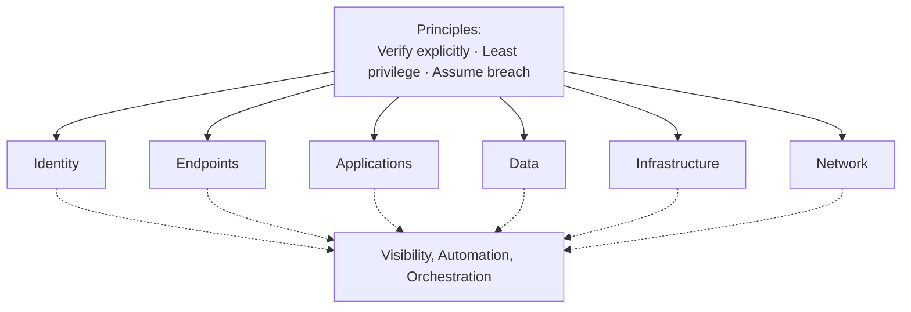
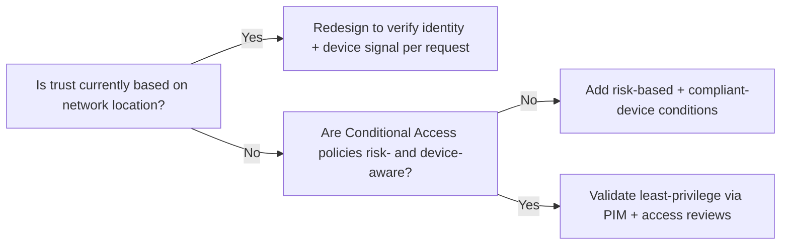

---
tags:
  - sc100
---

# Zero Trust

## Purpose

Zero Trust is the strategic principle — "verify explicitly, use least privilege, assume breach" — that architects use to evaluate and design every security control across an organization.

---

## Why Architects Choose It

- Removes implicit trust granted by network location (corporate LAN, VPN) — every request is authenticated, authorized, and encrypted regardless of origin.
- Gives a single evaluation lens across identity, endpoints, apps, data, infrastructure, and network, so controls are judged for consistency rather than designed in silos.
- Underpins the [Zero Trust adoption framework](https://learn.microsoft.com/en-us/security/zero-trust/adopt/zero-trust-adoption-framework), which architects use to plan rollout in business-aligned phases (secure remote/hybrid work, protect data, modernize security operations).
- Required alignment target for [[Conditional Access]] policy design and for [[Microsoft Cybersecurity Reference Architectures (MCRA)|MCRA]]/[[Microsoft Cloud Security Benchmark (MCSB)|MCSB]]-based architecture reviews on the exam.

---

## When to Use

- Designing or evaluating a security strategy that must survive a compromised network segment or identity.
- Validating whether existing [[Conditional Access]] policies actually enforce explicit verification (vs. relying on network location as a signal).
- Planning [[Ransomware Resiliency and BCDR|ransomware resiliency]], since Zero Trust's "assume breach" principle drives segmentation and least-privilege design.
- Assessing Zero Trust maturity (Traditional → Advanced → Optimal) as part of a security posture review.

---

## When NOT to Use

- As a literal product or service to deploy — Zero Trust has no SKU; it's a design lens applied to existing controls.
- As justification to skip layered/defense-in-depth controls — Zero Trust complements defense in depth, it doesn't replace it.
- For legacy systems that cannot support modern authN (e.g., some OT/ICS) — here, compensating network-layer segmentation is the fallback, not a Zero Trust violation.

---

## Architecture

Zero Trust is applied across six pillars, all governed by shared visibility, automation, and orchestration:

Each pillar maps to concrete controls an architect designs or validates:

| Pillar | Primary controls |
| --- | --- |
| Identity | [[Entra ID]], [[Conditional Access]], [[PIM]], [[Identity Protection]] |
| Endpoints | Device compliance, Intune, endpoint detection |
| Applications | API security, [[Azure Web Application Firewall]], workload identities |
| Data | [[Purview]], [[Key Vault]], encryption at rest/in transit |
| Infrastructure | [[Microsoft Defender for Cloud]], [[Azure Policy]], Azure Arc |
| Network | [[Azure Firewall]], [[Private Link]], micro-segmentation, Global Secure Access (see [[Identity as the Security Perimeter]]) |
| Visibility/automation | [[Microsoft Sentinel]], [[Microsoft Defender XDR]] |

---

## Architecture Decisions

- If a design still grants access based on being "inside the network," it fails Zero Trust — recommend Conditional Access with explicit identity/device checks instead.
- If privileged access is standing rather than just-in-time, recommend [[PIM]] before recommending any new perimeter control — full privileged-access architecture in [[Securing Privileged Access]].

---

## Comparison

| Compare | Difference |
| --- | --- |
| Zero Trust vs. Defense in Depth | Zero Trust removes implicit trust per request; defense in depth adds redundant layered controls. Complementary, not competing — Zero Trust decides *what* to verify, defense in depth decides *how many layers* verify it. |
| Zero Trust vs. Perimeter (castle-and-moat) security | Perimeter model trusts everything inside the network boundary; Zero Trust trusts nothing by default, inside or outside — the concrete replacement mechanism is covered in [[Identity as the Security Perimeter]]. |
| Zero Trust vs. Conditional Access | Zero Trust is the strategy; [[Conditional Access]] is one enforcement mechanism that implements it for identity access decisions. |

---

## AZ-500 Review

AZ-500 already covers the enforcement mechanisms: [[Conditional Access]], MFA, [[Identity Protection]] risk policies, RBAC, [[Azure Firewall]], NSGs, and baseline [[Microsoft Defender for Cloud]] posture. That knowledge is assumed here.

---

## What's New for SC-100

- Treat Zero Trust as the **evaluation criterion**, not a control to implement — the exam asks you to judge whether a proposed architecture satisfies Zero Trust principles, not to configure it.
- Use the Zero Trust adoption framework to sequence a multi-year rollout plan across business scenarios, not just technical controls.
- Explicitly validate Conditional Access policies against Zero Trust as a standalone skill (exam objective, not just implementation task).
- Map Zero Trust maturity stage (Traditional/Advanced/Optimal) to prioritize which pillar to invest in next.

---

## Exam Tips

- Expect scenario questions like "which change best aligns this design with Zero Trust?" — look for removal of implicit/network-based trust.
- Ransomware resiliency questions often hinge on "assume breach" — segmentation and least privilege are the expected answers.
- Don't pick answers that add more network perimeter controls when the gap is actually identity verification, and vice versa.

---

## Common Exam Confusion

- **Zero Trust vs. Defense in Depth** — tested by asking which principle justifies a *specific* control choice; Zero Trust justifies removing trust assumptions, defense in depth justifies adding redundant layers.
- **Conditional Access vs. Zero Trust** — Conditional Access is graded as an implementation; Zero Trust is graded as the design intent behind it.

---

## Keywords

- Verify explicitly, least privilege, assume breach
- Zero Trust adoption framework
- Zero Trust maturity model (Traditional / Advanced / Optimal)
- Implicit trust / network-based trust
- Six pillars (identity, endpoints, apps, data, infrastructure, network)
- Assume breach / blast radius
- Explicit verification per request

---

## Related Services

- [[Conditional Access]]
- [[PIM]]
- [[Identity as the Security Perimeter]]
- [[Securing Privileged Access]]
- [[Microsoft Cybersecurity Reference Architectures (MCRA)]]
- [[Microsoft Cloud Security Benchmark (MCSB)]]
- [[Ransomware Resiliency and BCDR]]

---

## References

- [Zero Trust Guidance Center](https://learn.microsoft.com/en-us/security/zero-trust/) — Microsoft Learn
- [Zero Trust adoption framework](https://learn.microsoft.com/en-us/security/zero-trust/adopt/zero-trust-adoption-framework) — Microsoft Learn
- [[Exam Objectives]]
