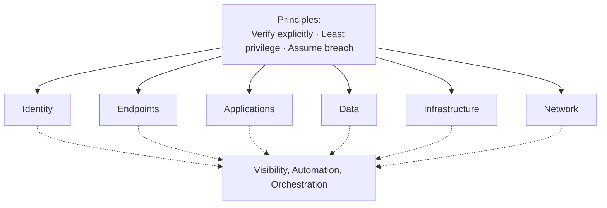
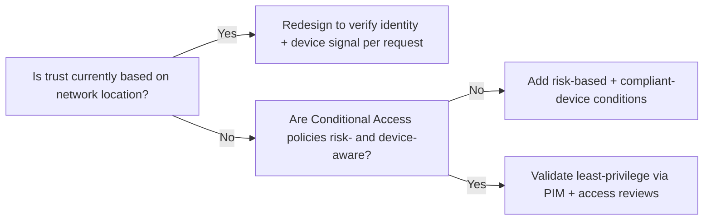

---
tags:
  - sc100
type: concept
domain:
  - best-practices
status: needs-verification
---
# Zero Trust

## Purpose

Zero Trust is the strategic principle — "verify explicitly, use least privilege, assume breach" — that architects use to evaluate and design every security control across an organization.

---

## Core Principles

- **Verify explicitly** — authenticate and authorize on *every* request using all available signals: user identity, location, device health, the requesting service/workload, and the classification of the data being accessed. Network location is never treated as a trust signal on its own.
- **Least privilege access** — enforce via Just-In-Time (JIT) and Just-Enough-Administration (JEA), risk-based adaptive policies, and data-level protection, so a compromised identity or device can't move laterally. [[PIM]] is the concrete JIT mechanism for directory roles; [[Securing IaaS and PaaS Services]] covers JIT VM access for management ports; JEA — constrained PowerShell admin sessions for Windows Server/AD DS — is covered in [[Securing Privileged Access]] alongside its client-device counterpart, Endpoint Privilege Management.
- **Assume breach** — design as if an attacker is already inside: minimize blast radius through segmentation, enforce end-to-end encryption everywhere (not just at the perimeter), and use analytics to gain visibility, drive threat detection, and continuously improve defenses. Directly drives [[Ransomware Resiliency and BCDR]] design.
  - Containment works in both directions — a breach is still averted if the attacker is inside the network but **egress is blocked**: outbound filtering (Azure Firewall application/network rules, Universal Tenant Restrictions blocking exfil to unauthorized tenants — see [[Identity as the Security Perimeter]]) stops data exfiltration and C2 callback even after initial compromise. Assume breach isn't only about stopping entry; it's equally about limiting what a foothold can *do* and *reach* once inside.

---

## Why Architects Choose It

- Removes implicit trust granted by network location (corporate LAN, VPN) — every request is authenticated, authorized, and encrypted regardless of origin.
- Gives a single evaluation lens across identity, endpoints, apps, data, infrastructure, and network, so controls are judged for consistency rather than designed in silos.
- Underpins the [Zero Trust adoption framework](https://learn.microsoft.com/en-us/security/zero-trust/adopt/zero-trust-adoption-framework), which architects use to plan rollout in business-aligned phases (secure remote/hybrid work, protect data, modernize security operations).
- Required alignment target for [[Conditional Access]] policy design and for [[Microsoft Cybersecurity Reference Architectures (MCRA)|MCRA]]/[[Microsoft Cloud Security Benchmark (MCSB)|MCSB]]-based architecture reviews on the exam.

---

## When to Use

- Designing or evaluating a security strategy that must survive a compromised network segment or identity.
- Validating whether existing [[Conditional Access]] policies actually enforce explicit verification (vs. relying on network location as a signal).
- Planning [[Ransomware Resiliency and BCDR|ransomware resiliency]], since Zero Trust's "assume breach" principle drives segmentation and least-privilege design.
- Assessing Zero Trust maturity (Traditional → Advanced → Optimal) as part of a security posture review.

---

## When NOT to Use

- As a literal product or service to deploy — Zero Trust has no SKU; it's a design lens applied to existing controls.
- As justification to skip layered/defense-in-depth controls — Zero Trust complements defense in depth, it doesn't replace it.
- For legacy systems that cannot support modern authN (e.g., some OT/ICS) — here, compensating network-layer segmentation is the fallback, not a Zero Trust violation.

---

## Architecture

Zero Trust is applied across six pillars, all governed by shared visibility, automation, and orchestration:

Each pillar maps to concrete controls an architect designs or validates:

| Pillar | Primary controls |
| --- | --- |
| Identity | [[Entra ID]], [[Conditional Access]], [[PIM]], [[Identity Protection]] |
| Endpoints | Device compliance, Intune, endpoint detection — full architecture in [[Securing Server and Client Endpoints]] |
| Applications | API security, [[Azure Web Application Firewall]], workload identities |
| Data | [[Purview]], [[Key Vault]], encryption at rest/in transit — full pipeline in [[Data Classification and Protection]] |
| Infrastructure | [[Microsoft Defender for Cloud]], [[Azure Policy]], [[Azure Arc]] |
| Network | [[Azure Firewall]], [[Private Link]], micro-segmentation, Global Secure Access (see [[Identity as the Security Perimeter]] and [[Network Security Architecture]]) |
| Visibility/automation | [[Microsoft Sentinel]], [[Microsoft Defender XDR]] |

### Pillar Details

- **Identity** — consolidate to a single identity/SSO across SaaS, IaaS, and on-prem so risk signals and behavioral baselines aren't fragmented across silos. Push toward passwordless (Windows Hello for Business, Microsoft Authenticator, FIDO2 security keys) to remove phishable/guessable credentials, and disable legacy authentication (IMAP, POP, SMTP AUTH) — these protocols can't enforce MFA or [[Conditional Access]] and account for the large majority of credential-guessing/password-spray attacks *(video cites ~90%; verify the exact current figure before quoting it on the exam)*.
- **Endpoints** — establish a hardware root of trust: [[Trusted Platform Module (TPM)|TPM plus Secure Boot/Trusted Boot]] attest that firmware and OS haven't been tampered with before a device is trusted with corporate access. Both corporate and personal devices must be managed (e.g., Intune) and proven compliant (patch level, disk encryption, anti-malware health) before access is granted — full breakdown in [[Securing Server and Client Endpoints]].
- **Network** — micro-segment with NSGs, Application Security Groups, and [[Azure Firewall]] (see [[Network Security Group]]) so lateral movement is blocked by default. Encrypt end-to-end (TLS/IPSec) from endpoint to resource rather than relying on a traditional VPN that "hairpins" all traffic through a central concentrator — hairpinning adds latency and doesn't guarantee encryption for the full path. [[Identity as the Security Perimeter]] covers the ZTNA replacement (Global Secure Access/Private Access). Azure Firewall also performs TLS inspection/intrusion detection so encrypted traffic is still inspectable.
  - **Egress control matters as much as ingress control** — segmentation isn't only about keeping an attacker out, it's about limiting where a foothold that's already inside can reach or exfiltrate to. Outbound-restricted NSGs/Azure Firewall rules and Universal Tenant Restrictions turn a successful intrusion into a contained, low-impact event instead of a full breach.
- **Infrastructure** — [[Azure Policy]] enforces guardrails and blocks insecure default configuration at deploy time. Management ports (RDP/SSH) stay closed by default and open only per-request, time-boxed, via Just-In-Time VM access — full mechanics in [[Securing IaaS and PaaS Services]]. Containerized workloads get the same guardrail treatment at the cluster level (admission control, workload identity, network policy) — see [[Container and Kubernetes Security]].
- **Applications** — publish on-prem apps externally with modern, Conditional-Access-governed authentication (Azure AD Application Proxy) instead of a VPN/DMZ. Use Defender for Cloud Apps (CASB) — see [[Microsoft Defender]] — to discover shadow IT and apply in-session controls (e.g., block downloads from an unmanaged device) — full depth in [[SaaS Application Discovery and Control]]. API traffic gets its own policy enforcement point — throttling, token validation, versioning — covered in [[API Management and Security]].
- **Data** — discovery and classification ([[Purview]]) is the prerequisite step; you can't protect data you haven't found and labeled. Prioritize protection by data criticality × probability of exposure, not uniform controls everywhere. Confidential Computing extends encryption to data *in use* (encrypted in memory during processing), closing the last gap after at-rest/in-transit encryption — full pipeline in [[Data Classification and Protection]].

### Conditional Access as the Decision Engine

[[Conditional Access]] is the mechanism that ties the pillars together operationally: it ingests user risk, sign-in risk, device compliance, and location signals from across the pillars, then enforces allow / require-MFA / require-compliant-device / block decisions. It also re-evaluates mid-session via **Continuous Access Evaluation (CAE)** rather than waiting for token expiry — so a revoked credential or a spike in risk can cut off access in near real time, not just at the next sign-in.

### Signals and Automation

Zero Trust depends on ingesting logs/signals from every pillar at a volume no human team can triage manually. [[Microsoft Sentinel]] (SIEM/SOAR) aggregates those signals; machine learning is what makes the scale usable — surfacing anomalous behavior and driving automated response (e.g., blocking an IP, disabling a compromised identity) instead of relying on manual investigation for every alert.

---

## Common Adoption Antipatterns

Recurring ways a Zero Trust rollout fails in practice — useful for "what's wrong with this design" scenario questions, not just "what is Zero Trust":

- **Treating it as a project with an end date** — Zero Trust is a continuous operating model (assume breach never "finishes"); a rollout planned as a one-off migration drifts back to implicit trust once the project closes.
- **Network-only Zero Trust** — segmenting the network (NSGs, firewalls) while identity, apps, and data still grant implicit trust. Removing trust in one pillar while leaving it in the other five doesn't satisfy the model — see the six pillars above.
- **Big-bang enforcement** — switching Conditional Access or blocking policies straight to enforced, tenant-wide, without a Report-only validation phase first. Causes outages/lockouts and creates pressure to roll back or over-exempt, which reintroduces implicit trust. See [[Conditional Access]]'s Report-only guidance.
- **Ignoring user friction** — over-restrictive policies push users toward workarounds (shadow IT, personal devices, unmanaged file sharing) that recreate the exact ungoverned access Zero Trust was meant to remove — see [[SaaS Application Discovery and Control]] for the discovery side of this gap.
- **Pillar silos** — identity, network, and data teams each implement their own controls without sharing signals, defeating the "single evaluation lens across pillars" purpose of the model.
- **No maturity baseline** — deploying controls without first assessing current Traditional/Advanced/Optimal maturity, so investment isn't prioritized against the actual biggest gap.
- **Retrofitting instead of designing in** — applying Zero Trust as a bolt-on review after an architecture is finalized, rather than as the lens applied from the first design decision.

---

## Architecture Decisions

- If a design still grants access based on being "inside the network," it fails Zero Trust — recommend Conditional Access with explicit identity/device checks instead.
- If privileged access is standing rather than just-in-time, recommend [[PIM]] before recommending any new perimeter control — full privileged-access architecture in [[Securing Privileged Access]].

---

## Comparison

| Compare | Difference |
| --- | --- |
| Zero Trust vs. Defense in Depth | Zero Trust removes implicit trust per request; defense in depth adds redundant layered controls. Complementary, not competing — Zero Trust decides *what* to verify, defense in depth decides *how many layers* verify it. |
| Zero Trust vs. Perimeter (castle-and-moat) security | Perimeter model trusts everything inside the network boundary; Zero Trust trusts nothing by default, inside or outside — the concrete replacement mechanism is covered in [[Identity as the Security Perimeter]]. |
| Zero Trust vs. Conditional Access | Zero Trust is the strategy; [[Conditional Access]] is one enforcement mechanism that implements it for identity access decisions. |

---

## AZ-500 Review

AZ-500 already covers the enforcement mechanisms: [[Conditional Access]], MFA, [[Identity Protection]] risk policies, RBAC, [[Azure Firewall]], NSGs, and baseline [[Microsoft Defender for Cloud]] posture. That knowledge is assumed here.

---

## What's New for SC-100

- Treat Zero Trust as the **evaluation criterion**, not a control to implement — the exam asks you to judge whether a proposed architecture satisfies Zero Trust principles, not to configure it.
- Use the Zero Trust adoption framework to sequence a multi-year rollout plan across business scenarios, not just technical controls. The tactical, checklist-level version of that sequencing — initiatives, deployment objectives, and named accountable/responsible owners — is the **[[Rapid Modernization Plan (RaMP)]]**.
- Explicitly validate Conditional Access policies against Zero Trust as a standalone skill (exam objective, not just implementation task).
- Map Zero Trust maturity stage (Traditional/Advanced/Optimal) to prioritize which pillar to invest in next.

---

## Exam Tips

- Expect scenario questions like "which change best aligns this design with Zero Trust?" — look for removal of implicit/network-based trust.
- Ransomware resiliency questions often hinge on "assume breach" — segmentation and least privilege are the expected answers.
- Don't pick answers that add more network perimeter controls when the gap is actually identity verification, and vice versa.
- "Attacker already has a foothold — what limits the damage?" often has an **egress/outbound** answer (restrict outbound firewall rules, block exfil to unauthorized tenants), not just inbound segmentation — containment counts as breach mitigation even if the attacker was never kept out.
- "90% of credential-guessing attacks use legacy authentication" style stats are useful intuition but not exact exam facts — the tested takeaway is *disable legacy auth*, not the precise percentage.
- "Where does the organization start / what are the quick wins?" is **not** a Zero Trust principles answer — it points to the [[Rapid Modernization Plan (RaMP)|RaMP]] checklists.

---

## Common Exam Confusion

- **Zero Trust vs. Defense in Depth** — tested by asking which principle justifies a *specific* control choice; Zero Trust justifies removing trust assumptions, defense in depth justifies adding redundant layers.
- **Conditional Access vs. Zero Trust** — Conditional Access is graded as an implementation; Zero Trust is graded as the design intent behind it.
- **Inbound (ingress) vs. outbound (egress) segmentation** — both count as "assume breach" controls; blocking an attacker from getting *in* and blocking a compromised resource from calling *out* are two different, complementary containment mechanisms, not the same control tested twice.

---

## Keywords

- Verify explicitly, least privilege, assume breach
- Zero Trust adoption framework
- Zero Trust maturity model (Traditional / Advanced / Optimal)
- Implicit trust / network-based trust
- Six pillars (identity, endpoints, apps, data, infrastructure, network)
- Assume breach / blast radius
- Explicit verification per request
- Just-In-Time (JIT), Just-Enough-Administration (JEA)
- Passwordless authentication, Windows Hello for Business, FIDO2 security keys
- Legacy authentication (IMAP/POP/SMTP AUTH) disablement
- TPM, Secure Boot, Trusted Boot (hardware root of trust)
- Micro-segmentation, Application Security Groups (ASG)
- VPN hairpinning, end-to-end encryption (TLS/IPSec)
- Egress/outbound filtering, exfiltration containment
- Just-In-Time (JIT) VM access
- Azure AD Application Proxy
- Confidential Computing (encryption in use)
- Continuous Access Evaluation (CAE)
- SIEM/SOAR, machine learning-driven anomaly detection
- Adoption antipatterns: big-bang enforcement, network-only Zero Trust, pillar silos, retrofitting

---

## Related Services

- [[Conditional Access]]
- [[PIM]]
- [[Identity as the Security Perimeter]]
- [[Securing Privileged Access]]
- [[Securing Server and Client Endpoints]]
- [[Securing IaaS and PaaS Services]]
- [[Security Adoption Framework (SAF)]]
- [[Secure Future Initiative (SFI)]]
- [[Network Security Group]]
- [[SaaS Application Discovery and Control]]
- [[Data Classification and Protection]]
- [[Microsoft Cybersecurity Reference Architectures (MCRA)]]
- [[Microsoft Cloud Security Benchmark (MCSB)]]
- [[Ransomware Resiliency and BCDR]]
- [[Microsoft Sentinel]]
- [[Rapid Modernization Plan (RaMP)]] — the prioritized execution plan for reaching this target state.
- [[Securing Active Directory Domain Services (AD DS)]]
- [[Microsoft Defender XDR]]
- [[Trusted Platform Module (TPM)]]
- [[Container and Kubernetes Security]]
- [[API Management and Security]]

---

## References

- [Zero Trust Guidance Center](https://learn.microsoft.com/en-us/security/zero-trust/) — Microsoft Learn
- [Zero Trust adoption framework](https://learn.microsoft.com/en-us/security/zero-trust/adopt/zero-trust-adoption-framework) — Microsoft Learn
- [[Exam Objectives]]

---

## Verification Flag

The Common Adoption Antipatterns list is synthesized from general Zero Trust rollout guidance and architecture judgment, not transcribed from one single Microsoft Learn page — re-verify against the current [Zero Trust Guidance Center](https://learn.microsoft.com/en-us/security/zero-trust/) for any named antipattern list before treating specific wording as exam-final.
