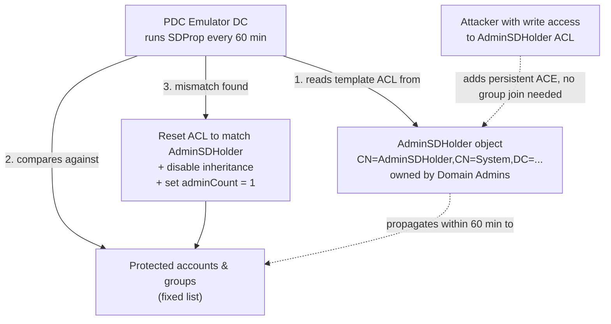
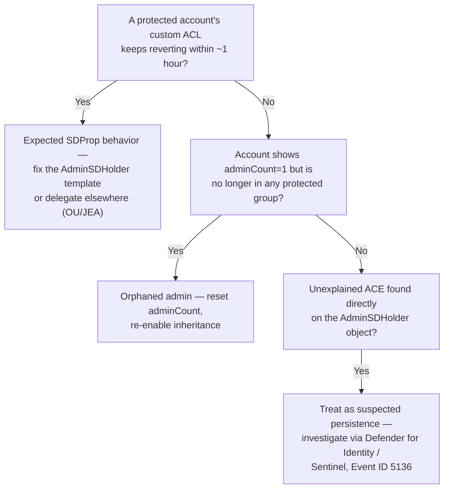

---
tags:
  - sc100
type: concept
domain:
  - ops-identity-compliance
aliases:
  - AdminSDHolder
  - SDProp
  - SD Propagator
  - adminCount
---
# AdminSDHolder and SDProp

## Purpose

The AD DS mechanism that structurally protects privileged (Control-plane) accounts and groups from permission tampering — why their ACLs silently "reset," why it's an attacker persistence technique, and the operational cleanup it creates.

---

## Why Architects Choose It

- It's not a control you configure — it's built-in AD behavior every architect needs to recognize, because it explains a specific class of "phantom" permission reversion that otherwise looks like a bug.
- It's a documented **attacker persistence technique**: a single ACE added to the AdminSDHolder object propagates to every current and future protected account within the hour, without the attacker ever joining Domain Admins — Microsoft Defender for Identity carries a dedicated alert for exactly this.
- It creates a real operational artifact — the **`adminCount=1`** flag — that persists on an account long after it's removed from a privileged group, which is why AD tier-hardening projects ([[Securing Active Directory Domain Services (AD DS)]]) always include an "orphaned admin" cleanup step.

---

## When to Use

- Explaining why a delegated permission change on a Domain Admins/Enterprise Admins/Schema Admins member (or any protected group member) reverts within roughly an hour instead of persisting.
- During AD hardening or Tier 0/Control-plane cleanup: auditing for accounts carrying a stale `adminCount=1` and disabled inheritance from having *once* been privileged — see [[Securing Active Directory Domain Services (AD DS)]].
- During incident response or threat hunting for privileged-account persistence: reviewing the AdminSDHolder object's own ACL and its modification history (Event ID 5136 on the `nTSecurityDescriptor` attribute) for unauthorized entries.
- Designing detection coverage: confirming [[Microsoft Defender]] for Identity's "suspicious modification of domain AdminSDHolder" alert is enabled and routed into [[Microsoft Defender XDR]] / [[Microsoft Sentinel]].

---

## When NOT to Use

- Never grant a user or group a direct, custom ACE on the AdminSDHolder object as a shortcut to propagate access to "all admin accounts" — this is literally the attacker technique; delegate at the OU level or via [[Securing Privileged Access|JEA]] instead.
- Don't assume removing a user from Domain Admins immediately returns the account to normal delegation — the `adminCount=1` flag and disabled inheritance persist and require explicit remediation (a script resetting `adminCount` and re-enabling inheritance).
- Don't reduce the default 60-minute SDProp interval in production without a specific, tested reason — a shorter interval increases LSASS/domain-controller processing overhead in proportion to the number of protected objects.
- Don't rely on AdminSDHolder/SDProp as your *only* Tier 0 control — it protects ACLs on a fixed group list, not authentication methods or credential caching; pair with [[Securing Active Directory Domain Services (AD DS)|Protected Users group]] for that.

---

## Architecture

- **AdminSDHolder** is automatically created in the System container of every AD domain. The **Domain Admins** group owns it (Enterprise Admins/Administrators can also modify or take ownership); it acts as the **template ACL** for every protected account/group.
- **SDProp (SD Propagator)** runs every 60 minutes by default on the domain controller holding the **PDC Emulator** role. It compares the ACL on every protected object against the AdminSDHolder template; on mismatch it resets the object's ACL, **disables permission inheritance**, and sets **`adminCount = 1`** on the object.
- **Protected groups** (fixed, built-in list): Administrators, Domain Admins, Enterprise Admins, Schema Admins, Account Operators, Backup Operators, Print Operators, Server Operators, Domain Controllers, Read-only Domain Controllers, Replicator, Krbtgt, Key Admins, Enterprise Key Admins — and their members.
- Inheritance is disabled on protected objects (and on AdminSDHolder itself) specifically so that permission changes elsewhere in the directory tree can't quietly flow down onto a privileged account.

---

## The Orphaned-Admin Problem

- SDProp sets `adminCount=1` and disables inheritance the moment an account joins a protected group — but **it does not undo this when the account is later removed**. The flag and the disabled inheritance simply stay.
- The result: an account that was a Domain Admin six months ago, and hasn't been since, still shows `adminCount=1`, still has inheritance disabled, and is still effectively carrying stale privileged-style ACLs — invisible unless someone specifically queries for it.
- Remediation is manual: a script (PowerShell/`ldifde`/third-party tooling) that finds accounts with `adminCount=1` no longer present in any protected group, resets the attribute, and re-enables inheritance.
- This is a standard, expected line item in any AD Tier 0 remediation project — not a sign something is broken.

---

## Attacker Persistence Technique

- Because SDProp *pushes* AdminSDHolder's ACL onto every protected object every hour, an attacker who obtains write access to the AdminSDHolder object itself (not membership in any privileged group) can add a backdoor ACE once and have it propagate to **every current and future** protected account automatically.
- This avoids the more heavily monitored act of joining a privileged group directly, making it a stealthy, low-noise persistence method.
- **Detection**: Microsoft Defender for Identity's **"Suspicious modification of domain AdminSDHolder"** alert — mapped to MITRE ATT&CK Persistence (TA0003) / Privilege Escalation (TA0004), technique Account Manipulation (T1098) — watches for exactly this, based on Windows Security Event ID 5136 changes to the object's `nTSecurityDescriptor`.

---

## Architecture Decisions

---

## Comparison

| Compare | Difference |
| --- | --- |
| AdminSDHolder/SDProp vs. Protected Users group | AdminSDHolder/SDProp enforces a **fixed ACL** on a fixed list of protected groups every hour. Protected Users restricts **authentication methods** (blocks NTLM, DES/RC4, unconstrained delegation, credential caching) for whichever accounts you add to it. Different mechanism, complementary — see [[Securing Active Directory Domain Services (AD DS)]]. |
| `adminCount=1` vs. actual current group membership | `adminCount=1` is a **sticky marker** set once and never automatically cleared — it does not reliably indicate current privileged status. Actual membership must be checked separately; treating the flag as live truth misidentifies orphaned accounts as active admins (or vice versa). |
| AdminSDHolder delegation vs. OU-based delegation | Modifying AdminSDHolder's own ACL propagates to **every** protected object domain-wide and is exactly the attacker technique described above. OU-based delegation ([[Securing Active Directory Domain Services (AD DS)]]) scopes rights to a specific organizational unit — the correct way to delegate narrowly. |

---

## AZ-500 Review

AZ-500 assumes general familiarity with AD groups, OUs, and delegation, but does not cover SDProp internals, the `adminCount` attribute, or AdminSDHolder as an attack surface — this note is new depth for SC-100.

---

## What's New for SC-100

- Recognize AdminSDHolder/SDProp as a named Tier 0/Control-plane hardening consideration, not just AD trivia — see [[Privileged Access Tier Models]].
- Know it as a documented persistence technique with a specific Defender for Identity detection (mapped to MITRE Persistence/Privilege Escalation), not only a defensive mechanism.
- Treat orphaned `adminCount=1` cleanup as an explicit, expected step in any privileged-access remediation project, sequenced alongside emptying privileged groups (see [[Rapid Modernization Plan (RaMP)]]).

---

## Exam Tips

- "An admin's custom permission grant on a Domain Admins member disappears within about an hour, with no one touching it" → SDProp overwriting the ACL to match AdminSDHolder — not a bug, not an attack by itself.
- "An account was removed from Domain Admins months ago but still behaves like a protected object" → orphaned `adminCount=1`, needs manual remediation.
- "Detect an attacker who never joined a privileged group but gained control of every admin account" → check for unauthorized modification of the **AdminSDHolder object's ACL** itself, surfaced by Defender for Identity.
- Don't confuse this with Protected Users group behavior — one resets ACLs on a schedule, the other restricts authentication protocols.

---

## Common Exam Confusion

- **AdminSDHolder/SDProp vs. Protected Users group** — ACL template enforcement vs. authentication-method restriction; full breakdown above.
- **`adminCount=1` vs. current group membership** — a sticky historical marker, not a live privilege indicator.
- **Delegating via AdminSDHolder vs. via OU** — domain-wide propagation to all protected objects (dangerous, attacker technique) vs. narrowly scoped delegation (correct approach).

---

## Keywords

- AdminSDHolder, SDProp (SD Propagator)
- PDC Emulator, 60-minute default interval, `AdminSDProtectFrequency`
- Protected groups (Domain/Enterprise/Schema Admins, Account/Backup/Print/Server Operators, Krbtgt, Key Admins, etc.)
- `adminCount` attribute, orphaned admin, disabled inheritance
- Persistence technique, MITRE ATT&CK T1098 (Account Manipulation), TA0003/TA0004
- Microsoft Defender for Identity: suspicious modification of domain AdminSDHolder
- Event ID 5136, `nTSecurityDescriptor`

---

## Related Services

- [[Securing Active Directory Domain Services (AD DS)]] — where this mechanism sits within the broader AD hardening checklist.
- [[Privileged Access Tier Models]] — the containment model this mechanism protects.
- [[Securing Privileged Access]]
- [[Microsoft Defender]] — Defender for Identity's detection coverage.
- [[Microsoft Defender XDR]]
- [[Microsoft Sentinel]] — DC audit log correlation and hunting.
- [[Microsoft Incident Response (DART)]]
- [[Identity and Access Management (IAM)]]

---

## References

- [Appendix C: Protected Accounts and Groups in Active Directory](https://learn.microsoft.com/en-us/windows-server/identity/ad-ds/plan/security-best-practices/appendix-c--protected-accounts-and-groups-in-active-directory) — Microsoft Learn
- [Best practices for securing Active Directory](https://learn.microsoft.com/en-us/windows-server/identity/ad-ds/plan/security-best-practices/best-practices-for-securing-active-directory) — Microsoft Learn
- [What is Microsoft Defender for Identity?](https://learn.microsoft.com/en-us/defender-for-identity/what-is) — Microsoft Learn
- [[Exam Objectives]]
