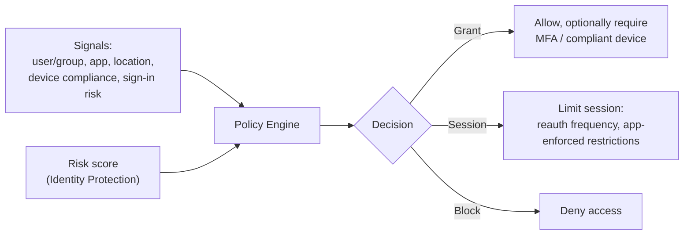
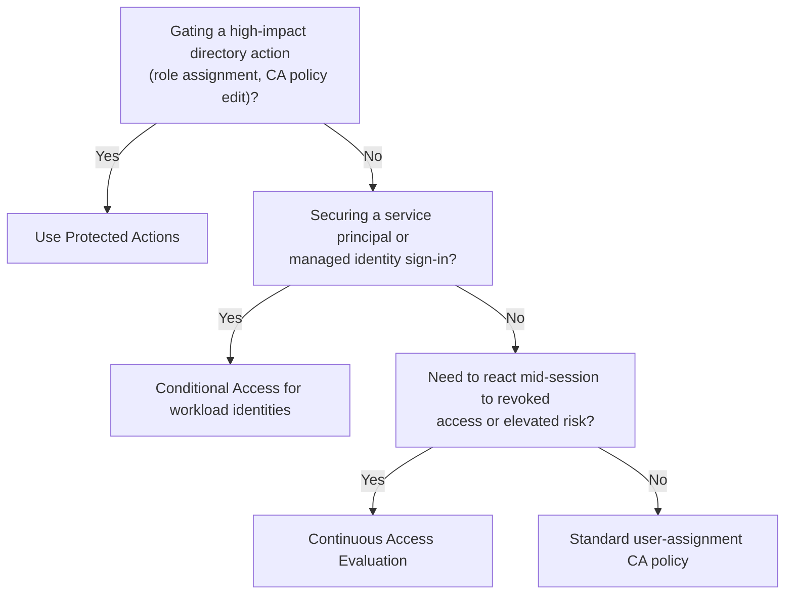

---
tags:
  - sc100
type: concept
domain:
  - ops-identity-compliance
---
# Conditional Access

## Purpose

Conditional Access is [[Entra ID]]'s policy engine that grants, blocks, or limits access at sign-in time based on identity, device, location, and risk signals.

---

## Why Architects Choose It

- Primary enforcement point for [[Zero Trust]]'s "verify explicitly" principle — every sign-in is evaluated against current signals, not a one-time network check.
- Combines signals (user/group, app, location, device compliance, sign-in risk) into a single access decision, replacing scattered per-app controls. Device compliance itself traces back to hardware attestation — see [[Trusted Platform Module (TPM)]] for the chain that produces the Compliant Device signal.
- Extends beyond interactive users to workload identities and continuously re-evaluates sessions, closing gaps that static, sign-in-only checks leave open.

---

## When to Use

- Enforcing MFA, compliant-device, or session controls for specific apps, users, or risk levels.
- Blocking legacy authentication that can't support modern signal evaluation.
- Gating high-impact directory actions (role changes, CA policy edits) behind step-up verification.
- Restricting or monitoring sign-ins from workload identities (service principals, managed identities).

---

## When NOT to Use

- As a replacement for network segmentation or resource-level authorization — CA governs sign-in, not what a resource permits after access is granted (that's RBAC).
- As the only control for on-premises-only authentication paths that never reach Entra ID.
- Without an excluded break-glass emergency access account — a global CA misconfiguration can otherwise lock out all admins.

---

## Architecture

Multiple applicable policies combine with **AND** logic — a sign-in must satisfy every matching policy, not just one.

---

## Architecture Decisions

- Roll out new/changed policies in **Report-only** mode first; validate impact before enforcing.
- Always exclude a break-glass account from blocking policies.

---

## Comparison

| Compare | Difference |
| --- | --- |
| Conditional Access vs. [[Identity Protection]] | Identity Protection *detects and scores* sign-in/user risk; Conditional Access *consumes* that score to grant, block, or challenge. |
| Conditional Access vs. RBAC | Conditional Access decides *whether* a sign-in is allowed; RBAC decides *what* an already-signed-in identity can do. |
| Conditional Access vs. [[PIM]] | Conditional Access evaluates every sign-in in real time; PIM governs standing vs. just-in-time privilege duration, independent of sign-in signals. |

---

## AZ-500 Review

AZ-500 already covers building individual policies: assignments (users, cloud apps, conditions), grant controls (require MFA, require compliant device), and session controls. That configuration-level knowledge is assumed here.

---

## What's New for SC-100

- Design Conditional Access as part of an org-wide [[Zero Trust]] strategy, not as a single isolated policy — includes validating existing policies for Zero Trust alignment (an explicit exam objective).
- Extend Conditional Access to **workload identities** (service principals, managed identities) — not just interactive users.
- Extend further to **agent identities** (Microsoft Entra Agent ID) for autonomous AI agents — see [[AI and Copilot Security Architecture]] for how this fits the broader AI security picture.
- Use **Continuous Access Evaluation (CAE)** to react to risk/revocation mid-session instead of waiting for token expiry.
- Use **Protected Actions** to require step-up authentication before high-impact directory changes, including changes to CA itself.
- Combine Conditional Access with Microsoft Entra Internet/Private Access (Global Secure Access) to add network-level compliance as a signal — full architecture in [[Identity as the Security Perimeter]].

---

## Exam Tips

- Break-glass accounts must always be excluded — expect distractor answers that "fix" an outage by loosening MFA instead.
- Report-only mode is the expected first step for any new policy recommendation, not immediate enforcement.
- Policies combine with AND — a scenario showing unexpected blocks is often caused by an additional policy the question didn't highlight.

---

## Common Exam Confusion

- **Conditional Access vs. Identity Protection** — one enforces, the other detects; questions often test whether you can identify which system produced a signal vs. which acted on it.
- **Conditional Access vs. PIM** — tested by scenarios mixing "block risky sign-in" (CA) with "limit standing admin access" (PIM); pick based on whether the control is about the sign-in event or the privilege duration.

---

## Keywords

- Policy engine, sign-in-time evaluation
- Grant controls vs. session controls
- Continuous Access Evaluation (CAE)
- Protected Actions
- Conditional Access for workload identities
- Break-glass / emergency access account
- Report-only mode
- Policies combine with AND logic

---

## Related Services

- [[Entra ID]] — Conditional Access requires P1; risk-based policies require P2.

- [[Entra ID]]
- [[Identity Protection]]
- [[PIM]]
- [[Zero Trust]]
- [[AI and Copilot Security Architecture]]
- [[Identity as the Security Perimeter]]
- [[Identity and Access Management (IAM)]]
- [[Trusted Platform Module (TPM)]]

---

## References

- [Conditional Access documentation](https://learn.microsoft.com/en-us/entra/identity/conditional-access/) — Microsoft Learn
- [[Exam Objectives]]
