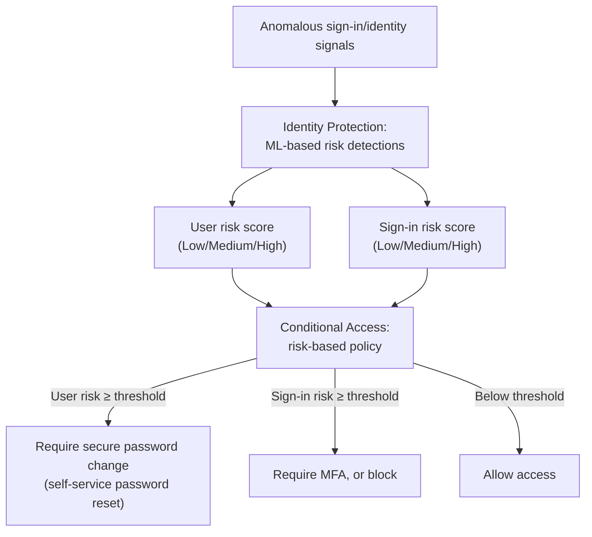

---
tags:
  - sc100
type: concept
domain:
  - ops-identity-compliance
aliases:
  - Entra ID Protection
status: needs-verification
---
# Identity Protection

## Purpose

The risk-detection engine behind Conditional Access's risk-based policies — Identity Protection scores **user risk** and **sign-in risk** from anomalous authentication signals; [[Conditional Access]] is the separate policy layer that actually *consumes* that score to allow, challenge, or block.

---

## Why Architects Choose It

- Detection and enforcement are deliberately separate products — the same prevent/detect split used everywhere else in this vault (CSPM/CWPP, AI-SPM/AI threat protection). Identity Protection detects; [[Conditional Access]] enforces. Neither alone closes the loop.
- ML-based detections catch patterns a static rule never would — leaked credentials surfacing in a breach dump, or a sign-in that's geographically impossible given the user's last known location.
- Two independent risk dimensions let policy be scoped precisely: a reused/leaked password (**user risk** — the identity itself may be compromised) is architecturally a different problem than one suspicious sign-in from an unfamiliar location (**sign-in risk** — this specific attempt looks off) — one policy for each, not a single blended signal.
- Gated behind **Microsoft Entra ID P2** — a real licensing/cost decision an architect has to size, not an assumed-available feature.

---

## Risk Types

- **User risk** — the likelihood a specific *identity* has been compromised: leaked credentials (username/password found in a public breach dump), Microsoft threat intelligence on the account, anomalous user activity, possible attempts to abuse a Primary Refresh Token, or an admin manually confirming a user as compromised.
- **Sign-in risk** — the likelihood a specific *authentication attempt* isn't the legitimate user: anonymous IP address (Tor/anonymizer), atypical travel (impossible travel between two sign-in locations in the available time), unfamiliar sign-in properties, a malware-linked IP address, or password spray.
- **Real-time vs. offline detections** — some detections (anonymous IP, unfamiliar properties) evaluate at sign-in time and can block immediately; others (leaked credentials, atypical travel) are computed via offline analysis and surface after the fact — an architecture can't assume every risk is caught before access is granted.
- **Risk levels** — Low, Medium, High (plus "no risk detected") — the level a detection produces is what a risk-based Conditional Access policy actually conditions on, not the raw detection type itself.

---

## What Happens Per Risk

- **Sign-in risk policy** — e.g., Medium risk → require MFA; High risk → block the sign-in outright. Scoped to the *specific attempt*, not the account as a whole.
- **User risk policy** — e.g., High risk → require a secure password change via self-service password reset (SSPR), which both remediates the risk and resolves it in the portal automatically once completed.
- **Manual remediation** — an admin can confirm a user as compromised (escalating risk) or dismiss a detection as a false positive directly in the Identity Protection portal, independent of any automated policy.
- Detection without a consuming Conditional Access policy does nothing — same "sensor with no enforcement point" trap as an unpaired CSPM finding elsewhere in this vault.

---

## When to Use

- Designing risk-based Conditional Access — requiring MFA or blocking access based on sign-in risk, requiring password reset based on user risk.
- Automating remediation for compromised-looking sign-ins instead of manual SOC triage of every anomaly.
- Feeding "verify explicitly" in [[Zero Trust]] with a real risk signal, not just device/location.
- Validating whether an existing Conditional Access design actually consumes risk at all — a policy set with no risk-based rule is a common gap to flag.

---

## When NOT to Use

- As a replacement for MFA — it's a signal layered on top of authentication, not an authentication method itself.
- Assuming detection alone protects anything — without a Conditional Access policy consuming the score, a risk detection just sits in a report.
- Treating every High risk detection as requiring identical action — sign-in risk (this attempt) and user risk (this identity) call for different remediations (challenge vs. password reset), not one blanket response.

---

## Comparison

| Compare | Difference |
| --- | --- |
| User risk vs. sign-in risk | User risk asks "has this identity likely been compromised" (persists across sessions until remediated). Sign-in risk asks "does this specific attempt look illegitimate" (evaluated per sign-in). A leaked-password detection is user risk; an impossible-travel detection is sign-in risk. |
| Identity Protection vs. Conditional Access | Full breakdown already in [[Conditional Access]] — Identity Protection detects and scores risk; Conditional Access is the policy engine that consumes the score to grant, challenge, or block. Not repeated here. |
| Real-time vs. offline risk detection | Real-time detections (anonymous IP, unfamiliar sign-in properties) block within the sign-in flow itself. Offline detections (leaked credentials, atypical travel) are computed after the fact and can't prevent the original sign-in — only later ones. |

---

## AZ-500 Review

AZ-500 already covers enabling Identity Protection, configuring individual risk policies, and reading the risk detections report at a configuration level. SC-100 adds: architecting Identity Protection as the detection half of a detect/enforce pair with Conditional Access (not a standalone control), sizing the P2 licensing decision, and treating risk-based policy design as part of the broader Zero Trust "verify explicitly" architecture rather than an isolated identity feature.

---

## What's New for SC-100

- Treat Identity Protection and Conditional Access as one detect/enforce architecture, explicitly — the same pattern as CSPM/CWPP and AI-SPM/AI threat protection elsewhere in this vault, applied to identity risk.
- Distinguish user risk (identity-level, persistent) from sign-in risk (attempt-level, per-session) as two separate exam-tested policy targets, not one blended "risk" concept.
- Know P1 vs. P2 licensing as an explicit architecture/cost decision — baseline Conditional Access is P1; risk-based policies and Identity Protection itself require P2, the same gate as [[PIM]].
- Tie risk-based Conditional Access design back into [[Zero Trust]]'s "verify explicitly" principle for identity-layer evaluation.

---

## Exam Tips

- "A single sign-in from an unfamiliar location or anonymous IP" → sign-in risk policy (challenge with MFA or block that attempt).
- "A user's credentials were found in a public breach dump" → user risk policy, remediated via self-service password reset.
- A scenario needing Identity Protection/risk-based Conditional Access but only licensing Entra ID P1 is under-licensed — P2 is required.
- Identity Protection alone ("we detect risk") without a paired Conditional Access policy is an incomplete architecture — the exam expects the enforcement half named too.

---

## Common Exam Confusion

- **User risk vs. sign-in risk** — identity-level/persistent vs. attempt-level/per-session; full breakdown above.
- **Identity Protection vs. Conditional Access** — detection/scoring vs. policy enforcement; see [[Conditional Access]] for the full comparison.
- **Real-time vs. offline detections** — some block the current attempt, others only inform future ones.

---

## Keywords

- Microsoft Entra ID Protection
- User risk vs. sign-in risk
- Risk levels: Low, Medium, High
- Leaked credentials, atypical travel, anonymous IP, malware-linked IP, password spray
- Risk-based Conditional Access policy
- Self-service password reset (SSPR)
- Entra ID P1 vs. P2 licensing
- Real-time vs. offline risk detection

---

## Related Services

- [[Conditional Access]]
- [[Entra ID]]
- [[Zero Trust]]
- [[PIM]]
- [[Securing Privileged Access]]
- [[Identity and Access Management (IAM)]]
- [[Identity as the Security Perimeter]]

---

## References

- [What is Identity Protection?](https://learn.microsoft.com/en-us/entra/id-protection/overview-identity-protection) — Microsoft Learn
- [Risk detections reference](https://learn.microsoft.com/en-us/entra/id-protection/concept-identity-protection-risks) — Microsoft Learn
- [[Exam Objectives]]

---

## Verification Flag

Exact detection names and their real-time-vs-offline classification are periodically revised by Microsoft; re-verify the current detection list and licensing (P1/P2 boundary) against the live Identity Protection risk detections reference close to exam date.
