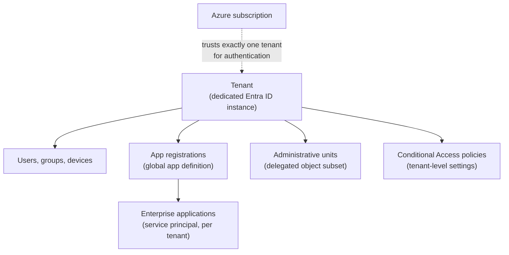
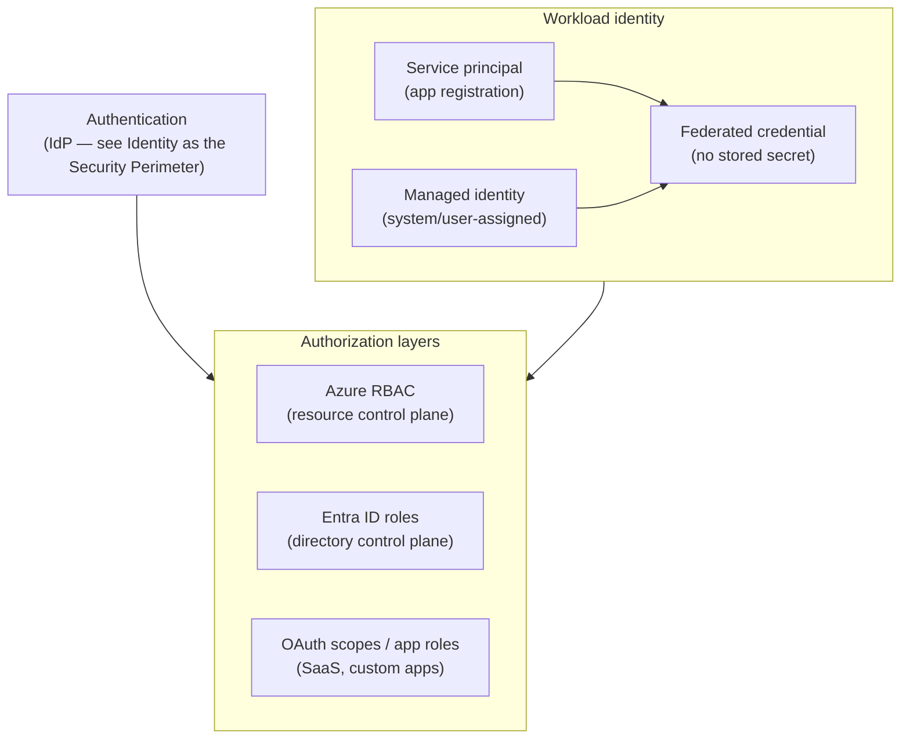
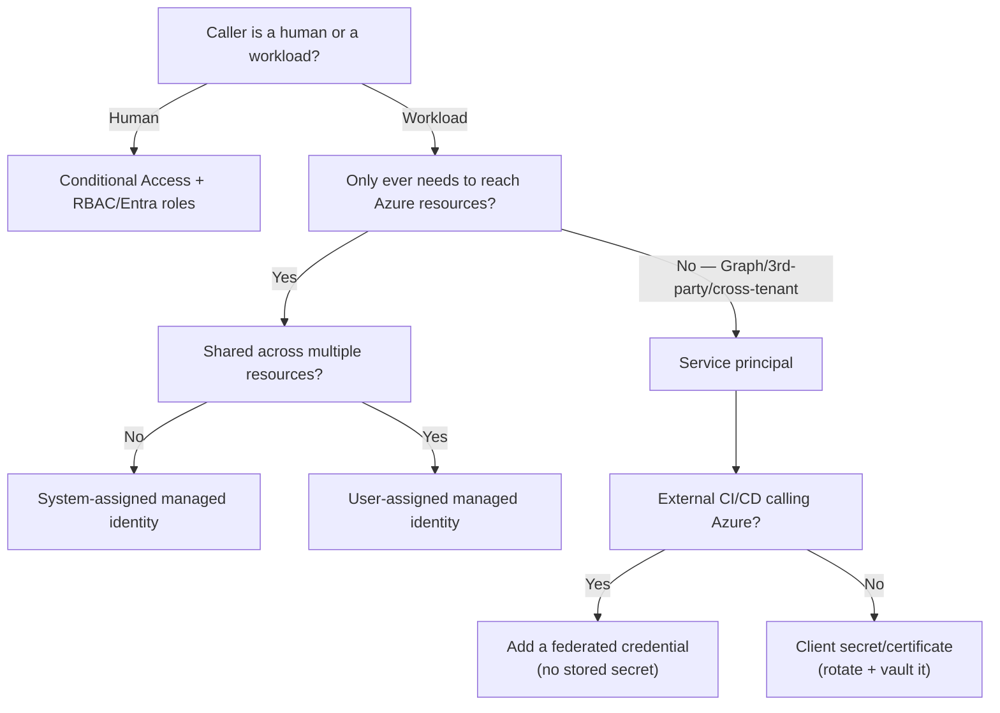

---
tags:
  - sc100
type: concept
domain:
  - ops-identity-compliance
  - apps-data
aliases:
  - IAM
---
# Identity and Access Management (IAM)

## Purpose

Architecting *authorization* — who can do what, once authenticated — across Azure RBAC, Entra ID roles, and workload identities, spanning SaaS/PaaS/IaaS and hybrid/multicloud. The counterpart to [[Identity as the Security Perimeter|IdP/authentication architecture]] and [[Conditional Access|sign-in policy]].

---

## Why Architects Choose It

- Authentication (who you are, via the IdP) and authorization (what you can do, via roles) are separate architectural layers — conflating them leaves over-scoped access even when sign-in is perfectly governed.
- Different resource types need different authorization mechanisms: Azure resources use Azure RBAC, the directory itself uses Entra ID roles, and SaaS/custom apps use OAuth scopes/app roles — one "identity strategy" has to span all three, not pick one.
- Workload identities (apps, scripts, pipelines) without managed identity end up with long-lived secrets in code or config — a common, avoidable breach vector. The architecture answer is eliminating stored credentials, not rotating them faster.
- Identity systems (AD DS, Entra Connect, domain controllers) are the #1 ransomware/lateral-movement priority (see [[Ransomware Resiliency and BCDR]]) — IAM hardening is the highest-priority control in that framework, not routine hygiene.

---

## Tenancy

A **tenant** is a dedicated, distinct instance of [[Entra ID]] that an organization or app developer receives at the start of its relationship with Microsoft — signing up for Azure, Microsoft 365, or Intune all provision (or attach to) one. Every authorization layer in this note operates *inside* a tenant boundary, not above it.

- **Distinct and separate by design** — each tenant has its own users, groups, devices, app registrations, and configuration. A role assignment, Conditional Access policy, or app registration in one tenant has zero effect in another.
- **What's scoped inside a tenant**: identity management (users/groups/devices), app registrations (the OAuth-scope/app-role layer from the Architecture diagram above), and Conditional Access itself — CA is a tenant-level setting, which is why "validate CA alignment with Zero Trust" is evaluated per tenant, not globally.
- **Directory objects** — every RBAC/Entra-role assignment in this note is a relationship between one of these principal objects, a role, and a scope: users, groups (security or Microsoft 365, assigned or dynamic-membership), devices, app registrations, enterprise applications, and administrative units.
- **App registration vs. enterprise application** — an app registration is the *global* definition of an application, owned in its home tenant; an enterprise application is the **service principal** — the local, tenant-specific instance of that app registration. A single multi-tenant app registration gets one enterprise application (service principal) per tenant it's consented into, each governable independently — the same "service principal" this note's Comparison table already covers, seen from the directory-object side.
- **Administrative units** scope delegated directory administration to a *subset* of users, groups, or devices (a department, a subsidiary) without granting a tenant-wide Entra ID role — the directory-object equivalent of Azure RBAC's narrowest-scope resource assignment.
- **Tenant vs. subscription** — a tenant is the identity/directory boundary; a subscription is the billing/resource boundary that trusts exactly one tenant at a time for authentication (subscriptions can be moved between tenants, but only belong to one at a time). Azure RBAC's management-group hierarchy nests *inside* a tenant's subscriptions — the tenant is the true outermost authorization boundary, above Azure RBAC and Entra ID roles alike.
- **Multi-tenant reality** (M&A, subsidiaries, sovereign/regulatory separation, dev/test isolation) creates the same governance problem "IdP consolidation" solves in [[Identity as the Security Perimeter]] — every extra tenant is a separate authorization boundary to administer, not just a separate IdP. Cross-tenant access settings and B2B (covered there) are the bridge *between* tenants; this note's RBAC/Entra-role scoping happens independently *within* each one.

---

## App Registration and API Permissions

The identity elements inside an app registration, and the permission model that governs what a registered app can actually do — the mechanics underneath the "app registration vs. enterprise application" distinction above.

- **Application (client) ID** — the globally unique ID for the app's *definition*, same value across every tenant it's registered/consented into.
- **Object ID** — the ID of the *directory object itself* (different value from the Application ID — a frequent exam trap; the app registration and its per-tenant enterprise application/service principal each have their own, separate Object ID).
- **Directory (tenant) ID** — which tenant the registration was created in — its home tenant.
- **Redirect URIs (reply URLs)** — pre-registered destinations the IdP is allowed to send the auth response to; not pre-registering (or over-broadly registering) these opens the door to token redirection attacks.
- **Certificates & secrets** — the credential material a confidential client presents to authenticate itself; a certificate is preferred over a client secret, and workload identity federation (see [[Identity and Access Management (IAM)|Comparison]] above) removes the need for either.
- **API permissions** — which permissions this app requests from other APIs (Microsoft Graph, a custom API), each either delegated or application (see below), subject to consent.
- **Expose an API** — the scopes *this* app itself defines, for other apps to request delegated/application permissions against.
- **App roles** — custom roles an app defines for its own authorization model, assignable to users/groups/other apps — an app-level authorization layer distinct from Azure RBAC or Entra ID roles.

### Application Permission vs. Delegated Permission

- **Delegated permission** — the app acts **as the signed-in user**, bounded by *both* the consented scope *and* whatever that user is actually allowed to do. A user with no mailbox access still can't be used to read mail through the app, even if `Mail.Read` (delegated) was consented — least privilege by construction. Requires an actual signed-in user (interactive sign-in, or on-behalf-of for a downstream call).
- **Application permission** — the app acts **as itself**, with no signed-in user, and the permission applies **tenant-wide** regardless of any individual user's own access. `Mail.Read` as an *application* permission means the app can read *any* mailbox in the tenant — a materially larger blast radius, not just a stricter version of the delegated case.
- **Consent**: low-privilege delegated permissions can sometimes be user-consented (subject to tenant consent policy); application permissions **always** require admin consent — no signed-in user exists to consent on their own behalf. Restricting risky user consent org-wide is covered in [[SaaS Application Discovery and Control|OAuth App Governance]], not repeated here.
- **Architecture decision**: default to delegated permissions wherever a human is actually present in the flow; reserve application permissions for genuine unattended/backend services, and scope them as narrowly as the task allows — an application permission is the identity equivalent of the "not just narrower RBAC scope" theme running through this whole note.

---

## When to Use

- An Azure-hosted app/script needs to authenticate to other Azure resources — **managed identity**, not a service principal with stored credentials.
- Non-human access that reaches Microsoft Graph, a third-party API, or crosses tenant boundaries — a **service principal** (app registration), since managed identity is scoped to Azure-resource-to-Azure-resource auth only.
- Scoping what an identity can manage on Azure resources — **Azure RBAC** at the narrowest sufficient scope (resource → resource group → subscription → management group).
- Scoping what an identity can do to the directory itself (create users, manage Conditional Access, assign roles) — **Entra ID roles**, not Azure RBAC.
- Removing plaintext secrets from CI/CD pipelines calling Azure (GitHub Actions, Kubernetes, another cloud) — **workload identity federation**, not a stored client secret.

---

## When NOT to Use

- Using a service principal with a client secret/certificate for something that only ever needs to reach Azure resources — that's exactly what managed identity replaces.
- Assigning Azure RBAC roles at subscription or management group scope when a resource-group or resource-level assignment would do — scope creep is standing, unreviewed excess access.
- Treating AD DS as safe to under-invest in "because we're moving to the cloud" — as long as it's synced to Entra ID, a compromised domain controller compromises the cloud identity too.

---

## Architecture

---

## Architecture Decisions

---

## Comparison

| Compare | Difference |
| --- | --- |
| Managed identity vs. service principal | A managed identity is auto-managed and tied to an Azure resource's lifecycle, with no credentials to store or rotate — usable only for Azure-resource-to-Azure-resource auth. A service principal is the identity behind any app registration, usable for Graph/third-party/cross-tenant scenarios, but needs a client secret or certificate unless paired with a federated credential. |
| System-assigned vs. user-assigned managed identity | System-assigned: 1:1 with a single resource, created and deleted with it — simplest, least reusable. User-assigned: a standalone resource, shareable across multiple compute resources — needed when several resources must present the same identity or the identity must outlive one resource. |
| Azure RBAC vs. Entra ID roles | Azure RBAC governs access to Azure resources (management group → subscription → resource group → resource scope); Entra ID roles govern the directory itself (users, groups, Conditional Access, licensing) at tenant/administrative-unit/object scope. Different control planes — assigning one doesn't grant the other. |
| Client secret/certificate vs. workload identity federation | A client secret/certificate is a stored, rotatable credential. Workload identity federation configures a service principal *or* a user-assigned managed identity to trust tokens from an external IdP (GitHub Actions, Kubernetes, another cloud), exchanging them for an Entra ID token with nothing stored at rest. |
| Application permission vs. delegated permission | Delegated: the app acts as the signed-in user, bounded by both the consented scope and that user's own access — smaller blast radius, requires a signed-in user. Application: the app acts as itself with no signed-in user, and the permission applies tenant-wide regardless of any individual user's access — larger blast radius, always requires admin consent. |

---

## AZ-500 Review

AZ-500 already covers configuring Azure RBAC role assignments, creating managed identities and service principals, and basic Entra ID role assignment. The SC-100 addition is the architecture-level decision layer: which identity type for which scenario, narrowest-scope RBAC design, eliminating stored secrets via federation, and treating AD DS hardening as a named, prioritized architecture concern rather than routine maintenance.

---

## What's New for SC-100

- Recommend managed identity — and workload identity federation for external CI/CD — as the default over service principals with stored secrets: an explicit "eliminate the credential" answer, not "rotate it more often."
- Separate authentication architecture ([[Identity as the Security Perimeter]]) from authorization architecture (this note) from sign-in policy ([[Conditional Access]]) — the exam tests these as distinct layers, not one "identity" bucket.
- Know Azure RBAC and Entra ID roles as two different control planes with two different scope hierarchies — a scenario granting "too much access" often stems from confusing the two.
- Treat AD DS hardening as tied directly to ransomware/BCDR priority (see [[Ransomware Resiliency and BCDR]]) — a named, prioritized IAM decision, not routine patching.
- Full privileged-access governance — [[PIM]], entitlement management, access reviews, the enterprise access model, CIEM — is the related but distinct "Securing privileged access" exam subsection; this note covers general IAM/authorization, not standing-privilege reduction.
- Treat the tenant as the outermost authorization boundary — Azure RBAC and Entra ID roles both operate *inside* one tenant; a multi-tenant estate is a governance decision (consolidate vs. deliberately separate), not just an IdP question.
- Treat application permissions as a blast-radius decision, not a stricter form of delegated permission — an application permission grants tenant-wide access regardless of any user's own scope, which is why it always requires admin consent.

---

## Exam Tips

- "App needs to read from a storage account" → managed identity, not a service principal with a stored key.
- "Multiple VMs/functions need to share the same identity" → user-assigned managed identity, not several system-assigned ones.
- "GitHub Actions pipeline deploys to Azure without storing a secret" → workload identity federation.
- A scenario granting directory-level power (creating users, managing Conditional Access) via an Azure RBAC role is a trap — that requires an Entra ID role instead.
- "A subscription needs to move between organizations/tenants" → re-associate it with the target tenant; RBAC assignments don't carry over and must be recreated, since they're scoped inside the original tenant.
- "An app needs to read any mailbox in the tenant, with no user signed in" → application permission (tenant-wide, admin-consent-only), not delegated.
- "An app should only ever see what the signed-in user can already see" → delegated permission — the correct least-privilege default when a human is present.
- A scenario confusing an app's **Application ID** with its **Object ID** is testing whether you know they're different values on the same app registration.

---

## Common Exam Confusion

- **Managed identity vs. service principal** — full breakdown above; pick based on whether the caller only ever talks to Azure resources.
- **Azure RBAC vs. Entra ID roles** — resource control plane vs. directory control plane.
- **App registration vs. enterprise application** — global app definition (home tenant) vs. its per-tenant service principal instance; a scenario "consenting" a multi-tenant app is creating an enterprise application, not a new app registration.
- **Client secret vs. federated credential** — a rotatable stored secret vs. no stored secret at all.
- **Tenant vs. subscription** — identity/directory boundary vs. billing/resource boundary; a subscription trusts one tenant, it isn't part of one.
- **Application permission vs. delegated permission** — acts as itself, tenant-wide vs. acts as the signed-in user, bounded by their access; full breakdown above.
- **Application (client) ID vs. Object ID** — the app's global definition ID vs. the directory object's own ID — different values, often assumed to be the same.

---

## Keywords

- Authentication vs. authorization
- Managed identity: system-assigned vs. user-assigned
- Service principal, app registration, client secret/certificate
- Workload identity federation, federated identity credential
- Azure RBAC (management group / subscription / resource group / resource scope)
- Entra ID roles (directory control plane)
- AD DS hardening, domain controller compromise
- Tenant, directory objects (users, groups, devices)
- App registration vs. enterprise application (service principal)
- Administrative units, delegated administration
- Application (client) ID, Object ID, Directory (tenant) ID
- Redirect URIs (reply URLs), certificates & secrets
- API permissions, Expose an API, app roles
- Application permission vs. delegated permission, admin consent vs. user consent

---

## Related Services

- [[Conditional Access]]
- [[Identity as the Security Perimeter]]
- [[Entra ID]]
- [[Key Vault]]
- [[Ransomware Resiliency and BCDR]]
- [[Zero Trust]]
- [[Securing IaaS and PaaS Services]]
- [[Data Classification and Protection]]
- [[Microsoft Defender XDR]]
- [[PIM]]
- [[Securing Privileged Access]]
- [[SaaS Application Discovery and Control]]
- [[Identity Protection]]

---

## References

- [Managed identities for Azure resources](https://learn.microsoft.com/en-us/entra/identity/managed-identities-azure-resources/overview) — Microsoft Learn
- [Workload identity federation](https://learn.microsoft.com/en-us/entra/workload-id/workload-identity-federation) — Microsoft Learn
- [Azure roles, Microsoft Entra roles, and classic subscription administrator roles](https://learn.microsoft.com/en-us/azure/role-based-access-control/rbac-and-directory-admin-roles) — Microsoft Learn
- [Permissions and consent in the Microsoft identity platform](https://learn.microsoft.com/en-us/entra/identity-platform/permissions-consent-overview) — Microsoft Learn
- (https://aka.ms/idplatform)
- [[Exam Objectives]]
