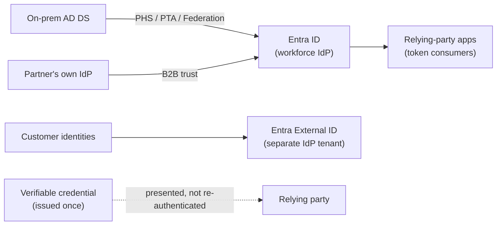
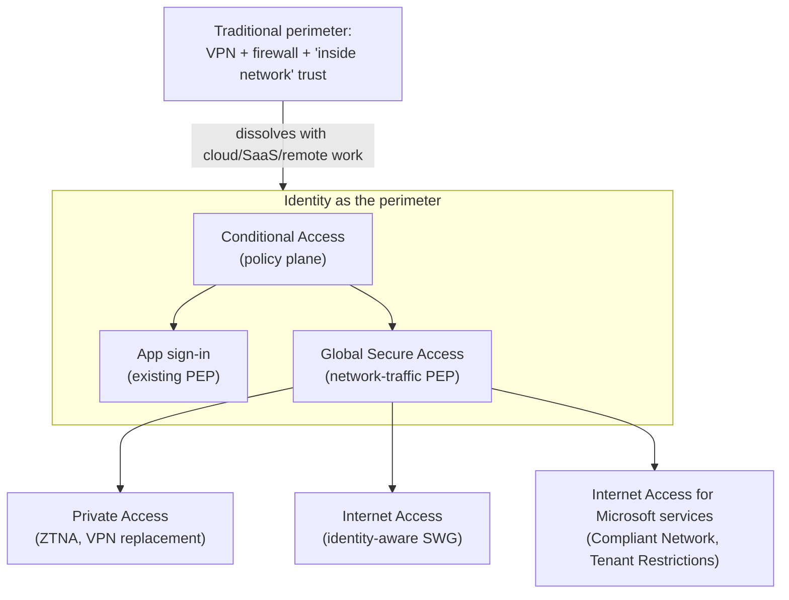
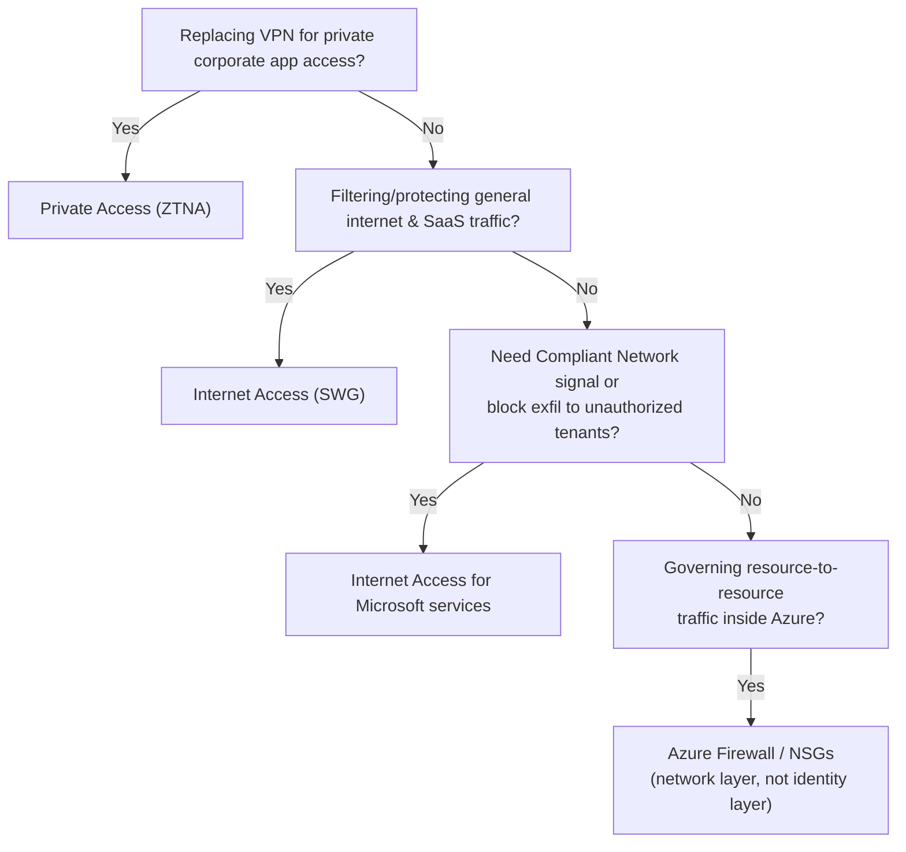

---
tags:
  - sc100
---
# Identity as the Security Perimeter

## Purpose

The architectural shift from a network-based security boundary to an identity-based one — and the concrete mechanism, Global Secure Access, that applies identity/device/risk signals to network traffic itself, not just application sign-in.

---

## Why Architects Choose It

- Cloud, SaaS, BYOD, and remote/hybrid work dissolved the "inside the corporate network = trusted" boundary that VPNs and firewalls were built to protect — see [[Zero Trust]] for the castle-and-moat comparison. Identity is the one signal present on every access path regardless of where the request originates.
- [[Conditional Access]] already acts as the identity control plane's policy enforcement point for application sign-in; **Global Secure Access** extends that same Conditional Access policy plane onto network traffic itself — one policy engine instead of a separate firewall/VPN policy set.
- Reduces standing network trust the same way [[PIM]] reduces standing privileged access — Private Access grants per-app, per-protocol access instead of a flat VPN tunnel into the whole network.
- Extends the "perimeter" concept to non-human identities: Conditional Access already reaches workload identities, and agent identities (see [[AI and Copilot Security Architecture]]) are the newest addition — the perimeter is *whoever or whatever is asking*, not where they're asking from.

---

## Identity Provider (IdP)

An IdP is the authoritative source that authenticates an identity and issues the signed token (SAML, OIDC, WS-Fed) a relying-party application trusts. It's the root of trust every control in this note depends on — Conditional Access and Global Secure Access only work because a trusted IdP vouches for who's asking. A weak or redundant IdP is a hole at the base of the "identity as the perimeter" model, not a detail to configure later.

- **[[Entra ID]] is Microsoft's cloud IdP** for the workforce tenant. Hybrid orgs feed it from on-prem AD DS via Entra Connect/Cloud Sync using one of three methods — **Password Hash Sync (PHS)**: cloud-only auth, most resilient to on-prem outage; **Pass-through Authentication (PTA)**: validates against on-prem AD DS per sign-in via an agent; **Federation (AD FS or third-party)**: delegates authentication entirely to an external IdP. AZ-500 covers configuring each; the SC-100 addition is *which to recommend* — Microsoft's guidance is to migrate off AD FS toward PHS/PTA plus cloud-native Conditional Access, since AD FS sits outside Entra ID's signal and policy surface.
- **External IdPs (B2B collaboration)** — a partner's own IdP authenticates their users directly ("bring your own identity"); Entra ID trusts the assertion instead of provisioning a duplicate guest account. [[Conditional Access]] and cross-tenant access settings govern how much that external IdP is trusted, closing the same gap a weak partner IdP would otherwise open.
- **Entra External ID** (the unified successor to Azure AD B2C) is a *separate* IdP tenant type for customer-facing apps — deliberately isolated from the workforce tenant so a customer-identity breach can't pivot into corporate access.
- **Decentralized identity (Verified ID)** inverts the model: the individual holds a cryptographically verifiable credential issued once, and presents it to relying parties without a live callback to the issuing IdP every time — removing the IdP itself as a single point of failure or tracking.
- **Architecture decision — IdP consolidation:** every additional IdP (a second AD forest, a lingering AD FS farm, an ungoverned B2C tenant) is a separate trust boundary — an attacker only needs to compromise the weakest one. Collapsing redundant IdPs into a single, centrally-governed Entra ID tenant (plus a deliberately isolated External ID tenant for customers) is the standard SC-100 recommendation over maintaining several.

---

## When to Use

- Replacing legacy VPN with per-app, Conditional-Access-governed remote access — Microsoft Entra **Private Access** (Zero Trust Network Access/ZTNA; **Quick Access** for IP/FQDN ranges without full per-app config).
- Applying identity-aware, risk-based filtering to general internet/SaaS traffic — Microsoft Entra **Internet Access** (cloud-delivered Secure Web Gateway: content/FQDN filtering, TLS inspection, threat intelligence).
- Hardening access to Microsoft services specifically — **Internet Access for Microsoft services**: the Compliant Network Conditional Access check, Universal Tenant Restrictions (blocks exfiltration to unauthorized/personal tenants), and sign-in log source IP restoration.
- Governing a SaaS session *after* sign-in rather than the network path to it — that's Defender for Cloud Apps (CASB), a companion to Global Secure Access, not a replacement; full discovery/control depth in [[SaaS Application Discovery and Control]].

---

## When NOT to Use

- Assuming Global Secure Access replaces [[Azure Firewall]]/NSGs outright — GSA governs user-to-resource (north-south) traffic; resource-to-resource (east-west) segmentation inside Azure still needs Azure Firewall/NSGs (see [[Securing IaaS and PaaS Services]]).
- Treating "Compliant Network" as the same signal as "Compliant Device" — Compliant Network confirms traffic passed through Global Secure Access; Compliant Device confirms Intune device posture. Requiring one doesn't imply the other.
- Rolling out Private Access on broad IP/FQDN ranges (Quick Access) as the permanent design — that recreates flat, VPN-style trust; per-app TCP/UDP access is the fuller Zero Trust answer.

---

## Architecture

---

## Architecture Decisions

---

## Comparison

| Compare | Difference |
| --- | --- |
| Private Access vs. traditional VPN | Private Access grants per-app/per-protocol access evaluated by Conditional Access on every request (ZTNA); VPN grants flat, standing network-layer access to everything behind the tunnel once connected. |
| Internet Access vs. Internet Access for Microsoft services | Internet Access is a general identity-aware SWG for all internet/SaaS destinations; Internet Access for Microsoft services is scoped to Microsoft traffic and adds the Compliant Network signal, Universal Tenant Restrictions, and sign-in log source IP restoration. |
| Compliant Network vs. Compliant Device (Conditional Access signals) | Compliant Network confirms the request traversed Global Secure Access; Compliant Device confirms Intune device posture — distinct signals, requirable independently or together. |
| Global Secure Access vs. Defender for Cloud Apps (CASB) | GSA controls the network path to a resource (pre-connection, identity-aware routing/filtering); Defender for Cloud Apps controls the SaaS session after sign-in (in-session policies, file inspection) — full CASB depth in [[SaaS Application Discovery and Control]]. Complementary layers. |
| Global Secure Access vs. Azure Firewall/NSGs | GSA governs user-to-resource (north-south) traffic via identity signals; Azure Firewall/NSGs govern resource-to-resource (east-west) traffic via network constructs — different traffic direction, different control plane. |

---

## AZ-500 Review

AZ-500 covers the network-perimeter tools this shift moves away from (Azure Firewall, NSGs, VPN Gateway, Private Link/Service Endpoints), plus configuring PHS, PTA, and AD FS federation individually. It does not cover Global Secure Access, Private Access, Internet Access, IdP consolidation strategy, or Entra External ID/Verified ID as distinct architecture decisions — all new for SC-100. Conditional Access fundamentals (grant/session controls) are assumed AZ-500 knowledge; extending Conditional Access to govern network traffic itself, and choosing/consolidating IdPs, are the SC-100 additions.

---

## What's New for SC-100

- Recognize **Global Secure Access** (Internet Access + Private Access) as the concrete product answer whenever a scenario frames "identity as the perimeter" or asks to replace VPN/legacy network trust.
- Know Private Access's **Quick Access** (IP/FQDN ranges) vs. **per-app TCP/UDP access** as two granularity levels — Quick Access is the faster migration path, per-app access is the fuller Zero Trust answer.
- Know the three-way split — Internet Access (all internet/SaaS), Internet Access for Microsoft services (Microsoft traffic + Compliant Network + Tenant Restrictions), Private Access (private corporate apps) — a common exam trap treats these as one product.
- Extend the "perimeter is identity" narrative to workload and agent identities — Conditional Access already reaches workload identities (see [[Conditional Access]]); Microsoft Entra Agent ID does the same for AI agents (see [[AI and Copilot Security Architecture]]).
- GSA is built on the same [[Zero Trust]] principles (verify explicitly, least privilege, assume breach) — treat it as Zero Trust's network pillar made concrete, not a separate framework.
- Treat the IdP itself as an architecture decision: recommend PHS/PTA over AD FS federation, consolidate redundant IdPs, and separate workforce (Entra ID) from customer (Entra External ID) identity by design.

---

## Exam Tips

- "Replace VPN with a Zero Trust, per-app access model" → Microsoft Entra Private Access, not a redesigned firewall/VPN gateway.
- "Require traffic to have passed through Global Secure Access before allowing sign-in" → Compliant Network condition, not Compliant Device.
- "Prevent users from signing in to an unauthorized or personal tenant" → Universal Tenant Restrictions, not Conditional Access alone.
- A scenario needing east-west (resource-to-resource) segmentation inside Azure still points to Azure Firewall/NSGs — GSA answers user-to-resource scenarios.
- "Reduce attack surface from legacy federation / multiple identity silos" → decommission AD FS and consolidate IdPs, not add more Conditional Access policies on top of the existing sprawl.
- "Let a partner's employees sign in with their own credentials without provisioning guest accounts manually" → B2B collaboration trusting the partner's IdP.

---

## Common Exam Confusion

- **Private Access vs. Internet Access** — private corporate apps (ZTNA/VPN replacement) vs. general internet/SaaS (SWG); both sit under Global Secure Access, easy to conflate.
- **Compliant Network vs. Compliant Device** — network path signal vs. device posture signal; see Comparison table.
- **Global Secure Access vs. Defender for Cloud Apps** — network path control vs. post-sign-in SaaS session control.
- **B2B collaboration vs. Entra External ID** — both are "external identity" features, but B2B trusts a partner's own IdP for *guest workforce* access to your apps; External ID is a *separate customer-facing* IdP tenant. Different audience, different tenant.
- **Federation (AD FS) vs. PHS/PTA** — AD FS delegates auth outside Entra ID's visibility; PHS/PTA keep authentication inside Entra ID's signal and policy surface. The SC-100 answer favors PHS/PTA.

---

## Keywords

- Security Service Edge (SSE), Global Secure Access
- Microsoft Entra Internet Access (SWG), Private Access (ZTNA)
- Internet Access for Microsoft services, Compliant Network
- Universal Tenant Restrictions, source IP restoration
- Quick Access vs. per-app TCP/UDP access
- VPN replacement, Zero Trust Network Access (ZTNA)
- Identity as the control plane / policy enforcement point
- Identity Provider (IdP), relying party, SAML / OIDC / WS-Fed
- Password Hash Sync (PHS), Pass-through Authentication (PTA), Federation (AD FS) decommissioning
- B2B collaboration (bring your own identity), cross-tenant access settings
- Entra External ID, decentralized identity, Verified ID
- IdP consolidation

---

## Related Services

- [[SaaS Application Discovery and Control]]

- [[Zero Trust]]
- [[Conditional Access]]
- [[PIM]]
- [[Identity Protection]]
- [[Azure Firewall]]
- [[AI and Copilot Security Architecture]]
- [[Entra ID]]
- [[Identity and Access Management (IAM)]]

---

## References

- [What is Global Secure Access?](https://learn.microsoft.com/en-us/entra/global-secure-access/overview-what-is-global-secure-access) — Microsoft Learn
- [[Exam Objectives]]
