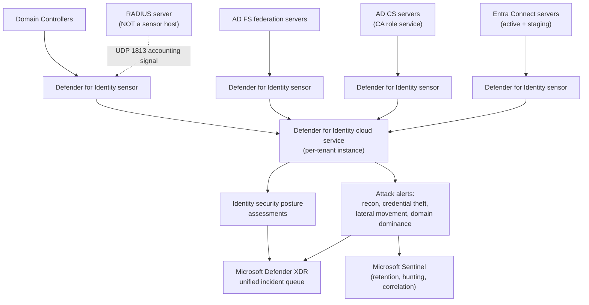
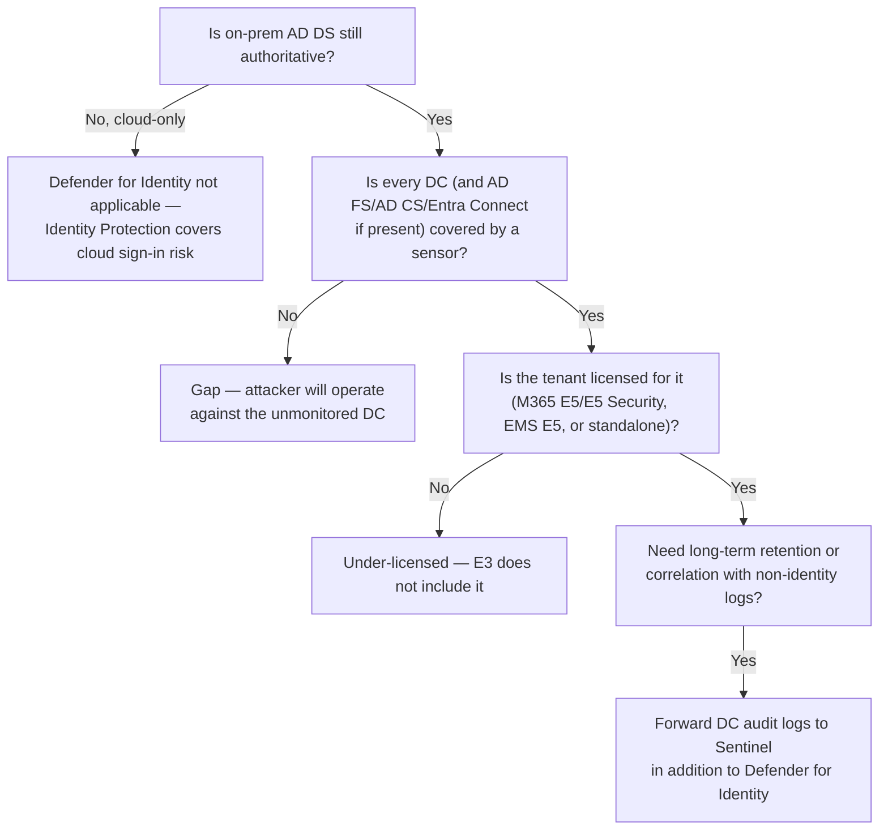

---
tags:
  - sc100
type: concept
domain:
  - ops-identity-compliance
aliases:
  - Defender for Identity
  - MDI
  - Azure ATP
  - Azure Advanced Threat Protection
status: needs-verification
---

# Microsoft Defender for Identity

## Purpose

Sensor-based detection service that watches on-premises **domain controller, AD FS, AD CS, and Microsoft Entra Connect** traffic and event logs directly on the server, correlating attacker behavior (reconnaissance, credential theft, lateral movement, domain dominance) into the [[Microsoft Defender XDR]] incident queue.

---

## Why Architects Choose It

- Cloud-native tools have a blind spot: [[Identity Protection]] scores risk on **Entra ID sign-ins**, [[Microsoft Sentinel]] correlates whatever logs you forward to it — neither natively understands Kerberos ticket abuse, LDAP reconnaissance, or NTLM relay the way a purpose-built AD sensor does. Defender for Identity closes that specific gap.
- It is the **detection half** of the AD DS hardening story: [[Securing Active Directory Domain Services (AD DS)]] specifies the preventive controls (tiering, PAWs, DC hardening); Defender for Identity is what tells you those controls were bypassed.
- Sensors run **directly on the monitored server** (domain controller, AD FS, AD CS, or Entra Connect) and read local network traffic and Windows Events — no SPAN/port-mirroring infrastructure to stand up, unlike the legacy on-prem SIEM agents architects may still expect.
- Because it plugs into the unified [[Microsoft Defender XDR]] queue, an identity alert automatically correlates with endpoint, email, and cloud-app signals from the same attack chain — architects don't stand up a separate identity SOC console.

---

## Prerequisites and Deployment

| Requirement | Detail |
| --- | --- |
| **Instance** | One Defender for Identity instance per Entra tenant, provisioned from the Defender portal. A single instance can ingest sensors from **multiple AD forests** — it is not limited to one forest. |
| **Sensor placement — the four supported server roles** | The sensor installs **directly on** the monitored server, one of exactly four roles: **domain controllers**, **AD FS** federation servers, **AD CS** servers, and **Microsoft Entra Connect** servers (both active *and* staging). It is **not** installed on a generic member server, and **not** on a RADIUS server — see Common Exam Confusion. |
| — AD FS detail | Supported only on the **federation servers**, not required on Web Application Proxy (WAP) servers. |
| — AD CS detail | Supported only on AD CS servers running the **Certification Authority role service**; not needed on offline AD CS servers. |
| — Entra Connect detail | Install on **both the active and staging** Entra Connect servers, not just the active one. |
| **Coverage** | Every domain controller (and every in-scope AD FS/AD CS/Entra Connect server) needs its own sensor — partial coverage leaves detection gaps for attacker paths through the unmonitored server. |
| **Sensor versions** | **Sensor v2.x** supports domain controllers on Windows Server 2016 or earlier, plus non-DC AD FS/AD CS/Entra Connect servers. **Sensor v3.x** is Microsoft's current recommendation for any server (DC or otherwise) on Windows Server 2019 or later. |
| **Sensor host specs** | 2 CPU cores, 6 GB RAM, 6 GB disk minimum (10 GB recommended) beyond what the OS/DC role already uses. Supports RODC. Desktop Experience and Server Core both supported; Nano Server is not. |
| **Software dependency** | **Npcap** (packet-capture driver) is installed by the sensor setup for local traffic capture — check for conflicts if Wireshark/WinPcap is already present. .NET Framework 4.7+ is installed automatically if missing (may require a reboot). |
| **Directory Service Account (DSA)** | The account the sensor uses to query AD — Microsoft's recommendation is a **group Managed Service Account (gMSA)**, not a static-password service account, consistent with the gMSA guidance in [[Securing Active Directory Domain Services (AD DS)]]. Minimum permissions: read access to directory objects (Domain Admin is *not* required and should be avoided). |
| **Roles/permissions to set up the instance** | Creating the Defender for Identity workspace needs an Entra tenant and a user with the **Security Administrator** Entra role. |
| **Network/connectivity** | Sensors need **outbound HTTPS (443)** to the workspace's own sensor API URL (`https://<workspace>sensorapi.atp.azure.com`) — via proxy, ExpressRoute, or firewall allow-list. Internally, sensors also use DNS (53), NTLM-over-RPC (135), NetBIOS (137), and RDP (3389, for name resolution) against other devices on the network, plus **inbound UDP 1813 from a RADIUS server** if RADIUS accounting is integrated — this is *the* mechanic behind the "RADIUS server" exam distractor: RADIUS sends signal *to* a sensor, it never hosts one. |
| **Licensing** | Requires **Microsoft Defender for Identity** — included in **Microsoft 365 E5 / A5 / G5**, **Microsoft 365 E5/A5/G5/F5 Security**, **Enterprise Mobility + Security E5**, or purchasable standalone; not included in E3. Full tier breakdown in [[Microsoft 365 Licensing]]. |
| **Time sync** | Servers and domain controllers running the sensor must have clocks synchronized within **5 minutes** of each other — Kerberos-based detections depend on it. |

---

## When to Use

- Any environment where on-prem AD DS remains authoritative — hybrid identity is the default assumption for SC-100.
- Detecting Kerberoasting, AS-REP roasting, pass-the-hash/pass-the-ticket, DCSync/DCShadow, golden/silver ticket use, and AD FS/AD CS-specific abuse (e.g., ADCS certificate template exploitation).
- Producing **identity security posture assessments** — prioritized recommendations (unsecure account attributes, legacy protocol usage, dormant privileged accounts, risky delegation, exposed credentials) that feed [[Security Posture Assessments|Secure Score]]-style remediation.
- Planting **honeytoken accounts** — decoy accounts with no legitimate use; any authentication attempt against one is a high-confidence compromise signal.

---

## When NOT to Use

- As a replacement for [[Identity Protection]] — that product scores **cloud sign-in/user risk** for Conditional Access; Defender for Identity has no visibility into cloud-only sign-ins.
- As a replacement for [[Microsoft Sentinel]] — Defender for Identity ships prebuilt AD-specific analytics but is not a general-purpose SIEM; long-term retention, custom hunting queries, and correlation with non-identity log sources still belong in Sentinel.
- On **Microsoft Entra Domain Services** — that's a Microsoft-managed domain; there's no DC to install a sensor on, and no Domain Admin-level attack surface to monitor the same way.
- Deployed on only some DCs as a cost-saving measure — partial sensor coverage materially weakens detection (an attacker simply operates against the unmonitored DC).

---

## Architecture

### Detection Categories

| Stage | Example detections |
| --- | --- |
| Reconnaissance | Account/SMB session enumeration, DNS reconnaissance, user and group membership enumeration |
| Compromised credential | Brute force, password spray, Kerberoasting, AS-REP roasting |
| Lateral movement | Pass-the-hash, pass-the-ticket, overpass-the-hash, remote code execution attempts |
| Domain dominance | DCSync, DCShadow, golden ticket, skeleton key, malicious replication, AD FS/AD CS abuse, [[AdminSDHolder and SDProp|AdminSDHolder]] tampering |

---

## Architecture Decisions

---

## Comparison

| Compare | Difference |
| --- | --- |
| Defender for Identity vs. [[Identity Protection]] | Defender for Identity detects attacks against **on-prem AD** (DC/AD FS/AD CS/Entra Connect sensors). Identity Protection scores **cloud sign-in and user risk** for Conditional Access. Different directories, complementary signals — both surface in Defender XDR. |
| Defender for Identity vs. [[Microsoft Sentinel]] | Defender for Identity is a purpose-built AD detection product with prebuilt analytics and its own alert logic. Sentinel ingests DC audit logs for long-term retention, custom hunting, and correlation with everything else in the environment. Use both, not one instead of the other. |
| Defender for Identity vs. Defender for Endpoint | Identity-plane attack detection from DC/AD FS/AD CS/Entra Connect sensors vs. endpoint EDR on workstations/servers — both feed the same [[Microsoft Defender XDR]] queue but cover different attack surfaces. |
| Sensor deployment vs. legacy SPAN/port-mirroring agents | The modern sensor installs directly on the monitored server and reads local traffic/events — no network tap or mirrored port required, unlike older on-prem monitoring architectures. |
| Sensor host vs. RADIUS server | The sensor is **installed on** a DC/AD FS/AD CS/Entra Connect server. A RADIUS server is never a sensor host — it's a network access control (NAC) component that, if integrated, *sends* accounting signal (UDP 1813) to a sensor running elsewhere. Confusing "sends data to a sensor" with "is a valid sensor host" is the exact trap in this exam topic. |
| Sensor v2.x vs. v3.x | v2.x is what's documented for domain controllers on Server 2016 or earlier and for non-DC AD FS/AD CS/Entra Connect servers. v3.x is Microsoft's current recommendation for any of those roles on Server 2019+. Not a capability difference an architect chooses between freely — it follows the OS version. |

---

## AZ-500 Review

AZ-500 covers *enabling* Defender for Identity at a configuration level — installing the sensor, basic alert triage. It does not cover sensor architecture (DSA/gMSA sizing, multi-forest instance design), identity security posture assessments as a remediation source, or honeytoken account strategy — all new for SC-100, alongside placing Defender for Identity correctly inside the broader Defender XDR/Sentinel detection architecture.

---

## What's New for SC-100

- Treat Defender for Identity as the **identity-plane sensor** in a layered detection architecture — paired with Identity Protection (cloud sign-in risk) and Sentinel (retention/correlation), not a standalone product decision.
- Size the **Directory Service Account** as a gMSA with least-privilege read access, consistent with the service-account hardening pattern in [[Securing Active Directory Domain Services (AD DS)]] — not a shortcut Domain Admin account.
- Use **identity security posture assessments** as an architecture input for prioritizing AD DS remediation work, not only as a passive report.
- Recognize the **licensing gate** (E5/EMS E5/standalone, not E3) as a sizing decision in any hybrid identity design.

---

## Exam Tips

- "Detect Kerberoasting / pass-the-hash / golden ticket / DCSync on-prem" → **Defender for Identity**, not Entra ID Protection and not Defender for Endpoint.
- "Some DCs are covered, some aren't, and lateral movement wasn't detected" → the answer is **incomplete sensor coverage**, not a product failure.
- A scenario naming a service account with a static password used by the AD sensor is under-hardened — the correct recommendation is a **gMSA**.
- A tenant on **Microsoft 365 E3** asking for Defender for Identity is under-licensed — needs E5/E5 Security, EMS E5, or the standalone SKU.
- Decoy account triggering an alert the moment it's touched → **honeytoken account**, not a real user risk detection.
- "Which servers can the sensor be directly installed on?" → **domain controllers, AD FS (federation servers), AD CS (with CA role service), and Microsoft Entra Connect (active + staging)**. A generic non-DC Windows Server and a RADIUS server are both wrong answers — RADIUS only sends accounting signal *to* a sensor, it never hosts one.
- Don't overthink "AD FS environments" scenarios — sensors go on the **federation servers**, explicitly *not* required on WAP servers.

---

## Common Exam Confusion

- **Defender for Identity vs. Identity Protection** — on-prem AD attack detection vs. cloud sign-in/user risk scoring; see full row above.
- **Defender for Identity vs. Sentinel** — purpose-built AD analytics vs. general SIEM retention/correlation; complementary, not competing.
- **Defender for Identity vs. AD DS hardening itself** — Defender for Identity *detects* attacks; [[Securing Active Directory Domain Services (AD DS)]] *prevents* them by reducing the attack surface in the first place.
- **Sensor on AD DS vs. Microsoft Entra Domain Services** — there is no equivalent sensor deployment on Entra Domain Services; you don't own the DCs.
- **Valid sensor hosts vs. RADIUS server** — DC/AD FS/AD CS/Entra Connect are valid sensor hosts; a RADIUS server is a signal *source* (NAC accounting data over UDP 1813) that a sensor elsewhere consumes, never a host itself.
- **AD FS federation server vs. WAP server** — sensors are required on the federation server, not on the Web Application Proxy in front of it.

---

## Keywords

- Defender for Identity sensor, Directory Service Account (DSA), gMSA
- Npcap, per-tenant instance, multi-forest support
- Identity security posture assessments
- Honeytoken account
- Reconnaissance, compromised credential, lateral movement, domain dominance
- Kerberoasting, AS-REP roasting, pass-the-hash, pass-the-ticket, DCSync, DCShadow, golden ticket, skeleton key
- AD FS (federation servers) / AD CS (CA role service) / Microsoft Entra Connect (active + staging) sensor coverage
- RADIUS server is NOT a sensor host — UDP 1813 accounting signal only
- Sensor v2.x (Server 2016-) vs. v3.x (Server 2019+, current recommendation)
- Security Administrator role (workspace creation)
- Microsoft 365 E5 / E5 Security / EMS E5 licensing gate
- Legacy alias: Azure ATP (Azure Advanced Threat Protection)

---

## Related Services

- [[Securing Active Directory Domain Services (AD DS)]]
- [[Identity Protection]]
- [[Microsoft Sentinel]]
- [[Microsoft Defender XDR]]
- [[Microsoft Defender]]
- [[AdminSDHolder and SDProp]]
- [[Privileged Access Tier Models]]
- [[Securing Privileged Access]]
- [[Entra ID]]
- [[Microsoft 365 Licensing]]
- [[Zero Trust]]

---

## References

- [What is Microsoft Defender for Identity?](https://learn.microsoft.com/en-us/defender-for-identity/what-is) — Microsoft Learn
- [Defender for Identity sensor v2.x prerequisites](https://learn.microsoft.com/en-us/defender-for-identity/deploy/prerequisites-sensor-version-2) — Microsoft Learn
- [Configure the Directory Service account](https://learn.microsoft.com/en-us/defender-for-identity/directory-service-accounts) — Microsoft Learn
- [Microsoft Defender for Identity architecture](https://learn.microsoft.com/en-us/defender-for-identity/architecture) — Microsoft Learn
- [[Exam Objectives]]

---

## Verification Flag

Sensor version numbering (v2.x vs. v3.x), exact port/connectivity lists, and licensing SKU mapping change periodically as Microsoft revises the product. Re-verify prerequisites and the current licensing table against Microsoft Learn close to exam date.
