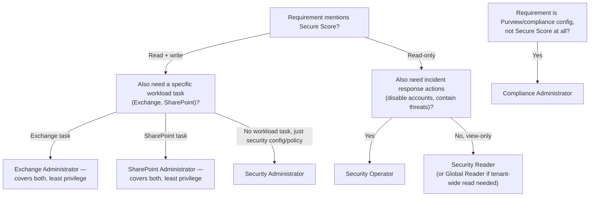

---
tags:
  - sc100
type: concept
domain:
  - ops-identity-compliance
aliases:
  - Entra built-in roles
  - Entra ID role comparison
  - Least privilege role selection
status: needs-verification
---

# Microsoft Entra Built-in Roles

## Purpose

Choosing the correct **least-privilege** built-in Entra role when several similar-sounding roles could technically satisfy a scenario's requirements — the recurring SC-100 exam pattern where the "obviously named" role is wrong because its actual scope is broader or narrower than its name suggests.

---

## Why Architects Choose It

- Least-privilege questions aren't testing whether you can find *a* role that works — every scenario has one that technically works and is over-scoped (often Global Administrator). They test whether you know a role's **exact boundary**, including the parts its name doesn't hint at.
- Two failure modes recur constantly: a role **reaches further than its name implies** (Exchange Administrator can read/write Microsoft Secure Score — a "security" surface, not an Exchange one), and a role **doesn't reach as far as its name implies** (Security Administrator cannot manage a user's Exchange mail alias — a workload-specific task "security config" doesn't cover).
- [[Identity and Access Management (IAM)]] already covers Azure RBAC vs. Entra ID roles as two control planes; this note is the detail layer *inside* the Entra ID roles plane — which specific built-in role, not which plane.
- [[PIM]] governs *when* a role is active; this note governs *which* role to assign in the first place — get the role wrong and JIT activation just delivers the wrong permissions on a timer.

---

## The Methodology: How to Answer These Questions

1. **List every stated requirement literally** — don't paraphrase "manage security" into "Security Administrator" before checking what the requirement actually is (view-only? write? a specific workload like Exchange or SharePoint?).
2. **Check whether a workload-specific role already satisfies a "security" requirement** — Exchange Administrator and SharePoint Administrator both have Secure Score read/write, despite not being named "Security" anything. This is the single most-tested surprise in this area.
3. **Check whether a "security" role actually reaches the specific workload task** — Security Administrator does not manage Exchange recipients/aliases, SharePoint sites, or Teams settings; it manages security *configuration and reporting*, not workload administration.
4. **Reject any role that grants MORE than what's asked**, even if it also satisfies the requirement — Global Administrator, Security Operator (adds incident-response actions), and Security Administrator (adds broader write access) are common "technically works, but not least privilege" distractors.
5. **Prefer the narrowest role that satisfies every stated requirement, and no requirement is left unsatisfied.**

---

## Worked Scenario 1: Support Team Role Assignment

Three new support users, each with two stated requirements; assign least-privilege roles.

| User | Requirements | Correct role | Why the obvious alternatives fail |
| --- | --- | --- | --- |
| **SupportUserA** | Read/write Microsoft Secure Score; create policies in the Microsoft Defender portal | **Security Administrator** | Global Administrator satisfies it but is over-scoped. **Exchange Administrator** gives Secure Score read/write but **not** Defender portal policy creation. **User Administrator** gives only *read* access to Secure Score. |
| **SupportUserB** | Read-only Microsoft Secure Score (no changes); view the Microsoft Purview dashboard | **Security Reader** | **User Administrator** gives Secure Score access but not the Purview dashboard, and adds unrelated Entra ID object management — not least privilege. **Security Operator** satisfies both but adds the ability to respond to security threat alerts — extra capability, not least privilege. **Security Administrator** satisfies both but grants read/**write**, not the required read-only. |
| **SupportUserC** | Manage users' email aliases; read/write Microsoft Secure Score | **Exchange Administrator** | **SharePoint Administrator** grants Secure Score read/write but **not** email alias management — and fully manages SharePoint Online, which isn't needed at all. **Security Administrator** grants Secure Score read/write but **not** email alias management. **Global Administrator** satisfies both but isn't least privilege. |

The load-bearing fact behind all three: **Security Administrator, Exchange Administrator, and SharePoint Administrator all have identical Secure Score read/write access** — full mechanics and the permission source in [[Secure Score Mechanics]]. Once you know that, "which role also does X" becomes the actual discriminator, not "which role sounds most like Secure Score."

---

## Built-in Role Reference (Security- and Compliance-Adjacent Roles)

| Role | Core scope | Secure Score access | Notable reach (or lack of it) |
| --- | --- | --- | --- |
| **Global Administrator** | Everything in Entra ID and every connected Microsoft service | Read/write | The default over-scoped wrong answer in nearly every least-privilege scenario — technically satisfies almost any requirement. |
| **Security Administrator** | Read security info/reports; **manage security configuration** in Entra ID and Microsoft 365 (Defender portal policies, Identity Protection, Conditional Access-adjacent security settings) | **Read/write** | Does **not** manage workload-specific admin tasks — no Exchange mailbox/alias management, no SharePoint site management. |
| **Security Reader** | Read-only security info/reports across Entra ID and Microsoft 365 | **Read-only** | No configuration changes anywhere; the correct answer whenever a requirement explicitly says "should not be able to make any changes." |
| **Security Operator** | Create/manage security events; perform **identity containment actions** during incidents (e.g., disable a compromised account) | Read-only | A step beyond Security Reader — adds active incident-response capability, which makes it *over*-scoped whenever a scenario only asks for read access. |
| **Exchange Administrator** | Manage **all aspects of Exchange** — mailboxes, mail flow, **recipient/alias management** | **Read/write** | Reaches into Secure Score despite the name suggesting a purely Exchange-scoped role — the classic trap. |
| **SharePoint Administrator** | Manage all aspects of SharePoint Online (and OneDrive) | **Read/write** | Same Secure Score reach as Exchange Administrator and Security Administrator — but no Exchange or directory-object management. |
| **User Administrator** | Manage users and groups — create/delete/reset passwords, licenses, group membership | **Read-only** | Broad object-management power, but explicitly **not** Exchange-specific (no alias/mailbox management) and only read access to Secure Score. |
| **Compliance Administrator** | Read/manage **compliance configuration and reports** in Entra ID and Microsoft 365 (Purview-facing) | Not part of the Secure Score list | The correct answer when a requirement is about Purview/compliance configuration specifically, not security posture scoring. |
| **Global Reader** | Read everything a Global Administrator can — no updates anywhere | **Read-only** | The read-only mirror of Global Administrator; correct only when a scenario needs *broad* visibility with zero write access across the whole tenant. |
| **Helpdesk Administrator** | Reset passwords and manage support tasks for non-admin and some admin users | **Read-only** | Narrow, mostly password-reset-scoped; included in the Secure Score read-only list but rarely the right choice unless password reset is the actual stated task. |
| **Service Support Administrator** | Open and manage support tickets, view service health | **Read-only** | Narrow, service-health-scoped. |

---

## Architecture Decisions

---

## Comparison

| Compare | Difference |
| --- | --- |
| Security Administrator vs. Exchange/SharePoint Administrator (for Secure Score) | All three grant identical Secure Score read/write. Security Administrator additionally covers general security config/Defender portal policy creation; Exchange/SharePoint Administrator additionally cover their respective workload's full administration — pick based on the *other* stated requirement, not the Secure Score requirement alone. |
| Security Reader vs. Security Operator | Both read-only on Secure Score and security reports. Security Operator adds active identity containment/incident-response actions — only correct when the scenario asks for that capability. |
| Security Administrator vs. Compliance Administrator | Security Administrator manages security configuration/posture (Defender portal, Secure Score). Compliance Administrator manages compliance configuration/reports (Purview-facing) — different portals, different concerns, easy to conflate because both sound like "the security/compliance role." |
| User Administrator vs. Exchange Administrator (for a user's mail attributes) | User Administrator manages directory-object properties broadly (password, license, group membership) but not Exchange-specific recipient/alias settings. Exchange Administrator owns the mail-specific configuration layer — a user's email alias is an Exchange object, not a generic directory property, for role-assignment purposes. |
| Global Administrator vs. any scoped role | Global Administrator always technically satisfies any requirement — which is exactly why it's the default wrong answer whenever the question says "following the principle of least privilege." |

---

## AZ-500 Review

AZ-500 covers assigning built-in Entra roles and understanding RBAC basics at a configuration level. It does not test the specific cross-workload permission overlaps this note covers (Exchange/SharePoint Administrator's Secure Score reach, Security Administrator's workload boundaries) — that granular least-privilege role selection is new, heavily-tested SC-100 territory.

---

## What's New for SC-100

- Treat "least privilege role assignment" scenarios as a two-step check: does the obvious role cover *everything* asked, and does it grant *nothing extra* — both conditions must hold.
- Memorize the Secure Score read/write list (Security Administrator, Exchange Administrator, SharePoint Administrator) as a named fact, not something to infer from role names.
- Recognize Global Administrator, Security Operator, and Security Administrator as the three most common "technically works but not least privilege" distractors.

---

## Exam Tips

- Whenever a scenario states "following the principle of least privilege," immediately eliminate Global Administrator unless every other option demonstrably fails a stated requirement.
- A workload-named role (Exchange Administrator, SharePoint Administrator) satisfying a "security"-sounding requirement (Secure Score) is not a trick — it's a documented, tested fact. Don't second-guess it toward Security Administrator by default.
- "Should not be able to make any changes" → the read-only counterpart role (Security Reader over Security Administrator/Security Operator; Global Reader over Global Administrator).
- A role that grants an *extra* capability beyond what's asked (Security Operator's incident response, Security Administrator's write access when only read was needed) is the wrong answer even if it also satisfies the stated requirement.
- "Manage a user's email alias" → Exchange Administrator, not User Administrator and not Security Administrator.

---

## Common Exam Confusion

- **Security Administrator vs. Exchange/SharePoint Administrator** — all three share identical Secure Score read/write; the differentiator is the *other* stated requirement.
- **Security Reader vs. Security Operator** — read-only visibility vs. read-only plus active incident-containment actions.
- **Security Administrator vs. Compliance Administrator** — security posture/Defender portal vs. compliance configuration/Purview.
- **User Administrator vs. Exchange Administrator** — general directory-object management vs. Exchange-specific mail configuration.

---

## Keywords

- Least privilege role selection
- Global Administrator, Security Administrator, Security Reader, Security Operator
- Exchange Administrator, SharePoint Administrator, User Administrator, Compliance Administrator, Global Reader
- Helpdesk Administrator, Service Support Administrator
- Secure Score read/write roles vs. read-only roles
- Identity containment actions (Security Operator)
- Workload-specific role reach vs. security-named role boundary

---

## Related Services

- [[Secure Score Mechanics]]
- [[Identity and Access Management (IAM)]]
- [[PIM]]
- [[Securing Privileged Access]]
- [[Entra ID]]
- [[Purview]]
- [[Microsoft Defender XDR]]
- [[Exam Objectives]]

---

## References

- [Microsoft Entra built-in roles](https://learn.microsoft.com/en-us/entra/identity/role-based-access-control/permissions-reference) — Microsoft Learn
- [Microsoft Secure Score — permissions](https://learn.microsoft.com/en-us/defender-xdr/microsoft-secure-score) — Microsoft Learn
- [[Exam Objectives]]

---

## Verification Flag

The Secure Score role-permission list (which roles get read/write vs. read-only) and the ongoing migration to Defender Unified RBAC for Secure Score access are both areas Microsoft is actively changing — re-verify the exact role list and whether GraphAPI-based Secure Score access has moved off the legacy Entra-role model before relying on it close to exam date.
