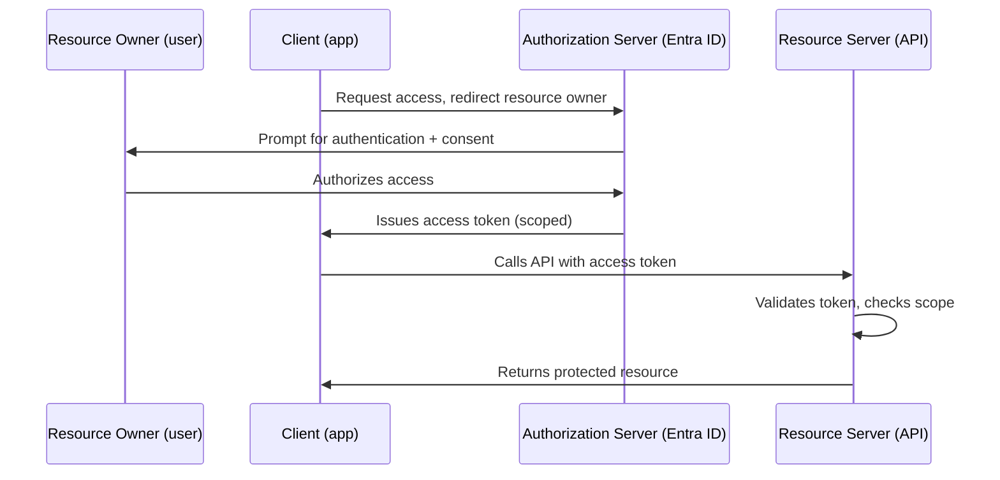
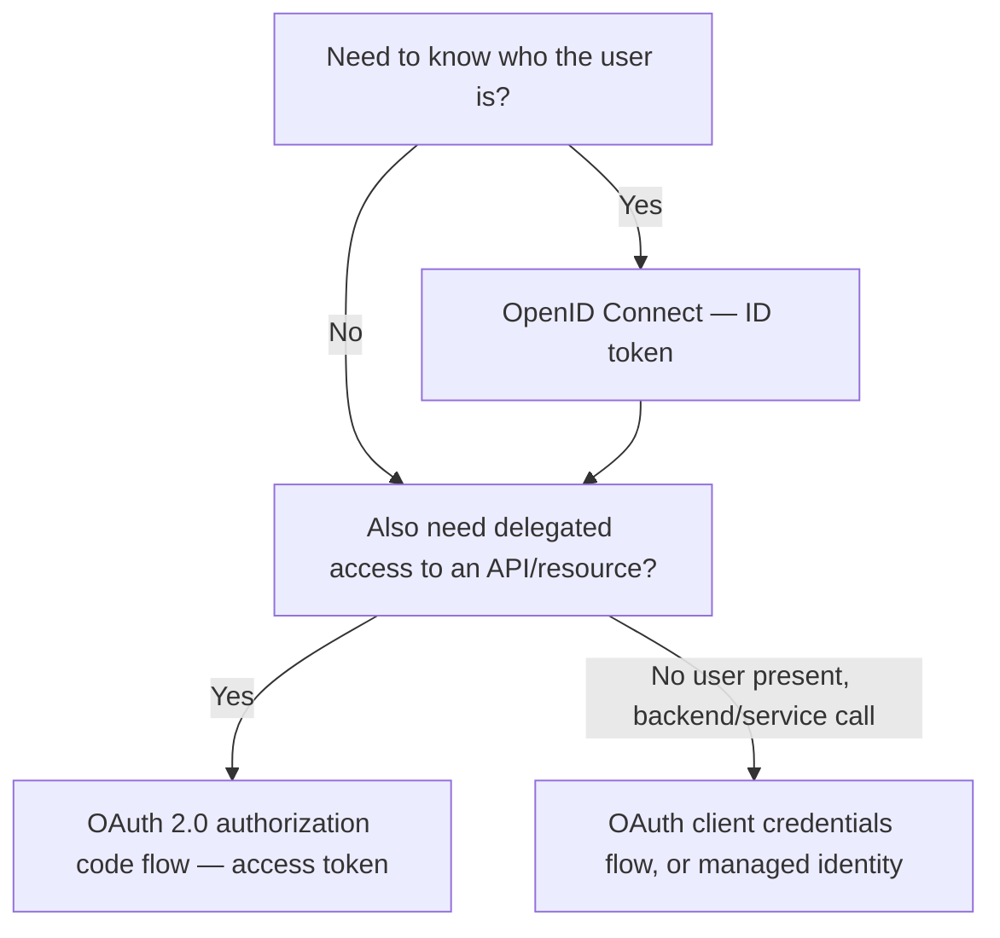

---
tags:
  - sc100
type: concept
domain:
  - ops-identity-compliance
  - apps-data
aliases:
  - OAuth 2.0
  - OIDC
  - OpenID Connect
  - OAuth roles
  - authorization code flow
---

# OAuth 2.0 and OpenID Connect

## Purpose

The four-party OAuth 2.0 delegation model (authorization server, client, resource owner, resource server) and how OpenID Connect layers authentication on top of it — the recurring "match the role to the process" exam pattern for centralizing custom-app auth on Entra ID.

---

## Why Architects Choose It

- Recommending "deploy Entra ID, implement OAuth 2.0" is only an architecture if you can name **which component performs which process** — the exam tests the role model directly, not just the recommendation to use OAuth.
- OAuth 2.0 is **authorization only** — it governs delegated access to a resource, not who the user is. Bolting "authentication" onto raw OAuth without OIDC is a common architectural mistake the exam expects you to catch.
- Centralizing auth away from individually-maintained app databases (the classic "customer mobile app" scenario) is a Zero Trust move — one verified identity plane instead of N app-specific credential stores, consistent with [[Identity and Access Management (IAM)]].
- The delegated vs. application permission model in [[Identity and Access Management (IAM)]] is what the **client** ends up holding after this flow completes — this note is the protocol mechanics that produce that token; IAM is what you do with it afterward.

---

## When to Use

- Centralizing authentication/authorization for custom-built apps (mobile, SPA, web) currently using per-app credential stores.
- Granting a third-party or first-party app scoped, delegated access to a protected API without sharing the user's password.
- Any exam scenario that names the four OAuth parties and asks which does what.

---

## When NOT to Use

- Pure authentication with no delegated resource access — OIDC alone (or just Entra ID sign-in) is sufficient; don't reach for full OAuth scope negotiation if nothing downstream needs delegated API access.
- Machine-to-machine calls with no user present — see the client credentials flow and managed identity, not the authorization code flow below.
- As a substitute for knowing SAML — legacy/enterprise SSO scenarios may still expect SAML; OAuth/OIDC is the modern federated answer, not the only one ([[Entra ID]]).

---

## The Four OAuth 2.0 Roles

| Role | Process it performs |
| --- | --- |
| **Resource owner** | **Authorizes** access to a protected resource. Typically the end user — prompted to consent when an app wants to act on their behalf. |
| **Client** | **Requests** access to a protected resource. The application itself (web app or web API) — e.g., the calendar app wanting a user's calendar data. |
| **Authorization server** | **Gives scoped access** to a protected resource. Authenticates the resource owner, validates the request, and issues a token to the client. Entra ID plays this role. |
| **Resource server** | **Uses access tokens to accept requests.** Hosts the protected resource (the API/data) and validates the token before serving the request. |

**Memory hook** — read the names literally: the *owner* owns/authorizes, the *client* is the app asking, the *authorization* server does the authorizing work and issues the token, the *resource* server hosts the resource the token is for.

---

## Architecture

---

## OAuth 2.0 vs. OpenID Connect (OIDC)

- **OAuth 2.0** answers *"what is this client allowed to do?"* — delegated authorization, expressed as scopes, resulting in an **access token**.
- **OIDC** is a thin identity layer **on top of** OAuth 2.0, adding authentication — *"who is this user?"* — expressed as an **ID token** (a JWT with claims about the signed-in user).
- A modern sign-in flow typically requests both: an ID token (OIDC, who signed in) and an access token (OAuth, what the app can call next) in the same round trip.
- Architecture decision: if the requirement is only "centralize authentication," OIDC alone covers it; the moment the app needs to call a protected API on the user's behalf, you need OAuth scopes too — which is why the exam scenario says "authentication **and** authorization."

---

## Architecture Decisions

---

## AZ-500 Review

AZ-500 covers configuring app registrations, API permissions (delegated vs. application), and consent in Entra ID at the admin-console level. It does not name or test the four OAuth **roles** as protocol actors — that mapping (resource owner / client / authorization server / resource server) is SC-100 design-level knowledge, needed to justify the architecture recommendation itself, not just to click through the portal.

---

## What's New for SC-100

- Map a scenario's actors (customer, mobile app, Entra ID, backend API) onto the four formal OAuth roles — this is a named exam question pattern (drag/drop or dropdown matching).
- Justify **why** OAuth 2.0 + Entra ID is the recommended design for centralizing auth away from per-app databases — one authorization server, consistent token validation, no distributed credential stores.
- Distinguish which protocol produces which token (OIDC → ID token / authentication, OAuth → access token / authorization) when a scenario asks for "authentication and authorization" together.

---

## Exam Tips

- If a scenario gives you the **process** and asks for the **role name**, or vice versa, use the literal reading: authorizes → resource owner; requests → client; issues scoped access → authorization server; accepts requests with the token → resource server.
- "The client requests access" is the most commonly mis-mapped role — students often guess the client authorizes access (that's the resource owner).
- "Gives scoped access" is the authorization server, not the resource server — the resource server *consumes* the token, it doesn't issue it.
- Entra ID is always the authorization server in these scenarios; the custom mobile/web app is always the client.

---

## Common Exam Confusion

| Compare | Difference |
| --- | --- |
| **OAuth 2.0 vs. OpenID Connect** | OAuth = delegated authorization (access token, scopes). OIDC = authentication layer on top of OAuth (ID token, who the user is). |
| **Resource owner vs. client** | Resource owner *authorizes* (the human). Client *requests* (the app). Easy to swap under exam time pressure. |
| **Authorization server vs. resource server** | Authorization server *issues* the token (Entra ID). Resource server *validates and accepts* the token (the API). |
| **Delegated permission vs. application permission** | What the client ends up holding after this flow — delegated acts as the signed-in resource owner; application acts as itself, tenant-wide. Full comparison in [[Identity and Access Management (IAM)]]. |
| **OAuth vs. SAML** | OAuth/OIDC is token(JWT)-based and API-friendly; SAML is XML-assertion-based and browser-SSO-oriented. Legacy enterprise apps may still require SAML. |

---

## Keywords

- Resource owner, client, authorization server, resource server
- Access token, ID token, scope, consent
- Authorization code flow, client credentials flow
- OpenID Connect (OIDC) vs. OAuth 2.0
- Delegated permission vs. application permission
- Centralizing authentication and authorization

---

## Related Services

- [[Entra ID]]
- [[Identity and Access Management (IAM)]]
- [[Conditional Access]]
- [[API Management and Security]]
- [[SaaS Application Discovery and Control]]
- [[Identity as the Security Perimeter]]
- [[Microsoft Entra Built-in Roles]]

---

## References

- [OAuth 2.0 and OpenID Connect (OIDC) in the Microsoft identity platform](https://learn.microsoft.com/en-us/entra/identity-platform/v2-protocols) — Microsoft Learn
- [Authentication vs. authorization](https://learn.microsoft.com/en-us/entra/identity-platform/authentication-vs-authorization) — Microsoft Learn
- [Microsoft identity platform and OAuth 2.0 authorization code flow](https://learn.microsoft.com/en-us/entra/identity-platform/v2-oauth2-auth-code-flow) — Microsoft Learn
