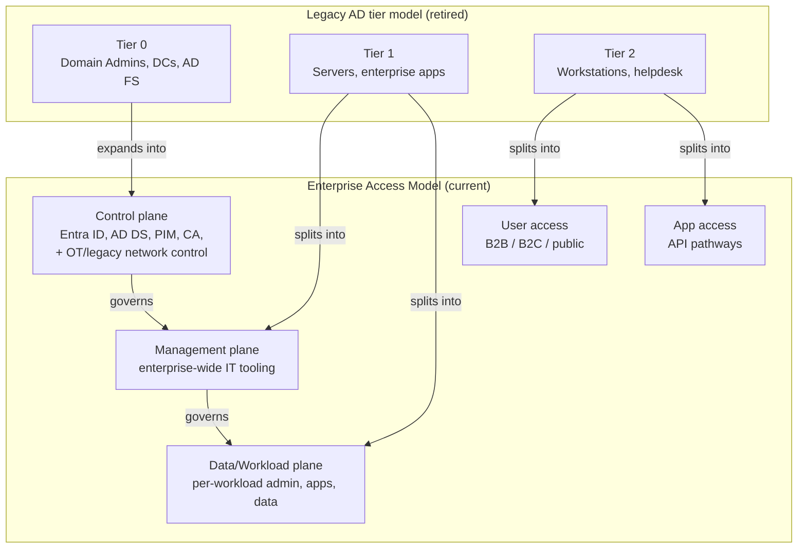
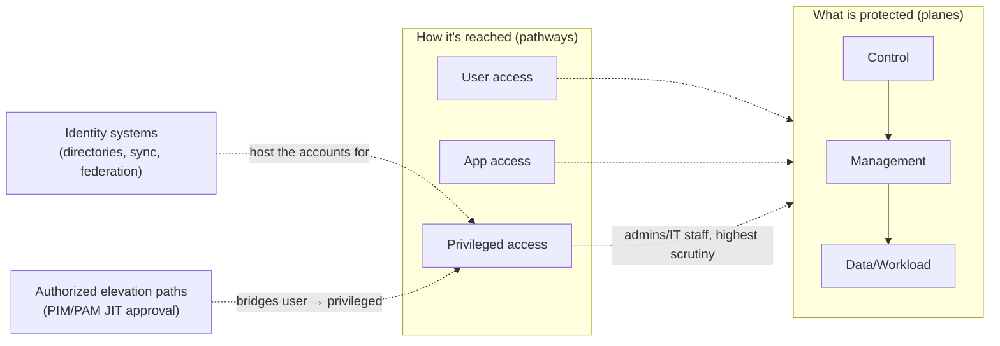
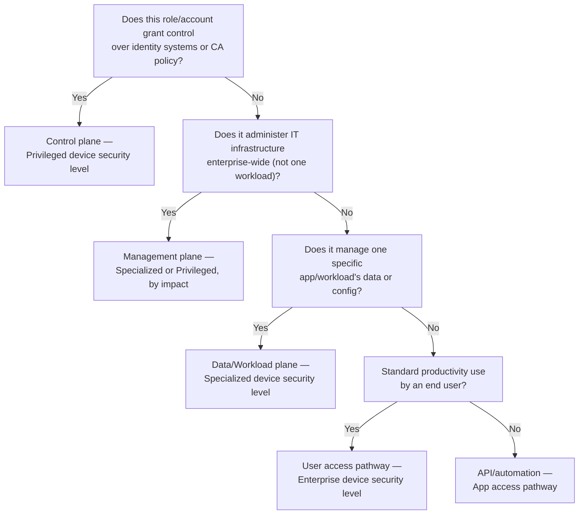

---
tags:
  - sc100
type: concept
domain:
  - ops-identity-compliance
aliases:
  - Tier 0
  - Tier 1
  - Tier 2
  - Enterprise Access Model
  - EAM
  - Privileged Access Levels
  - AD tier model
---
# Privileged Access Tier Models

## Purpose

Unpacks the containment models [[Securing Privileged Access]] and [[Securing Active Directory Domain Services (AD DS)]] reference in passing — the legacy AD **Tier 0/1/2** model, the **Enterprise Access Model** that replaced it, and the **Enterprise/Specialized/Privileged** device-and-account security levels used to implement both.

---

## Why Architects Choose It

- Every privileged-access control (PIM, PAWs, Conditional Access, JEA) is *placement* logic — it answers "which plane/tier is this account or device in," and that answer is meaningless without the model itself. Get the model wrong and every downstream control is scoped to the wrong boundary.
- Microsoft explicitly retired the on-prem-only Tier 0/1/2 language in favor of the **Enterprise Access Model (EAM)** — a cloud-inclusive model covering hybrid, multicloud, SaaS admin, OT/network access, and API access. The exam and current Microsoft Learn guidance use EAM terminology; a design that still speaks only in "Tier 0/1/2" is citing retired vocabulary.
- The model enforces a strict one-way hierarchy — **Control plane → Management plane → Data/Workload plane** — so that compromising a lower plane can never grant control of a higher one. This is the architectural reason PAW tiering, deny-logon GPOs, and PIM role scoping all exist.
- EAM separates *what's being protected* (the three planes) from *how someone reaches it* (User access / App access / Privileged access pathways) — two different axes that a design has to address independently, not one combined "tier."

---

## When to Use

- Classifying **any** identity, device, group, or admin role into a containment boundary before designing PIM, Conditional Access, or PAW policy around it.
- Explaining why on-prem AD hardening ([[Securing Active Directory Domain Services (AD DS)]]) and cloud privileged-access reduction ([[Securing Privileged Access]]) are the *same* containment problem applied to different planes, not two separate initiatives.
- Assigning a device security level (**Enterprise / Specialized / Privileged**) to a role based on the business impact of that role being compromised — not a uniform device policy for every admin.
- Migrating a design that still uses legacy Tier 0/1/2 language into current Enterprise Access Model terminology for an architecture review or exam scenario.
- Scoping OT/legacy network access control as part of the Control plane when identity-based control isn't achievable (the model explicitly folds this in).

---

## When NOT to Use

- Treating the three planes as a strict 1:1 replacement for Tier 0/1/2 — the mapping is a *split*, not a rename (see Architecture below); assuming otherwise misplaces Tier 2 assets.
- Applying "Privileged" device-security level uniformly to every admin — it's reserved for roles that could cause material organizational damage if compromised; over-applying it creates unnecessary friction and under-applying it leaves Control-plane admins on Enterprise-grade devices.
- Using the model as a static, one-time classification exercise — EAM requires continuous audit for configuration drift that could let a lower plane escalate into a higher one (e.g., a Management-plane tool granted standing rights over the Control plane).

---

## Architecture

- **Data/Workload plane** holds the actual business value — apps and data. Everything else exists to protect it.
- **Management plane** is enterprise-wide IT tooling that administers workloads/infrastructure (on-prem, Azure, third-party cloud).
- **Control plane** is the centralized identity system(s) (plus network access control where identity control isn't possible, e.g. legacy OT) that grant consistent access control across the whole enterprise — compromise here compromises everything below it.
- **User access** and **App access** are the productivity/automation pathways into these planes for standard users, partners, customers, and APIs.
- **Privileged access** is the pathway IT staff and admins use to manage/maintain the planes — the highest-value target, protected via **identity systems** (directories, sync, federation) and **authorized elevation paths** (JIT approval via PIM/PAM).

---

## Enterprise / Specialized / Privileged Security Levels

Microsoft's privileged-access strategy assigns every account and device one of three security levels — the mechanism that actually *implements* plane containment day to day:

| Level | Who it's for | Device behavior |
| --- | --- | --- |
| **Enterprise** | All standard users, general productivity | Users may install their own apps; standard baseline security |
| **Specialized** | Roles with elevated business impact if compromised (e.g., business-critical app admins, some developers) | Users can't self-administer the device; only admin-installed apps run; general web browsing/productivity still allowed |
| **Privileged** | Roles that could cause a major incident or material damage if compromised (Control-plane/Tier-0-equivalent admins) | No general web browsing, no productivity apps — a dedicated, hardened PAW for admin tasks only |

These levels are how the "clean source principle" (only a trustworthy device can be used to administer a trustworthy system) is enforced in practice — a Control-plane admin account is meaningless protection if it's typed on an Enterprise-level device.

---

## Architecture Decisions

---

## Comparison

| Compare | Difference |
| --- | --- |
| Legacy AD tier model vs. Enterprise Access Model | Tier model: on-prem AD-only, three tiers. EAM: cloud-inclusive, splits Tier 1 into Management + Data/Workload planes (infra-wide vs. per-workload admin) and Tier 2 into User access + App access (human vs. API pathway) — not a rename, a genuine restructuring. |
| Planes vs. pathways | Planes (Control/Management/Data-Workload) describe **what's being protected** and enforce a one-way governance hierarchy. Pathways (User/App/Privileged access) describe **how it's reached**. A single Control-plane asset can be reached via a privileged-access pathway; conflating the two axes is a common design error. |
| Enterprise vs. Specialized vs. Privileged security levels | Three device/account hardening tiers mapped to business impact of compromise, not to job title — a Control-plane admin gets Privileged, a business-critical app owner typically gets Specialized, everyone else gets Enterprise. |
| Enterprise Access Model vs. Azure RBAC/Entra role hierarchy | EAM is the containment *model* (which plane an asset belongs to); Azure RBAC/Entra ID roles ([[Identity and Access Management (IAM)]]) are the *mechanism* that assigns permissions within that model — the model tells you where to be strict, RBAC/roles implement the strictness. |

---

## AZ-500 Review

AZ-500 assumes familiarity with Azure RBAC scope hierarchy, Entra ID roles, and basic Domain Admin/local Administrator concepts, but does not teach a named containment model. The full Control/Management/Data-Workload plane structure, the pathway distinction, and the Enterprise/Specialized/Privileged device levels are new territory for SC-100.

---

## What's New for SC-100

- Know the exact plane-expansion mapping — Tier 0 **expands** into the Control plane (now includes OT/legacy network control); Tier 1 **splits** into Management and Data/Workload; Tier 2 **splits** into User access and App access. A scenario testing whether you know it's a split, not a rename, is common.
- Recognize planes (what) and pathways (how) as two separate axes of the same model, both needed to fully classify an asset.
- Name the Enterprise/Specialized/Privileged device security levels and map them to business impact, not job title.
- Treat the one-way governance hierarchy (Control governs Management governs Data/Workload) as a design constraint to actively verify, not a passive description — continuously audit for configuration drift that would let a lower plane escalate into a higher one.
- Recognize that identity systems and authorized elevation paths (PIM/PAM) are explicitly named components of the privileged-access pathway, not implementation detail.

---

## Exam Tips

- A scenario naming "Tier 0" is testing whether you reach for the **Control plane** / Enterprise Access Model instead of the retired term.
- "Which plane does an app owner who only manages their own app's configuration belong to?" → **Data/Workload plane**, not Management (Management is enterprise-wide IT tooling).
- "Which plane covers a legacy OT network where identity-based control isn't achievable?" → **Control plane** — EAM explicitly folds in network access control for cases like this.
- "An admin's workstation needs no general browsing/productivity apps at all" → **Privileged** security level, reserved for roles that could cause material organizational damage.
- Distinguish a question about *what's being protected* (planes) from one about *how it's reached* (pathways) — they test as separate concepts.

---

## Common Exam Confusion

- **Tier 0/1/2 vs. Control/Management/Data-Workload planes** — retired vs. current terminology; the split detail above is the frequent trap.
- **Planes vs. pathways** — protected asset classification vs. access route classification.
- **Enterprise vs. Specialized vs. Privileged security levels** — device/account hardening tier by business impact, not by department or title.
- **Enterprise Access Model vs. Azure RBAC/Entra role hierarchy** — containment model vs. the permission-assignment mechanism that implements it.

---

## Keywords

- Legacy AD tier model, Tier 0, Tier 1, Tier 2 (retired terminology)
- Enterprise Access Model (EAM), Control plane, Management plane, Data/Workload plane
- User access, App access, Privileged access pathways
- Identity systems, authorized elevation paths
- Enterprise / Specialized / Privileged security levels
- Clean source principle
- Closed-loop privileged access system
- Zero Trust: explicit validation, least privilege, assume breach

---

## Related Services

- [[Securing Privileged Access]] — PIM, entitlement management, CIEM, PAWs built on top of this model.
- [[Securing Active Directory Domain Services (AD DS)]] — the on-prem Control-plane/Tier-0 estate this model contains.
- [[AdminSDHolder and SDProp]] — the AD mechanism that structurally protects Control-plane accounts.
- [[Identity and Access Management (IAM)]] — Azure RBAC/Entra role mechanics that implement plane boundaries.
- [[PIM]] — the JIT activation mechanism for the authorized elevation path.
- [[Conditional Access]]
- [[Rapid Modernization Plan (RaMP)]] — stages privileged-access work across 30/90/beyond.
- [[Ransomware Resiliency and BCDR]] — names identity systems as the #1 recovery priority.
- [[Zero Trust]]

---

## References

- [Enterprise access model](https://learn.microsoft.com/en-us/security/privileged-access-workstations/privileged-access-access-model) — Microsoft Learn
- [Developing a privileged access strategy](https://learn.microsoft.com/en-us/security/privileged-access-workstations/privileged-access-strategy) — Microsoft Learn
- [Securing privileged access security levels](https://learn.microsoft.com/en-us/security/privileged-access-workstations/privileged-access-security-levels) — Microsoft Learn
- [[Exam Objectives]]
