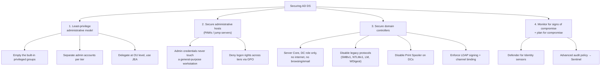
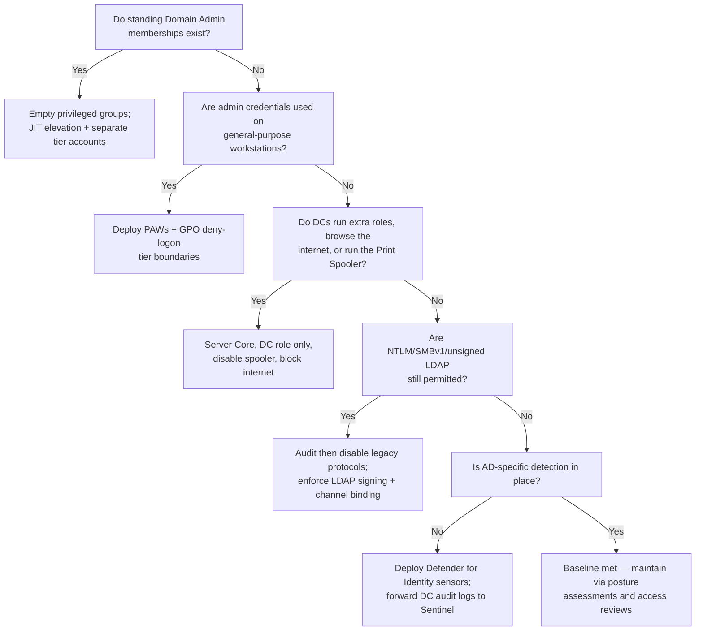

---
tags:
  - sc100
type: concept
domain:
  - ops-identity-compliance
aliases:
  - AD DS
  - Active Directory Domain Services
  - AD DS attack surface
  - Securing Active Directory
status: needs-verification
---

# Securing Active Directory Domain Services (AD DS)

## Purpose

Specifies the security requirements for on-premises Active Directory Domain Services and the concrete moves that reduce its attack surface — the single highest-value hardening target in a hybrid estate, because a compromised forest compromises everything synced from it.

---

## Why Architects Choose It

- AD DS is the **Tier 0 / Control-plane** asset in the enterprise access model ([[Securing Privileged Access]]). Domain Admin is not "an administrator" — it is effectively root over every domain-joined server, workstation, application, and (via [[Entra ID|Entra Connect]]) the cloud tenant.
- Legacy AD is designed for **availability and interoperability**, not containment: default protocol support (NTLM, unsigned LDAP, SMB signing off), broad delegation defaults, and cached credentials mean a single workstation compromise plus one careless admin logon yields the forest.
- Hybrid does not retire the problem — it **inherits** it. As long as identities sync to [[Entra ID]], a compromised DC or Entra Connect server is a cloud compromise; [[Conditional Access]] and [[PIM]] cannot compensate for an attacker who can mint Kerberos tickets or edit synced objects.
- Ransomware operators treat AD as the distribution mechanism: Domain Admin plus Group Policy is how encryption reaches every endpoint at once. [[Ransomware Resiliency and BCDR]] puts identity systems **first** in the restore order for exactly this reason.
- Microsoft's guidance is structured around a small number of high-leverage moves — least-privilege administrative models, secure administrative hosts, and hardened domain controllers — rather than a long configuration catalogue.

---

## When to Use

- Any hybrid identity design where on-prem AD DS remains authoritative for user or computer accounts.
- Pre- or post-incident hardening — [[Microsoft Incident Response (DART)|DART]] engagements almost always produce AD DS work as the strategic half of recovery.
- Before extending trust outward: federating a new SaaS app, adding a forest trust, or synchronizing to a new tenant.
- When migrating toward cloud-only identity, to reduce the on-prem attack surface during a multi-year coexistence period.

---

## When NOT to Use

- As a substitute for cloud identity controls — hardened AD DS does not give risk-based sign-in, [[Identity Protection]], or [[Conditional Access]]; those require [[Entra ID]] P1/P2 ([[Microsoft 365 Licensing]]).
- Applied to **Microsoft Entra Domain Services** as if it were the same product — Entra Domain Services is a managed domain with no Domain Admin access and a different (much smaller) hardening surface.
- As a reason to defer cloud modernization — the target is fewer on-prem dependencies, not a perfectly hardened forest maintained forever.
- Cleaning a compromised forest in place after a domain-wide breach — Microsoft's guidance is **rebuild Tier 0**, not remediate it.

---

## Architecture

Microsoft's "Best Practices for Securing Active Directory" organizes the work into four themes; treat these as the requirement checklist.

---

## 1. Least-Privilege Administrative Model

| Requirement | Detail |
| --- | --- |
| Empty the privileged groups | **Enterprise Admins**, **Schema Admins**, **Domain Admins**, and built-in **Administrators** should have **no standing members** day to day — populate only for specific, approved, time-boxed tasks. |
| Don't forget the "quiet" groups | **Account Operators**, **Backup Operators**, **Print Operators**, **Server Operators**, and **DnsAdmins** are effectively Tier 0 (they can log on to DCs or load code into them) yet are routinely overlooked. |
| Separate accounts per tier | A distinct admin account per plane — Control (Tier 0), Management (Tier 1), Data/Workload (Tier 2) — never one account used across all three. Cloud-only admin accounts for [[Entra ID]] roles. |
| Protected Users group | Blocks NTLM, DES/RC4, unconstrained delegation, and credential caching for its members. Add Tier 0 admins (verify no legacy dependency first). |
| AdminSDHolder / SDProp | Understand that protected-group members have their ACLs reset by SDProp — permission changes on those accounts silently revert. |
| Delegation, not membership | Delegate specific tasks at the **OU level**; use **JEA** (Just Enough Administration) for Windows Server administrative tasks instead of granting server-wide admin — see [[Securing Privileged Access]]. |
| Service accounts | Replace shared password service accounts with **group Managed Service Accounts (gMSA)** — automatic 240-character password rotation, no human-known secret, resistant to Kerberoasting. |
| Remove SPNs from privileged accounts | An SPN on a Domain Admin account makes it Kerberoastable — offline crackable to full domain compromise. |
| Mark sensitive accounts | Set **"Account is sensitive and cannot be delegated"** on Tier 0 accounts so a compromised delegated service cannot impersonate them. |

---

## 2. Secure Administrative Hosts

- **Privileged Access Workstations (PAWs)** — dedicated, hardened, internet-restricted devices for Tier 0 administration. The rule is that a Tier 0 credential is only ever typed on a Tier 0 device.
- Enforce the tier boundary with **GPO deny-logon rights**: `Deny log on locally`, `Deny log on through Remote Desktop Services`, `Deny access to this computer from the network` — applied so Tier 0 accounts cannot authenticate to Tier 1/2 systems, and lower-tier accounts cannot log on to DCs.
- Administer over the **network from a PAW to the DC**, not by interactively logging on to servers, which leaves harvestable credentials in memory.
- Use **RDP Restricted Admin mode** / Remote Credential Guard where interactive remote administration is unavoidable.
- Require **MFA and [[PIM]]-style just-in-time elevation** for privileged use, including for on-prem via [[Conditional Access]]-gated jump hosts.
- Treat **[[Entra ID|Entra Connect]] servers, ADFS servers, AD CS servers, and backup infrastructure as Tier 0** — they hold or can mint credentials for the whole estate.

---

## 3. Reduce the Domain Controller Attack Surface

| Control | Why |
| --- | --- |
| **Server Core**, DC role only | Every extra role, agent, or application is another exploit path into Tier 0. No general-purpose software on DCs. |
| No internet access, no browsing/email on DCs | Removes the most common initial-access vectors; block DC outbound internet at the firewall and restrict inbound to required AD ports. |
| **Disable the Print Spooler service on DCs** | Long-standing abuse path (spooler-based coercion and PrintNightmare-class RCE). Microsoft explicitly recommends disabling it on DCs. |
| **Disable SMBv1**; require SMB signing | Removes a legacy protocol with no authentication integrity and a relay/exploit history. |
| **Disable LM and NTLMv1; restrict NTLM** | NTLM enables relay and pass-the-hash. Audit NTLM usage first, then restrict via policy; target Kerberos-only where possible. |
| **Enforce LDAP signing and LDAP channel binding** | Prevents LDAP relay attacks against DCs. |
| **Disable WDigest**; enable **LSASS protection (RunAsPPL)**; **Credential Guard** on Windows clients/servers | Denies plaintext and hash extraction from memory — the mechanic behind pass-the-hash and pass-the-ticket (see [[Trusted Platform Module (TPM)]] for the hardware root of trust these depend on). |
| Eliminate **unconstrained delegation** | Any server with unconstrained delegation caches TGTs for every user who connects — a DC-compromise shortcut. Use constrained delegation or resource-based constrained delegation. |
| Patch DCs fast; apply **security baselines** | Use the Microsoft Security Compliance Toolkit baselines via GPO rather than hand-built settings. |
| Protect virtualized DCs | Shielded VMs / Guarded Fabric so a virtualization admin is not implicitly a Domain Admin; encrypt DC disks; secure DC backups. |
| **RODC** in low-trust sites | Read-only, filtered credential replication for branch or physically insecure locations. |
| **Entra Password Protection** (on-prem agent) | Extends the global and custom banned-password lists to DCs, blocking weak passwords at change time. |
| **Windows LAPS** | Unique, rotated local administrator passwords stop workstation-to-workstation lateral movement (see [[Securing Server and Client Endpoints]]). |
| **AD CS hardening** | Certificate template misconfigurations (over-permissive enrollment, requester-supplied SANs) allow forging authentication certificates for any user, including Domain Admins. Review templates and enrollment permissions. |
| **AD Recycle Bin + offline forest backup + tested forest recovery plan** | Recovery from deletion or destruction, aligned to [[Ransomware Resiliency and BCDR]]. |

---

## 4. Monitor and Plan for Compromise

- **[[Microsoft Defender]] for Identity** — sensors deployed on domain controllers (and AD FS / AD CS servers) providing:
  - detection of Kerberoasting, pass-the-hash/ticket, golden ticket, DCSync/DCShadow, reconnaissance, and lateral movement paths;
  - **identity security posture assessments** — unsecure account attributes, legacy protocol usage, dormant privileged accounts, risky delegation, exposed credentials;
  - signal into the unified [[Microsoft Defender XDR]] incident queue. Requires [[Microsoft 365 Licensing|Microsoft 365 E5 / E5 Security or EMS E5]].
- **Advanced audit policy** on DCs, forwarded into [[Microsoft Sentinel]] for retention, correlation, and hunting — key events include privileged group membership change, Kerberos ticket requests (encryption downgrade), account lockouts, GPO changes, and replication (DCSync) activity.
- **Plan for compromise**: assume domain-wide compromise means rebuilding Tier 0. Rotate **`krbtgt` twice** (allowing replication between rotations) to invalidate golden tickets, and rebuild rather than clean DCs — see [[Microsoft Incident Response (DART)]].

---

## Architecture Decisions

---

## Comparison

| Compare | Difference |
| --- | --- |
| **AD DS vs. [[Entra ID]]** | AD DS: on-prem, Kerberos/NTLM/LDAP, OUs and GPOs, domain/forest trusts, you own the DCs. Entra ID: cloud, OAuth/OIDC/SAML, flat tenant with Conditional Access, Microsoft operates it. Not a hierarchy or an upgrade path — different directories with different controls. |
| **AD DS vs. Microsoft Entra Domain Services** | Entra Domain Services is a **managed** domain (LDAP/Kerberos/GPO for lift-and-shift VMs) where Microsoft owns the DCs — you never get Domain Admin, so most of this hardening list doesn't apply and cannot be applied. |
| **Defender for Identity vs. [[Identity Protection]]** | Defender for Identity detects attacks against **on-prem AD** (and AD FS/AD CS) from DC sensors. Entra ID Protection scores **cloud sign-in and user risk** for Conditional Access. Different directories, complementary signals, both surface in Defender XDR. |
| **Defender for Identity vs. [[Microsoft Sentinel]]** | Defender for Identity is a purpose-built AD detection product with prebuilt analytics; Sentinel ingests DC audit logs for long-term retention, custom hunting, and correlation with non-identity sources. Use both. |
| **gMSA vs. traditional service account** | gMSA: AD-managed, automatically rotated 240-character password, no human knows it, tied to authorized hosts. Traditional: static shared password, often with an SPN and privileged group membership — the classic Kerberoasting target. |
| **Windows LAPS vs. gMSA** | LAPS randomizes and rotates the **local** administrator password per machine (lateral movement). gMSA manages **domain service account** credentials (service authentication). |
| **Protected Users vs. "sensitive and cannot be delegated"** | Protected Users blocks weak authentication methods and credential caching for its members. The account flag specifically prevents delegation/impersonation of that account. Complementary, not alternatives. |
| **Unconstrained vs. constrained vs. resource-based constrained delegation** | Unconstrained caches the user's full TGT on the service (avoid entirely). Constrained limits which services can be reached; RBCD moves the trust decision to the **target** resource — the modern, preferred model. |

---

## AZ-500 Review

AZ-500 covers hybrid identity plumbing — Entra Connect / Cloud Sync, password hash sync vs. pass-through authentication vs. federation, seamless SSO, and Entra Domain Services deployment — plus Windows Server hardening basics and JEA. That configuration knowledge is assumed here.

---

## What's New for SC-100

- Frame AD DS hardening as **specifying security requirements** at architecture level — the tier/plane model, group emptiness, administrative host separation — rather than a list of settings to toggle.
- Recognize the **cloud blast radius**: on-prem AD compromise ⇒ Entra ID compromise wherever objects are synced, which makes Entra Connect and AD FS Tier 0 assets in a cloud security strategy.
- Choose the **detection architecture**: Defender for Identity for AD-native attack detection, Sentinel for retention/correlation, Defender XDR as the single incident queue.
- Sequence the work — the **[[Rapid Modernization Plan (RaMP)|privileged access RaMP]]** ordering (separate admin accounts and MFA first, PAWs next, full enterprise access model after) rather than attempting everything simultaneously.
- Accept **rebuild over remediate** for Tier 0 after a domain-wide compromise as the recommended architectural position.

---

## Exam Tips

- "Reduce the AD DS attack surface" → the answer set is: **empty privileged groups, separate/tiered admin accounts, privileged access workstations, hardened DCs (Server Core, no internet, no spooler), disable legacy protocols**. Not "install more agents."
- "Detect Kerberoasting / pass-the-hash / golden ticket / DCSync on-prem" → **Defender for Identity**, not Entra ID Protection and not Defender for Endpoint.
- "Prevent lateral movement using a shared local administrator password" → **Windows LAPS**.
- "Service account with an SPN and a static password used across servers" → replace with **gMSA**, and remove the SPN from any privileged account.
- "Protect a highly privileged account from credential theft and delegation abuse" → **Protected Users** group plus **"Account is sensitive and cannot be delegated."**
- "Branch office with poor physical security needs a local DC" → **RODC**.
- "Block weak passwords on on-prem accounts" → **Entra Password Protection** with the DC agent and proxy.
- After a domain compromise: rotate **`krbtgt` twice**, rebuild Tier 0, and deploy EDR before eviction — a "clean the DCs and carry on" answer is wrong.
- Any answer treating **Entra Domain Services** as a hardening target for Domain Admin controls is a distractor — you don't get Domain Admin there.

---

## Common Exam Confusion

- **AD DS vs. Entra ID vs. Entra Domain Services** — three different directories; only the first gives (and requires) full control-plane hardening.
- **Defender for Identity vs. Entra ID Protection** — on-prem AD attack detection vs. cloud sign-in/user risk scoring.
- **Defender for Identity vs. Defender for Endpoint** — identity-plane attack detection from DC sensors vs. endpoint EDR; both feed [[Microsoft Defender XDR]].
- **gMSA vs. LAPS** — domain service account credentials vs. per-machine local admin passwords.
- **Tiering (Tier 0/1/2) vs. the enterprise access model (Control/Management/Data-Workload planes)** — the same containment idea, older and newer terminology; SC-100 prefers the plane language ([[Securing Privileged Access]]).
- **Constrained vs. resource-based constrained delegation** — configured on the *source* service vs. on the *target* resource.

---

## Keywords

- Tier 0 / Control plane, enterprise access model
- Enterprise Admins, Schema Admins, Domain Admins, Account/Backup/Server/Print Operators, DnsAdmins
- Protected Users, AdminSDHolder, SDProp
- Privileged Access Workstation (PAW), secure administrative host
- Deny logon rights (GPO), RDP Restricted Admin, Remote Credential Guard
- Credential Guard, LSASS RunAsPPL, WDigest
- Pass-the-hash, pass-the-ticket, Kerberoasting, golden ticket, DCSync, DCShadow
- Unconstrained / constrained / resource-based constrained delegation
- gMSA, SPN removal, Windows LAPS
- SMBv1, NTLMv1/LM, LDAP signing and channel binding, Print Spooler on DCs
- Server Core, RODC, shielded VMs, Microsoft Security Compliance Toolkit baselines
- Entra Password Protection (on-prem agent + proxy)
- AD CS certificate template abuse
- Defender for Identity sensors, identity security posture assessments, lateral movement paths
- krbtgt rotation (twice), rebuild Tier 0
- AD Recycle Bin, forest recovery plan

---

## Related Services

- [[Identity and Access Management (IAM)]]
- [[Securing Privileged Access]]
- [[Entra ID]]
- [[Identity Protection]]
- [[PIM]]
- [[Conditional Access]]
- [[Microsoft Defender]]
- [[Microsoft Defender XDR]]
- [[Microsoft Sentinel]]
- [[Securing Server and Client Endpoints]]
- [[Trusted Platform Module (TPM)]]
- [[Ransomware Resiliency and BCDR]]
- [[Microsoft Incident Response (DART)]]
- [[Rapid Modernization Plan (RaMP)]]
- [[Zero Trust]]
- [[Microsoft 365 Licensing]]
- [[Azure Security Logging]]

---

## References

- [Best practices for securing Active Directory](https://learn.microsoft.com/en-us/windows-server/identity/ad-ds/plan/security-best-practices/best-practices-for-securing-active-directory) — Microsoft Learn
- [Reducing the Active Directory attack surface](https://learn.microsoft.com/en-us/windows-server/identity/ad-ds/plan/security-best-practices/reducing-the-active-directory-attack-surface) — Microsoft Learn
- [Implementing least-privilege administrative models](https://learn.microsoft.com/en-us/windows-server/identity/ad-ds/plan/security-best-practices/implementing-least-privilege-administrative-models) — Microsoft Learn
- [Securing domain controllers against attack](https://learn.microsoft.com/en-us/windows-server/identity/ad-ds/plan/security-best-practices/securing-domain-controllers-against-attack) — Microsoft Learn
- [Monitoring Active Directory for signs of compromise](https://learn.microsoft.com/en-us/windows-server/identity/ad-ds/plan/security-best-practices/monitoring-active-directory-for-signs-of-compromise) — Microsoft Learn
- [What is Microsoft Defender for Identity?](https://learn.microsoft.com/en-us/defender-for-identity/what-is) — Microsoft Learn
- [[Exam Objectives]]

---

## Verification Flag

Several items here sit on shifting ground: Defender for Identity's sensor coverage (AD FS, AD CS, Entra Connect) and its posture-assessment catalogue expand regularly; Microsoft's NTLM deprecation and SMB hardening defaults are changing across Windows Server releases; and Windows LAPS has superseded legacy LAPS with different deployment mechanics. Re-verify sensor scope, protocol defaults, and LAPS deployment against Microsoft Learn close to exam date.
