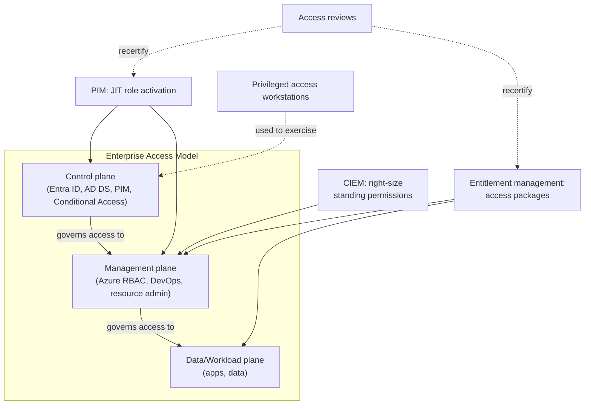
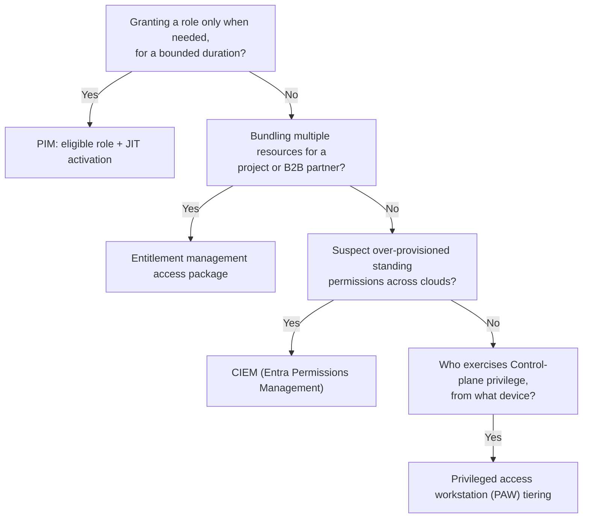

---
tags:
  - sc100
---
# Securing Privileged Access

## Purpose

Architecting how privileged access is granted, activated, bundled, reviewed, and right-sized — across Entra ID, Azure RBAC, AD DS, and multicloud — using Microsoft's Enterprise Access Model as the containment framework. The counterpart to [[Identity and Access Management (IAM)|general IAM/authorization]], which covers *what roles exist*; this note covers *how standing privilege is reduced*.

---

## Why Architects Choose It

- Standing privileged access (a role held indefinitely rather than activated when needed) is the single biggest lever in blast-radius reduction — see [[Ransomware Resiliency and BCDR]], which sequences privileged-access hardening as Phase 2 and names identity systems as the #1 recovery priority.
- The **Enterprise Access Model** replaces the legacy, on-prem-only "Tier 0/1/2" AD model with a cloud-inclusive containment structure — architects need the current model by name, not the retired one.
- Over-provisioned standing permissions (a role granting far more than a principal ever uses) exist even when every activation is perfectly just-in-time — CIEM closes a gap PIM alone doesn't reach.
- A privileged account is worth more to an attacker than any single resource — the workstation and network path used to exercise that privilege is itself attack surface, not just the role assignment.

---

## When to Use

- Containing which systems can compromise which other systems — the Enterprise Access Model's Control/Management/Data-Workload planes, protecting the Control plane above all else.
- Granting a role only for the duration it's needed, with approval and MFA on activation — [[PIM]] (Entra ID roles, Azure RBAC roles, and PIM for Groups).
- Bundling time-bound, approval-gated access to a set of resources (groups, apps, SharePoint sites) for internal or B2B external users — **entitlement management** access packages.
- Periodically recertifying who still needs standing access, group membership, or an entitlement package — **access reviews**.
- Finding and shrinking over-provisioned permissions across Azure/AWS/GCP that no JIT policy alone would catch — **CIEM** (Microsoft Entra Permissions Management, surfaced in Defender for Cloud).
- Isolating the device and network path used for privileged administration — **privileged access workstations (PAW)** tiering, not a standard managed device.

---

## When NOT to Use

- Treating PIM activation as sufficient on its own — a role can be perfectly just-in-time and still be over-scoped; pair it with CIEM right-sizing.
- Running access reviews as a one-time cleanup — they're a recurring control tied to entitlement packages, PIM-eligible roles, and B2B guests, not an annual audit.
- Administering the tenant or cloud estate from a standard user workstation — privileged sessions need a dedicated, hardened device regardless of how tightly the role itself is scoped.

---

## Architecture

---

## Architecture Decisions

---

## Comparison

| Compare | Difference |
| --- | --- |
| PIM vs. entitlement management | PIM activates a role you're already eligible for, just-in-time, for a bounded duration; entitlement management grants a bundle of resources (possibly including a role-granting group) via a request/approval workflow, for internal or B2B external users. Complementary — an access package can include PIM eligibility as one of its bundled resources. |
| PIM vs. CIEM | PIM controls *when* an already-correctly-scoped role is active (temporal); CIEM finds and shrinks roles/permissions that are *too broad in the first place* (scope), across Azure/AWS/GCP. PIM without CIEM still leaves standing over-permission live during the activation window. |
| Enterprise Access Model vs. legacy AD tier model (Tier 0/1/2) | The tier model was on-prem/AD-only; the Enterprise Access Model extends the same "protect the top plane above all" logic across hybrid, multicloud, and SaaS admin surfaces — the current architecture to recommend. |
| Access reviews vs. Identity Protection risk policies | Access reviews are scheduled, human-driven recertification of standing access; Identity Protection is continuous, automated risk *detection* feeding [[Conditional Access]] — different cadence, different trigger. |
| PIM vs. Endpoint Privilege Management (EPM) | PIM (this note) JIT-activates *directory/Azure RBAC role* privilege. EPM (see [[Intune]]) JIT-elevates a *specific local app/task on a device* for a standard user, without granting standing local admin — same "reduce standing privilege" principle, different layer (cloud roles vs. local device). |

---

## AZ-500 Review

AZ-500 already covers configuring PIM activation, individual access reviews, and basic RBAC hygiene at the resource level. SC-100 adds: the Enterprise Access Model as the named containment framework, entitlement management for bundled/external access at scale, CIEM as a distinct cross-cloud permission-right-sizing capability, and privileged access workstations as an architecture decision rather than a device policy.

---

## What's New for SC-100

- Know the Enterprise Access Model's three planes by name (Control, Management, Data/Workload) and that it replaced the legacy Tier 0/1/2 AD model — a frequent "current vs. retired terminology" trap.
- Recognize CIEM as solving a different problem than PIM — standing over-permission vs. JIT activation timing — and that Microsoft's CIEM capability is Entra Permissions Management, exposed through Defender for Cloud.
- Use entitlement management, not manual approval emails, as the architecture answer for bundled, time-bound, B2B-inclusive resource access at scale.
- Tie privileged access workstation tier to the plane being administered — Control-plane administration deserves the most isolated tier, not a uniform PAW policy for every admin.
- Sequence privileged-access hardening as explicitly prioritized work (see [[Ransomware Resiliency and BCDR]]), not a generic "least privilege" platitude.

---

## Exam Tips

- "Contain lateral movement between on-prem AD and cloud admin" → Enterprise Access Model plane separation, not just PIM.
- "Find permissions nobody uses, across three clouds" → CIEM/Entra Permissions Management, not PIM or access reviews.
- "Grant a partner org's team access to a project's resources for 90 days with approval" → entitlement management access package.
- A scenario naming "Tier 0" or the legacy AD tiering model is testing whether you recognize the retired terminology and reach for the Enterprise Access Model instead.

---

## Common Exam Confusion

- **PIM vs. entitlement management** — activate an eligible role vs. request a bundle of resources; full breakdown above.
- **PIM vs. CIEM** — temporal control vs. scope control.
- **Enterprise Access Model vs. legacy tier model** — current, cloud-inclusive vs. retired, AD-only.

---

## Keywords

- Enterprise Access Model: Control plane, Management plane, Data/Workload plane
- Privileged Identity Management (PIM): eligible vs. active role, JIT activation
- Entitlement management, access packages
- Access reviews, recertification
- Cloud infrastructure entitlement management (CIEM), Microsoft Entra Permissions Management
- Privileged access workstations (PAW)
- Standing access vs. just-in-time access
- Legacy AD tier model (Tier 0/1/2) — retired terminology

---

## Related Services

- [[PIM]] — activation mechanism detail (eligible/active, PIM for Groups) lives in its own note.
- [[Entra ID]] — PIM requires P2 licensing.
- [[Identity and Access Management (IAM)]]
- [[Identity as the Security Perimeter]]
- [[Conditional Access]]
- [[Ransomware Resiliency and BCDR]]
- [[Microsoft Defender for Cloud]]
- [[Zero Trust]]

---

## References

- [Enterprise access model](https://learn.microsoft.com/en-us/security/privileged-access-workstations/privileged-access-access-model) — Microsoft Learn
- [What's Microsoft Entra Permissions Management?](https://learn.microsoft.com/en-us/entra/permissions-management/overview) — Microsoft Learn
- [Cloud infrastructure entitlement management (CIEM)](https://learn.microsoft.com/en-us/azure/defender-for-cloud/permissions-management) — Microsoft Learn
- (https://aka.ms/eam)
- (https://aka.ms/paw)
- [[Exam Objectives]]
