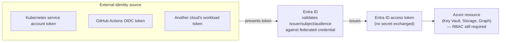
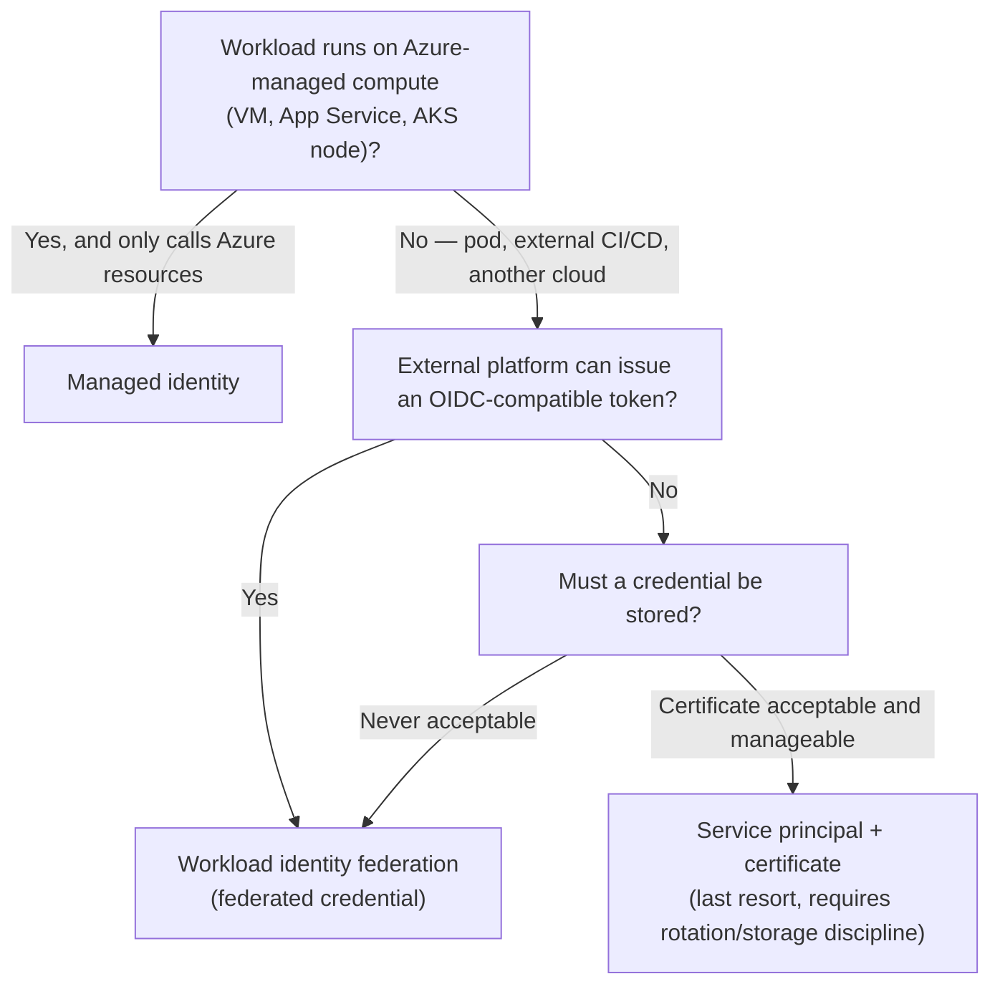

---
tags:
  - sc100
type: concept
domain:
  - ops-identity-compliance
aliases:
  - Workload ID
  - Microsoft Entra Workload ID
  - Federated credentials
  - Workload identity federation
  - FIC
---

# Workload Identity Federation

## Purpose

How a non-Azure-hosted or non-human workload (a Kubernetes pod, a GitHub Actions pipeline, another cloud's compute) authenticates to Entra ID-protected resources **without any stored secret or certificate**, by exchanging an external token for an Entra ID token — and why this beats both managed identity and self-signed certificates outside their respective comfort zones.

---

## Why Architects Choose It

- Managed identity only works when the workload **runs on Azure infrastructure** (a VM, App Service, AKS node) — Entra ID can vouch for it because Azure itself issued and controls the compute. A Kubernetes *pod* (as opposed to the AKS node) and anything running outside Azure (GitHub Actions, another cloud, on-prem) fall outside that trust boundary — this is exactly why "configure a managed identity for the Kubernetes cluster" is the wrong answer for pod-level Key Vault access.
- Workload identity federation extends the "eliminate stored credentials" principle from [[Identity and Access Management (IAM)]] to workloads managed identity can't reach — no secret or certificate ever exists to leak, rotate, or expire.
- A self-signed certificate stored in the app/container is a credential like any other: it must be issued, distributed, rotated, and protected — and if the container is compromised, the certificate is exposed right along with it. Federation removes that entire attack surface by design, not by better key hygiene.
- Aligns with Zero Trust's "verify explicitly" principle at the workload level, not just the user level — see [[Zero Trust]].

---

## When to Use

- A Kubernetes pod needs to call an Azure resource (Key Vault, Storage, a database) — **Microsoft Entra Workload ID**, using a federated credential tied to the pod's Kubernetes service account.
- A CI/CD pipeline (GitHub Actions, Azure DevOps, GitLab) needs to deploy to Azure without a stored client secret — **workload identity federation** on the pipeline's service principal or user-assigned managed identity.
- A workload running in **another cloud** (AWS, GCP) needs to authenticate to Azure resources — federation, trusting that cloud's own identity token.
- An Azure-hosted resource (VM, App Service, Azure Function, AKS node itself) needs to call another Azure resource — plain **managed identity** is simpler and sufficient; federation solves a problem managed identity doesn't have here.

---

## When NOT to Use

- Don't reach for federation when the workload is genuinely Azure-hosted compute talking to another Azure resource — that's a managed identity, full stop; federation adds configuration complexity (issuer/subject/audience matching) with no benefit over the simpler option.
- Don't recommend a self-signed certificate stored in a container/app as the "secure" answer — it reintroduces exactly the stored-credential risk (issuance, rotation, container-compromise exposure) that both managed identity and federation exist to eliminate.
- Don't create an Entra ID **user account** for an application to authenticate with — password/credential management for a non-human entity is a service-to-service anti-pattern; use a service principal or workload identity instead.
- Don't assume federation removes the need for RBAC — the federated credential only proves *identity*; the resulting token still needs a role assignment (e.g., Key Vault Secrets User) to actually access anything.

---

## Mechanics

A **federated credential** is configured on an app registration's service principal (or a user-assigned managed identity) and defines a trust relationship with an external identity provider — no secret exchanged, ever:

- **Issuer** — the external IdP's token-issuing URL (e.g., the Kubernetes cluster's OIDC issuer, GitHub Actions' token endpoint).
- **Subject** — the specific external identity allowed to claim this federated credential (e.g., `system:serviceaccount:<namespace>:<service-account>` for a Kubernetes pod, or a specific GitHub repo/branch/environment).
- **Audience** — normally fixed to Entra ID's expected value (`api://AzureADTokenExchange`).

**Flow**: the workload presents its *own* platform-native token (a Kubernetes service account token, a GitHub Actions OIDC token) to Entra ID → Entra ID validates issuer/subject/audience match the configured federated credential → Entra ID issues a standard Entra ID access token → the workload uses that token against the target resource (Key Vault, Storage, Graph). Nothing long-lived is stored anywhere in this exchange.

---

## Architecture

---

## Architecture Decisions

---

## Comparison

| Compare | Difference |
| --- | --- |
| **Managed identity vs. workload identity federation** | Managed identity: Azure auto-manages the identity's lifecycle and credential, but only for Azure-hosted compute calling Azure resources. Workload identity federation: works for *anything* that can present an external OIDC token — Kubernetes pods, CI/CD pipelines, other clouds — still with nothing stored at rest. Federation is the broader-reach tool; managed identity is the simpler one when the workload qualifies. |
| **Workload identity federation vs. service principal with a client secret/certificate** | Federation exchanges an external token for an Entra ID token — no secret exists to leak or rotate. A client secret/certificate is a stored credential requiring issuance, secure storage, and rotation; compromise of the storage location (a container, a repo, a config file) directly compromises the credential. |
| **Self-signed certificate vs. workload identity federation** | A self-signed certificate stored in an app/container is a credential like any other — issuance, renewal, and secure storage are all the app owner's responsibility, and a compromised container exposes it directly. Federation eliminates the credential entirely, aligning with Zero Trust; Microsoft's own guidance favors federation over certificate-based auth wherever the workload can support it. |
| **Kubernetes: managed identity (node-level) vs. Workload ID (pod-level)** | A managed identity assigned to the AKS node is shared by *every* pod scheduled on that node — too broad. Microsoft Entra Workload ID federates per **Kubernetes service account**, so each pod (or group of pods sharing a service account) gets its own scoped identity — see [[Container and Kubernetes Security]] for the full AKS identity picture, including the retired AAD Pod Identity this replaced. |
| **User account vs. service principal/workload identity for app authentication** | A user account requires password/credential management and wasn't designed for non-human callers — using one for an app is a service-to-service anti-pattern. Service principals and workload identities are purpose-built for this and support secret-free federation. |

---

## AZ-500 Review

AZ-500 covers creating and assigning managed identities and configuring basic service principal authentication. It does not cover federated credentials, the issuer/subject/audience trust model, or workload identity federation as the architectural default for non-Azure-hosted workloads — this is new SC-100-level design knowledge, building directly on [[Identity and Access Management (IAM)]]'s existing managed-identity-vs-service-principal foundation.

---

## What's New for SC-100

- Recognize the specific trigger for federation over managed identity: the workload is **not Azure-hosted compute** — a Kubernetes pod, an external CI/CD runner, or a workload in another cloud.
- Treat "no stored secret or certificate" as the deciding requirement phrase — both managed identity and federation satisfy it; certificates and user accounts never do.
- Know the federated credential's three matching fields (issuer, subject, audience) as the mechanism, not just the marketing description "secretless authentication."
- Connect this to the AKS-specific version already covered in [[Container and Kubernetes Security]] — Workload ID is the concrete implementation of federation for Kubernetes specifically.

---

## Exam Tips

- "Containerized app in Kubernetes needs to access Key Vault, aligned with best practices" → **Microsoft Entra workload identity**, letting the app authenticate directly — not a managed identity on the cluster (managed identity doesn't natively extend to individual pods).
- A self-signed certificate stored in the container is always the wrong "secure" answer when federation is available — it's certificate-management overhead plus a credential exposed if the container is compromised.
- Creating an Entra ID **user account** for an application is always wrong — password/credential management overhead, not designed for non-human entities.
- "Eliminate stored secrets for a CI/CD pipeline deploying to Azure" → workload identity federation on the pipeline's identity, not a stored client secret.
- If the workload genuinely runs on Azure compute and only talks to Azure resources, don't over-engineer with federation — plain managed identity is the simpler, sufficient answer.

---

## Common Exam Confusion

- **Managed identity vs. workload identity federation** — Azure-hosted-only vs. any OIDC-capable external workload; see Comparison table.
- **Federation vs. certificate-based auth** — both can avoid a plaintext secret, but a certificate is still a stored, manageable credential with container-compromise exposure; federation stores nothing at all.
- **Node-level identity vs. Workload ID in Kubernetes** — a managed identity on the AKS node is shared by every pod on it; Workload ID scopes per service account/pod. Full depth in [[Container and Kubernetes Security]].
- **Service principal vs. user account for app authentication** — purpose-built non-human identity vs. a password-bearing human-identity construct misapplied to an app.

---

## Keywords

- Microsoft Entra Workload ID, workload identity federation
- Federated credential — issuer, subject, audience
- Federated Identity Credential (FIC)
- Kubernetes service account token, OIDC issuer
- Secretless / passwordless authentication for non-human identities
- GitHub Actions OIDC, cross-cloud federation
- No stored secrets or certificates

---

## Related Services

- [[Identity and Access Management (IAM)]]
- [[Container and Kubernetes Security]]
- [[Key Vault]]
- [[Zero Trust]]
- [[DevOps Security]]
- [[Securing Privileged Access]]

---

## References

- [Workload identity federation](https://learn.microsoft.com/en-us/entra/workload-id/workload-identity-federation) — Microsoft Learn
- [What are workload identities?](https://learn.microsoft.com/en-us/entra/workload-id/workload-identities-overview) — Microsoft Learn
- [Create a self-signed public certificate to authenticate your application](https://learn.microsoft.com/en-us/entra/identity-platform/howto-create-self-signed-certificate) — Microsoft Learn
