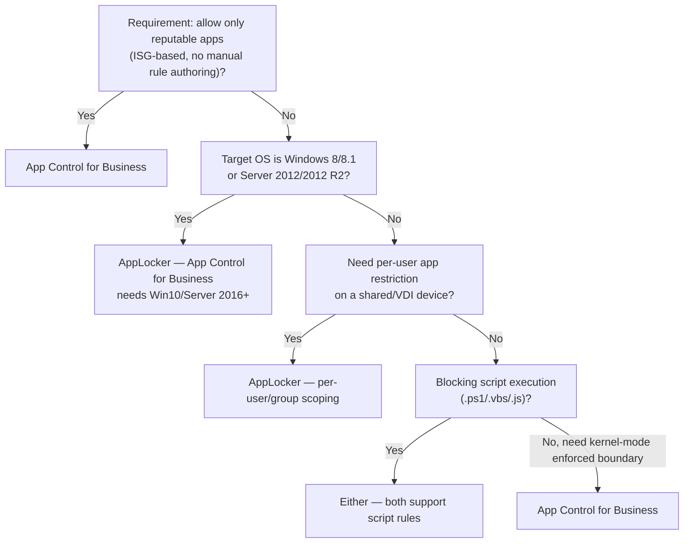

---
tags:
  - sc100
type: concept
domain:
  - infrastructure
aliases:
  - App Control for Business
  - Windows Defender Application Control
  - WDAC
  - AppLocker
  - Application control
---

# App Control for Business and AppLocker

## Purpose

Two Windows application-allowlisting mechanisms — App Control for Business (formerly WDAC) and AppLocker — and which one a mitigation requirement actually maps to, a recurring "match the requirement to the control" exam pattern, often framed as mitigating VDI/shared-device risk.

---

## Why Architects Choose It

- Both control *which code is allowed to execute*, but they enforce at different scopes and trust models — picking the wrong one either under-protects (AppLocker's kernel-mode gaps) or over-restricts (App Control for Business's system-wide, no-per-user policy).
- App Control for Business runs partly in **kernel mode**, making it a genuine security boundary Microsoft will service as one — AppLocker is **user-mode only**, so it's a management/compliance convenience, not a hardened security boundary. Architecturally this is the same "trust boundary vs. convenience control" distinction that runs through [[Trusted Platform Module (TPM)]] (hardware root of trust vs. software attestation).
- Shared/VDI devices raise a specific requirement AppLocker uniquely answers: **per-user** application restriction on the same machine — App Control for Business policies are system-wide and can't differentiate users on a shared endpoint.
- Reputation-based allowlisting (via the Intelligent Security Graph) is an App Control for Business-only capability — it lets "allow only reputable apps" scale without hand-maintaining a rule list, which AppLocker cannot do.

---

## When to Use

- Allowing only apps with a known-good reputation to run, without manually authoring every rule — **App Control for Business**, using Microsoft's Intelligent Security Graph (ISG) to classify known-good/known-bad/unknown.
- Hardening VDI/shared-session hosts as a kernel-mode-enforced security boundary — **App Control for Business**.
- Managing application execution on **Windows 8/8.1** or Windows Server 2012/2012 R2 and earlier — **AppLocker** (App Control for Business requires Windows 10/Server 2016 or later).
- Blocking risky script types (`.ps1`, `.vbs`, `.js`) from running — **either** AppLocker or App Control for Business; both support script rules.
- Restricting which specific apps an individual signed-in user can launch on a shared device, while leaving other users on the same machine unaffected — **AppLocker** (per-user/per-group rule scoping).

---

## When NOT to Use

- App Control for Business on legacy OS versions below Windows 10 / Server 2016 — not supported; fall back to AppLocker.
- AppLocker where a genuine kernel-enforced security boundary is required — it's user-mode only and explicitly not treated by Microsoft as a security boundary the same way App Control for Business is.
- App Control for Business when the requirement is per-user differentiation on a shared device — its policies apply system-wide to all users of that device, not scoped per signed-in user.
- Either tool as a substitute for endpoint detection/response — application control prevents *unauthorized* execution; it doesn't detect malicious behavior in *allowed* apps (that's Defender for Endpoint, see [[Securing Server and Client Endpoints]]).

---

## Architecture Decisions

---

## Comparison

| Compare | Difference |
| --- | --- |
| **App Control for Business vs. AppLocker** | App Control for Business (formerly WDAC): kernel-mode enforcement, a genuine security boundary, Windows 10/Server 2016+ only, policies apply system-wide (no per-user scoping), supports Intelligent Security Graph reputation-based rules. AppLocker: user-mode only (not a hardened security boundary), works back to Windows 8/Server 2012, supports per-user/per-group rule scoping — the answer whenever a requirement needs to differentiate users on the same shared device. |
| **Reputable-apps allowlisting vs. explicit rule authoring** | App Control for Business can defer to Microsoft's Intelligent Security Graph to classify unknown apps by reputation instead of the admin hand-writing every allow rule — AppLocker has no equivalent; every AppLocker rule is explicitly authored. |
| **Application control vs. EDR (Defender for Endpoint)** | Application control (App Control for Business/AppLocker) prevents unauthorized code from running at all. EDR detects and responds to malicious behavior in code that *was* allowed to run. Complementary layers, not substitutes — see [[Securing Server and Client Endpoints]]. |
| **App Control for Business vs. Intune app protection policies (APP)** | Different problem entirely — App Control for Business governs *which Windows executables/scripts are allowed to run on the OS*; Intune APP governs *corporate data handling inside specific mobile apps* (MAM). A VDI/Windows-execution-control scenario points here; a BYOD mobile-data scenario points to [[Securing Server and Client Endpoints|Intune MAM]]. |

---

## AZ-500 Review

AZ-500 does not cover App Control for Business or AppLocker — Windows application allowlisting sits outside its Azure-resource-centric scope. Both are new territory for SC-100, typically surfacing in VDI/shared-device or endpoint-hardening mitigation scenarios.

---

## What's New for SC-100

- Map a stated mitigation requirement (reputable-apps-only, legacy-OS support, script blocking, per-user restriction) directly onto App Control for Business vs. AppLocker vs. "either" — this is tested as a multi-row matching exercise, not a single pick-one question.
- Know the **kernel-mode vs. user-mode** distinction as the reason App Control for Business is Microsoft's recommended modern control and AppLocker is the legacy/compatibility fallback.
- Recognize VDI risk-mitigation scenarios (shared session hosts, multiple users per machine) as the context where AppLocker's per-user scoping becomes the differentiator over App Control for Business, despite App Control for Business otherwise being the "stronger" control.

---

## Exam Tips

- "Allow only reputable apps to run" → **App Control for Business** (Intelligent Security Graph) — the clearest single-answer signal for this control.
- "Manage apps on Windows 8/8.1 or older Server" → **AppLocker** — App Control for Business's OS floor is Windows 10/Server 2016.
- "Block .ps1, .vbs, .js scripts" → **either AppLocker or App Control for Business** — don't over-select just one when the explanation confirms both qualify.
- "Control which apps a specific user can use, on a device shared by multiple users" → **AppLocker** — the per-user/per-group scoping is the deciding detail; App Control for Business policies are system-wide and can't do this.
- Don't default to App Control for Business as "always the better answer" — it's stronger as a boundary, but the per-user requirement and legacy-OS requirement both point to AppLocker specifically.

---

## Common Exam Confusion

- **App Control for Business vs. AppLocker (general)** — kernel-mode security boundary, modern OS only, system-wide policy vs. user-mode convenience control, legacy OS support, per-user scoping. See Comparison table.
- **"Stronger control" vs. "correct control for this requirement"** — App Control for Business is architecturally stronger, but AppLocker is still the *correct* answer whenever the requirement is per-user differentiation or legacy OS support — strength and fit aren't the same axis.
- **Application control vs. Intune MAM/app protection policies** — OS-level execution control vs. mobile app data protection; different device types, different problems, see Comparison table.
- **Application control vs. EDR** — prevention of execution vs. detection/response after execution is allowed; see Comparison table.

---

## Keywords

- App Control for Business, Windows Defender Application Control (WDAC)
- AppLocker
- Kernel-mode vs. user-mode enforcement
- Intelligent Security Graph (ISG), reputable apps
- Per-user / per-group rule scoping (shared devices, VDI)
- Script rules: .ps1, .vbs, .js
- Windows 10/Server 2016+ (App Control for Business) vs. Windows 8/Server 2012+ (AppLocker)
- VDI risk mitigation

---

## Related Services

- [[Securing Server and Client Endpoints]]
- [[Trusted Platform Module (TPM)]]
- [[Microsoft Defender]]
- [[Conditional Access]]
- [[Container and Kubernetes Security]]
- [[Identity Protection]]

---

## References

- [Authorize reputable apps with the Intelligent Security Graph (ISG)](https://learn.microsoft.com/en-us/windows/security/application-security/application-control/app-control-for-business/design/use-appcontrol-with-intelligent-security-graph) — Microsoft Learn
- [Requirements to use AppLocker](https://learn.microsoft.com/en-us/windows/security/application-security/application-control/windows-defender-application-control/applocker/requirements-to-use-applocker) — Microsoft Learn
- [App Control for Business and AppLocker overview](https://learn.microsoft.com/en-us/windows/security/application-security/application-control/app-control-for-business/appcontrol) — Microsoft Learn
- [App Control for Business and AppLocker feature availability](https://learn.microsoft.com/en-us/windows/security/application-security/application-control/app-control-for-business/appcontrol-and-applocker-technical-reference) — Microsoft Learn
- [Understand App Control for Business policy design decisions](https://learn.microsoft.com/en-us/windows/security/application-security/application-control/app-control-for-business/design/understand-appcontrol-policy-design-decisions) — Microsoft Learn
