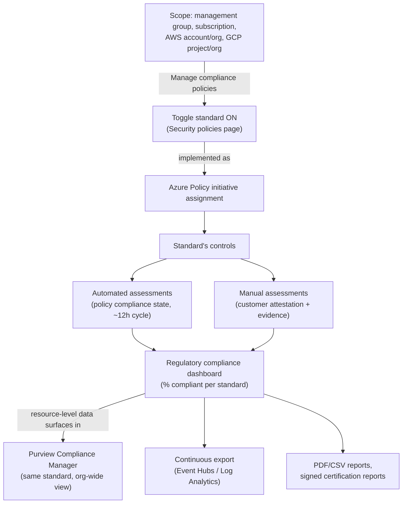
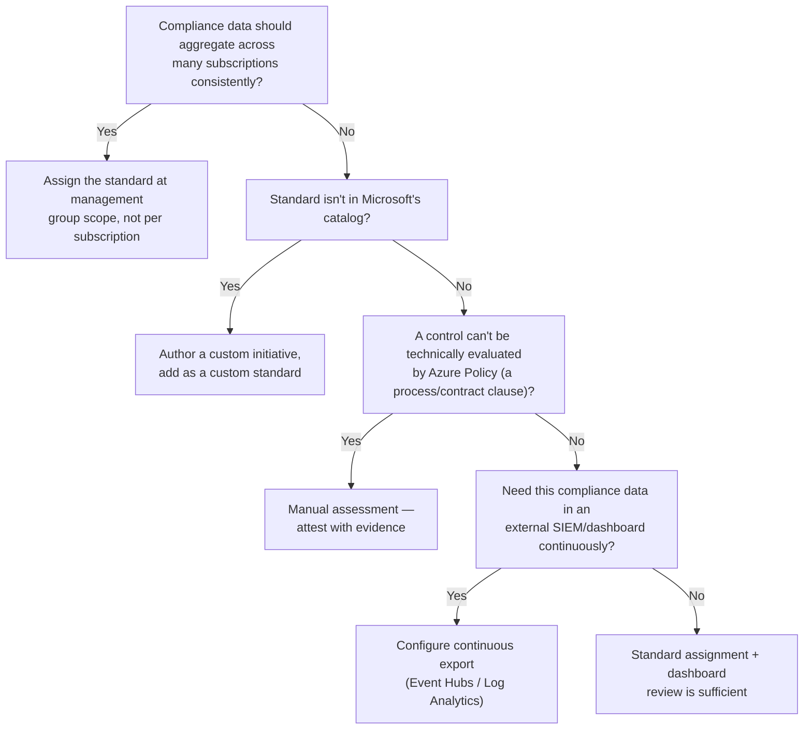

---
tags:
  - sc100
type: concept
domain:
  - infrastructure
aliases:
  - Regulatory Compliance dashboard
  - Manage compliance policies
  - Assign a standard
---
# Assigning Regulatory Compliance Standards

## Purpose

The mechanics [[Security Posture Assessments]] only summarizes — exactly **where** and **how** a named regulatory standard gets assigned to a scope in [[Microsoft Defender for Cloud]], what that assignment actually does under the hood, and how it drives measurable compliance.

---

## Why Architects Choose It

- "Get compliant with standard X" is meaningless until it's answered architecturally as: *which scope* does the standard apply to, *who* is allowed to turn it on, and *what mechanism* actually evaluates it — this note is that missing middle step between naming a regulation and seeing a compliance percentage.
- A regulatory standard in Defender for Cloud **is** an Azure Policy initiative under the hood — assigning a standard is assigning a policy initiative, so everything an architect already knows about [[Azure Policy]] scope/inheritance/exemptions applies directly.
- Assignment scope is itself an architecture decision with a stated best practice: assign at the **highest applicable scope** (management group over individual subscription) so compliance data aggregates and tracks consistently across every nested resource, rather than being assigned — and drifting — subscription by subscription.
- Since a recent integration, resource-level compliance data from an assigned standard **automatically surfaces in [[Purview Compliance Manager]]** for the same standard — assigning a standard once now feeds both the technical (Defender for Cloud) and organizational/process (Compliance Manager) views of compliance without duplicate setup.

---

## When to Use

- Mapping a named regulation (PCI DSS, ISO 27001, NIST CSF, CIS benchmarks, a custom internal standard) to measurable, continuously assessed technical controls across Azure, AWS, and GCP resources.
- Producing audit-ready evidence — downloadable PDF/CSV compliance reports, or signed Microsoft/Dynamics certification reports (PCI, SOC, ISO, etc.) — for external auditors.
- Feeding compliance state into a SIEM or governance dashboard via continuous export (Event Hubs/Log Analytics) rather than manually checking the portal.
- Triggering an automated response (a Logic App notification, a ticket) when a regulatory assessment's status changes.

---

## When NOT to Use

- Assigning a standard at subscription scope when a management-group-wide rollout is the actual requirement — fragments compliance tracking and multiplies the toggling work.
- Treating "standard assigned" as "compliant" — assignment only starts continuous assessment; controls still need remediation (automated) or attestation with evidence (manual) before the score reflects real compliance.
- Granting a user **Owner** or **Policy Contributor** at a broad scope just so they can toggle standards on — that's the minimum required permission, but it's also broad write access to policy; consider whether the narrower **Security Admin** role (sufficient to view/manage security policy without full policy-authoring rights) fits the actual need.
- Assuming a paid Defender for Cloud plan is optional — non-default (non-MCSB) standards require at least one paid plan enabled on the scope; Defender for Servers Plan 1 and Defender for APIs Plan 1 specifically don't unlock compliance standards.

---

## Architecture

---

## Where to Assign a Standard — the Actual Steps

1. In the Azure portal, go to **Microsoft Defender for Cloud → Regulatory compliance**.
2. Select **Manage compliance policies**.
3. Choose the **scope**: an Azure subscription or management group, an AWS account/management account, or a GCP project/organization. **Assign at the highest scope that legitimately applies** so nested resources aggregate under it automatically.
4. Select **Security policies**.
5. Find the standard and **toggle it On**. If the standard needs parameters (e.g., an exclusion list), a **Set parameters** page appears.
6. The standard now appears as enabled for that scope on the Regulatory compliance dashboard, and Defender for Cloud begins continuous assessment (assessments refresh roughly every **12 hours**).

**Permissions**: `Owner` or `Policy Contributor` to *assign* a standard; at minimum `Resource Policy Contributor` + `Security Admin`, or the subscription `Reader` role (not `Security Reader`, which lacks access to policy compliance data), to *view* compliance results.

**Prerequisite**: any Defender for Cloud paid plan except Defender for Servers Plan 1 or Defender for API Plan 1 must be onboarded to the scope before non-default standards can be added. The **MCSB** standard is enabled by default the moment Defender for Cloud is enabled on a scope — see [[Microsoft Cloud Security Benchmark (MCSB)]].

**Custom standards**: an organization can author a custom initiative and add it as a custom regulatory standard the same way, for internal or non-Microsoft-catalogued requirements.

---

## Achieving Compliance for an Assigned Standard

- Each standard breaks down into **controls**, each control into one or more **assessments** — automated or manual — the same Control → Assessment vocabulary Compliance Manager uses, applied here to technical resource state instead of organizational process.
- **Automated assessments**: driven by Azure Policy compliance state directly — remediate the underlying misconfiguration (e.g., "Disk encryption should be applied on virtual machines") via **Take action** on the recommendation, and the next ~12-hour assessment cycle reflects the fix in the compliance percentage.
- **Manual assessments**: controls Azure Policy can't technically evaluate (a process, a physical control, a contractual clause) — remediated by **attesting**: selecting the relevant subscriptions, entering supporting information, and attaching evidence, then saving. This is the mechanism behind "prove a non-technical control is met."
- **Investigate and drill down**: select a standard → a control → **Control details** to see **Overview**, **Your Actions** (your remediation/attestation work), and **Microsoft Actions** (what Microsoft has already done for Microsoft-managed portions of the control) — the same Microsoft-managed/customer-managed/shared control split [[Purview Compliance Manager]] uses.
- **Reporting**: **Download report** produces a point-in-time PDF/CSV summary for stakeholders/auditors; **Audit reports** downloads Microsoft's own signed certification reports (PCI, SOC, ISO, etc.) demonstrating Azure/Dynamics' own compliance with the framework — evidence about the platform, not your workload.
- **Automation**: workflow automation can trigger a Logic App whenever a regulatory compliance assessment changes state (e.g., notify a compliance owner on a failed assessment) — see [[Playbooks and Automation Rules]].

---

## Architecture Decisions

---

## Comparison

| Compare | Difference |
| --- | --- |
| Assigning a standard in Defender for Cloud vs. creating an assessment in [[Purview Compliance Manager]] | Defender for Cloud: technical resource configuration, evaluated automatically via Azure Policy, ~12-hour cycle, scoped to Azure/AWS/GCP resources. Compliance Manager: organizational/process controls (often attestation-based), spans Microsoft 365 + multicloud, scored via improvement actions. Both can now target the *same* named standard, and Defender for Cloud's resource-level results **automatically feed into** Compliance Manager for that standard. |
| Automated assessment vs. manual assessment | Automated: driven directly by Azure Policy compliance state, no customer action needed to *evaluate* (only to *remediate*). Manual: requires customer attestation and attached evidence, because the control isn't something a policy definition can technically check. |
| Assigning at management group vs. subscription scope | Management group: one assignment, aggregated compliance data across every nested subscription, Microsoft's recommended default. Subscription: isolated tracking per subscription — needed only when different subscriptions genuinely require different standards, not as a default. |
| `Security Reader` vs. `Reader` for viewing compliance data | `Security Reader` does **not** include access to Azure Policy compliance data and therefore can't view regulatory compliance results properly; the subscription `Reader` role (or `Resource Policy Contributor` + `Security Admin`) is what's actually required — a frequent least-privilege trap. |
| MCSB vs. a named regulatory standard | MCSB is the default, auto-assigned baseline benchmark ([[Microsoft Cloud Security Benchmark (MCSB)]]) driving Secure Score. A named standard (PCI, ISO, NIST, custom) is an *additional*, explicitly assigned standard tracked in parallel on the same dashboard, requiring a paid plan. |

---

## AZ-500 Review

AZ-500 covers enabling Defender for Cloud and reading/remediating individual recommendations at the resource level. The regulatory compliance assignment workflow — scope selection, the Azure Policy initiative relationship, manual attestation, and the Purview Compliance Manager integration — is new depth for SC-100.

---

## What's New for SC-100

- Know the exact portal path and scope options for assigning a standard — **Regulatory compliance → Manage compliance policies → scope → Security policies → toggle On** — as a testable, concrete workflow, not an abstract "enable compliance" statement.
- Recognize a regulatory standard **is** an Azure Policy initiative assignment — the same scope-inheritance and remediation mechanics from [[Azure Policy]] apply directly.
- Treat scope selection (management group vs. subscription) as a deliberate architecture decision favoring the highest applicable scope, not an implementation detail.
- Know the automated-vs-manual assessment split and that manual assessments require explicit attestation + evidence — a control isn't "done" just because Azure Policy can't check it automatically.
- Recognize the Defender for Cloud ↔ Purview Compliance Manager integration as the current architecture: assigning a standard once feeds both the technical and organizational compliance views for that standard.

---

## Exam Tips

- "Compliance data should aggregate consistently across 40 subscriptions under one management group" → assign the standard at the **management group**, not each subscription.
- "A user needs to view regulatory compliance results but shouldn't be able to change policy" → grant `Reader` (or `Resource Policy Contributor` + `Security Admin`), not `Security Reader` — `Security Reader` alone won't show the compliance data.
- "A control requires physical security procedures documentation" → manual assessment with attestation and attached evidence, not an automated policy check.
- "The org wants regulatory compliance state in their existing SIEM continuously" → continuous export to Event Hubs/Log Analytics, not manual periodic report downloads.
- "We enabled Defender for Servers Plan 1 but can't add a non-default standard" → Plan 1 (and API Plan 1) don't unlock compliance standards; a higher/different plan is required.
- A scenario needing the *same* standard tracked for both technical config and organizational process points to assigning it once in Defender for Cloud and letting it surface into Compliance Manager, not configuring both separately.

---

## Common Exam Confusion

- **Defender for Cloud regulatory compliance vs. Purview Compliance Manager** — technical resource config vs. organizational/process controls; now integrated for a shared standard, but still two different scoring domains. Full detail in [[Purview Compliance Manager]].
- **`Security Reader` vs. `Reader`** — a frequent least-privilege trap; `Security Reader` lacks policy compliance data access.
- **Automated vs. manual assessments** — policy-driven evaluation vs. customer attestation with evidence.
- **MCSB (default, auto-assigned) vs. a named standard (explicitly assigned, needs a paid plan)**.

---

## Keywords

- Regulatory compliance dashboard, Manage compliance policies, Security policies
- Standard assignment scope: management group, subscription, AWS account, GCP project
- Azure Policy initiative (underlying mechanism)
- Automated assessment vs. manual assessment, attestation, evidence
- `Owner`/`Policy Contributor` (assign) vs. `Reader`/`Resource Policy Contributor`+`Security Admin` (view)
- Continuous export, workflow automation trigger
- Compliance report (PDF/CSV), audit/certification report
- Purview Compliance Manager integration

---

## Related Services

- [[Security Posture Assessments]] — where this workflow is summarized alongside Secure Score.
- [[Purview Compliance Manager]] — the organizational/process compliance counterpart this now integrates with.
- [[Compliance and Privacy]]
- [[Azure Policy]] — the underlying enforcement mechanism.
- [[Microsoft Cloud Security Benchmark (MCSB)]] — the default, always-on standard.
- [[Security Scoring Dashboards]] — routing "which score answers which question."
- [[Defender for Cloud REST API]] — programmatic assignment via `Standard Assignments`/`Regulatory Compliance Standards` operations.
- [[Microsoft Defender for Cloud]]
- [[Playbooks and Automation Rules]] — triggering a workflow on assessment state change.

---

## References

- [Assign regulatory compliance standards in Microsoft Defender for Cloud](https://learn.microsoft.com/en-us/azure/defender-for-cloud/assign-regulatory-compliance-standards) — Microsoft Learn
- [Improve regulatory compliance in Microsoft Defender for Cloud](https://learn.microsoft.com/en-us/azure/defender-for-cloud/regulatory-compliance-dashboard) — Microsoft Learn
- [[Exam Objectives]]
