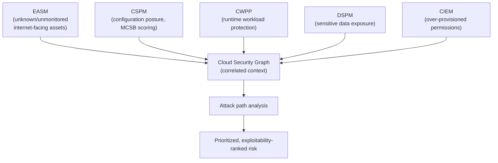
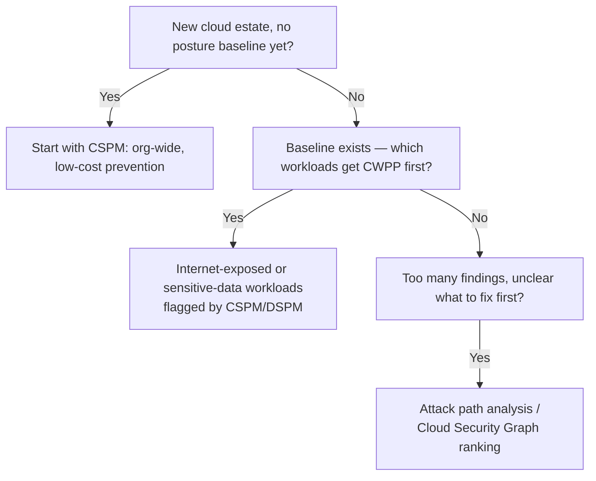

---
tags:
  - sc100
type: concept
domain:
  - infrastructure
aliases:
  - CNAPP
---

# CSPM and CWPP

## Purpose

How [[Security Posture Assessments|CSPM]] (prevent misconfiguration) and [[Cloud Workload Protection (CWPP)|CWPP]] (detect/respond to active threats) combine into one risk-reduction lifecycle inside [[Microsoft Defender for Cloud]] — Microsoft's CNAPP (Cloud-Native Application Protection Platform). This note is the synthesis; each capability's own depth lives in its dedicated note.

---

## Why Architects Choose It

- Neither layer alone closes the risk gap: CSPM without CWPP means a perfectly-configured resource can still be exploited via a runtime vulnerability; CWPP without CSPM means detection is fighting fires the posture layer should have prevented in the first place.
- Microsoft packages both — plus [[Data Security Posture Management (DSPM)|DSPM]] and CIEM (see [[Securing Privileged Access]]) — as a single CNAPP, correlating posture, workload, identity, and data signals on one **Cloud Security Graph** instead of four disconnected tools.
- **Attack path analysis** is the concrete payoff of combining them: a misconfigured resource (CSPM finding) that's *also* internet-exposed *and* running vulnerable software (CWPP finding) *and* holds sensitive data (DSPM finding) ranks far higher than any single finding would in isolation.
- Sequencing matters for cost and effort: CSPM is broad, cheap, and prevents entire classes of exposure before they exist; CWPP is targeted, costs more per resource, and is worth prioritizing on crown-jewel/internet-facing workloads first.

---

## External Attack Surface Management (EASM)

Defender EASM answers a different question than CSPM, CWPP, DSPM, or CIEM: *what internet-facing assets does the organization have that security teams don't even know about?* The other four signals in the Architecture diagram below all assume the resource is already known — inside Defender for Cloud, Purview, or Entra. EASM discovers from the outside in, the same reconnaissance an attacker would perform, before any of the other tools ever gets a chance to assess the asset.

- **Discovery, not assessment** — Defender EASM's proprietary discovery engine recursively maps infrastructure from known seed assets (domains, IP blocks, ASNs, WHOIS records) to uncover previously unknown or unmonitored properties: forgotten subdomains, shadow-IT web apps, stale third-party dependencies, dev/test environments never decommissioned.
- **Inventory and risk insights** — discovered assets are classified as recent (active) or historic, then scored for vulnerabilities, compliance gaps, and infrastructure risk — an **Attack Surface** view, distinct from Secure Score.
- **Feeds the same correlated risk view** — EASM findings feed Security Exposure Management (see [[Security Posture Assessments]]) and the Cloud Security Graph alongside CSPM/CWPP/DSPM/CIEM, so an unknown internet-facing asset with a real vulnerability gets prioritized the same way a known one would.
- Full depth — what actually counts as external attack surface (subdomain takeover, certificate sprawl, DNS hygiene, post-M&A exposure) and how to defend each category — lives in [[External Attack Surface Management (EASM)]]; this section stays at "where EASM fits among CSPM/CWPP/DSPM/CIEM."

---

## When to Use

- Establishing a new cloud security program — start with CSPM (org-wide, low cost, prevents exposure) before layering CWPP onto specific workloads.
- Prioritizing a long list of findings from multiple tools — attack path analysis and the Cloud Security Graph, which correlate CSPM + CWPP + DSPM signals into one ranked risk list.
- Justifying which workloads get the more expensive CWPP plans first — internet-exposed or sensitive-data-holding resources identified by CSPM/DSPM, not a uniform rollout.
- Explaining Defender for Cloud's category to a broader audience — CNAPP is the umbrella industry term; CSPM/CWPP/DSPM/CIEM are the capabilities inside it.
- Discovering internet-facing assets the organization doesn't know it owns — Defender EASM, before CSPM/CWPP can even assess them.

---

## When NOT to Use

- Treating "we have Defender for Cloud enabled" as equivalent to having both layers configured — CSPM is on by default at a baseline; CWPP plans are opt-in per workload type and cost extra.
- Chasing every individual CSPM recommendation or CWPP alert by count — attack-path-ranked prioritization is the architecture answer, not raw finding volume (already covered in [[Security Posture Assessments]]).
- Assuming CNAPP is a single product to buy — it's a category; Defender for Cloud is Microsoft's implementation, unifying capabilities that used to be separate tools.

---

## Architecture

---

## Architecture Decisions

---

## Comparison

| Compare | Difference |
| --- | --- |
| CSPM vs. CWPP | Full breakdown in [[Security Posture Assessments]] and [[Cloud Workload Protection (CWPP)]] — prevent (configuration) vs. detect/respond (runtime). |
| CNAPP vs. CSPM/CWPP individually | CNAPP is the umbrella category correlating posture, workload, identity, and data risk together; CSPM and CWPP (plus DSPM/CIEM) are the individual capabilities it unifies. Defender for Cloud *is* Microsoft's CNAPP — don't treat "CNAPP" as a separate product to shop for. |
| Attack path analysis vs. raw recommendation/alert count | Attack paths rank findings by actual exploitability and reachability across combined signals; raw counts treat every recommendation or alert as equally urgent, which they aren't. |
| EASM vs. CSPM | EASM discovers internet-facing assets the organization may not even know it owns (outside-in reconnaissance); CSPM assesses the configuration of resources already known to and managed within Azure/AWS/GCP (inside-out). EASM often *feeds* CSPM's inventory rather than replacing it. |

---

## AZ-500 Review

AZ-500 doesn't cover CNAPP, attack path analysis, or the Cloud Security Graph at all — it's scoped to configuring individual Defender for Cloud plans and reading their outputs in isolation. Correlating posture, workload, identity, and data signals into one prioritized risk view is entirely new for SC-100.

---

## What's New for SC-100

- Know CNAPP as the named industry category Defender for Cloud implements, and that it's a correlation of CSPM + CWPP + DSPM + CIEM, not a fifth separate tool.
- Recommend CSPM-first, CWPP-targeted-second as the standard cloud security program sequencing — an explicit maturity/cost architecture answer, not "enable everything at once."
- Use attack path analysis and the Cloud Security Graph as the prioritization mechanism when a scenario combines multiple finding types (misconfiguration + vulnerability + exposed data) — the exam rewards recognizing *combined* signal over any single tool's output.
- Know Defender EASM as the outside-in discovery layer that finds assets *before* CSPM/CWPP/DSPM ever get a chance to assess them — a distinct capability from the other four, not a fifth flavor of posture scoring.

---

## Exam Tips

- A scenario listing findings from multiple categories (a misconfigured NSG, a vulnerable VM, a publicly-readable storage account with sensitive data) is testing attack path analysis, not which single tool to check first.
- "What should we deploy first for a brand-new subscription" → CSPM, not CWPP.
- Don't answer "CNAPP" as if it names a specific Azure resource or plan — it's the category; the actionable answer is always the specific plan (CSPM, Defender for Servers, etc.).
- "Discover shadow IT / forgotten internet-facing assets we don't know we own" → Defender EASM, not CSPM — CSPM only sees what's already inside a managed subscription.

---

## Common Exam Confusion

- **CNAPP vs. CSPM/CWPP** — umbrella category vs. the individual capabilities inside it.
- **Attack path priority vs. finding count** — exploitability-ranked vs. raw volume; see [[Security Posture Assessments]] for the same point applied to Secure Score specifically.
- **EASM vs. CSPM** — outside-in discovery of unknown assets vs. inside-out configuration scoring of known ones; full comparison above.

---

## Keywords

- Cloud-Native Application Protection Platform (CNAPP)
- Cloud Security Graph
- Attack path analysis
- Prevent (CSPM) vs. detect/respond (CWPP)
- Exploitability-ranked prioritization
- External Attack Surface Management (EASM)
- Outside-in discovery, unknown/unmonitored assets, Attack Surface score

---

## Related Services

- [[Security Posture Assessments]]
- [[Cloud Workload Protection (CWPP)]]
- [[Data Security Posture Management (DSPM)]]
- [[Securing Privileged Access]]
- [[Microsoft Defender for Cloud]]
- [[Zero Trust]]
- [[External Attack Surface Management (EASM)]]

---

## References

- [Microsoft Defender for Cloud provides CNAPP security](https://www.microsoft.com/en-us/security/blog/2023/03/22/the-next-wave-of-multicloud-security-with-microsoft-defender-for-cloud-a-cloud-native-application-protection-platform-cnapp/) — Microsoft Security Blog
- [Identify and remediate attack paths](https://learn.microsoft.com/en-us/azure/defender-for-cloud/how-to-manage-attack-path) — Microsoft Learn
- [Defender EASM overview](https://learn.microsoft.com/en-us/azure/external-attack-surface-management/overview) — Microsoft Learn
- [[Exam Objectives]]
