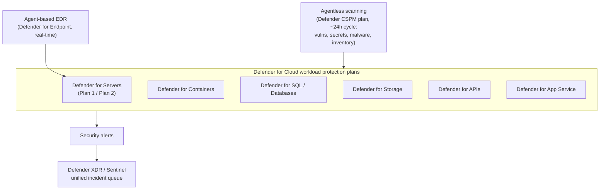
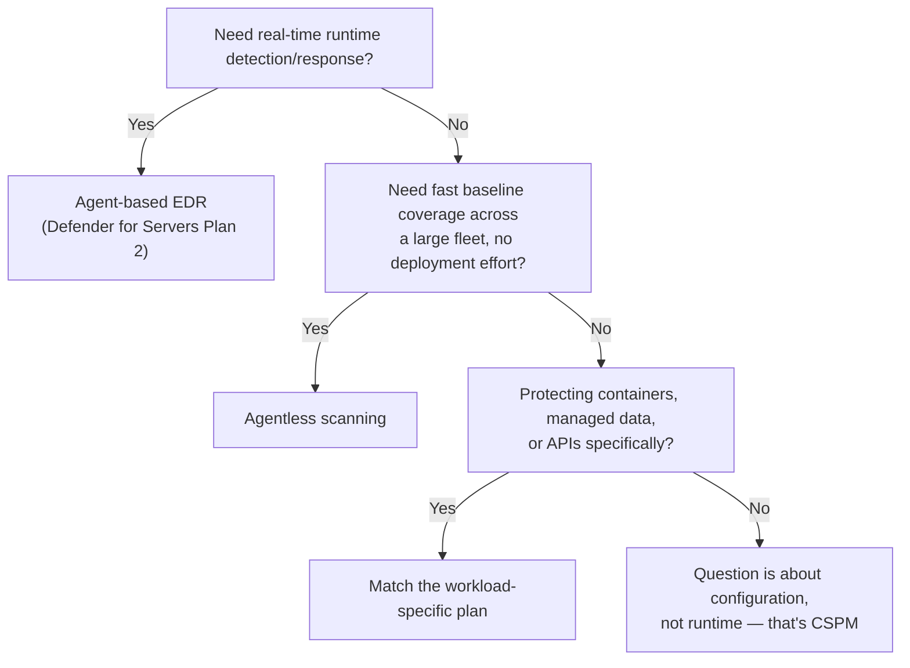

---
tags:
  - sc100
---
# Cloud Workload Protection (CWPP)

## Purpose

CWPP is active, runtime protection of the workload itself (VMs, containers, databases, storage, APIs) — the counterpart to CSPM's static configuration scoring, both delivered as plans inside [[Microsoft Defender for Cloud]].

---

## Why Architects Choose It

- Posture ([[Security Posture Assessments|CSPM]]) tells you what's misconfigured *before* an incident; CWPP detects and responds to what's actively happening on a running resource — an architecture needs both, not one instead of the other.
- Coverage spans compute types with fundamentally different attack surfaces (VM process behavior, container image/runtime, database query patterns, API abuse) — one CWPP plan per workload type, not a single generic control.
- Agentless and agent-based collection are complementary, not competing choices — agentless (≈24h cycle: software inventory, vulnerabilities, secrets, malware) gives fast, low-friction baseline coverage; agent-based (Defender for Endpoint integration, real-time) gives runtime EDR depth. Choosing only one leaves a gap.
- CWPP alerts flow into [[Microsoft Defender XDR]] and [[Microsoft Sentinel]] for the same unified incident queue used everywhere else in the SOC (see [[Security Operations]]) — workload protection isn't a siloed console.

---

## When to Use

- Protecting compute that runs continuously (VMs, containers, App Service) against active exploitation — Defender for Servers / Containers / App Service. Container/AKS-specific architecture (cluster RBAC, network policy, workload identity, admission control) beyond enabling this plan is covered in [[Container and Kubernetes Security]].
- Baseline visibility (vulnerabilities, secrets, malware, software inventory) across a large fleet with minimal deployment friction — **agentless scanning** (bundled in the Defender CSPM plan).
- Real-time behavioral detection and response on a server — **Defender for Servers Plan 2**, which layers Defender for Endpoint's agent-based EDR on top.
- Protecting managed data services (SQL, Cosmos DB, Storage) from anomalous access/exfiltration patterns — Defender for SQL/Databases/Storage. **Defender for Storage** specifically scans blobs for malware on upload and flags anomalous access patterns (unusual location, Tor exit node, unexpected data-extraction volume); **Defender for Databases** flags anomalous query patterns (potential SQL injection, brute-force login, unusual data-exfiltration-shaped queries) — both are detection layers on top of, not a replacement for, the encryption/access-control design in [[Data Classification and Protection]].
- Assessing custom API exposure against the OWASP API Top 10 — Defender for APIs.

---

## When NOT to Use

- Relying on agentless scanning alone where real-time detection/response matters — its ~24-hour scan cycle misses fast-moving runtime attacks by design.
- Enabling every workload-specific plan uniformly regardless of what's actually deployed — CWPP is priced and enabled per plan/per resource type; unused plans are pure cost with no protection benefit.
- Treating a CWPP alert as a posture problem — an active detection needs incident response (see [[Security Operations]]), not a Secure Score remediation task.

---

## Architecture

---

## Architecture Decisions

---

## Comparison

| Compare | Difference |
| --- | --- |
| Agentless scanning vs. agent-based EDR | Agentless: no install, no performance impact, ~24h scan cycle, covers software inventory/vulnerabilities/secrets/malware — good baseline, not real-time. Agent-based: Defender for Endpoint agent, continuous/real-time, adds behavioral detection and active response. Bundled together for full coverage, not a strict either/or. |
| Defender for Servers Plan 1 vs. Plan 2 | Plan 1: threat detection for the VM/server itself. Plan 2: adds the full agent-based EDR bundle (Defender for Endpoint), vulnerability assessment, and adaptive application controls — the more complete, higher-tier plan. |
| CWPP vs. EDR | EDR (Defender for Endpoint) is the agent and detection engine; CWPP is the broader category of workload protection plans that *use* EDR as one input alongside agentless scanning, network-layer alerts, and workload-specific detections (SQL, container, API). EDR is a component inside CWPP, not a synonym for it. |
| CWPP vs. CSPM | Full comparison in [[Security Posture Assessments]] — CSPM scores configuration before an incident; CWPP detects and responds to activity during one. |

---

## AZ-500 Review

AZ-500 already covers enabling individual Defender for Cloud plans and reading their alerts at the resource level. SC-100 adds: choosing which plans a workload actually needs, deciding agentless vs. agent-based (or both) per scenario, and treating plan selection as a cost/coverage architecture trade-off rather than "turn everything on."

---

## What's New for SC-100

- Know agentless scanning as a specific, named capability (part of the Defender CSPM plan) with a defined ~24h cycle — not a synonym for "no protection," and not the same product as agent-based EDR.
- Map workload type to plan deliberately (Servers/Containers/SQL/Storage/APIs/App Service) as an explicit design exercise, not "enable Defender for Cloud" as a single action.
- Recognize Defender for Servers Plan 2 as the plan that bundles Defender for Endpoint's agent-based EDR — a frequent "which plan gives me EDR" exam trap.
- Route CWPP alerts into the same unified incident queue as everything else (see [[Security Operations]]) rather than treating workload protection as a separate console/workflow.

---

## Exam Tips

- "Fast, low-friction vulnerability/secrets/malware baseline across a large VM fleet" → agentless scanning, not agent deployment.
- "Real-time runtime threat detection and response on a server" → Defender for Servers Plan 2, not agentless scanning alone.
- "Which plan adds EDR" → Defender for Servers Plan 2, not Plan 1.
- "Detect malware in a file uploaded to Blob Storage" → Defender for Storage's malware scanning, not Defender for Servers or a CSPM finding.
- "Detect a potential SQL injection or brute-force login attempt against a database" → Defender for Databases, a runtime detection — not an encryption or access-control (CSPM) fix on its own.
- A scenario describing a misconfiguration (not an active attack) is a CSPM question even if it's about a running workload — see [[Security Posture Assessments]].

---

## Common Exam Confusion

- **Agentless scanning vs. agent-based EDR** — full breakdown above; the exam tests whether you know agentless is periodic/baseline, not real-time.
- **CWPP vs. EDR** — category vs. component.
- **Defender for Servers Plan 1 vs. Plan 2** — base detection vs. full EDR bundle.

---

## Keywords

- Cloud Workload Protection Platform (CWPP)
- Defender for Servers Plan 1 / Plan 2
- Agentless scanning (vulnerabilities, secrets, malware, software inventory)
- Agent-based EDR (Defender for Endpoint integration)
- Defender for Containers / SQL / Storage / APIs / App Service
- OWASP API Top 10
- Runtime protection vs. configuration posture

---

## Related Services

- [[Security Posture Assessments]]
- [[CSPM and CWPP]]
- [[Microsoft Defender for Cloud]]
- [[Microsoft Defender]]
- [[Microsoft Defender XDR]]
- [[Security Operations]]
- [[Securing IaaS and PaaS Services]]
- [[Container and Kubernetes Security]]

---

## References

- [Review workload protection in Microsoft Defender for Cloud](https://learn.microsoft.com/en-us/azure/defender-for-cloud/workload-protections-dashboard) — Microsoft Learn
- [Agentless machine scanning in Microsoft Defender for Cloud](https://learn.microsoft.com/en-us/azure/defender-for-cloud/concept-agentless-data-collection) — Microsoft Learn
- [Overview of Defender for Servers](https://learn.microsoft.com/en-us/azure/defender-for-cloud/defender-for-servers-overview) — Microsoft Learn
- (https://aka.ms/defenderforcloud, https://aka.ms/dfcninja)
- [[Exam Objectives]]
