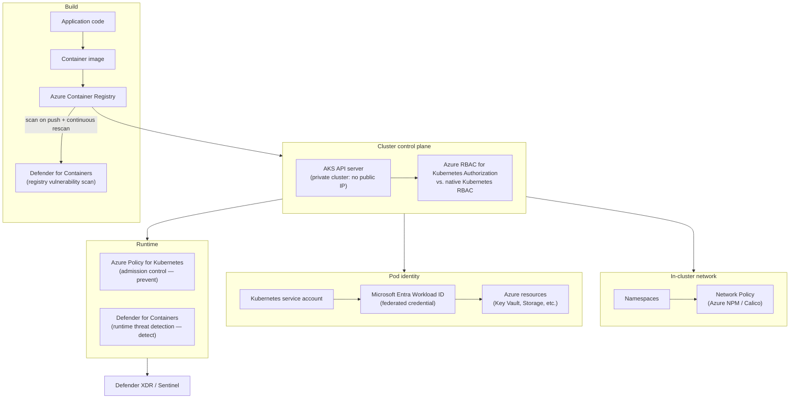
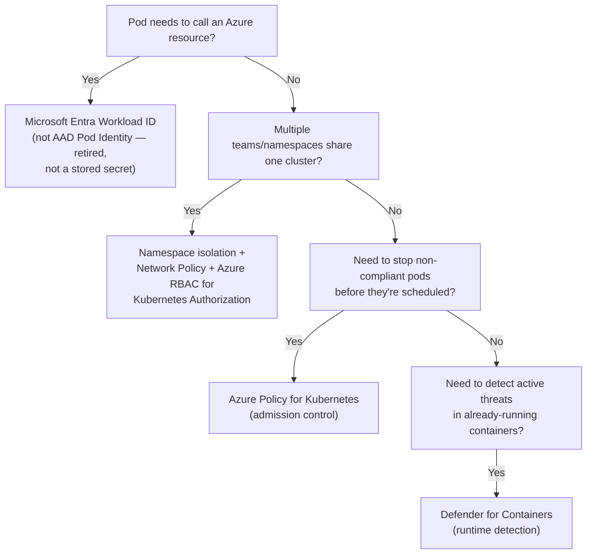

---
tags:
  - sc100
type: concept
domain:
  - infrastructure
aliases:
  - AKS Security
  - Kubernetes Security
status: needs-verification
---
# Container and Kubernetes Security

## Purpose

Architecting security across the container lifecycle — image build, cluster control plane, in-cluster network, and pod-level workload identity — for AKS/Kubernetes specifically, as distinct from *enabling* [[Cloud Workload Protection (CWPP)|Defender for Containers]] as a runtime-detection plan.

---

## Why Architects Choose It

- Containers share a kernel and, often, a cluster — one vulnerable base image or one over-permissioned pod can affect every workload co-located with it, so security has to be designed at build, cluster, and runtime layers, not toggled on as a single Defender plan.
- [[Cloud Workload Protection (CWPP)]] covers *which Defender plan* protects a container workload at runtime; this note covers the architecture decisions upstream and around that plan — image provenance, cluster identity model, network segmentation inside the cluster, and pod-to-Azure authentication.
- Kubernetes ships its own RBAC and network model, separate from Azure's — an architect has to decide whether to run two parallel permission systems or collapse into one governed by Entra ID.
- Legacy pod-to-Azure authentication patterns (stored secrets, the retired AAD Pod Identity project) are exactly the standing-credential problem [[Identity and Access Management (IAM)]] argues against — containers are where that problem shows up at the highest density (many short-lived pods, each needing Azure access).

---

## When to Use

- Running production workloads on AKS where multiple teams/namespaces share a cluster — namespace isolation, Network Policy, and Azure RBAC for Kubernetes Authorization become required, not optional.
- A pod needs to call Azure resources (Key Vault, Storage, a database) — **Microsoft Entra Workload ID** (federated credential per Kubernetes service account), not a stored secret or the retired AAD Pod Identity.
- Images are pulled from a registry before deployment — Azure Container Registry (ACR) integrated with Defender for Containers for vulnerability scanning on push and continuous rescan.
- Enforcing cluster-wide guardrails (no privileged containers, no `:latest` tags, required resource limits) before a pod is ever scheduled — **Azure Policy for Kubernetes** (Gatekeeper-based admission control).
- Restricting the Kubernetes API server itself from public exposure — **AKS private cluster**.

---

## When NOT to Use

- A single-container App Service deployment with no orchestrator — there's no cluster RBAC, network policy, or admission control layer to design; that's Defender for App Service, covered in [[Cloud Workload Protection (CWPP)]].
- Small/dev/test clusters where private-cluster networking and full admission-control policy sets add operational friction disproportionate to the risk — apply the full architecture to production and shared clusters first.
- Treating Defender for Containers alone as "container security done" — it detects and scans; it doesn't prevent a non-compliant pod from being scheduled or replace cluster-level identity/network design.

---

## Architecture

---

## Architecture Decisions

---

## Comparison

| Compare | Difference |
| --- | --- |
| Kubernetes RBAC vs. Azure RBAC for Kubernetes Authorization | Native Kubernetes RBAC manages permissions via `ClusterRoleBinding`/`RoleBinding` objects, checked against the cluster's own identity model. Azure RBAC for Kubernetes Authorization extends Azure's control plane to authorize `kubectl`/API calls using Entra ID identities and Azure role assignments — Microsoft's recommended path, since it centralizes Kubernetes access into the same governance (Conditional Access, PIM, access reviews) as every other Azure resource instead of a parallel permission system. |
| Microsoft Entra Workload ID vs. AAD Pod Identity vs. node-level managed identity | Workload ID: a federated credential tied to a specific Kubernetes service account (OIDC federation, no stored secret) — the current recommended pattern. AAD Pod Identity: the predecessor open-source project, **retired** — a scenario naming it is a legacy-migration trap, not a valid current answer. Node-level managed identity: assigned to the underlying VM/VMSS, so *every* pod scheduled on that node shares it — too broad for workload-scoped access. |
| Defender for Containers vs. Azure Policy for Kubernetes | Defender for Containers **detects** — registry image scanning plus runtime threat detection on already-running containers. Azure Policy for Kubernetes **prevents** — Gatekeeper-based admission control that blocks a non-compliant pod (privileged mode, missing resource limits, disallowed image source) from being scheduled at all. Complementary detect/prevent layers, not substitutes. |
| Network Policy vs. NSG | NSG operates at the Azure network layer — VNet/subnet/NIC — and has no visibility inside a Kubernetes cluster's pod-to-pod traffic. Network Policy (Azure NPM or Calico) is a Kubernetes-native construct that segments traffic between pods/namespaces *inside* the cluster. Full segmentation needs both: NSG at the cluster's VNet boundary, Network Policy within it. |

---

## AZ-500 Review

AZ-500 covers AKS security at the configuration level — enabling the Network Policy option and the Azure Policy add-on at cluster creation, onboarding Defender for Containers. It does not cover Azure RBAC for Kubernetes Authorization as an architectural choice over native Kubernetes RBAC, Microsoft Entra Workload ID design, or treating build → cluster → network → runtime as one connected security architecture — all new for SC-100.

---

## What's New for SC-100

- Treat container security as four connected layers (build/cluster/network/runtime) rather than a single "enable Defender for Containers" checkbox.
- Recommend Microsoft Entra Workload ID as the default for pod-to-Azure authentication — explicitly over AAD Pod Identity (retired) and over node-level managed identity (too broad).
- Recommend Azure RBAC for Kubernetes Authorization over native Kubernetes RBAC when the goal is centralizing governance into existing Entra ID roles, PIM, and access reviews.
- Pair Azure Policy for Kubernetes (prevent, admission-time) with Defender for Containers (detect, runtime) as two distinct, necessary controls — a common exam trap is treating either one as sufficient alone.

---

## Exam Tips

- "Pod needs to read a secret from Key Vault without a stored credential" → Microsoft Entra Workload ID.
- A scenario mentioning **AAD Pod Identity** is describing a legacy/retired pattern — the correct modern answer is Workload ID, not "continue using AAD Pod Identity."
- "Prevent privileged containers from ever being scheduled" → Azure Policy for Kubernetes (admission control), not Defender for Containers (which only detects after the fact).
- "Centralize Kubernetes access into existing Entra ID roles instead of managing kubeconfig-based permissions separately" → Azure RBAC for Kubernetes Authorization.
- "Segment traffic between pods in different namespaces" → Network Policy, not NSG (NSG can't see inside the cluster).

---

## Common Exam Confusion

- **Kubernetes RBAC vs. Azure RBAC for Kubernetes Authorization** — cluster-native permission model vs. Azure-governed, Entra ID-backed model; full comparison above.
- **Defender for Containers vs. Azure Policy for Kubernetes** — detect (runtime/registry scanning) vs. prevent (admission control).
- **Network Policy vs. NSG** — in-cluster pod/namespace segmentation vs. Azure VNet/subnet segmentation; different layer, both needed.
- **Workload ID vs. AAD Pod Identity vs. node-level managed identity** — current federated-credential pattern vs. retired project vs. over-broad node-shared identity.

---

## Keywords

- Azure Kubernetes Service (AKS), container security
- Defender for Containers — registry scanning vs. runtime threat detection
- Azure RBAC for Kubernetes Authorization
- Kubernetes RBAC (ClusterRoleBinding/RoleBinding)
- Microsoft Entra Workload ID, federated credential
- AAD Pod Identity (retired)
- Azure Policy for Kubernetes, Gatekeeper, admission control
- Network Policy (Azure NPM / Calico) vs. NSG
- AKS private cluster
- Azure Container Registry (ACR), image scanning, SBOM

---

## Related Services

- [[Cloud Workload Protection (CWPP)]]
- [[DevOps Security]]
- [[Identity and Access Management (IAM)]]
- [[Azure Policy]]
- [[Network Security Group]]
- [[Securing IaaS and PaaS Services]]
- [[Microsoft Defender]]
- [[Zero Trust]]
- [[CSPM and CWPP]]

---

## References

- [AKS security concepts](https://learn.microsoft.com/en-us/azure/aks/concepts-security) — Microsoft Learn
- [Microsoft Entra Workload ID](https://learn.microsoft.com/en-us/entra/workload-id/workload-identities-overview) — Microsoft Learn
- [Azure RBAC for Kubernetes Authorization](https://learn.microsoft.com/en-us/azure/aks/manage-azure-rbac) — Microsoft Learn
- [Defender for Containers overview](https://learn.microsoft.com/en-us/azure/defender-for-cloud/defender-for-containers-introduction) — Microsoft Learn
- [Azure Policy for Kubernetes](https://learn.microsoft.com/en-us/azure/governance/policy/concepts/policy-for-kubernetes) — Microsoft Learn
- [[Exam Objectives]]

---

## Verification Flag

Exact current status/GA date of AAD Pod Identity's retirement and any newer Workload ID capabilities — Microsoft's container identity guidance moves quickly. Re-verify close to exam date.
