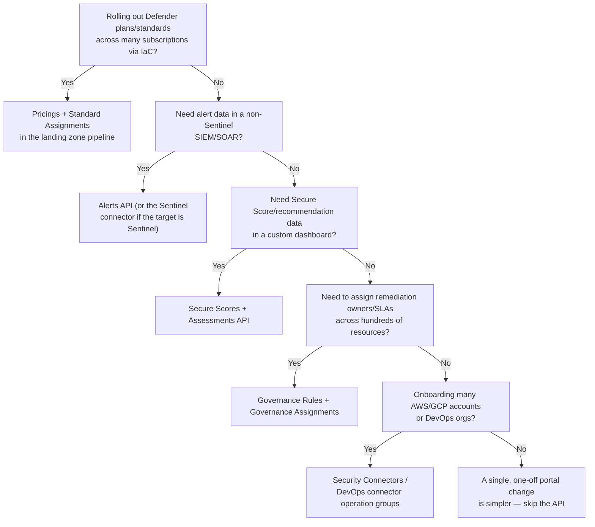

---
tags:
  - sc100
type: concept
domain:
  - infrastructure
aliases:
  - Defender for Cloud API
  - Microsoft.Security REST API
status: needs-verification
---
# Defender for Cloud REST API

## Purpose

What the `Microsoft.Security` REST API (the programmatic surface under [[Microsoft Defender for Cloud]]) is actually for — which operation groups exist, and the architecture use cases each one enables beyond what the portal gives you.

---

## Why Architects Choose It

- Every portal action in Defender for Cloud — enabling a plan, assigning a standard, reading Secure Score, reviewing an alert — has a corresponding REST operation, which is what makes Defender for Cloud **automatable at landing-zone scale** rather than something configured subscription-by-subscription by hand.
- It's the mechanism behind **infrastructure-as-code security baselines** — enabling Defender plans, assigning regulatory standards, and setting security contacts as part of a subscription-vending pipeline (Bicep/ARM/Terraform calling the same REST surface) rather than a manual post-provisioning checklist.
- It's how Defender for Cloud data reaches systems the portal doesn't — a custom executive dashboard, a non-Sentinel SIEM, a governance tool that needs Secure Score/recommendation data as structured JSON instead of a screenshot.
- Some operations (bulk governance rule assignment, custom recommendations, DevOps connector management at scale) have no efficient portal equivalent for large estates — the API is the only practical way to operate them at scale.

---

## When to Use

- Enabling/configuring Defender for Cloud **plans and sub-plans programmatically** across many subscriptions as part of a landing zone pipeline — the `Pricings` operations (`PUT /providers/Microsoft.Security/pricings/{pricingName}`).
- Assigning regulatory compliance standards or reading compliance results at scale, instead of toggling each subscription manually in the portal — `Standard Assignments`, `Regulatory Compliance Standards/Controls/Assessments`.
- Pulling **Secure Score, control-level scoring, and recommendation (assessment) data** into a custom dashboard or executive report — `Secure Scores`, `Secure Score Controls`, `Secure Score Control Definitions`, `Assessments`, `Assessments Metadata`, `Sub Assessments` (per-resource findings, e.g. individual vulnerabilities under one recommendation).
- Exporting or forwarding **security alerts** into a SIEM/SOAR that isn't natively connected — `Alerts`, `Alerts Suppression Rules` (managing noise programmatically rather than per-alert in the portal).
- Configuring **security notification routing** (who gets emailed on high-severity alerts) as code — `Security Contacts`.
- Onboarding and managing **multicloud connectors** (AWS/GCP) and **DevOps connectors** (GitHub, GitLab, Azure DevOps) at scale for many accounts/orgs — `Security Connectors`, `Azure DevOps Orgs/Projects/Repos`, `Git Hub Owners/Repos`, `Git Lab Groups/Projects/Subgroups`, `DevOps Configurations/Policies/Policy Assignments`.
- Driving **remediation accountability at scale** — assigning an owner and SLA to a recommendation programmatically across many resources — `Governance Rules`, `Governance Assignments`.
- Adding org-specific checks Microsoft doesn't ship — `Custom Recommendations`.
- Automating a response to a state change (a failed assessment, a new alert) via a registered automation resource — `Automations` (the resource that wires Defender for Cloud events to Event Hubs/Log Analytics/Logic Apps, configurable as code).
- SQL-specific vulnerability management as code — `Sql Vulnerability Assessment Scans/Scan Results/Baseline Rules/Settings`.

---

## When NOT to Use

- As a substitute for [[Microsoft Sentinel]]'s native Defender for Cloud data connector for routine SIEM ingestion — the connector already streams alerts/recommendations without custom API polling code; reach for the raw REST API when the target isn't Sentinel, or the data shape needed isn't what the connector provides.
- For one-off, single-subscription changes an admin can make faster in the portal — the API's value is **scale and repeatability**, not replacing every portal click.
- As a way to bypass RBAC — every call is still authorized against the caller's Azure RBAC permissions on the target scope; the API doesn't grant access, it exposes the same permission model programmatically.
- To manage identity/directory-side controls (Conditional Access, PIM) — those are Microsoft Graph/Entra ID APIs, a different control plane entirely (see [[Identity and Access Management (IAM)]]).

---

## Architecture

```mermaid
flowchart TD
    subgraph Posture["Posture & scoring"]
        SS["Secure Scores /<br/>Secure Score Controls"]
        Assess["Assessments /<br/>Sub Assessments"]
    end
    subgraph Compliance["Regulatory compliance"]
        StdA["Standard Assignments"]
        RCS["Regulatory Compliance<br/>Standards / Controls / Assessments"]
    end
    subgraph Config["Plan & policy config"]
        Pricing["Pricings<br/>(enable/configure Defender plans)"]
        Contacts["Security Contacts"]
        Gov["Governance Rules /<br/>Governance Assignments"]
    end
    subgraph Detection["Detection & response"]
        Alerts["Alerts /<br/>Alerts Suppression Rules"]
        Auto["Automations<br/>(trigger Logic Apps / Event Hub / Log Analytics)"]
    end
    subgraph Onboarding["Multicloud & DevOps onboarding"]
        Conn["Security Connectors<br/>(AWS / GCP)"]
        DevOps["Azure DevOps / GitHub / GitLab<br/>orgs, repos, policies"]
    end

    Pipeline["IaC pipeline / automation script"] --> Pricing
    Pipeline --> StdA
    Pipeline --> Contacts
    Pipeline --> Conn
    Pipeline --> Gov

    SIEM["Custom SIEM / dashboard"] --> Alerts
    SIEM --> SS
    SIEM --> RCS
```

---

## Notable Operation Groups

| Operation group | Use case |
| --- | --- |
| `Pricings` | Enable/disable a Defender plan and sub-plan (e.g., `VirtualMachines` plan with `subPlan=P1/P2`) at subscription or resource scope — the API behind programmatic Defender plan rollout. |
| `Assessments` / `Assessments Metadata` / `Sub Assessments` | Read recommendation-level and per-resource finding-level posture data — the raw data behind Secure Score and the Regulatory compliance dashboard. |
| `Secure Scores` / `Secure Score Controls` / `Secure Score Control Definitions` | Read the calculated Secure Score and its control-level breakdown — see [[Secure Score Mechanics]] for the formula this data feeds. |
| `Standard Assignments` / `Regulatory Compliance Standards` / `Regulatory Compliance Controls` / `Regulatory Compliance Assessments` | Programmatically assign a standard to a scope and read its control/assessment-level compliance results — the API form of [[Assigning Regulatory Compliance Standards]]. |
| `Alerts` / `Alerts Suppression Rules` | Read/dismiss security alerts and manage suppression rules at scale. |
| `Security Contacts` | Configure who receives security notification emails, and at what severity — as code. |
| `Governance Rules` / `Governance Assignments` | Assign an owner and remediation SLA to a recommendation across resources — accountability at scale. |
| `Custom Recommendations` | Register organization-specific checks Microsoft doesn't ship natively. |
| `Automations` | Manage the resource that triggers a Logic App/Event Hub/Log Analytics export when a Defender for Cloud event (alert, assessment change) occurs. |
| `Security Connectors` | Onboard/manage AWS accounts and GCP projects as multicloud connectors. |
| `Azure DevOps Orgs/Projects/Repos`, `Git Hub Owners/Repos`, `Git Lab Groups/Projects/Subgroups`, `DevOps Configurations/Policies/Policy Assignments` | Manage DevOps security connectors and policies (see [[DevOps Security]]) across many repos/orgs. |
| `Sql Vulnerability Assessment *` | Manage SQL vulnerability assessment scans, results, and baseline rules programmatically. |

---

## Architecture Decisions

---

## Comparison

| Compare | Difference |
| --- | --- |
| Defender for Cloud REST API vs. Sentinel's Defender for Cloud connector | The connector is a purpose-built, low-effort ingestion path *into Sentinel specifically*. The raw REST API is general-purpose — needed when the destination isn't Sentinel, or when writing (assigning plans/standards) rather than just reading alerts. |
| `Pricings` API vs. portal plan toggle | Same underlying action (enable a Defender plan), but the API is idempotent and scriptable across many subscriptions — the portal toggle doesn't scale past a handful of subscriptions managed by hand. |
| `Standard Assignments`/`Regulatory Compliance *` API vs. Manage compliance policies (portal) | Same underlying Azure Policy initiative assignment described in [[Assigning Regulatory Compliance Standards]] — the API version is how that workflow gets embedded in a landing zone pipeline instead of performed manually per subscription. |
| Defender for Cloud REST API vs. Microsoft Graph Security API | Defender for Cloud's API is scoped to Azure/multicloud *resource* posture, alerts, and compliance. Microsoft Graph's security surface (and Defender XDR's own APIs) covers identity/endpoint/email alerts and incidents — a different product family, relevant to [[Microsoft Defender XDR]] instead. |

---

## AZ-500 Review

AZ-500 doesn't test the Defender for Cloud REST API directly — API-driven automation of security posture at landing-zone scale is new SC-100 architecture territory, building on the portal-level Defender for Cloud knowledge AZ-500 assumes.

---

## What's New for SC-100

- Recognize the REST API as the mechanism that turns Defender for Cloud from a per-subscription portal tool into a landing-zone-scale, IaC-driven security baseline — the architecture answer to "enforce this consistently across 200 subscriptions."
- Know `Pricings` by name as the operation that enables Defender plans as code — a common "how do we guarantee every new subscription has Defender for Servers enabled" design answer.
- Know `Standard Assignments`/`Regulatory Compliance *` as the programmatic counterpart to the manual "Manage compliance policies" workflow in [[Assigning Regulatory Compliance Standards]].
- Recognize `Governance Rules`/`Governance Assignments` as the API-driven answer to "hold resource owners accountable for remediation SLAs" at scale — a governance, not just a technical, capability.
- Distinguish this API's scope (Azure/multicloud resource posture) from Microsoft Graph Security/Defender XDR APIs (identity/endpoint/email) — different product surfaces the exam can conflate.

---

## Exam Tips

- "Ensure every newly vended subscription automatically has Defender for Servers enabled" → call the `Pricings` API from the landing zone pipeline, not a manual post-provisioning step.
- "Assign PCI DSS to 300 subscriptions consistently" → `Standard Assignments` via the API (or assign once at management group scope — see [[Assigning Regulatory Compliance Standards]]), not per-subscription portal toggling.
- "Feed Secure Score into an executive Power BI dashboard" → `Secure Scores`/`Assessments` API, not a manual export.
- "Alerts need to reach a third-party SOAR platform that isn't Sentinel" → the `Alerts` REST API (or the `Automations` resource to push events out), not assuming Sentinel is the only path.
- A scenario about Conditional Access, PIM, or Entra ID role automation pointing to this API is a trap — that's Microsoft Graph/Entra ID's API surface, not Defender for Cloud's.

---

## Common Exam Confusion

- **Defender for Cloud REST API vs. Sentinel connector** — general-purpose read/write API vs. purpose-built Sentinel ingestion path.
- **Defender for Cloud REST API vs. Microsoft Graph Security API** — Azure/multicloud resource posture vs. identity/endpoint/email security data.
- **`Pricings` API vs. `Standard Assignments` API** — enabling a Defender *plan* (what protects the resource) vs. assigning a *regulatory standard* (what you're measured against) — easy to conflate, different operations.

---

## Keywords

- `Microsoft.Security` resource provider, Defender for Cloud REST API
- Pricings (enable Defender plans as code)
- Assessments, Sub Assessments, Assessments Metadata
- Secure Scores, Secure Score Controls, Secure Score Control Definitions
- Standard Assignments, Regulatory Compliance Standards/Controls/Assessments
- Alerts, Alerts Suppression Rules
- Security Contacts, Governance Rules, Governance Assignments, Custom Recommendations
- Automations (Logic App/Event Hub/Log Analytics trigger resource)
- Security Connectors (multicloud), DevOps connector operation groups
- SQL Vulnerability Assessment API operations
- Infrastructure as code, landing zone security baseline

---

## Related Services

- [[Microsoft Defender for Cloud]]
- [[Security Posture Assessments]]
- [[Assigning Regulatory Compliance Standards]] — the manual portal workflow this API automates.
- [[Secure Score Mechanics]] — the calculation behind the data this API exposes.
- [[Azure Policy]] — the underlying assignment mechanism for standards.
- [[Microsoft Sentinel]] — native connector vs. raw API, compared above.
- [[Azure Landing Zones]] — where this API gets embedded as IaC.
- [[DevOps Security]] — DevOps connector operation groups.
- [[Playbooks and Automation Rules]] — `Automations` resource, Logic Apps integration.

---

## References

- [Microsoft Defender for Cloud REST APIs](https://learn.microsoft.com/en-us/rest/api/defenderforcloud/) — Microsoft Learn
- [Pricings - Update](https://learn.microsoft.com/en-us/rest/api/defenderforcloud/pricings/update) — Microsoft Learn
- [[Exam Objectives]]

---

## Verification Flag

The REST operation-group list reflects the composite API surface at the time this note was written; Defender for Cloud's API surface (new plans, new operation groups) evolves frequently. Re-verify the current operation-group list and API version against Microsoft Learn close to exam date.
