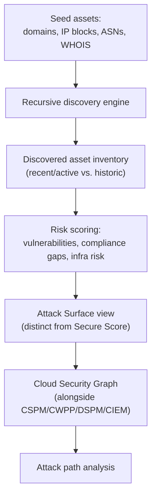
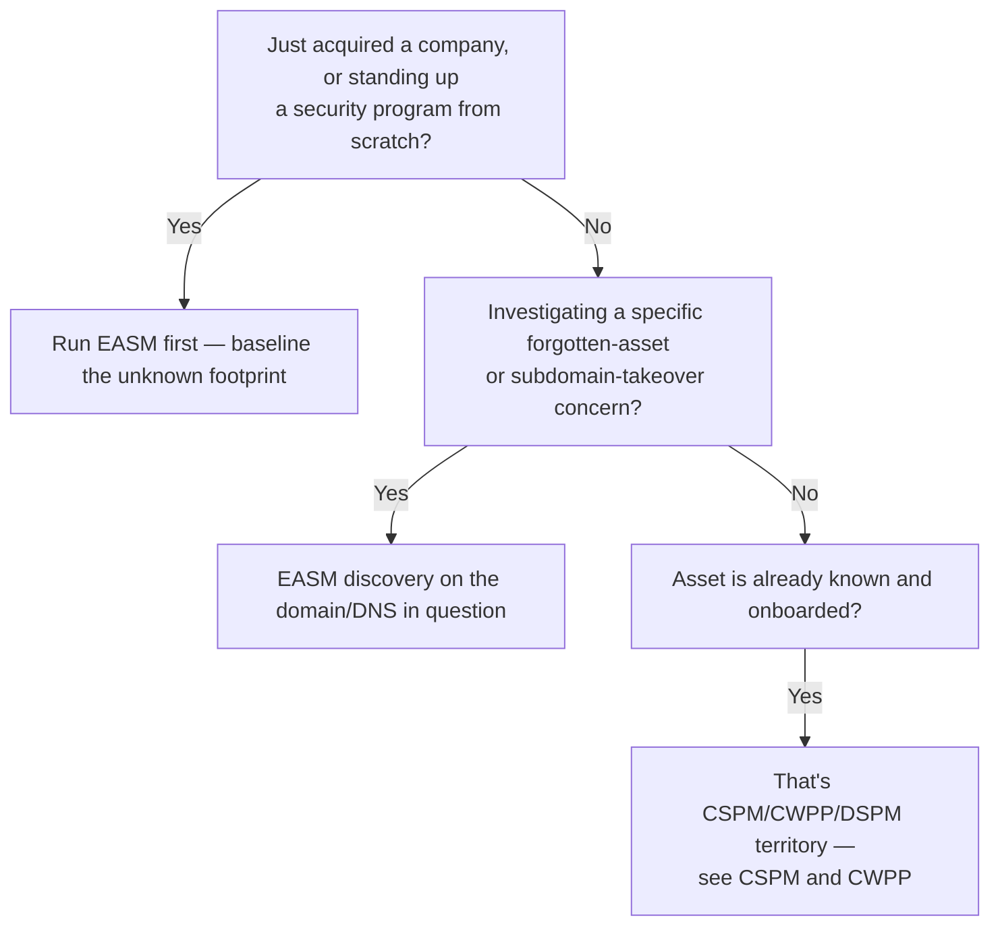

---
tags:
  - sc100
type: concept
domain:
  - infrastructure
aliases:
  - EASM
  - Defender EASM
---
# External Attack Surface Management (EASM)

## Purpose

Continuously discovering, inventorying, and risk-scoring every internet-facing asset attributable to an organization — including the ones it doesn't know it owns — using the same outside-in reconnaissance an attacker would perform.

---

## Why Architects Choose It

- CSPM, CWPP, and DSPM (see [[CSPM and CWPP]]) all assume the resource is *already known* — inside a managed subscription, tenant, or repository. EASM is the only layer that starts from zero knowledge and finds what's actually reachable from the internet, known to security or not.
- Attackers reconnaissance an org exactly the way EASM does — domains, IP blocks, ASNs, WHOIS/certificate data. Running the same discovery defensively flips the reconnaissance advantage to the defender instead of ceding it.
- Asset inventories drift fastest in exactly the situations a landing zone's own tooling (Azure Resource Graph, Azure Policy) can't see: shadow IT stood up outside IT's purview, and M&A — acquired infrastructure isn't inside the parent tenant's policy/RBAC scope until someone onboards it, and EASM finds it before that onboarding happens.
- Findings feed the same Cloud Security Graph and attack path analysis as CSPM+CWPP+DSPM+CIEM (see [[CSPM and CWPP]]) — an unknown asset with a real vulnerability gets prioritized exactly the way a known one would, the moment it's discovered.

---

## What Counts as External Attack Surface

Broader than "the servers we run" — anything internet-reachable and attributable to the company, whether IT provisioned it or not:

| Category | Examples |
| --- | --- |
| **Known cloud/network assets** | Registered domains/subdomains, public IP ranges, resources with public endpoints (storage accounts, App Services, VMs), SaaS tenants |
| **Unknown/unmanaged assets** | Forgotten subdomains (`dev.company.com` never decommissioned), shadow IT web apps stood up by a business unit, dev/test/staging environments still internet-reachable, acquired companies' infrastructure not yet inventoried post-M&A |
| **Orphaned DNS** | Stale DNS records pointing at decommissioned infrastructure — the classic **subdomain takeover** setup, where an attacker claims the now-unused cloud resource the DNS record still points to |
| **Certificate surface** | Expired or misconfigured TLS certificates, wildcard certificate sprawl (one leaked wildcard key exposes every subdomain it covers) |
| **DNS hygiene / email spoofing surface** | Missing or misconfigured SPF/DKIM/DMARC records — lets an attacker spoof mail as the company's own domain |
| **Third-party/vendor-linked** | Exposed APIs, partner-facing portals, CDN/edge configuration, publicly exposed cloud storage buckets/containers |
| **Code/secrets exposure** | Public code repositories (GitHub/GitLab) leaking credentials, API keys, or internal configuration — see [[DevOps Security]] |
| **Exposed admin surfaces** | Internet-reachable management portals/consoles without MFA or Conditional Access enforced |

- The unifying test isn't "did we provision it" — it's "can an outside attacker reach it and connect it back to us." Ownership is often the whole discovery problem, not a given.
- M&A is the highest-risk moment for this list: every asset above appears at once, unvetted, the day an acquisition closes.

---

## When to Use

- Standing up or maturing a cloud security program — run EASM alongside CSPM from day one, since CSPM can't see what EASM hasn't found yet.
- Immediately after an acquisition — baseline the acquired company's actual internet-facing footprint before trusting or integrating any of it.
- Investigating a suspected shadow-IT or forgotten-asset exposure — subdomain takeover, an abandoned dev environment, a leaked credential tied to a corporate domain.
- Feeding Security Exposure Management/Cloud Security Graph a genuinely complete asset inventory, not just what's already inside a managed subscription.

---

## When NOT to Use

- As a replacement for CSPM/CWPP once an asset is known — EASM discovers and gives a coarse Attack Surface risk score; CSPM/CWPP do the deep configuration and runtime assessment once the asset is onboarded.
- As a one-time scan — the whole point is continuous discovery, since shadow IT and DNS drift don't stop after the first run.
- Assuming EASM inventories internal, non-internet-facing assets — its entire discovery model is outside-in; internal network posture is CSPM/NSG/Azure Firewall territory (see [[Network Security Architecture]]).

---

## Architecture

---

## Architecture Decisions

---

## Defending the External Attack Surface

Discovery alone doesn't reduce risk — each category above maps to a concrete architectural control:

- **Decommission stale DNS/subdomains** the moment infrastructure is retired — the direct fix for subdomain takeover, and the cheapest item on this list to get wrong.
- **Public network access disabled by default + [[Private Link]]** for anything that doesn't need to be internet-facing — removes the asset from the external surface entirely rather than just monitoring it (see [[Securing IaaS and PaaS Services]]).
- **Certificate lifecycle management** — automated renewal and inventory so expiry/misconfiguration isn't discovered by EASM (or an attacker) first.
- **DNS hygiene** — SPF/DKIM/DMARC configured and enforced (`p=reject`, not just `p=none`) to close the spoofing gap.
- **Secrets scanning in source control** — Defender for DevOps (see [[DevOps Security]]) catches leaked credentials/keys before they become part of the external surface.
- **MFA/[[Conditional Access]] on every internet-facing admin portal** — an exposed management interface without it is a direct EASM/attacker target.
- **Route every EASM finding into the same vulnerability/patch management cycle** as known assets — a discovered asset that never gets remediated is just a documented risk, not a reduced one.
- **Re-run discovery on a schedule, and always immediately post-M&A** — this list drifts continuously; a single baseline scan goes stale the same week shadow IT stands up the next forgotten subdomain.

---

## Comparison

| Compare | Difference |
| --- | --- |
| EASM vs. CSPM | EASM discovers internet-facing assets the organization may not even know it owns (outside-in reconnaissance); CSPM assesses the configuration of resources already known to and managed within Azure/AWS/GCP (inside-out). EASM often *feeds* CSPM's inventory rather than replacing it. |
| Attack Surface score vs. Secure Score | Attack Surface (EASM) scores discovered internet-facing assets for vulnerabilities/compliance/infra risk; Secure Score (see [[Security Posture Assessments]]) scores MCSB-benchmarked configuration of resources already inside a managed subscription. Different inventories, different scoring models. |
| Subdomain takeover vs. a standard misconfiguration finding | Subdomain takeover is EASM's signature finding type — a DNS record still points at infrastructure that's been deleted/deprovisioned, letting an attacker claim that resource and serve content under the company's own domain. A standard CSPM misconfiguration is a live, still-owned resource configured wrong — different failure mode, different urgency. |
| EASM vs. penetration testing | EASM is continuous, automated, breadth-first discovery and risk scoring across the entire external footprint. A pen test is a point-in-time, depth-first, hands-on exploitation attempt against a defined scope — often informed by what EASM already found. Complementary, not interchangeable. |

---

## AZ-500 Review

AZ-500 doesn't cover EASM, outside-in discovery, or subdomain takeover at all — its network/resource security content assumes the asset is already known and inside a managed subscription. Treat this entire topic as new for SC-100.

---

## What's New for SC-100

- Recognize EASM as the *discovery* layer that has to run before CSPM/CWPP/DSPM can assess anything — an explicit ordering the exam expects, not four interchangeable posture tools.
- Know subdomain takeover by name as EASM's signature finding, and DNS-record decommissioning as its direct fix.
- Treat EASM as a mandatory, immediate step post-M&A — a named scenario trigger, not a "nice to have" continuous-monitoring feature.
- Tie EASM findings into the same Cloud Security Graph/attack path prioritization as every other CNAPP signal (see [[CSPM and CWPP]]) rather than treating Attack Surface score as a separate, disconnected report.

---

## Exam Tips

- "Discover shadow IT / forgotten internet-facing assets we don't know we own" → Defender EASM, not CSPM — CSPM only sees what's already inside a managed subscription.
- "A DNS record still resolves to a deprovisioned resource an attacker could claim" → subdomain takeover, fixed by decommissioning the DNS record, not a CSPM recommendation.
- "We just acquired a company — assess its security exposure" → EASM first, to baseline the unknown footprint, before CSPM/CWPP can even be pointed at it.
- Don't answer "penetration test" when the scenario describes continuous, automated discovery across an unknown footprint — that's EASM; pen testing is the point-in-time, scoped, hands-on counterpart.

---

## Common Exam Confusion

- **EASM vs. CSPM** — outside-in discovery of unknown assets vs. inside-out configuration scoring of known ones; full comparison above.
- **Attack Surface score vs. Secure Score** — two different scores from two different inventories; don't conflate them as one number.
- **EASM vs. penetration testing** — continuous automated discovery vs. point-in-time scoped exploitation; complementary, tested as a pair.

---

## Keywords

- External Attack Surface Management (EASM), Defender EASM
- Outside-in discovery, seed assets (domains, IP blocks, ASNs, WHOIS)
- Attack Surface score vs. Secure Score
- Subdomain takeover, orphaned/stale DNS records
- Shadow IT, dev/test environments never decommissioned
- Post-M&A asset baseline
- Certificate sprawl, SPF/DKIM/DMARC
- Recent (active) vs. historic assets

---

## Related Services

- [[CSPM and CWPP]]
- [[Security Posture Assessments]]
- [[Securing IaaS and PaaS Services]]
- [[Network Security Architecture]]
- [[DevOps Security]]
- [[Conditional Access]]
- [[Private Link]]
- [[Zero Trust]]

---

## References

- [Defender EASM overview](https://learn.microsoft.com/en-us/azure/external-attack-surface-management/overview) — Microsoft Learn
- [Microsoft Defender for Cloud provides CNAPP security](https://www.microsoft.com/en-us/security/blog/2023/03/22/the-next-wave-of-multicloud-security-with-microsoft-defender-for-cloud-a-cloud-native-application-protection-platform-cnapp/) — Microsoft Security Blog
- [[Exam Objectives]]
