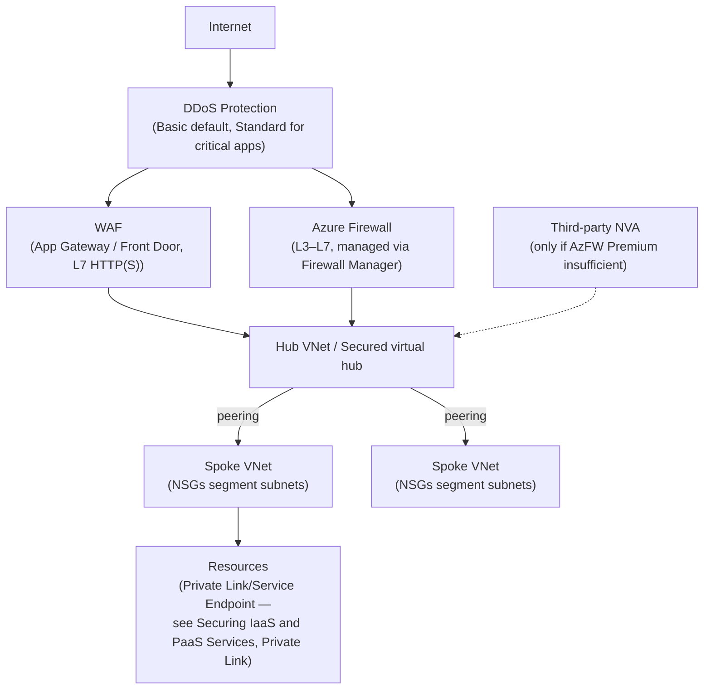
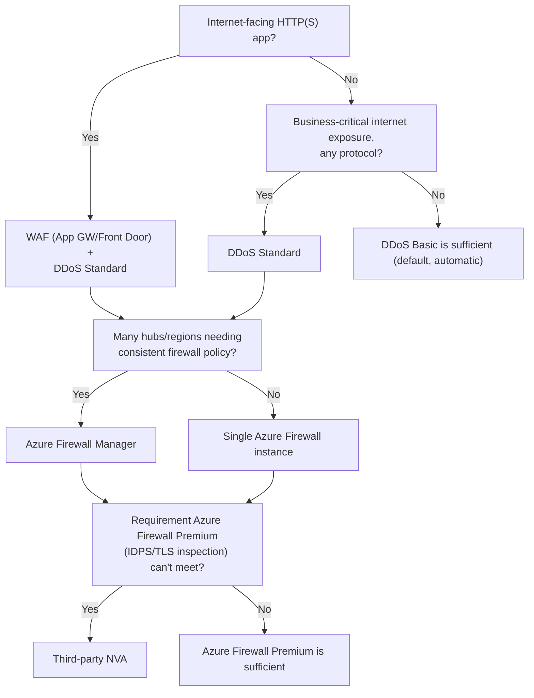

---
tags:
  - sc100
type: concept
domain:
  - infrastructure
---
# Network Security Architecture

## Purpose

Evaluating a network design against a workload's actual security requirements — layering perimeter (DDoS, WAF, firewall), segmentation, and policy-centralization controls instead of treating any single control as sufficient.

---

## Why Architects Choose It

- The exam objective is explicitly "evaluate a network design against security requirements" — a judgment skill (does this design fit *this* workload's exposure/compliance/blast-radius needs?), not a configuration task.
- Defense in depth means perimeter, segmentation, and identity-aware access are layered together — DDoS/WAF/firewall at the edge, NSGs/hub-spoke inside, [[Identity as the Security Perimeter|SSE]] for user-to-resource traffic, [[Securing IaaS and PaaS Services|Private Link/Service Endpoints]] at the resource itself. No single layer is "the" answer.
- **Azure Firewall Manager** centralizes segmentation/egress policy across many hub VNets or secured virtual hubs so rules don't drift per-region or per-team as the estate grows — a scaling concern the topology choice in [[Azure Landing Zones]] doesn't address by itself.
- **DDoS Protection Standard**'s cost-protection SLA and Rapid Response support team are what justify layering it onto specific internet-facing, business-critical workloads — not a blanket recommendation for every VNet.

---

## When to Use

- Choosing the network topology itself (Hub & Spoke vs. Virtual WAN) — already covered in [[Azure Landing Zones]]; this note assumes that choice is made and focuses on the security controls layered onto it.
- Public internet-facing HTTP(S) workload needing OWASP-based protection (SQLi, XSS) — **WAF** on [[Front Door and Application Gateway|Application Gateway or Front Door]], layered behind DDoS Protection.
- Centralizing firewall/segmentation policy across many hub VNets or secured virtual hubs — **Azure Firewall Manager**.
- Mission-critical, internet-facing services where the cost-protection guarantee and Rapid Response support matter — **DDoS Protection Standard**, layered on top of the Basic tier that's already on by default.
- Needing IDS/IPS or a vendor-specific feature Azure Firewall doesn't provide — a third-party **network virtual appliance (NVA)** routed through the hub, after confirming **Azure Firewall Premium** (TLS inspection, IDPS) genuinely can't cover the requirement.
- Replacing VPN for user-to-private-app access — that's [[Identity as the Security Perimeter|Entra Private Access]] (ZTNA), not this note's perimeter/segmentation layer; choosing between its **Quick Access** (IP/FQDN ranges, fast migration) and **per-app TCP/UDP access** (fuller Zero Trust granularity) is covered there in full, this note only notes where it sits relative to DDoS/WAF/Firewall.

---

## When NOT to Use

- Relying on DDoS Protection Basic alone for a business-critical internet-facing app — Basic is free and automatic but carries no SLA, no cost-protection guarantee, and no Rapid Response.
- Placing a WAF in front of non-HTTP(S) traffic expecting protection — WAF is Layer 7, HTTP(S)-specific; other protocols need Azure Firewall/NSGs instead.
- Deploying a third-party NVA by default — it adds cost, self-managed scaling, and HA responsibility; justified only when Azure Firewall (including Premium) genuinely lacks a required capability.
- Re-solving resource-level reachability (Private Link/Service Endpoint/NSG) here — that's [[Securing IaaS and PaaS Services]]; this note is the topology/perimeter layer above it.

---

## Architecture

---

## Architecture Decisions

---

## Comparison

| Compare | Difference |
| --- | --- |
| WAF vs. Azure Firewall | WAF (on Application Gateway/Front Door) is Layer 7, HTTP(S)-only, and inspects for web-specific threats (OWASP Top 10 — SQLi, XSS). Azure Firewall is a general Layer 3–7 network firewall (FQDN filtering, threat intelligence, any protocol) sitting at the VNet/hub level. A scenario about protecting a web app from injection attacks points to WAF; one about filtering arbitrary outbound traffic points to Azure Firewall. Layered together, not either/or. |
| DDoS Protection Basic vs. Standard | Basic: free, automatic, always-on for every public IP — no SLA, no cost protection. Standard: paid, tuned to the specific application's traffic patterns, adds a cost-protection guarantee (credits for scale-out costs during an attack), Rapid Response support team access, and integrates with WAF for combined L3–L7 defense. Standard is justified for specific business-critical, internet-facing workloads — not a universal upgrade. Standard itself splits into Network Protection (VNet-wide) vs. IP Protection (per-IP) — full plan detail in [[DDoS Protection]]. |
| Azure Firewall vs. third-party NVA | Azure Firewall is Microsoft-managed PaaS (auto-scale, no patching, Firewall Manager policy) with Premium tier adding IDPS and TLS inspection. An NVA is a customer-deployed/managed appliance (own scaling, HA, patching) chosen only when a specific vendor feature or existing licensing requirement isn't met by Azure Firewall Premium. |
| Azure Firewall vs. NSG | Full comparison already in [[Securing IaaS and PaaS Services]] — segmentation (NSG) vs. centralized, stateful policy/inspection (Azure Firewall); not repeated here. |
| Perimeter/segmentation controls (this note) vs. Private Access | This note's DDoS/WAF/Firewall/NSG layer protects resource-to-resource and internet-to-resource traffic inside the Azure network; [[Identity as the Security Perimeter|Entra Private Access]] replaces VPN for *user*-to-private-app access via Conditional-Access-governed ZTNA (Quick Access vs. per-app TCP/UDP — full decision in that note). Complementary layers, not overlapping ones. |

---

## AZ-500 Review

AZ-500 already covers configuring NSGs, Azure Firewall rules, DDoS Protection plans, WAF policies on Application Gateway/Front Door, and hub-spoke VNet peering at the resource level. That configuration knowledge is assumed here.

---

## What's New for SC-100

- Evaluating a proposed network design against a workload's *stated* security requirements (compliance, blast radius, internet exposure) as an explicit judgment skill, not a configuration checklist.
- Recommending DDoS Standard specifically for business-critical, internet-facing workloads based on the cost-protection/Rapid Response justification, rather than "always enable it everywhere."
- Using **Azure Firewall Manager** to centralize policy across many hubs/secured virtual hubs as the estate scales, instead of managing rules per hub.
- Recognizing when **Azure Firewall Premium**'s IDPS/TLS inspection closes the gap that used to require a third-party NVA — an explicit cost/complexity trade-off the exam expects you to weigh before recommending an NVA.

---

## Exam Tips

- "Protect a web app from SQL injection/XSS" → WAF, not Azure Firewall alone.
- "Guarantee cost protection and get expert support during a volumetric attack on a critical internet-facing service" → DDoS Protection Standard, not Basic.
- A scenario listing many hub VNets/regions with drifting firewall rules → Azure Firewall Manager, not per-hub manual management.
- Don't default to a third-party NVA when the gap described (TLS inspection, IDPS) is exactly what Azure Firewall Premium already covers.

---

## Common Exam Confusion

- **WAF vs. Azure Firewall** — HTTP(S)-specific L7 web protection vs. general L3–L7 network firewall; full comparison above.
- **DDoS Basic vs. Standard** — automatic/free/no SLA vs. paid/tuned/cost-protection guarantee + Rapid Response.
- **Azure Firewall vs. third-party NVA** — managed PaaS with Premium IDPS/TLS inspection vs. self-managed appliance for gaps Premium doesn't cover.
- **This note vs. [[Securing IaaS and PaaS Services]]** — topology/perimeter layer (DDoS, WAF, Firewall Manager) vs. resource-level reachability (NSG, Private Link, Service Endpoint); a scenario about one specific resource's exposure points to the other note.

---

## Keywords

- Network design evaluation against security requirements
- Web Application Firewall (WAF), OWASP Top 10
- Azure Firewall Manager, secured virtual hub
- DDoS Protection Basic vs. Standard, cost-protection guarantee, Rapid Response
- Azure Firewall Premium: IDPS, TLS inspection
- Network virtual appliance (NVA)
- Defense in depth (perimeter, segmentation, identity)
- Quick Access vs. per-app TCP/UDP access (Private Access, see [[Identity as the Security Perimeter]])

---

## Related Services

- [[Azure Landing Zones]]
- [[Securing IaaS and PaaS Services]]
- [[Identity as the Security Perimeter]]
- [[Azure Web Application Firewall]]
- [[Azure Firewall]]
- [[Zero Trust]]
- [[Microsoft Defender for Cloud]]
- [[Private Link]]
- [[Network Security Group]]
- [[Azure Firewall]]
- [[Front Door and Application Gateway]]
- [[DDoS Protection]]

---

## References

- [Azure Firewall Manager overview](https://learn.microsoft.com/en-us/azure/firewall-manager/overview) — Microsoft Learn
- [Azure DDoS Protection overview](https://learn.microsoft.com/en-us/azure/ddos-protection/ddos-protection-overview) — Microsoft Learn
- [What is Azure Web Application Firewall?](https://learn.microsoft.com/en-us/azure/web-application-firewall/overview) — Microsoft Learn
- [Azure Firewall Premium features](https://learn.microsoft.com/en-us/azure/firewall/premium-features) — Microsoft Learn
- (https://aka.ms/designpat)
- [[Exam Objectives]]
