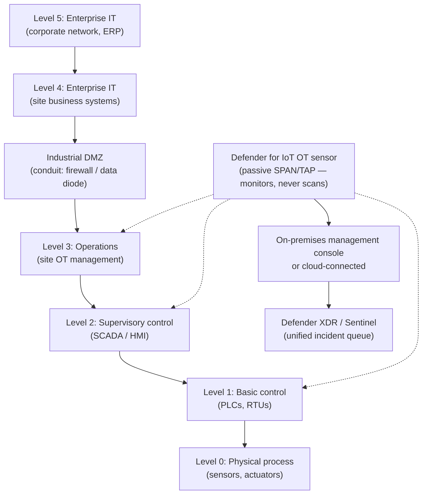
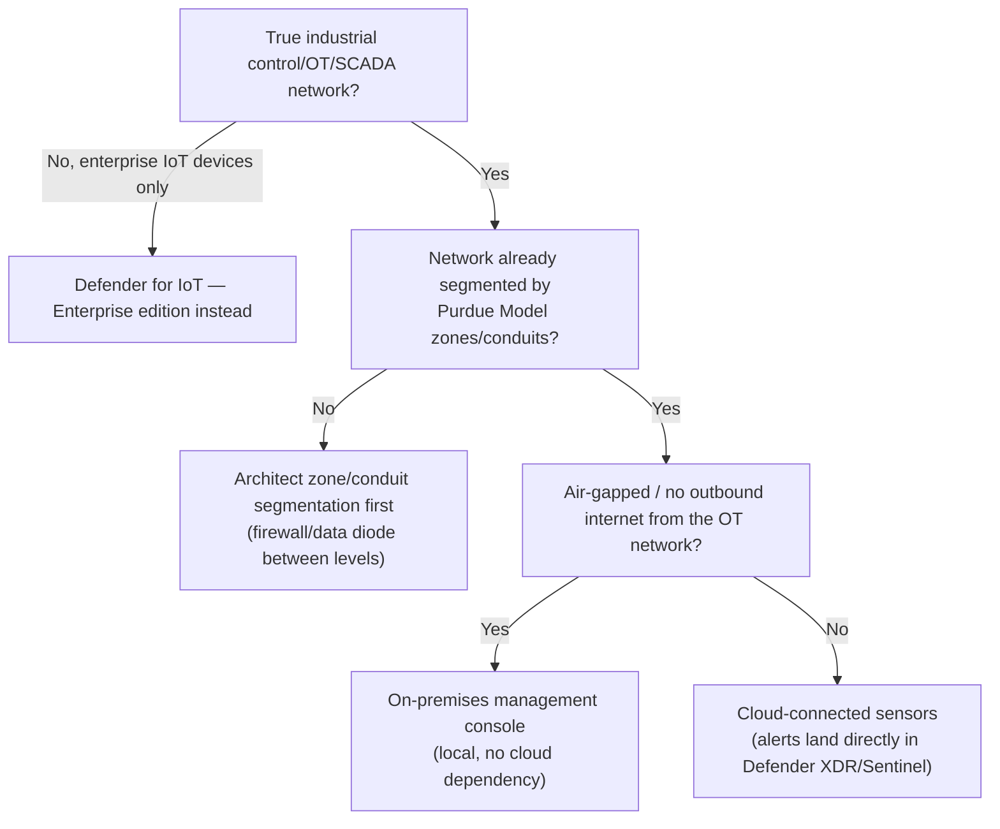

---
tags:
  - sc100
type: concept
domain:
  - infrastructure
aliases:
  - OT Security
  - ICS Security
  - Defender for IoT OT
status: needs-verification
---
# OT and ICS Security

## Purpose

Evaluating and securing operational technology (OT)/industrial control system (ICS) networks with **Defender for IoT's OT edition** — passive, agentless monitoring and segmentation for equipment IT-centric controls can't reach or safely touch.

---

## Why Architects Choose It

- OT/ICS devices (PLCs, RTUs, SCADA/HMI systems) usually can't run an agent, and often can't tolerate active scanning — a probe built for IT can crash a decades-old PLC. Defender for IoT's passive network sensors are the only safe way to get visibility, the same "can't instrument directly" gap flagged in [[Securing Server and Client Endpoints]].
- OT networks are segmented by function using the **Purdue Model** (zones/conduits), not Azure-native constructs — evaluating an OT network means evaluating that segmentation, not NSGs/Azure Firewall.
- An OT incident risks physical safety and process uptime, not just data — the risk criteria differ from a typical IT assessment, which changes what "high severity" means here.
- Defender for IoT feeds OT alerts into the same [[Microsoft Defender XDR|Defender XDR]]/[[Microsoft Sentinel]] incident queue used for IT (see [[Security Operations]]) — OT stops being a siloed, separately-watched network once deployed.

---

## When to Use

- Any environment with PLCs, RTUs, SCADA/HMI, or other industrial control equipment — Defender for IoT **OT edition** sensors, deployed passively (SPAN/mirror port or TAP), never actively scanning.
- Evaluating or designing OT network segmentation — apply **Purdue Model** zone/conduit boundaries first, then layer Defender for IoT visibility on top; sensors give visibility, not enforcement.
- Needing protocol-aware anomaly detection for ICS-specific protocols (Modbus, DNP3, Profinet, and similar) that Azure Firewall/NSGs don't parse.
- Correlating an OT alert with an IT-side identity or network signal in one incident — Defender for IoT reports into the unified Defender XDR/Sentinel queue.

---

## When NOT to Use

- Deploying Defender for IoT's **Enterprise IoT** edition for true industrial control equipment — that edition targets enterprise IoT (printers, cameras, badge readers), not ICS/SCADA; use the OT edition instead (edition split detailed in [[Securing Server and Client Endpoints]]).
- Active vulnerability scanning an OT network the way you would IT — many legacy ICS devices can't handle active probes; passive monitoring is the safe default.
- Treating sensor deployment as "segmentation done" — sensors give visibility, not enforcement; zone/conduit boundaries (firewalls/data diodes between Purdue levels) still need to be architected separately.

---

## Architecture

---

## Architecture Decisions

---

## Comparison

| Compare | Difference |
| --- | --- |
| On-premises management console vs. cloud-connected sensors | On-prem console: sensors report to a local console, no internet dependency — the answer for air-gapped/no-outbound OT networks. Cloud-connected: sensors report to the cloud, alerts land directly in Defender XDR/Sentinel — simpler unified-incident-queue integration, but needs outbound connectivity routed through the industrial DMZ, never directly from Levels 0–3. |
| Passive network monitoring vs. active scanning | Passive (Defender for IoT's model): reads mirrored/SPAN traffic — zero risk of disrupting a fragile legacy device. Active scanning: sends probes that can crash or destabilize ICS equipment never built to handle unexpected traffic — avoided in OT, acceptable in IT. |
| Purdue Model segmentation vs. Azure-native segmentation | Purdue zones/conduits are the OT-specific model (Levels 0–5, enforced by firewalls/data diodes at the industrial DMZ). NSGs/Azure Firewall (see [[Network Security Architecture]]) segment Azure-hosted IT resources — an OT network typically isn't Azure-hosted at all, so it's evaluated by a different control plane entirely. |
| Defender for IoT: Enterprise vs. OT edition | Device-type split, not a licensing tier — full comparison already in [[Securing Server and Client Endpoints]]; this note is the OT-edition deep dive specifically. |

---

## AZ-500 Review

AZ-500 doesn't cover OT/ICS, the Purdue Model, or Defender for IoT at all — its network security content (NSGs, Azure Firewall) assumes Azure-hosted IT resources. Treat this entire topic as new for SC-100.

---

## What's New for SC-100

- Recognize OT/ICS as a distinct evaluation domain with its own segmentation model (Purdue) and risk criteria (physical safety/uptime, not just data) — not "IT security applied to a factory."
- Know Defender for IoT OT's passive, agentless architecture as the reason it's the answer whenever a scenario says devices "can't run an agent" or "can't tolerate active scanning."
- Choose on-premises management console vs. cloud-connected sensors based on whether the OT network has outbound internet connectivity at all — an explicit architecture decision, not a default.
- Tie OT alerts into the same unified Defender XDR/Sentinel incident queue used for IT (see [[Security Operations]]) — OT monitoring isn't meant to stay a siloed, separately-watched system.

---

## Exam Tips

- "Monitor a plant-floor/SCADA network without installing agents or risking device stability" → Defender for IoT OT, passive sensors — not active scanning.
- "The OT network has no outbound internet access" → on-premises management console, not cloud-connected sensors.
- A scenario about segmenting an OT network points to Purdue Model zones/conduits, not NSGs/Azure Firewall — different control plane.
- Don't confuse Defender for IoT's OT edition with its Enterprise edition — printers/cameras/badge readers are Enterprise; PLCs/SCADA/HMI are OT (full split in [[Securing Server and Client Endpoints]]).

---

## Common Exam Confusion

- **On-premises console vs. cloud-connected sensors** — connectivity-driven choice, not preference; see Comparison above.
- **Passive monitoring vs. active scanning** — a safety-driven default for fragile legacy ICS equipment, not a cost/feature trade-off.
- **Purdue Model vs. Azure-native network segmentation** — different control plane, different note ([[Network Security Architecture]]).
- **Defender for IoT Enterprise vs. OT edition** — device type, not licensing tier; also flagged in [[Securing Server and Client Endpoints]].

---

## Keywords

- OT, ICS, SCADA, PLC, RTU, HMI
- Purdue Model, Levels 0–5, zone/conduit segmentation, industrial DMZ
- Defender for IoT OT sensor, passive/agentless monitoring
- On-premises management console vs. cloud-connected sensors
- Modbus, DNP3, Profinet (protocol-aware detection)
- Air-gapped network

---

## Related Services

- [[Securing Server and Client Endpoints]]
- [[Security Operations]]
- [[Network Security Architecture]]
- [[Zero Trust]]
- [[Microsoft Defender XDR]]
- [[Microsoft Sentinel]]
- [[Ransomware Resiliency and BCDR]]

---

## References

- [What is Microsoft Defender for IoT for organizations?](https://learn.microsoft.com/en-us/azure/defender-for-iot/organizations/overview) — Microsoft Learn
- [IoT/OT security in Microsoft Defender XDR](https://learn.microsoft.com/en-us/defender-xdr/protect-against-iot-ot-threats) — Microsoft Learn
- [[Exam Objectives]]

---

## Verification Flag

The Purdue Model level numbering/labels and exact OT-sensor deployment/level-mapping guidance are transcribed from training-knowledge recall (ISA-95/Purdue Enterprise Reference Architecture), not a live re-read of Microsoft's current Defender for IoT deployment docs — re-verify sensor placement guidance and level terminology against [What is Microsoft Defender for IoT for organizations?](https://learn.microsoft.com/en-us/azure/defender-for-iot/organizations/overview) before treating it as exam-final.
