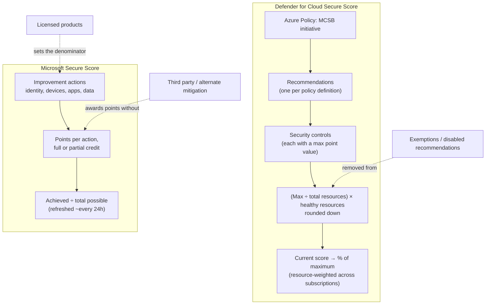
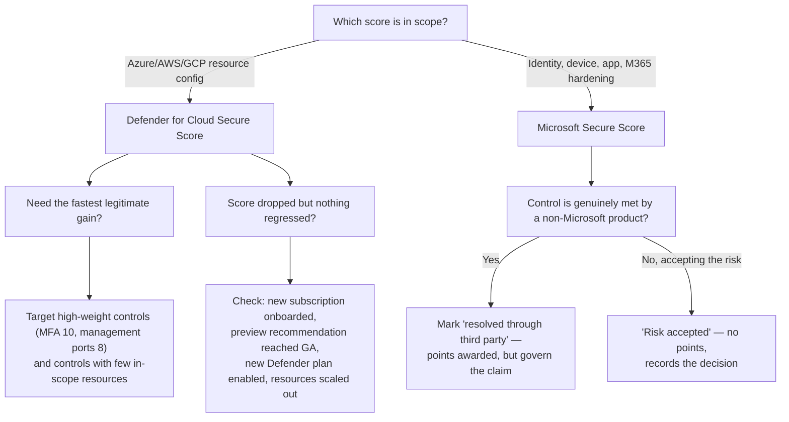

---
tags:
  - sc100
type: concept
domain:
  - infrastructure
aliases:
  - Secure Score point system
  - Secure Score calculation
  - Microsoft Secure Score
  - secure score scoring
status: needs-verification
---

# Secure Score Mechanics

## Purpose

How the two Secure Scores are actually calculated — Defender for Cloud's control-weighted resource score and Microsoft Secure Score's improvement-action points — so a target ("get to 80%") can be translated into specific work, and so score movement can be explained rather than guessed at.

---

## Why Architects Choose It

- A score is only a management tool if you can predict what moves it. Knowing the formula turns "improve our posture" into "these three controls carry 24 of our missing points, across these resources."
- The two scores use **completely different math**. Defender for Cloud weights *security controls* against *resource counts*; Microsoft Secure Score sums *points per improvement action* with partial credit. Advice that works on one is wrong on the other.
- Understanding the denominator prevents a real failure mode: **the score can fall when nothing got worse** — onboarding a new subscription, a new recommendation entering GA, or resources scaling out all change the ratio.
- The scoring rules encode Microsoft's own prioritization (MFA and management-port exposure are worth the most), which is a defensible basis for a remediation backlog.
- Knowing the exemption/mitigation paths matters for governance: **teams can raise a score without reducing risk** by exempting resources or marking actions "resolved through third party." That has to be a governed decision, not a local one.

---

## When to Use

- Setting a numeric posture target and decomposing it into a remediation backlog.
- Explaining an unexpected score movement to leadership (a drop that isn't a regression).
- Deciding whether to remediate, exempt, or accept a recommendation — and understanding the score consequence of each.
- Designing which score is reported to which audience — the routing decision lives in [[Security Scoring Dashboards]].

---

## When NOT to Use

- As a risk measure. A high score means *configuration adoption*, not low likelihood of breach. Attack-path/exposure prioritization is the risk view — see [[CSPM and CWPP]].
- As compliance evidence — that's the Regulatory Compliance dashboard against a named standard ([[Security Posture Assessments]]).
- As a team KPI without governance around exemptions and "risk accepted" — you get score optimization instead of security.
- To compare across products or organizations as if the numbers were commensurable — different scales, different denominators.

---

## Defender for Cloud Secure Score — the Formula

Recommendations are grouped into **security controls**; each control carries a **maximum point value** reflecting how much risk it addresses. The control is scored by how many of its in-scope resources are healthy:

```
Security control score = (Max score ÷ Total resources) × Healthy resources
```

- The result is **rounded down** to the nearest integer.
- A resource counts as **healthy for a control only when it passes every recommendation in that control** — partial remediation of one resource earns nothing, but remediating some resources earns proportional credit.
- **Current score** for a subscription = sum of all achieved control scores.
- **Secure Score percentage** = achieved points ÷ maximum possible points, expressed as a percentage.

**Worked example** — control "Remediate vulnerabilities" (max 6 points), 20 in-scope resources, 12 healthy:

```
(6 ÷ 20) × 12 = 3.6 → 3 points of 6
```

Fixing 3 more resources → `(6 ÷ 20) × 15 = 4.5 → 4 points`. Note the jump costs three resources for one point: **controls with many resources move slowly**, which is why picking a control with a small resource population is often the fastest legitimate gain.

**Weighting** — the highest-value controls are the ones Microsoft considers most consequential:

| Typical max points | Control (examples) |
| --- | --- |
| 10 | Enable MFA |
| 8 | Secure management ports (JIT / no open RDP-SSH) |
| 6 | Remediate vulnerabilities; apply system updates |
| 4 | Encrypt data in transit; restrict unauthorized network access; enable auditing and logging |
| 1–3 | Lower-impact hygiene controls |

**Multi-subscription and management group scores** are **resource-weighted, not averaged** — a 40-resource subscription pulls the combined score far harder than a 4-resource one. Averaging subscription percentages gives the wrong answer.

### What does and doesn't count

- Only recommendations from the built-in **[[Microsoft Cloud Security Benchmark (MCSB)|MCSB]] initiative** contribute to Secure Score by default — see [[Azure Policy]] for why the initiative *is* the assessment engine.
- **Preview recommendations do not affect the score** — they appear, flagged, and only start counting at GA (which is itself a common cause of an unexplained drop).
- **Exempted** resources and **disabled** recommendations leave the calculation entirely — they change the denominator, so exempting unhealthy resources raises the score without changing risk.
- Recommendations from other regulatory standards or custom initiatives are reported separately and don't move the classic Secure Score.
- Enabling a paid Defender plan usually **surfaces new recommendations**, which can lower the score before it raises it.

### Classic vs. risk-based

Defender for Cloud also exposes a newer, risk-based **Cloud Secure Score** in the Microsoft Defender portal, which weights findings by asset criticality and exploitability rather than by flat control weights and resource ratios. Same product, different prioritization logic — know both exist (see [[Security Scoring Dashboards]]).

---

## Microsoft Secure Score (Defender portal) — the Point System

A different model: a catalogue of **improvement actions**, each worth a fixed number of points, summed.

```
Microsoft Secure Score % = achieved points ÷ total possible points
```

- Points are awarded **fully or partially** — an action covering users, devices, or mailboxes gives credit proportional to coverage (MFA enforced for 60% of users ≈ 60% of that action's points).
- Actions span **identity, devices, apps, and data** — sourced from [[Entra ID]], [[Microsoft Defender XDR|Defender for Office 365 / Endpoint / Identity / Cloud Apps]], [[Intune]], and [[Purview]]. Which products you own determines the **total possible** — the denominator, so licensing changes shift the percentage ([[Microsoft 365 Licensing]]).
- The score **refreshes roughly every 24 hours**; remediation is not reflected instantly.
- Includes **comparison benchmarks** against organizations of similar size/industry — the feature leadership usually asks about.

### Improvement action statuses

| Status | Effect on score |
| --- | --- |
| **To address** | Not yet actioned — no points. |
| **Planned** | Acknowledged, scheduled — no points. |
| **Resolved through third party** | Points **awarded** — the control is met by a non-Microsoft product. |
| **Resolved through alternate mitigation** | Points **awarded** — met by a different internal control. |
| **Risk accepted** | **No points**, and the action is treated as consciously declined. |
| **Completed** | Full points, verified by the product. |

The two "resolved through…" statuses are the governance risk: they are self-asserted and Microsoft does not verify them. A score that climbed via third-party attestations needs review before it's reported upward.

### Products Included in Microsoft Secure Score

Recommendations currently span: [[Entra ID]], Exchange Online, [[Securing Microsoft 365|SharePoint Online, Microsoft Teams]], [[Microsoft Defender XDR|Defender for Endpoint, Defender for Identity, Defender for Office, Defender for Cloud Apps]], [[Purview]] Information Protection, app governance, and several non-Microsoft SaaS apps (Citrix ShareFile, Docusign, GitHub, Okta, Salesforce, ServiceNow, Zoom). You see the *full* recommendation catalogue for a product regardless of which license/plan you hold — the absolute score doesn't change based on entitlement, only which recommendations you can actually action.

**Security defaults** in Entra ID auto-satisfy three specific improvement actions at full points the moment they're turned on: MFA for all users (9 pts), MFA for administrative roles (10 pts), and blocking legacy authentication (7 pts). Because security defaults overlap functionally with the sign-in-risk/user-risk-policy recommended actions, mark those overlapping actions **"resolved through alternative mitigation"** instead of building risk-based Conditional Access on top of security defaults redundantly.

### Secure Score Permissions — Who Can View vs. Manage It

Two separate permission models govern access to the Microsoft Secure Score in the Defender portal:

- **Microsoft Defender Unified RBAC** (current, portal-only) — create a custom role with the **Exposure Management (read)** or **Exposure Management (manage)** permission, under the *Security posture* category, scoped to the **Microsoft Security Exposure Management** data source. Takes effect immediately on assignment; GraphAPI access (including Defender for Identity's own Secure Score) still requires the legacy Entra-role model below until Microsoft extends GraphAPI support.
- **Microsoft Entra global roles** (legacy, still fully supported) — if a user isn't assigned a Defender Unified RBAC custom role, their Entra role determines Secure Score access:

| Access level | Roles |
| --- | --- |
| **Read + write** (edit status/notes, edit score zones, edit custom comparisons, grant others read-only) | **Security Administrator** (or higher), **Exchange Administrator**, **SharePoint Administrator** |
| **Read-only** | Helpdesk Administrator, User Administrator, Service Support Administrator, Security Reader, Security Operator, Global Reader |

The read/write list is the exam's favorite trap: **Exchange Administrator and SharePoint Administrator both grant full read/write Secure Score access**, identical in that one respect to Security Administrator — despite their names suggesting a workload-scoped, non-security role. Picking the *least-privilege correct* role for a user who needs Secure Score write access **plus** a workload-specific task (e.g., managing Exchange recipient/alias settings) means checking whether the workload-specific role *already* covers Secure Score, rather than reflexively reaching for Security Administrator or Global Administrator. Full built-in-role comparison and worked exam scenarios live in [[Microsoft Entra Built-in Roles]].

---

## Architecture



---

## Architecture Decisions



---

## Comparison

| Compare | Difference |
| --- | --- |
| **Defender for Cloud Secure Score vs. Microsoft Secure Score** | Control-weighted ratio over *resources* (Azure/multicloud config) vs. summed points over *improvement actions* (identity/device/app/M365). Same brand word, different math, different portal. |
| **Control score vs. recommendation** | Points attach to the **control**, not the individual recommendation — remediating one recommendation in a control gives nothing unless the resource then passes all of that control's recommendations. |
| **Exemption vs. remediation** | Remediation makes a resource healthy (numerator up). Exemption removes it from scope (denominator down). Both raise the score; only one reduces risk. |
| **"Risk accepted" vs. "resolved through third party"** | Both are decisions not to use the Microsoft control. Risk accepted earns **no** points; resolved through third party / alternate mitigation earns **full** points on an unverified assertion. |
| **Percentage vs. points** | The percentage is scale-free and comparable over time; raw points depend on how many controls are in scope. A percentage can fall while points rise (new controls entered scope). |
| **Secure Score vs. Regulatory Compliance %** | Secure Score is benchmarked to MCSB by default; the compliance percentage maps the same underlying assessments to a named external standard ([[Security Posture Assessments]]). |
| **Secure Score vs. exposure/attack-path score** | Configuration adoption vs. exploitability-weighted risk. A resource can be fully compliant and still sit on a live attack path ([[CSPM and CWPP]]). |
| **Secure Score vs. Azure Advisor Score** | Advisor's Security category is **derived from** the Defender for Cloud model — a rollup, not an independent measurement ([[Security Scoring Dashboards]]). |

---

## AZ-500 Review

AZ-500 covers reading Secure Score, acting on recommendations, and exempting a resource. What it doesn't cover: the calculation itself, control weighting, resource-weighted aggregation across subscriptions, the preview/GA and denominator effects, and the improvement-action status model — all of which are what SC-100 needs in order to set and defend a posture target.

---

## What's New for SC-100

- Translate a **score target into a remediation plan** using control weights and resource counts, instead of working through recommendations top to bottom.
- Explain **score volatility that isn't regression** — new subscriptions, preview→GA transitions, newly enabled Defender plans, and elastic resource counts all move the denominator.
- Govern the **exemption and "resolved through third party" paths** explicitly — otherwise the score becomes a reporting artifact rather than a control.
- Know that extending scoring with organization-specific checks means **custom [[Azure Policy]] definitions in a custom initiative**, not a feature request.
- Position Secure Score as *one* input alongside attack-path/exposure prioritization, not as the sole posture metric.

---

## Exam Tips

- The Defender for Cloud formula is `(max score ÷ total resources) × healthy resources`, rounded down — a scenario asking why remediating a few resources produced no score change is testing the rounding and the all-recommendations-per-control rule.
- Combined scores across subscriptions are **resource-weighted**, never an average of percentages.
- **Preview recommendations don't count** toward the score; a score drop right after a preview feature went GA is expected behaviour, not a regression.
- **Enable MFA** is the highest-weighted control (10 points) — "fastest single improvement" scenarios usually point there or to securing management ports (8).
- Exempting resources raises the score **without** reducing risk — an answer choosing exemption to "improve posture" is a distractor unless the scenario justifies the exemption.
- In Microsoft Secure Score, **"risk accepted" earns no points** while **"resolved through third party"/"alternate mitigation" earn full points** — a frequently tested asymmetry.
- Microsoft Secure Score's **total possible points depend on licensed products** — buying more licenses can lower the percentage by adding actions.
- Microsoft Secure Score updates on roughly a **24-hour** cycle — "why hasn't the score changed yet" is usually this.
- "Which role gives read/write access to Microsoft Secure Score?" → **Security Administrator, Exchange Administrator, or SharePoint Administrator** — not just Security Administrator. A scenario needing Secure Score write access *and* a workload-specific task (e.g., Exchange recipient management) is very likely testing whether you know Exchange Administrator already covers both, making it the least-privilege answer over Security Administrator or Global Administrator. Full role comparison in [[Microsoft Entra Built-in Roles]].

---

## Common Exam Confusion

- **Which Secure Score** — Defender for Cloud (resources) vs. Microsoft Secure Score (identity/device/app/M365). Check the portal named in the scenario.
- **Control points vs. recommendation points** — points are earned per control, per healthy resource, not per recommendation fixed.
- **Score drop = something broke** — usually a scope/denominator change instead.
- **Exemption vs. risk accepted** — a Defender for Cloud scope action vs. a Microsoft Secure Score status; different products, different score effects.
- **Secure Score vs. compliance percentage vs. exposure score** — adoption vs. standard-mapped attestation vs. exploitability.

---

## Keywords

- `(Max score ÷ total resources) × healthy resources`, rounded down
- Security control, max score, healthy vs. unhealthy resources
- Current score, maximum score, Secure Score percentage
- Resource-weighted aggregation across subscriptions/management groups
- MCSB initiative, preview recommendations excluded
- Exemption, disabled recommendation, denominator change
- Improvement action, partial credit
- To address / Planned / Risk accepted / Resolved through third party / Resolved through alternate mitigation / Completed
- ~24-hour refresh, comparison benchmarks
- Classic Secure Score vs. risk-based Cloud Secure Score
- Security defaults — auto-scored MFA/legacy-auth actions
- Defender Unified RBAC — Exposure Management (read)/(manage), Security posture category
- Secure Score read/write roles: Security Administrator, Exchange Administrator, SharePoint Administrator
- Secure Score read-only roles: Helpdesk Administrator, User Administrator, Service Support Administrator, Security Reader, Security Operator, Global Reader

---

## Related Services

- [[Security Posture Assessments]]
- [[Security Scoring Dashboards]]
- [[Microsoft Defender for Cloud]]
- [[Microsoft Cloud Security Benchmark (MCSB)]]
- [[Azure Policy]]
- [[CSPM and CWPP]]
- [[Securing Microsoft 365]]
- [[Microsoft 365 Licensing]]
- [[Microsoft Defender XDR]]
- [[Purview]]
- [[Entra ID]]
- [[Cloud Adoption Framework (CAF)]]
- [[Microsoft Entra Built-in Roles]]
- [[Identity and Access Management (IAM)]]

---

## References

- [Security posture for Microsoft Defender for Cloud — secure score calculation](https://learn.microsoft.com/en-us/azure/defender-for-cloud/secure-score-security-controls) — Microsoft Learn
- [Microsoft Secure Score](https://learn.microsoft.com/en-us/defender-xdr/microsoft-secure-score) — Microsoft Learn
- [Assess your security posture with Microsoft Secure Score](https://learn.microsoft.com/en-us/defender-xdr/microsoft-secure-score-improvement-actions) — Microsoft Learn
- [[Exam Objectives]]

---

## Verification Flag

Control weightings, the exact set of scored controls, and the improvement-action status semantics (particularly whether "risk accepted" ever contributes points) have all been revised by Microsoft over time, and the risk-based Cloud Secure Score in the Defender portal uses a different, less-documented model. Re-verify the point values and status behaviour against the current Microsoft Learn scoring pages before relying on specific numbers in an exam answer.
