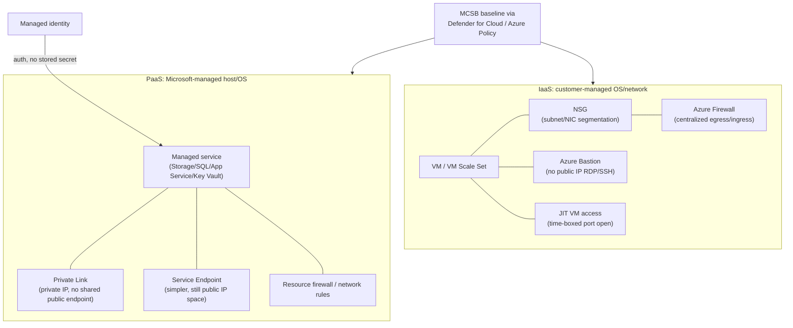
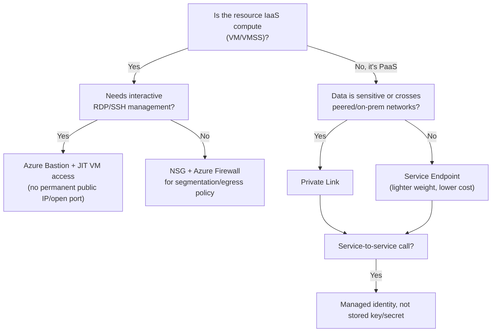

---
tags:
  - sc100
---
# Securing IaaS and PaaS Services

## Purpose

Matching network exposure and identity controls to the deployment model — IaaS leaves OS/network-layer hardening to the customer, PaaS shifts that layer to Microsoft and leaves only data-plane reachability and auth to secure.

---

## Why Architects Choose It

- Shared responsibility shifts by model: on IaaS the customer owns OS patching, network segmentation, and endpoint hardening; on PaaS Microsoft owns the host/OS/runtime, leaving only the service's public/private network boundary and the identity used to call it. The exam tests recognizing which layer a scenario actually leaves the customer responsible for.
- IaaS security is about eliminating direct exposure: no public IP on a management port, [[Network Security Group|NSGs]] micro-segmenting subnets, [[Azure Firewall]] centralizing egress/ingress policy, and **JIT VM access** closing the exposure window instead of leaving RDP/SSH permanently reachable.
- PaaS security is about restricting reachability to a service the platform already patches: **Private Link/Service Endpoints/resource firewall rules** replace "public endpoint + key" as the default posture, and **managed identity** (full comparison already in [[Identity and Access Management (IAM)]] — not repeated here) replaces stored credentials for the calling side.
- [[Microsoft Cloud Security Benchmark (MCSB)|MCSB]] baselines (see [[Security Posture Assessments]]) are what actually enforce "public network access disabled," "JIT required," etc., across a portfolio — governance layer, not a per-resource manual step.

---

## When to Use

- Any Azure VM/VM Scale Set/hybrid compute — apply the IaaS network stack: NSGs for subnet segmentation, [[Azure Firewall]] for centralized policy, **Azure Bastion** for browser-based RDP/SSH with no public IP, **JIT VM access** (Defender for Cloud) to open management ports only on approved request.
- Any managed data or app service (Storage, SQL, Cosmos DB, App Service, Key Vault, API Management) — apply the PaaS network stack: disable public network access by default, then choose **Private Link** (private IP, no data-exfiltration risk via other tenants' public endpoints) or **Service Endpoint** (simpler, no extra cost, still traverses the service's public IP space) per resource sensitivity. API-specific policy (throttling, token validation, versioning) in front of that backend is covered in [[API Management and Security]].
- Service-to-service calls between Azure resources — [[Identity and Access Management (IAM)|managed identity]], not a stored key/connection string.
- Portfolio-wide enforcement of the above ("public network access disabled," "JIT required") — [[Azure Policy]] and MCSB initiatives, not manual per-resource configuration.

---

## When NOT to Use

- Applying NSGs to control reachability *into* a PaaS resource — wrong layer; PaaS network reachability is governed by the resource's own firewall/network-rules blade or Private Link, not a subnet NSG.
- Treating JIT VM access as fire-and-forget — it's a per-request, time-boxed exposure window, not a one-time setting; a scenario needing *permanent* closed ports still wants NSG deny rules, not JIT alone.
- Defaulting to Service Endpoints at scale for sensitive data purely to save cost — Private Link is the stronger, recommended posture (private IP, works across peered/on-prem networks, no shared public endpoint); Service Endpoint is the lighter-weight answer for lower-sensitivity, cost-conscious scenarios only.
- Assuming Defender for Servers/agent-based EDR (see [[Cloud Workload Protection (CWPP)]]) applies to PaaS compute the customer doesn't manage — CWPP's server/container plans are the IaaS-adjacent runtime layer; PaaS runtime is Microsoft's responsibility. Container/AKS-specific cluster architecture beyond this network stack is covered in [[Container and Kubernetes Security]], not repeated here.

---

## Architecture

---

## Web Workload Security (App Service Specifics)

The PaaS network stack above (Private Link/Service Endpoint, managed identity) applies to App Service like any managed service — these are the additional controls specific to *web* workloads:

- **Built-in authentication (Easy Auth)** — App Service can front an app with Entra ID/OAuth sign-in at the platform level, before a request ever reaches application code — useful for adding auth to an app with no native auth code, but not a substitute for [[Conditional Access]] policy on the underlying identity.
- **Deployment slots** — stage a new version (and its security configuration) in an isolated slot, validate it, then swap — patches and config changes ship without an in-place, higher-risk edit to the production instance.
- **TLS/certificate management** — bind a certificate from [[Key Vault]] rather than uploading one manually, so rotation follows the same lifecycle as every other secret in the architecture.
- **Front-end protection** — pairs with [[Front Door and Application Gateway]] + [[Azure Web Application Firewall|WAF]] for HTTP-layer attack protection (OWASP Top 10); App Service itself doesn't inspect payloads for exploits.
- **API-shaped web workloads** — if the "web workload" is actually an API being consumed by multiple clients (not just browsers), the throttling/token-validation/versioning layer belongs in front of it — see [[API Management and Security]].

---

## Architecture Decisions

---

## Comparison

| Compare | Difference |
| --- | --- |
| Private Link vs. Service Endpoint | Private Link assigns the PaaS resource a **private IP inside the VNet**, reachable over ExpressRoute/VPN/peering too, and removes it from the public endpoint entirely — no data-exfiltration path via another tenant's traffic on the same public IP space. Service Endpoint keeps the resource's public IP but restricts traffic to it from selected subnets, routed over the Azure backbone — simpler and free, but the resource is still technically on a public endpoint. Private Link is the stronger default recommendation; Service Endpoint is the cost-conscious, lower-sensitivity option. Private Link mechanics (Private Endpoint vs. Private Link Service, DNS resolution) are detailed in [[Private Link]]. |
| NSG vs. Azure Firewall | NSG is a free, stateless-ish allow/deny filter at subnet/NIC level (5-tuple rules) — segmentation. Azure Firewall is a stateful, managed PaaS firewall with FQDN filtering, threat intelligence feeds, and centralized policy (Firewall Manager) across many VNets/hubs — egress/ingress policy at scale. Layered together, not either/or: NSGs segment, Azure Firewall centralizes and inspects. Rule-level mechanics for each live in [[Network Security Group]] and [[Azure Firewall]]. |
| JIT VM access vs. Azure Bastion | JIT (Defender for Cloud) narrows the *time window* a management port is open at the NSG/firewall level, on approved request — the port can still be opened to a source IP briefly. Bastion removes the need for any public IP or open management port at all — RDP/SSH is brokered through the Azure portal over TLS. Complementary: Bastion for the connection path, JIT for tightening any remaining direct access. |
| Managed identity vs. service principal (PaaS auth) | Full comparison in [[Identity and Access Management (IAM)]] — managed identity is the default for Azure-resource-to-Azure-resource calls; a stored key/connection string is the pattern both are meant to replace. |
| IaaS vs. PaaS shared responsibility (network layer) | IaaS: customer configures NSGs, firewall, Bastion/JIT — Microsoft only secures the physical/hypervisor layer. PaaS: Microsoft patches host/OS/runtime; customer only configures the resource's public-access setting, firewall rules, and Private Link/Service Endpoint. |

---

## AZ-500 Review

AZ-500 already covers configuring NSGs, Azure Firewall, Azure Bastion, JIT VM access, Private Link/Service Endpoints, and individual resource firewall rules (Storage, SQL, Key Vault) at the resource level. That configuration knowledge is assumed here.

---

## What's New for SC-100

- Choosing the right control **for the deployment model, across a portfolio** — as an explicit architecture decision (IaaS network stack vs. PaaS reachability stack) rather than configuring one resource in isolation.
- Recommending **Private Link as the default posture** for sensitive PaaS data, with Service Endpoint reserved for lower-sensitivity/cost-sensitive cases — a named trade-off, not "whichever is faster to set up."
- Enforcing the pattern portfolio-wide via [[Azure Policy]] and [[Security Posture Assessments|MCSB]] initiatives ("deny public network access," "require JIT") instead of per-resource manual configuration.
- Explicitly separating this east-west, resource-to-resource network layer from the north-south, user-to-resource layer that [[Identity as the Security Perimeter|Global Secure Access]] governs — both matter, neither replaces the other.

---

## Exam Tips

- "Eliminate public IP exposure on VM management ports without disabling remote administration" → Azure Bastion (+ JIT for any remaining direct access), not just closing NSG rules.
- "Restrict a storage/SQL resource to a specific VNet, including over ExpressRoute/on-prem" → Private Link, not Service Endpoint (Service Endpoint doesn't extend past the Azure backbone to on-prem).
- A scenario naming a cost constraint alongside "acceptable to still be on a public endpoint" → Service Endpoint is the intended answer, not Private Link.
- Service-to-service auth to a PaaS resource → managed identity is the default correct answer over a connection string/key, unless the scenario explicitly requires cross-tenant/non-Azure auth (service principal).
- "Deploy a security patch to a web app with zero risk of breaking production if something's wrong" → deployment slots + swap, not an in-place update.
- "Web app needs sign-in with no auth code written" → App Service built-in authentication (Easy Auth) — but a scenario needing risk-based/device-aware policy on top still needs Conditional Access as well.

---

## Common Exam Confusion

- **Private Link vs. Service Endpoint** — private IP + fully off the public endpoint vs. public IP retained + traffic restricted to selected subnets; full comparison above.
- **NSG vs. Azure Firewall** — free subnet-level segmentation vs. managed, stateful, FQDN/threat-intel-aware centralized policy.
- **JIT VM access vs. Azure Bastion** — narrows an exposure window vs. removes the exposure (public IP/open port) entirely.
- **This note's east-west segmentation vs. [[Identity as the Security Perimeter]]'s north-south identity perimeter** — Azure Firewall/NSGs/Private Link secure resource-to-resource and user-to-resource traffic *inside* Azure's network layer; Global Secure Access secures user-to-resource traffic at the identity layer, replacing VPN — a scenario mentioning VPN replacement or remote user access points to Global Secure Access, not this note's controls.

---

## Keywords

- IaaS vs. PaaS shared responsibility (network layer)
- Network Security Group (NSG), Azure Firewall, Firewall Manager
- Azure Bastion, JIT VM access
- Private Link vs. Service Endpoint
- Public network access disabled by default
- Resource firewall / network rules (Storage, SQL, Key Vault)
- Managed identity vs. stored key/connection string
- MCSB baseline enforcement, Azure Policy
- App Service built-in authentication (Easy Auth)
- Deployment slots, slot swap
- Web workload vs. API workload security

---

## Related Services

- [[Security Posture Assessments]]
- [[Cloud Workload Protection (CWPP)]]
- [[Identity and Access Management (IAM)]]
- [[Identity as the Security Perimeter]]
- [[Zero Trust]]
- [[Azure Policy]]
- [[Microsoft Defender for Cloud]]
- [[Network Security Architecture]]
- [[Private Link]]
- [[Container and Kubernetes Security]]
- [[API Management and Security]]
- [[Front Door and Application Gateway]]
- [[Key Vault]]

---

## References

- [Private Link vs. Service Endpoints](https://learn.microsoft.com/en-us/azure/private-link/private-link-service-overview) — Microsoft Learn
- [Just-in-time virtual machine access in Microsoft Defender for Cloud](https://learn.microsoft.com/en-us/azure/defender-for-cloud/just-in-time-access-overview) — Microsoft Learn
- [Azure Bastion overview](https://learn.microsoft.com/en-us/azure/bastion/bastion-overview) — Microsoft Learn
- [Azure Firewall vs. network security groups](https://learn.microsoft.com/en-us/azure/firewall/firewall-vs-nsg) — Microsoft Learn
- https://aka.ms/bastion
- [[Exam Objectives]]
