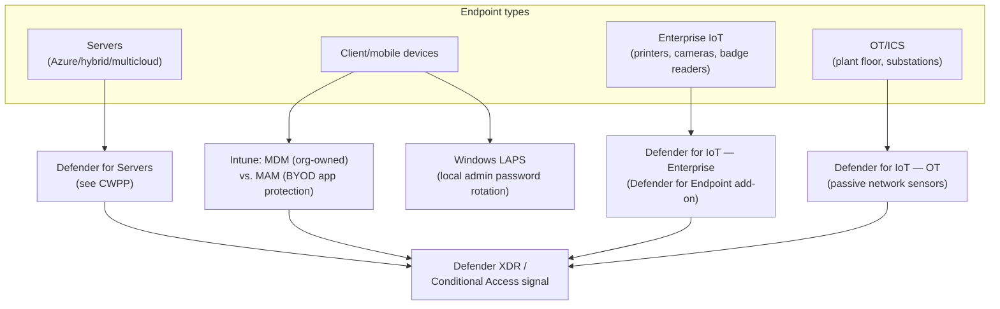
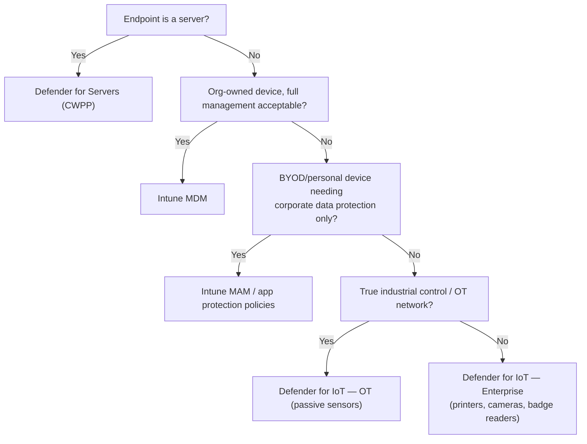

---
tags:
  - sc100
type: concept
domain:
  - infrastructure
---

# Securing Server and Client Endpoints

## Purpose

Architecting endpoint protection across the full device estate — servers, client/mobile devices, and enterprise IoT/OT — matching each endpoint type to the right management and protection mechanism rather than one uniform control.

---

## Why Architects Choose It

- Endpoint types have fundamentally different risk profiles and management surfaces: a server, a BYOD phone, and a factory-floor sensor each need a different combination of identity, agent, and management tooling — one Zero Trust "Endpoints" pillar, several concrete implementations.
- Local admin credential reuse across machines is a classic lateral-movement vector — **Windows LAPS** closes it by rotating and uniquely randomizing local admin passwords per device, backed to Entra ID or AD DS.
- Device compliance itself rests on a hardware root of trust, not just policy configuration — [[Trusted Platform Module (TPM)]] covers the TPM/Secure Boot/Measured Boot chain that produces the attestation Intune compliance and [[Conditional Access]] ultimately consume.
- BYOD and unmanaged personal devices can't always accept full device management — **MAM** (app-level control) extends data protection to devices MDM can't fully enroll.
- IoT/OT devices often can't run an agent at all — Defender for IoT's passive network-sensor architecture protects what can't be instrumented directly. Full OT/ICS evaluation and segmentation depth — Purdue Model, sensor deployment options — lives in [[OT and ICS Security]]; this note stays at the edition-selection level.

---

## MDM and MAM

MDM and MAM are the two Intune-based answers to "how do we manage a client device," and the exam cares far more about *which one a scenario calls for* than how either is configured — that config-level detail is MD-102/Intune-admin territory, not SC-100.

- **Mobile Device Management (MDM)** — full device enrollment. The org gets compliance policies, configuration profiles, and remote/full wipe over the *entire device*. This is the answer for corporate-owned hardware, where full control is expected and acceptable.
- **Mobile Application Management (MAM)** — app-level control without enrolling the device. Intune **app protection policies (APP)** wrap specific managed apps (Outlook, Teams, etc.) with corporate data controls — require a PIN to open the app, block copy/paste into unmanaged personal apps, and **selective wipe**: removing only corporate data from the app on demand, leaving personal photos, messages, and apps untouched.
- **MAM without enrollment (MAM-WE)** is the BYOD architecture answer specifically: the *device* is never MDM-enrolled — only a lightweight Entra ID device registration happens (via a broker app, Microsoft Authenticator on iOS or Company Portal on Android) so Conditional Access can evaluate it. If a device later becomes MDM-managed, MAM-WE settings stop applying — the two aren't meant to stack in that direction.
- **MDM + MAM together** is normal for corporate-owned devices: full device compliance (MDM) *and* app protection policies (MAM) layered on top — defense in depth at two different levels, not an either/or choice in that scenario.
- **Why this matters architecturally**: MAM is the concrete, least-privilege application of Zero Trust to endpoints — it protects exactly the corporate data at risk (inside managed apps) instead of claiming authority over an entire personal device, which is both a privacy overreach and often legally/organizationally unacceptable for BYOD.
- **Conditional Access integration** — the **"Require app protection policy"** grant control is the mechanism that ties MAM into sign-in policy, the same way "Require compliant device" ties in MDM. Microsoft is migrating the older combined "Require approved client app or app protection policy" grant to a straight "Require app protection policy" requirement (cutover March 2026) — know the current grant control name, not the retired combined one.

---

## IoT Workload Security

Distinct from the IoT *device discovery/monitoring* covered above (Defender for IoT Enterprise/OT editions) — this is securing the IoT *workload itself*: how a device proves its identity to Azure IoT Hub/Device Provisioning Service (DPS), and how its telemetry is protected in transit.

- **Device authentication to IoT Hub** — X.509 certificate-based auth (recommended; supports per-device or group CA-signed certs) vs. Shared Access Signature (SAS) tokens (simpler, symmetric-key based, but a compromised key affects every device sharing it — a much larger blast radius than one compromised certificate).
- **Device Provisioning Service (DPS)** — zero-touch enrollment at fleet scale, using the same X.509/SAS/TPM mechanisms to prove a device's identity before it's assigned to an IoT Hub — the IoT-specific counterpart to Windows Autopilot's zero-touch device provisioning (see [[Intune]]).
- **TPM attestation for IoT devices** — where the hardware supports it, DPS can attest a device's identity using its onboard TPM — the same hardware-root-of-trust pattern used for Windows device compliance (see [[Trusted Platform Module (TPM)]]), applied to IoT enrollment instead.
- **Transport security** — TLS for device-to-cloud/cloud-to-device messaging by default; Private Link for IoT Hub removes the public endpoint from the message path entirely (see [[Private Link]]).
- **Architecture decision** — prefer X.509 (TPM-backed where possible) over SAS tokens at any meaningful fleet scale; a scenario needing individually revocable device identity points to certificates, not shared symmetric keys.

---

## When to Use

- Authenticating IoT devices at enrollment and message-send time — X.509/TPM-backed DPS enrollment over SAS tokens once fleet size makes shared-key blast radius a real risk.
- Protecting Azure-hosted or hybrid/multicloud servers with runtime detection — Defender for Servers (full depth in [[Cloud Workload Protection (CWPP)]]; this note covers where it fits in the broader endpoint picture).
- Enrolling and enforcing configuration on org-owned client devices — **Intune MDM** (full device management, compliance policies feeding [[Conditional Access]]).
- Protecting corporate data on unenrolled/BYOD devices — **Intune MAM**/app protection policies (app-level control, no full device enrollment).
- Rotating and randomizing local administrator passwords across a fleet — **Windows LAPS**, backed to Entra ID (cloud-native) or AD DS.
- Discovering and monitoring enterprise IoT devices (printers, cameras, badge readers) — **Defender for IoT Enterprise** edition, surfaced in Defender XDR.
- Monitoring true industrial control systems/OT networks — **Defender for IoT OT** edition, passive network sensors.
- Establishing a consistent starting configuration across a device fleet — Intune security baselines (client/mobile), alongside MCSB-based Azure baselines for servers (see [[Security Posture Assessments]]).
- Keeping patch compliance current across the server fleet as a solution, not a manual task — **Azure Update Manager**, unified across Azure/Arc-enabled/on-prem — see [[Ransomware Resiliency and BCDR]] for how it fits the Prevent phase.

---

## When NOT to Use

- Assuming MDM enrollment is possible or desirable for every device — personal/BYOD devices often need MAM instead of a forced full-device policy.
- Deploying Defender for IoT's OT edition where Enterprise IoT would do — true ICS/plant-floor sensors are a different edition and deployment model than enterprise IoT device discovery. See [[OT and ICS Security]] for evaluating and deploying the OT edition itself.
- Treating Windows LAPS as a replacement for privileged access governance — it rotates *local* admin passwords; standing directory-level privilege still needs [[PIM]]/[[Securing Privileged Access]].

---

## Architecture

---

## Architecture Decisions

---

## Comparison

| Compare | Difference |
| --- | --- |
| MDM vs. MAM | MDM (Intune device enrollment) manages the whole device — compliance policies, wipe, full configuration. MAM (app protection policies) manages only corporate data inside specific apps, without enrolling the device — the BYOD answer when full enrollment isn't acceptable or possible. |
| Defender for IoT: Enterprise vs. OT edition | Enterprise IoT extends Defender for Endpoint to non-traditional enterprise devices (printers, cameras, badge readers) and surfaces them in Defender XDR; OT edition covers true industrial control systems via passive, agentless network sensors on plant-floor/substation networks. Different attack surface, different deployment model. |
| Windows LAPS vs. PIM | LAPS rotates and randomizes a *local* machine account's admin password per device; PIM governs *directory-level* standing privilege (Entra ID/Azure RBAC roles) — different layer, see [[Securing Privileged Access]] for the PIM side. A third layer, Endpoint Privilege Management (JIT elevation of a specific app/task without standing local admin), is covered in [[Intune]]. |
| Intune security baselines vs. MCSB | Intune baselines are pre-configured client/mobile device policy templates (Windows, Defender, Edge settings); MCSB is the cross-cloud resource-configuration benchmark used for servers/infrastructure (see [[Security Posture Assessments]]) — different scope, same "baseline-first" philosophy. |
| X.509 certificate auth vs. SAS tokens (IoT device identity) | X.509: asymmetric, per-device (or per-group CA-signed) identity — a compromised device's certificate can be individually revoked without affecting the rest of the fleet, and can be TPM-backed for hardware-rooted trust. SAS tokens: simpler, symmetric-key based — a leaked key often covers a whole device group, and revocation means rotating that shared key everywhere. X.509 is the stronger, recommended default at scale. |

---

## AZ-500 Review

AZ-500 doesn't cover Intune/endpoint management at all — MDM/MAM, Windows LAPS, and Defender for IoT are outside its Azure-resource-focused scope. AZ-500 does cover Defender for Servers-style workload protection at the resource level (already assumed in [[Cloud Workload Protection (CWPP)]]). Treat MDM/MAM, LAPS, and Defender for IoT as new territory for SC-100.

---

## What's New for SC-100

- Map endpoint type to the right mechanism as an explicit design exercise (server → CWPP, org-owned client → MDM, BYOD → MAM, enterprise IoT → Defender for IoT Enterprise, OT/ICS → Defender for IoT OT) rather than reaching for one "endpoint protection" answer.
- Know Windows LAPS as a specific, named, cloud-capable control (Entra ID- or AD DS-backed) — recently added to [[Microsoft Cybersecurity Reference Architectures (MCRA)|MCRA]] — and that Intune is the recommended management path for it.
- Distinguish Defender for IoT's Enterprise and OT editions by deployment model and target device type — a frequent exam trap given they share a product name.
- Feed device compliance and LAPS-backed posture into [[Conditional Access]] as a sign-in signal — endpoint security and identity architecture are one connected system, not separate concerns.
- Separate IoT *device discovery/monitoring* (Defender for IoT) from IoT *workload authentication* (X.509/SAS/TPM via DPS/IoT Hub) as two distinct exam-tested requirements, not one "IoT security" bucket.
- Know Azure Update Manager by name as the concrete answer to "evaluate solutions for security updates," tied to the ransomware Prevent phase, not a generic "keep systems patched" platitude.

---

## Exam Tips

- "Protect corporate data on a personal, unenrolled phone" → Intune MAM/app protection policies, not MDM.
- "Remove company data from a departed employee's personal device without touching their photos" → MAM selective wipe, not a full MDM wipe.
- "Enforce app-level sign-in requirements without requiring full device enrollment" → the Conditional Access "Require app protection policy" grant control, not "Require compliant device."
- "Eliminate shared/reused local admin passwords across a Windows fleet" → Windows LAPS.
- "Discover and monitor badge readers, printers, and cameras" → Defender for IoT Enterprise edition, not the OT edition.
- "Monitor a plant-floor industrial control network without installing agents" → Defender for IoT OT edition, passive sensors.
- "Individually revoke one compromised IoT device's identity without affecting the rest of the fleet" → X.509 certificate auth, not a shared SAS token.
- "Standardize patch compliance across Azure and on-prem servers" → Azure Update Manager.

---

## Common Exam Confusion

- **MDM vs. MAM** — full device management vs. app-level data protection; the BYOD signal points to MAM.
- **MAM-WE vs. MDM+MAM combined** — BYOD device never enrolled (only lightweight Entra ID registration) vs. corporate device fully enrolled *and* app-protected; the exam expects you to match the combination to device ownership, not assume they're interchangeable.
- **"Require compliant device" vs. "Require app protection policy"** — the MDM-backed Conditional Access signal vs. the MAM-backed one; a BYOD scenario needing the latter is a common distractor toward the former.
- **Defender for IoT Enterprise vs. OT** — enterprise device discovery (Defender for Endpoint add-on) vs. true industrial control monitoring (passive sensors); full comparison above.
- **Windows LAPS vs. PIM** — local machine credential rotation vs. directory-level standing privilege governance; see [[Intune]] for the third layer, Endpoint Privilege Management.
- **IoT device monitoring (Defender for IoT) vs. IoT workload authentication (X.509/SAS/DPS)** — discovering and watching devices on the network vs. how those devices actually prove their identity to IoT Hub; two different exam bullets, easy to collapse into one.

---

## Keywords

- Intune: Mobile Device Management (MDM) vs. Mobile Application Management (MAM)
- App protection policies (APP), selective wipe
- MAM without enrollment (MAM-WE), broker app (Authenticator/Company Portal)
- Conditional Access grant: "Require app protection policy" vs. "Require compliant device"
- BYOD, corporate-owned device
- Windows LAPS, local administrator password rotation
- Defender for IoT: Enterprise IoT edition vs. OT edition
- Passive network sensors, plant-floor/substation networks
- Security baselines (Intune baselines vs. MCSB)
- Device compliance signal (Conditional Access)
- IoT Hub, Device Provisioning Service (DPS)
- X.509 certificate auth vs. SAS tokens (IoT device identity)
- Azure Update Manager, patch compliance

---

## Related Services

- [[Cloud Workload Protection (CWPP)]]
- [[Security Posture Assessments]]
- [[Conditional Access]]
- [[Securing Privileged Access]]
- [[Zero Trust]]
- [[Microsoft Defender]]
- [[Microsoft Cybersecurity Reference Architectures (MCRA)]]
- [[Intune]] — co-management, Autopilot, and Endpoint Privilege Management detailed there.
- [[Trusted Platform Module (TPM)]]
- [[Private Link]]
- [[OT and ICS Security]]
- [[Shared Responsibility Model]]
- [[Ransomware Resiliency and BCDR]]

---

## References

- [Windows LAPS overview](https://learn.microsoft.com/en-us/windows-server/identity/laps/laps-overview) — Microsoft Learn
- [Enhance your OT security with Defender for IoT](https://learn.microsoft.com/en-us/azure/defender-for-iot/organizations/overview) — Microsoft Learn
- [IoT/OT security in Microsoft Defender XDR](https://learn.microsoft.com/en-us/defender-xdr/protect-against-iot-ot-threats) — Microsoft Learn
- [[Exam Objectives]]
