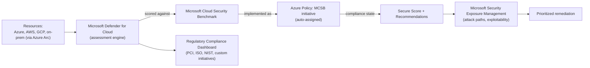
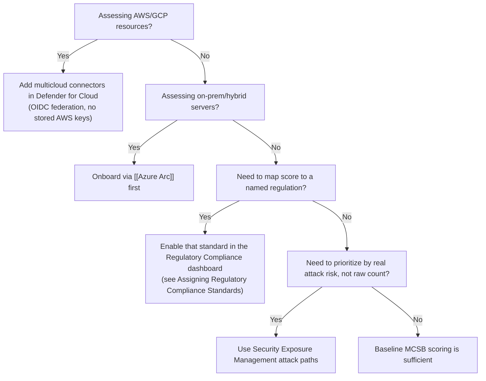

---
tags:
  - sc100
type: concept
domain:
  - infrastructure
aliases:
  - CSPM
status: needs-verification
---

# Security Posture Assessments

## Purpose

Continuous evaluation of resource configuration against a security benchmark, producing a prioritized, quantifiable view of risk across hybrid and multicloud environments.

---

## Why Architects Choose It

- Converts scattered configuration checks into one quantifiable metric ([[Microsoft Defender for Cloud]]'s Secure Score) that leadership and engineering can both track.
- Benchmarks every subscription against the **[[Microsoft Cloud Security Benchmark (MCSB)|Microsoft Cloud Security Benchmark (MCSB)]]** by default, so posture is measured consistently instead of per-team ad hoc checklists.
- **[[Azure Policy]] drives Secure Score** — Secure Score isn't a separate scoring engine; it's built from the MCSB initiative, an Azure Policy initiative auto-assigned to every onboarded subscription. Each recommendation is one policy definition, and a resource's policy compliance state *is* the pass/fail signal behind it — extending Secure Score with org-specific checks means adding a custom policy to a custom initiative, not requesting a Microsoft feature.
- Extends across Azure, AWS, GCP, and on-prem/hybrid (via [[Azure Arc]]) — a single assessment surface instead of one per cloud.
- Feeds directly into regulatory compliance reporting and, more recently, into attack-path-based prioritization rather than raw score-chasing.
- For how this score relates to other Microsoft scoring dashboards (Advisor, Purview Compliance Manager, Microsoft Secure Score), see [[Security Scoring Dashboards]]; for how the number is actually calculated — control weighting, `(max ÷ resources) × healthy`, exemption effects — see [[Secure Score Mechanics]].

---

## When to Use

- Establishing a security baseline before or during [[Azure Landing Zones|landing zone]] rollout.
- Continuously tracking configuration drift across hybrid/multicloud estates.
- Mapping technical controls to a named regulatory standard (PCI DSS, ISO 27001, NIST) for audit evidence.
- Prioritizing remediation by actual exploitability/impact, not just recommendation count.

---

## When NOT to Use

- As a runtime threat detection or response mechanism — that's [[Microsoft Sentinel]] / Defender XDR, not posture assessment.
- As the sole workload protection control — posture (CSPM) tells you what's misconfigured; [[Cloud Workload Protection (CWPP)|CWPP]] plans in Defender for Cloud actively defend the running resource.
- As proof of regulatory compliance by itself — a high Secure Score is a prioritization signal, not a certification.

---

## Foundational CSPM vs. Defender CSPM

Defender for Cloud's CSPM layer has **two plans**, available across Azure, AWS, and GCP alike:

| | Foundational CSPM | Defender CSPM |
| --- | --- | --- |
| Cost | **Free** | Paid, billed per resource type onboarded |
| Asset inventory, Secure Score, MCSB recommendations, workflow automation, data export | ✔ | ✔ |
| Attack path analysis, Security Exposure Management/Cloud Security Explorer (risk hunting) | ✘ | ✔ |
| Agentless VM/container vulnerability and secrets scanning | ✘ | ✔ |
| [[Data Security Posture Management (DSPM)|Data security posture management]], sensitive data scanning | ✘ | ✔ |
| [[Container and Kubernetes Security|AI security posture, API security posture, AKS security dashboard]] | ✘ | ✔ |
| [[External Attack Surface Management (EASM)|External attack surface management]], internet exposure analysis | ✘ | ✔ |
| Regulatory compliance assessments (named standards) | ✘ | ✔ |
| Custom recommendations, governance rules (remediation at scale), critical assets protection | ✘ | ✔ |

**Important timing fact**: starting **October 27, 2026**, Foundational CSPM moves to an **opt-in model** — it will no longer be enabled by default for new Azure subscriptions (it stays free and available on request). Subscriptions that already have it enabled before that date keep it unless deliberately turned off. AWS/GCP connector onboarding is unaffected by this change. Given this vault's current date, this cutover is imminent — treat "posture assessment isn't showing up on a brand-new subscription" as expected behavior after that date, not a misconfiguration.

---

## Multicloud Connector Authentication (AWS)

Connecting an AWS account or AWS management account uses AWS's **native connector**, authenticated via **OIDC federation** — no long-lived AWS access keys are stored anywhere in Defender for Cloud.

- Onboarding (via a CloudFormation template or Terraform) creates two things in AWS: an **OpenID Connect identity provider** trusting a Microsoft-managed Entra application, and one or more **IAM roles** Defender for Cloud can assume through **web identity federation**.
- At scan time, Defender for Cloud presents a Microsoft Entra token; AWS exchanges it for **short-lived credentials via AWS STS (Security Token Service)** — nothing long-lived is ever stored on either side.
- Before issuing those temporary credentials, AWS validates the Entra token against **four conditions**: **audience validation** (the token is intended for this specific application), **token digital signature validation** (Entra ID actually signed it, untampered), **certificate thumbprint validation** (the signer matches the trusted identity provider's known thumbprint), and **role-level conditions** in the IAM role's trust policy (restricting which federated identities may assume that specific role, so no other Microsoft identity can reuse it).
- **Onboarding scope**: a **management account** connector auto-provisions connectors for discovered and future member accounts; a **single account** connector covers just one AWS account.
- **Access type at onboarding**: **Default access** grants permissions for current and future Defender for Cloud capabilities; **Least privilege access** grants only what's needed today, with notifications if more is needed later — an explicit least-privilege-vs-convenience tradeoff to make at connection time.
- The same federated-trust, short-lived-credential pattern (no stored secrets) is the multicloud analogue of the workload identity federation principle already covered for Azure-native workloads in [[Identity and Access Management (IAM)]].

---

## Architecture

---

## Architecture Decisions

---

## Comparison

| Compare | Difference |
| --- | --- |
| Posture assessment vs. regulatory compliance dashboard | Posture assessment scores against MCSB continuously; the compliance dashboard maps that same data to a *named external standard* for audit purposes. |
| Defender for Cloud Secure Score vs. Microsoft Secure Score (M365) | Same name, different products — Defender for Cloud's score covers cloud resource configuration; the Microsoft 365 Secure Score covers identity/app/device posture in the Defender portal. Don't conflate them on the exam. |
| CSPM vs. [[Cloud Workload Protection (CWPP)|CWPP]] | Posture assessment (CSPM) evaluates configuration; workload protection (CWPP) actively defends the running resource — full comparison in the CWPP note, and how they combine in [[CSPM and CWPP]]. |
| CSPM vs. [[Data Security Posture Management (DSPM)|DSPM]] | CSPM scores *resource configuration*; DSPM scores risk to the *data itself* (sensitivity, exposure, access) — complementary, not interchangeable. Full comparison in the DSPM note. |
| Foundational CSPM vs. Defender CSPM | Foundational: free, Secure Score/MCSB/asset inventory baseline. Defender CSPM: paid, adds attack path analysis, agentless scanning, DSPM, EASM, regulatory compliance assessments, and governance-at-scale — a scenario asking for attack paths or agentless scanning on the free plan is under-licensed. |
| Default access vs. least privilege access (AWS onboarding) | Default: grants permissions for current *and future* Defender capabilities in one step. Least privilege: grants only what's needed today, with follow-up prompts as new capabilities are enabled — a deliberate least-privilege-vs-operational-convenience tradeoff at connector creation time. |

---

## AZ-500 Review

AZ-500 already covers enabling [[Microsoft Defender for Cloud]] on a single subscription, reading recommendations, and remediating individual findings. That implementation-level knowledge is assumed here.

---

## What's New for SC-100

- Design posture management as an org-wide, **hybrid/multicloud** architecture decision — which connectors (AWS, GCP, Arc), which subscriptions, and how exemptions are governed.
- Evaluate and validate alignment with regulatory standards using the compliance dashboard as an explicit exam skill, not just reading Secure Score.
- Use **Security Exposure Management** to prioritize by attack-path exploitability instead of chasing raw recommendation counts.
- Treat [[Microsoft Cloud Security Benchmark (MCSB)|MCSB]] as the default, org-wide baseline benchmark — know it by name, since it replaced the older Azure Security Benchmark. For what MCSB actually contains (domains, controls, subcontrols), see its own note.
- Recognize [[Azure Policy]] as the literal enforcement substrate beneath Secure Score — full mechanics (Deny vs. Audit, remediation tasks, custom initiatives) live in its own note, not repeated here.
- Know this note *is* the CSPM half of Microsoft's CNAPP — see [[CSPM and CWPP]] for how it combines with workload, data, and permissions signals into one prioritized risk view.

---

## Exam Tips

- A high Secure Score answering a "prove regulatory compliance" scenario is a distractor — the correct answer maps to the regulatory compliance dashboard and a named standard.
- Multicloud posture requires connectors; hybrid/on-prem requires [[Azure Arc]] onboarding first — a scenario mentioning AWS or on-prem servers is testing whether you know which mechanism applies.
- "Prioritize remediation by risk" scenarios point to Security Exposure Management attack paths, not sorting recommendations by count.
- Requesting attack path analysis, agentless scanning, DSPM, or EASM on a subscription that only has the **free Foundational CSPM** plan is a licensing gap — those require **Defender CSPM** (paid).
- "Which conditions does AWS validate on the Microsoft Entra token before issuing credentials?" → **audience validation, token digital signature validation, certificate thumbprint validation, and role-level trust-policy conditions** — not issuer validation or an expiration check as separately named items in Microsoft's own documentation of this flow.
- The AWS connector never stores long-lived AWS access keys — it's OIDC federation exchanged for short-lived STS credentials, the same "no stored secret" pattern as workload identity federation elsewhere in [[Identity and Access Management (IAM)]].

---

## Common Exam Confusion

- **Defender for Cloud Secure Score vs. Microsoft Secure Score (M365)** — identical branding, different scope; verify which portal/product a scenario is actually describing.
- **Posture assessment vs. regulatory compliance** — continuous scoring vs. mapping that scoring to an external audit standard.
- **Foundational CSPM vs. Defender CSPM** — free baseline vs. paid advanced posture (attack paths, agentless scanning, DSPM, EASM, compliance assessments).
- **Audience/signature/certificate-thumbprint validation vs. issuer/expiration checks** — Microsoft's documented AWS OIDC trust flow names the former three (plus role-level conditions) explicitly; don't assume issuer or expiration are the tested checks here.

---

## Keywords

- CSPM (Cloud Security Posture Management)
- Secure Score
- Microsoft Cloud Security Benchmark (MCSB)
- Regulatory Compliance dashboard
- Multicloud connectors (AWS/GCP)
- [[Azure Arc]] onboarding
- Security Exposure Management / attack paths
- CWPP (Cloud Workload Protection Platform)
- CNAPP (Cloud-Native Application Protection Platform)
- Foundational CSPM (free) vs. Defender CSPM (paid)
- Foundational CSPM opt-in cutover — October 27, 2026
- AWS native connector, OIDC federation, AWS STS short-lived credentials
- Audience validation, token digital signature validation, certificate thumbprint validation, role-level trust conditions
- Management account vs. single account onboarding
- Default access vs. least privilege access (AWS onboarding)

---

## Related Services

- [[Microsoft Defender for Cloud]]
- [[Microsoft Defender]]
- [[Azure Security Logging]]
- [[Zero Trust]]
- [[Microsoft Cloud Security Benchmark (MCSB)]]
- [[Cloud Adoption Framework (CAF)]]
- [[Data Security Posture Management (DSPM)]]
- [[Cloud Workload Protection (CWPP)]]
- [[CSPM and CWPP]]
- [[External Attack Surface Management (EASM)]]
- [[Azure Arc]]
- [[Azure Policy]]
- [[Azure Landing Zones]]
- [[Secure Score Mechanics]] — the scoring formula behind the recommendations on this page.
- [[Assigning Regulatory Compliance Standards]] — exactly where/how a standard gets turned on, and how compliance is actually achieved.
- [[Defender for Cloud REST API]] — programmatic/IaC posture and compliance automation.
- [[Identity and Access Management (IAM)]] — workload identity federation, the Azure-native analogue of the AWS OIDC trust pattern.

---

## References

- [Security posture in Microsoft Defender for Cloud (CSPM plans)](https://learn.microsoft.com/en-us/azure/defender-for-cloud/concept-cloud-security-posture-management) — Microsoft Learn
- [Microsoft Cloud Security Benchmark](https://learn.microsoft.com/en-us/security/benchmark/azure/introduction) — Microsoft Learn
- [Connect your AWS account](https://learn.microsoft.com/en-us/azure/defender-for-cloud/quickstart-onboard-aws) — Microsoft Learn
- [Authentication architecture for AWS connectors](https://learn.microsoft.com/en-us/azure/defender-for-cloud/concept-authentication-architecture-aws) — Microsoft Learn
- [[Exam Objectives]]

---

## Verification Flag

The Foundational CSPM opt-in cutover (October 27, 2026), the exact CSPM feature-tier table, and the AWS OIDC token validation condition list are all recent, actively-revised Microsoft documentation. Re-verify the cutover date/status, plan feature matrix, and validation condition list against Microsoft Learn close to exam date.
