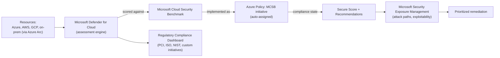
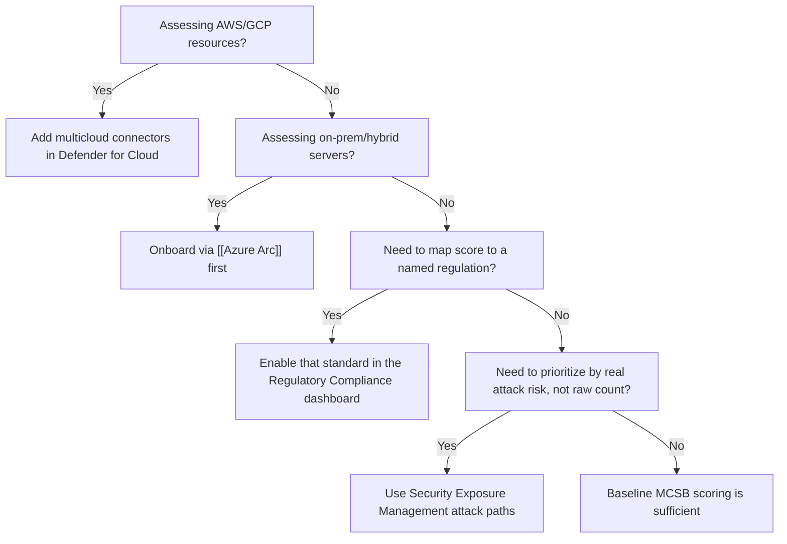

---
tags:
  - sc100
type: concept
domain:
  - infrastructure
aliases:
  - CSPM
---

# Security Posture Assessments

## Purpose

Continuous evaluation of resource configuration against a security benchmark, producing a prioritized, quantifiable view of risk across hybrid and multicloud environments.

---

## Why Architects Choose It

- Converts scattered configuration checks into one quantifiable metric ([[Microsoft Defender for Cloud]]'s Secure Score) that leadership and engineering can both track.
- Benchmarks every subscription against the **[[Microsoft Cloud Security Benchmark (MCSB)|Microsoft Cloud Security Benchmark (MCSB)]]** by default, so posture is measured consistently instead of per-team ad hoc checklists.
- **[[Azure Policy]] drives Secure Score** — Secure Score isn't a separate scoring engine; it's built from the MCSB initiative, an Azure Policy initiative auto-assigned to every onboarded subscription. Each recommendation is one policy definition, and a resource's policy compliance state *is* the pass/fail signal behind it — extending Secure Score with org-specific checks means adding a custom policy to a custom initiative, not requesting a Microsoft feature.
- Extends across Azure, AWS, GCP, and on-prem/hybrid (via [[Azure Arc]]) — a single assessment surface instead of one per cloud.
- Feeds directly into regulatory compliance reporting and, more recently, into attack-path-based prioritization rather than raw score-chasing.
- For how this score relates to other Microsoft scoring dashboards (Advisor, Purview Compliance Manager, Microsoft Secure Score), see [[Security Scoring Dashboards]].

---

## When to Use

- Establishing a security baseline before or during [[Azure Landing Zones|landing zone]] rollout (new to that concept? [[Azure Landing Zones (Beginner Explainer)|start here]]).
- Continuously tracking configuration drift across hybrid/multicloud estates.
- Mapping technical controls to a named regulatory standard (PCI DSS, ISO 27001, NIST) for audit evidence.
- Prioritizing remediation by actual exploitability/impact, not just recommendation count.

---

## When NOT to Use

- As a runtime threat detection or response mechanism — that's [[Microsoft Sentinel]] / Defender XDR, not posture assessment.
- As the sole workload protection control — posture (CSPM) tells you what's misconfigured; [[Cloud Workload Protection (CWPP)|CWPP]] plans in Defender for Cloud actively defend the running resource.
- As proof of regulatory compliance by itself — a high Secure Score is a prioritization signal, not a certification.

---

## Architecture

---

## Architecture Decisions

---

## Comparison

| Compare | Difference |
| --- | --- |
| Posture assessment vs. regulatory compliance dashboard | Posture assessment scores against MCSB continuously; the compliance dashboard maps that same data to a *named external standard* for audit purposes. |
| Defender for Cloud Secure Score vs. Microsoft Secure Score (M365) | Same name, different products — Defender for Cloud's score covers cloud resource configuration; the Microsoft 365 Secure Score covers identity/app/device posture in the Defender portal. Don't conflate them on the exam. |
| CSPM vs. [[Cloud Workload Protection (CWPP)|CWPP]] | Posture assessment (CSPM) evaluates configuration; workload protection (CWPP) actively defends the running resource — full comparison in the CWPP note, and how they combine in [[CSPM and CWPP]]. |
| CSPM vs. [[Data Security Posture Management (DSPM)|DSPM]] | CSPM scores *resource configuration*; DSPM scores risk to the *data itself* (sensitivity, exposure, access) — complementary, not interchangeable. Full comparison in the DSPM note. |

---

## AZ-500 Review

AZ-500 already covers enabling [[Microsoft Defender for Cloud]] on a single subscription, reading recommendations, and remediating individual findings. That implementation-level knowledge is assumed here.

---

## What's New for SC-100

- Design posture management as an org-wide, **hybrid/multicloud** architecture decision — which connectors (AWS, GCP, Arc), which subscriptions, and how exemptions are governed.
- Evaluate and validate alignment with regulatory standards using the compliance dashboard as an explicit exam skill, not just reading Secure Score.
- Use **Security Exposure Management** to prioritize by attack-path exploitability instead of chasing raw recommendation counts.
- Treat [[Microsoft Cloud Security Benchmark (MCSB)|MCSB]] as the default, org-wide baseline benchmark — know it by name, since it replaced the older Azure Security Benchmark. For what MCSB actually contains (domains, controls, subcontrols), see its own note.
- Recognize [[Azure Policy]] as the literal enforcement substrate beneath Secure Score — full mechanics (Deny vs. Audit, remediation tasks, custom initiatives) live in its own note, not repeated here.
- Know this note *is* the CSPM half of Microsoft's CNAPP — see [[CSPM and CWPP]] for how it combines with workload, data, and permissions signals into one prioritized risk view.

---

## Exam Tips

- A high Secure Score answering a "prove regulatory compliance" scenario is a distractor — the correct answer maps to the regulatory compliance dashboard and a named standard.
- Multicloud posture requires connectors; hybrid/on-prem requires [[Azure Arc]] onboarding first — a scenario mentioning AWS or on-prem servers is testing whether you know which mechanism applies.
- "Prioritize remediation by risk" scenarios point to Security Exposure Management attack paths, not sorting recommendations by count.

---

## Common Exam Confusion

- **Defender for Cloud Secure Score vs. Microsoft Secure Score (M365)** — identical branding, different scope; verify which portal/product a scenario is actually describing.
- **Posture assessment vs. regulatory compliance** — continuous scoring vs. mapping that scoring to an external audit standard.

---

## Keywords

- CSPM (Cloud Security Posture Management)
- Secure Score
- Microsoft Cloud Security Benchmark (MCSB)
- Regulatory Compliance dashboard
- Multicloud connectors (AWS/GCP)
- [[Azure Arc]] onboarding
- Security Exposure Management / attack paths
- CWPP (Cloud Workload Protection Platform)
- CNAPP (Cloud-Native Application Protection Platform)

---

## Related Services

- [[Microsoft Defender for Cloud]]
- [[Microsoft Defender]]
- [[Azure Security Logging]]
- [[Zero Trust]]
- [[Microsoft Cloud Security Benchmark (MCSB)]]
- [[Cloud Adoption Framework (CAF)]]
- [[Data Security Posture Management (DSPM)]]
- [[Cloud Workload Protection (CWPP)]]
- [[CSPM and CWPP]]
- [[Azure Arc]]
- [[Azure Policy]]
- [[Azure Landing Zones]]
- [[Azure Landing Zones (Beginner Explainer)]]

---

## References

- [Security posture in Microsoft Defender for Cloud](https://learn.microsoft.com/en-us/azure/defender-for-cloud/concept-cloud-security-posture-management) — Microsoft Learn
- [Microsoft Cloud Security Benchmark](https://learn.microsoft.com/en-us/security/benchmark/azure/introduction) — Microsoft Learn
- [[Exam Objectives]]
