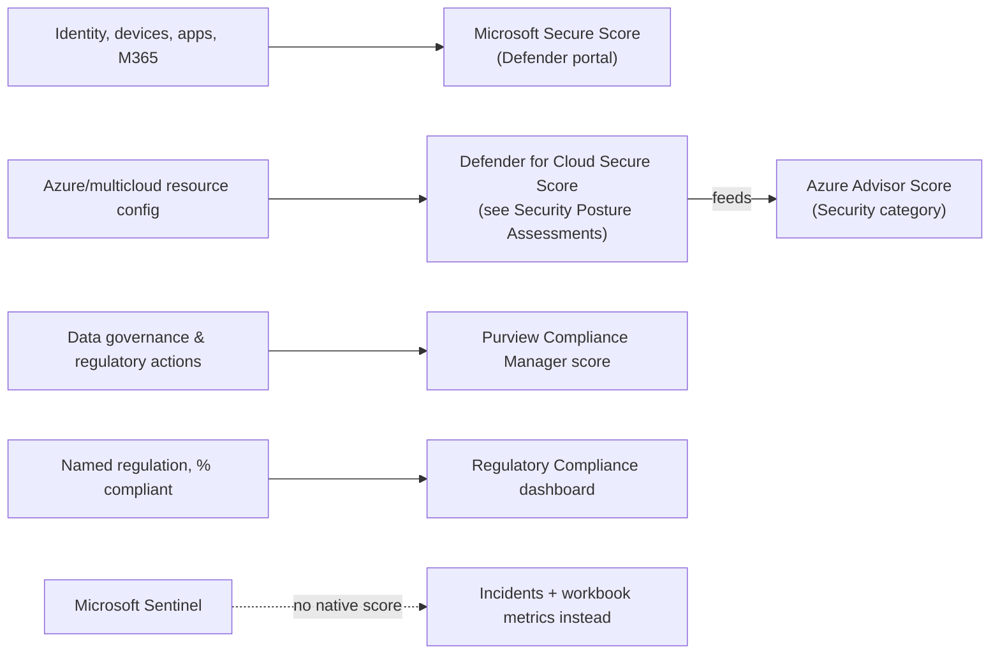
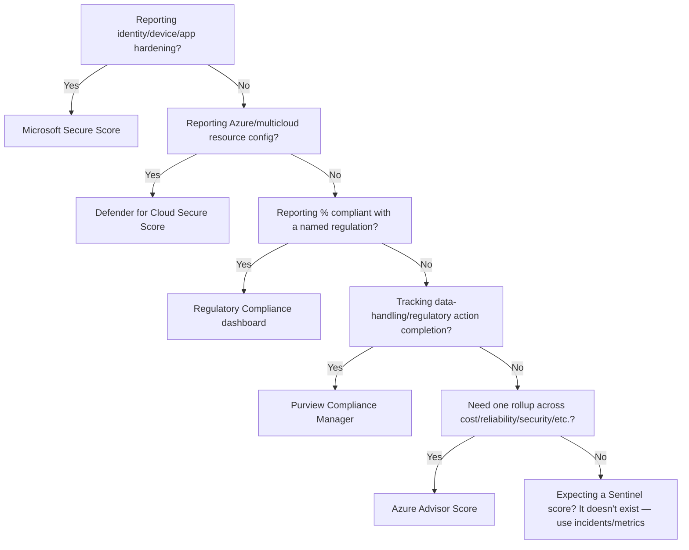

---
tags:
  - sc100
---

# Security Scoring Dashboards

## Purpose

Microsoft's security stack exposes several distinct, non-interchangeable scores; knowing which one answers which question — and which portal owns it — is what turns a score into a decision.

---

## Why Architects Choose It

- Gives leadership a trend line without requiring technical depth, but only when the right score reaches the right audience. Microsoft Secure Score specifically rolls up identity, device, app, and Microsoft 365 hardening — see [[Securing Microsoft 365]] for the productivity/collaboration-domain products (Defender for Office 365, Defender for Cloud Apps) that feed it.
- Scores are often layered rather than independent — Azure Advisor's Security category is literally calculated *using* Defender for Cloud's secure-score model, not a separate assessment.
- Some domains — data governance, regulatory attestation — need a score [[Microsoft Defender for Cloud]] simply doesn't produce.

---

## When to Use

- Executive/board reporting on security trend over time.
- Prioritizing a remediation backlog within a single domain (identity vs. cloud resource vs. data governance).
- Preparing audit evidence for a named regulation.
- Feeding score deltas into a recurring governance review ([[Cloud Adoption Framework (CAF)]] Govern methodology).

---

## When NOT to Use

- As a cross-product apples-to-apples comparison — these scores measure different things on different scales.
- As proof of compliance by itself — see [[Security Posture Assessments]] for why a high score isn't a certification.
- As an isolated engineering KPI — teams can raise a score by dismissing recommendations rather than fixing risk.

---

## Architecture

---

## Architecture Decisions

---

## Comparison

| Compare | Difference |
| --- | --- |
| Microsoft Secure Score vs. Defender for Cloud Secure Score | Different scope (identity/app/device vs. cloud resource config) — full comparison in [[Security Posture Assessments]]. |
| Azure Advisor Score vs. Defender for Cloud Secure Score | Advisor's Security category is *calculated using* the Defender for Cloud secure-score model — it's a derivative rollup, not an independent measurement. Improving one moves the other. |
| Purview Compliance Manager score vs. Regulatory Compliance dashboard | Both express "% compliant with standard X," but different domains: Compliance Manager scores data governance/organizational actions (often attestation-based); the Regulatory Compliance dashboard scores technical resource configuration against that standard's mapped controls. |

---

## AZ-500 Review

AZ-500 already covers reading and acting on Microsoft Secure Score and Defender for Cloud's classic Secure Score at the implementation level. That knowledge is assumed here.

---

## What's New for SC-100

- Defender for Cloud now offers **two Secure Score models**: the classic score (Azure portal) and a newer risk-based **Cloud Secure Score** (Microsoft Defender portal) that weighs asset criticality and exploitability instead of raw recommendation count — know both exist, since the newer model changes prioritization, not just presentation.
- Recognize score *dependencies* across products (Advisor Security ← Defender for Cloud) so the same underlying number isn't reported twice as if independent.
- Purview Compliance Manager is the dedicated score for data governance/regulatory action tracking — a distinct domain AZ-500 doesn't cover.
- Architect *which* score routes to *which* stakeholder as a deliberate governance decision, not an afterthought.

---

## Exam Tips

- A scenario naming identity/device/app hardening points to Microsoft Secure Score, not Defender for Cloud's.
- "Automatically tested and credited" improvement actions describes Purview Compliance Manager, not Defender for Cloud — don't cross the two.
- Any answer choice suggesting a "Sentinel security score" is wrong — Sentinel has no native score.

---

## Common Exam Confusion

- **Azure Advisor Score vs. Defender for Cloud Secure Score** — Advisor's Security category uses the Defender for Cloud model as its source, not a separate assessment.
- **Regulatory Compliance dashboard vs. Purview Compliance Manager** — infrastructure config percentage vs. data governance/process score.
- **Classic vs. risk-based Cloud Secure Score** — both live inside Defender for Cloud but in different portals and with different weighting logic.

---

## Keywords

- Microsoft Secure Score vs. Defender for Cloud Secure Score
- Classic Secure Score vs. risk-based Cloud Secure Score
- Azure Advisor Score (Security category)
- Purview Compliance Manager score
- Regulatory Compliance dashboard percentage
- No native Sentinel score

---

## Related Services

- [[Security Posture Assessments]]
- [[Microsoft Defender for Cloud]]
- [[Microsoft Defender]]
- [[Purview]]
- [[Microsoft Sentinel]]
- [[Securing Microsoft 365]]

---

## References

- [Advisor score](https://learn.microsoft.com/en-us/azure/advisor/advisor-score) — Microsoft Learn
- [Compliance Manager scoring](https://learn.microsoft.com/en-us/purview/compliance-manager-scoring) — Microsoft Learn
- [Cloud Secure Score in Microsoft Defender for Cloud](https://learn.microsoft.com/en-us/azure/defender-for-cloud/secure-score-security-controls) — Microsoft Learn
- [[Exam Objectives]]
